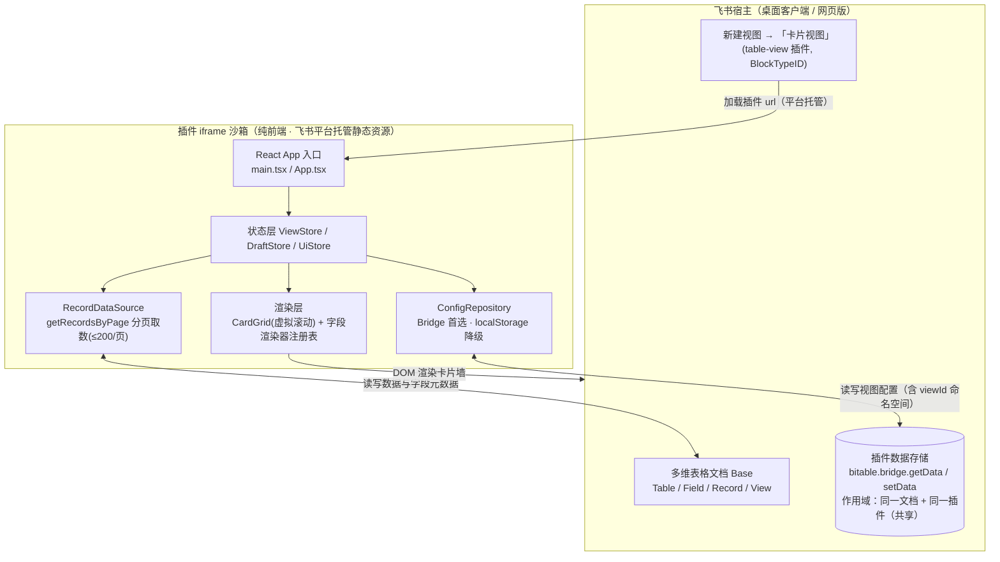
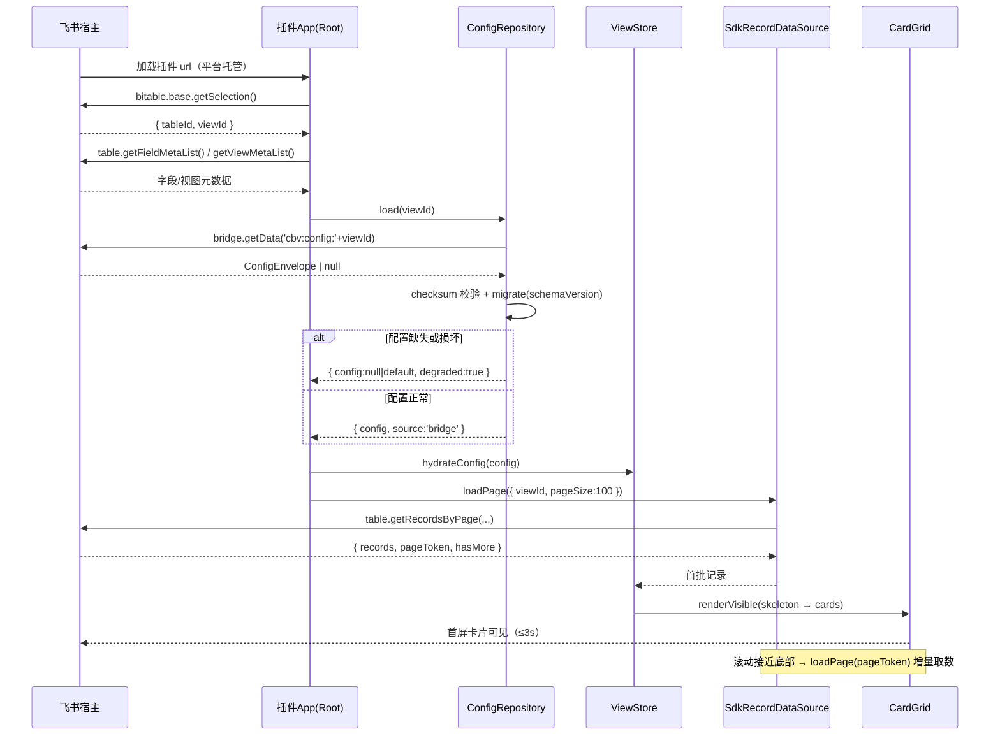
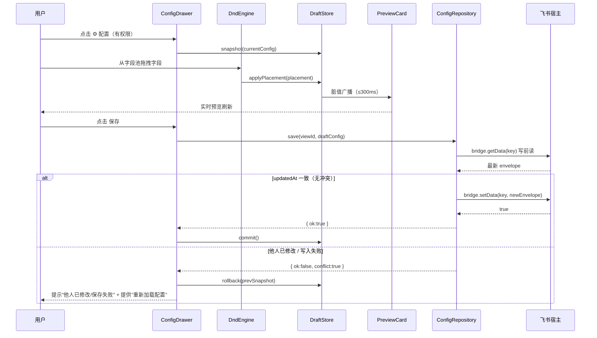
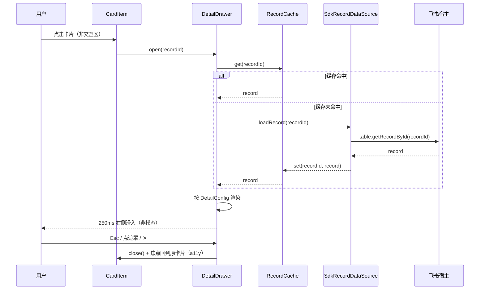
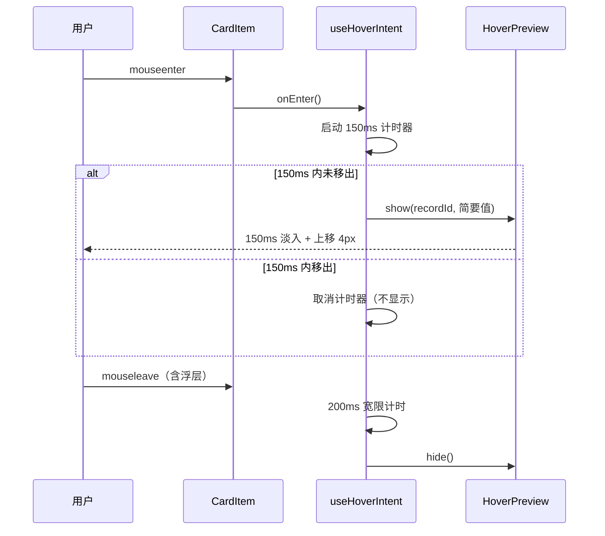
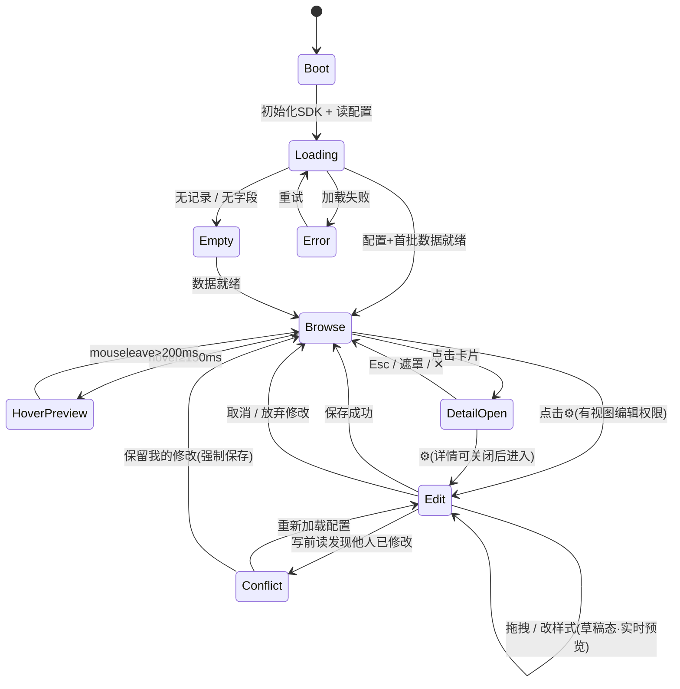
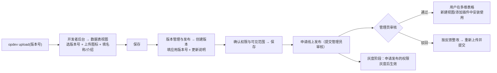
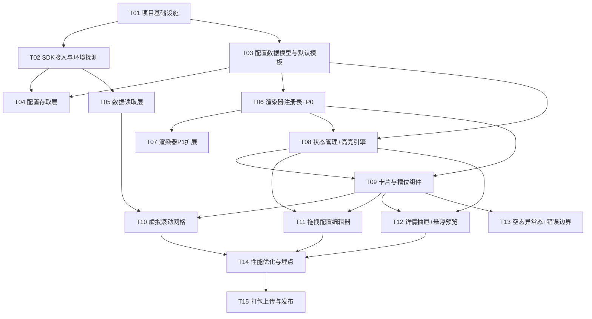

# 技术实现方案与部署方案｜飞书多维表格扩展视图插件 ——「卡片视图」（Card View）

> 本文承接产品需求文档 `01-PRD.md`，是面向工程实施的核心技术文档。**本阶段只做方案设计，不写业务实现代码。**

---

## 1. 文档信息

| 项 | 内容 |
|---|---|
| 文档名称 | 飞书多维表格「卡片视图」技术实现方案与部署方案 |
| 版本 | v1.0 |
| 日期 | 2026-09-20 |
| 作者 | 高见远（架构师） |
| 上游输入 | `01-PRD.md`（许清楚 / 产品经理，v1.0） |
| 评审人 | 齐活林（交付总监）、许清楚（产品经理） |
| 状态 | 待评审（Draft） |
| 适用范围 | 飞书企业内部自建应用（多维表格插件 / 数据表视图 table-view） |

**已核实的平台硬约束（不可推翻）**

| 编号 | 约束 | 对本方案的影响 |
|---|---|---|
| C1 | 发布形态：企业自建应用（不上架，保留未来上架空间） | 无需 ISV 资质与严格审核；发布走企业管理员审核 |
| C2 | 单表、万行级 | 必须使用分页 API + 虚拟滚动 |
| C3 | 可视化拖拽配置 | 需引入拖拽库 + 草稿状态 + 实时预览 |
| C4 | 点击展开 + 悬浮预览 | 需详情抽屉 + 悬浮浮层 + 焦点管理 |
| C5 | **构建必须使用 Webpack**，且安装 `@lark-opdev/block-bitable-webpack-utils` | 排除 Vite/Rollup 作为最终构建工具 |

---

## 2. 方案总览

### 2.1 端到端架构图



### 2.2 数据流三条主线

| 主线 | 路径 | 关键 API |
|---|---|---|
| **配置流** | 视图打开 → `ConfigRepository.load(viewId)` → `bridge.getData(key)` → 校验/迁移 → `ViewStore` | `bitable.bridge.getData/setData/onDataChange` |
| **数据流** | 视图打开 → `RecordDataSource.loadPage({viewId,pageSize:100})` → 首批渲染 → 滚动增量 | `table.getRecordsByPage` |
| **元数据流** | 初始化 → `base.getSelection()` 拿 tableId/viewId → `table.getFieldMetaList()` / `getViewMetaList()` | `bitable.base.getSelection`、`table.getFieldMetaList` |

> 说明：`viewId` 与 `tableId` 在插件加载后通过 `bitable.base.getSelection()` 获取，是所有配置读写与数据读取的上下文根。

---

## 3. 技术可行性分析（逐条回应 Q1~Q10）

| 编号 | 问题 | 结论 | 依据 / 依据链接 |
|---|---|---|---|
| **Q1** | MVP 是否需要卡片区写入/编辑记录？ | **建议不做（只读浏览）**。技术上可行（SDK 提供 `table.setRecord` 等），但需 `bitable:app` 写权限、引入协作冲突与误操作风险，与 PRD NG1 一致。 | SDK Table/Field 模块含写接口；PRD NG1 |
| **Q2** | 悬浮预览 MVP 做简要气泡还是后置 P1？ | **P0 保底做"简要气泡"**（标题+副标题+前 N 个属性，纯静态、无写操作），P1 升级为完整浮层。技术上无阻塞。 | 官方 `bridge` 无阻碍；纯前端可控 |
| **Q3** | 详情展开形式 | **按 PRD 建议做右侧滑出抽屉**（非模态，主区保留上下文）。技术无阻塞；居中弹窗/就地展开为备选，成本相近。 | 纯前端布局决策 |
| **Q4** | **配置持久化的存储介质与容量上限** | **可行（满足 US-4）**。首选 `bitable.bridge.setData/getData`：官方语义为"**该自定义数据在同一文档的同一插件下是共享的**"→ 天然满足 AC1（随视图/文档持久化）与 AC2（全表用户共享同一配置）。**容量上限官方文档未覆盖**（见风险 R1/R9），采用"配置体积预算 + 校验 + 降级"应对。 | [Bridge 模块文档](https://lark-base-team.github.io/js-sdk-docs/zh/api/bridge)；[bitable-extention 实战项目](https://github.com/Lark-Base-Team/bitable-extention) |
| **Q5** | 复制视图/表格时配置是否随视图复制？ | **有限可行**。配置以 `viewId` 为命名空间存于 bridge 存储；复制视图会生成**新 viewId**，bridge 存储**不会自动跟随复制**（需产品定义：不跟随 / 首开时提示"从模板重配"）。**需用户/产品拍板**。 | bridge 作用域为文档+插件，不感知视图复制语义 |
| **Q6** | 条件高亮是否支持多条件 AND/OR 复杂表达式？ | **建议 P1 支持单层 AND/OR 组合**（`{logic, items[]}`），不支持嵌套表达式树，避免规则引擎过度设计。 | 自研轻量规则引擎足够 |
| **Q7** | 移动端是否本次交付？ | **排除到 P2**（PRD 已定位）。技术上 view 插件在移动端受限，MVP 只保证桌面客户端 + 网页版。 | PRD NG4 / 兼容范围 |
| **Q8** | **运行时是否有网络请求？是否需要白名单 / 自建服务器？** | **无需自建服务器、无需白名单**。① 代码经 `opdev upload ./dist` 上传后由**飞书平台托管**静态资源；② 配置存于 bridge、数据取自宿主 SDK，**不发起任何外部网络请求**；③ 附件/头像等资源域名由宿主提供，非外部服务。若未来引入 P2 导出/分享服务，再按需申请白名单。 | [数据表视图开发指南](https://open.larksuite.com/document/uAjLw4CM/uYjL24iN/base-extensions/base-view-extensions/base-table-view-extension-development-guide)（"将代码上传到该应用能力"） |
| **Q9** | 是否需要对齐原生「筛选/排序/分组」？ | **有限可行（推荐只读对齐）**。`getRecordsByPage({viewId})` 会**自动遵循该视图的筛选/排序**（传 viewId 时 `sort`/`filter` 入参失效）；分组无对应读接口，需前端按字段值自行分组。MVP：搜索（前端过滤）+ 遵循视图排序；原生筛选面板由宿主提供或前端只读展示。 | [table.getRecordsByPage 文档](https://lark-base-team.github.io/js-sdk-docs/zh/api/table) |
| **Q10** | 国际化范围 | **建议 MVP 仅简中**，架构预留 i18n（`bridge.getLanguage()` 驱动）。全量中英/简繁作为 P2。 | 成本控制 |

### 3.1 关键技术未知项结论（CRITICAL）

**未知项 1（Q4）配置持久化 —— 结论：能，首选 bridge，localStorage 降级**

- **首选方案**：`bitable.bridge.setData('cbv:config:' + viewId, envelope)` / `getData(...)`。
  - 官方原文："通过指定 key 存储当前插件自定义数据，**该自定义数据在同一文档的同一插件下是共享的**"。
  - → **随文档持久化**（满足 US-4 AC1）+ **同文档同插件跨用户共享**（满足 US-4 AC2）。
  - → 支持 `onDataChange` 监听，可实现"多人同时改"的实时感知（呼应 PRD 6.6）。
  - **注意点**：作用域是"文档+插件"级，**不是"视图"级**。同一文档可存在多个卡片视图（PRD S4），因此**必须用 `viewId` 做 key 命名空间**区分：`cbv:config:{viewId}`。
  - **容量上限官方文档未覆盖** → 设计上限制单配置体积（建议 ≤ 64KB），超限截断 + 提示（风险 R9）。
- **降级方案**：`localStorage`（key：`cbv:config:{appId}:{viewId}`）。**取舍**：仅存于当前用户浏览器，**无法跨用户共享，无法满足 US-4 AC2** → 仅在 bridge 不可用时启用，并在 UI 提示"配置仅本地保存"。
- **次级可选方案（不推荐 MVP）**：写入多维表格内一张"隐藏配置表"的记录（可跨用户共享、视图级）。**取舍**：需 `bitable:app` 写权限、会向用户表格写入数据（违反 NG1/污染数据），仅作为未来无 bridge 时的兜底。
- **是否满足 US-4：满足**（首选方案）。**不需要自建服务端。**

**未知项 2（Q8）网络/白名单/服务器 —— 结论：纯前端，无需白名单，无需自建服务器**
- 部署形态：`npm run upload` / `opdev upload ./dist` 将构建产物上传到**应用能力（BlockTypeID）**，运行时由**飞书平台托管分发**，不需要开发者自己托管 `dist`。
- 运行时无外部请求 → **无需配置服务器域名白名单**。
- 结论：**企业自建应用发布不需要自建服务器**。

**未知项 3（性能）万行级取数 —— 结论：用分页 API + 虚拟滚动，可满足 PRD 第 8 章指标**
- 官方明确：`table.getRecordList()` / `getRecordIdList()` / `getRecords()` 均已标注 ⚠️**不再维护**（性能问题）。
- **推荐 API**：`table.getRecordsByPage({ pageSize≤200, pageToken, viewId, sort, filter })`（官方原话："所有批量获取表格数据的 API 实际均基于此方法"）。
- **有序记录 ID**：`view.getVisibleRecordIdList()`（按视图顺序）；`table.getRecordIdList()` 返回**无序**。
- **取舍**：`pageSize` 上限 200；需要按"视图顺序"而非创建时间排序时，传 `viewId`（会令 `sort`/`filter` 失效）。
- **策略**：首批 1 页（100~200 条，1 次请求）→ 首屏只渲染可视区 ~30 张 → 滚动接近底部时用 `pageToken` 预取下一页 → LRU 缓存已取页 → 骨架屏过渡。可满足首屏 ≤3s、滚动 ≥50FPS。

---

## 4. 技术选型

| 维度 | 选型 | 选择理由 | 备选 | 是否受平台约束 |
|---|---|---|---|---|
| 框架 | **React 18 + TypeScript** | 官方模板默认 React+TS；生态最成熟、类型完备 | Vue 3（官方亦支持，但需自行配 Webpack 与 webpack-utils） | 建议 |
| 语言 | **TypeScript 5.x** | 字段类型/配置结构复杂，强类型是正确性保障 | JS（不推荐） | — |
| 构建 | **Webpack 5 + `@lark-opdev/block-bitable-webpack-utils`** | **官方强制**：换框架也必须用 Webpack，并安装该 utils | Vite/Rollup（❌ 不满足上传要求） | **强制** |
| CLI | **`@lark-opdev/cli`** | 官方脚手架/登录/上传工具 | — | **强制** |
| 运行时 SDK | **`@lark-base-open/js-sdk`** | 官方运行时 SDK，文档最全（base/table/view/field/record/cell/bridge/ui） | `@lark-opdev/block-bitable-api`（脚手架默认，能力较少） | 推荐 |
| 状态管理 | **Zustand** | 轻量、零样板、支持细粒度订阅（草稿态高频更新友好） | Redux Toolkit / Jotai | — |
| 拖拽 | **dnd-kit** | 轻量、a11y 好、**基于指针事件、适配 iframe 沙箱**、支持排序+跨容器 | react-dnd（HTML5 拖拽在 iframe 中易异常）；react-beautiful-dnd（已停维） | — |
| 虚拟滚动 | **@tanstack/react-virtual** | 支持**动态高度**、网格/列虚拟化、无 headless 依赖 | react-window（动态高支持弱）/ virtua | — |
| 组件库 | **Radix UI primitives（无样式）+ 自研组件** | 需贴合飞书视觉规范，Radix 提供 a11y 基座且可深度定制 | MUI / Arco（样式重、覆盖成本高） | — |
| 样式 | **Tailwind CSS（布局）+ CSS Modules（复杂组件隔离）** | 快速布局 + 主题变量化；不与飞书宿主样式冲突 | styled-components（运行时开销） | — |
| 图标 | **lucide-react** | 轻量、可 tree-shaking | @ant-design/icons | — |
| 日期 | **dayjs** | 体积小、格式化灵活 | date-fns | — |
| i18n | **react-i18next + i18next** | 架构预留，语言由 `bridge.getLanguage()` 驱动 | 自研（MVP 简中够用） | — |
| 规则引擎 | **自研轻量引擎（highlight/ruleEngine.ts）** | 规则简单（单层 AND/OR），无需引入重库 | json-rules-engine（过重） | — |
| 测试 | **Vitest + React Testing Library + Playwright** | 单元 + 组件 + iframe 端到端 | Jest（配置重） | — |
| 包管理 | **npm**（默认） / pnpm（可选） | 官方模板默认 npm，与 CLI 兼容性最稳 | pnpm（需验证 CLI 兼容） | — |
| 代码规范 | **ESLint + Prettier** | 团队一致性 | — | — |

---

## 5. 工程结构

### 5.1 完整目录树

```
plugin/                          # 工程根（= opdev create 的 view-dir；位于 feishu-card-view/ 下）
├── app.json                     # 【官方·源文件】含 appId（应用凭证），upload 时定位目标应用
├── block.json                   # 【官方·源文件】含 blockTypeID / projectName / url / manifestVersion
├── debug.json                   # 【官方】可选，指定 v / vb 多维表格调试版本
├── package.json
├── tsconfig.json
├── webpack.config.js            # 【官方要求】Webpack + block-bitable-webpack-utils（含 app.json 同步垫片 / NODE_ENV 对齐）
├── tailwind.config.ts
├── postcss.config.js
├── .eslintrc.cjs / .prettierrc
├── .gitignore
├── public/
│   └── index.html               # 插件 iframe 的 HTML 宿主页
└── src/
    ├── main.tsx                 # 入口：挂载 React、初始化 SDK、注入错误边界
    ├── App.tsx                  # 顶层路由：Boot / Loading / Browse / Edit 分发
    ├── sdk/
    │   ├── base.ts              # bitable 单例、base/table/view 实例获取封装
    │   └── env.ts               # 环境探测：product、locale、theme、selection(tableId/viewId)
    ├── config/
    │   ├── types.ts             # CardViewConfig 等全部配置类型（见第 6 章）
    │   ├── defaults.ts          # 系统默认模板与默认值
    │   ├── migrations.ts        # schemaVersion 迁移与降级
    │   ├── ConfigRepository.ts  # 配置存取抽象接口
    │   ├── BridgeConfigRepository.ts      # 首选实现（bridge）
    │   ├── LocalStorageConfigRepository.ts# 降级实现（localStorage）
    │   └── factory.ts           # createConfigRepository() 运行时选型
    ├── data/
    │   ├── RecordDataSource.ts  # 取数抽象接口
    │   ├── SdkRecordDataSource.ts# getRecordsByPage 分页实现
    │   └── RecordCache.ts       # LRU 记录缓存 + 页缓存
    ├── fields/
    │   ├── fieldTypes.ts        # FieldType 枚举（官方值）+ 优先级映射
    │   ├── registry.ts          # 渲染器注册表 register/get
    │   ├── normalize.ts         # IOpenCellValue → NormalizedValue
    │   └── renderers/
    │       ├── TextRenderer.tsx        # Text(多行文本)
    │       ├── NumberRenderer.tsx      # Number / Currency
    │       ├── TagRenderer.tsx         # SingleSelect / MultiSelect
    │       ├── DateRenderer.tsx        # DateTime / CreatedTime / ModifiedTime
    │       ├── CheckboxRenderer.tsx    # Checkbox
    │       ├── UserRenderer.tsx        # User / CreatedUser / ModifiedUser
    │       ├── AttachmentRenderer.tsx  # Attachment
    │       ├── RatingRenderer.tsx      # Rating
    │       ├── ProgressRenderer.tsx    # Progress
    │       ├── LinkRenderer.tsx        # Url / Phone / Email
    │       ├── FormulaRenderer.tsx     # Formula（按结果类型分发）
    │       ├── LookupRenderer.tsx      # Lookup / SingleLink / DuplexLink
    │       └── FallbackRenderer.tsx    # 不支持类型兜底
    ├── state/
    │   ├── ViewStore.ts         # 已保存配置 + 数据 + 权限
    │   ├── DraftStore.ts        # 编辑草稿态（含快照/回滚）
    │   ├── UiStore.ts           # 抽屉/浮层/骨架屏等 UI 状态
    │   └── selectors.ts         # 派生选择器
    ├── components/
    │   ├── layout/
    │   │   ├── ViewShell.tsx    # 视图外壳（工具栏 + 卡片区 + 抽屉容器）
    │   │   ├── Toolbar.tsx      # 视图名/搜索/筛选/⚙配置/保存
    │   │   └── EmptyState.tsx   # 空态/异常态占位
    │   ├── grid/
    │   │   ├── CardGrid.tsx     # 虚拟滚动网格容器
    │   │   ├── CardItem.tsx     # 单卡片（memo + 悬浮意图）
    │   │   ├── CardSkeleton.tsx # 骨架卡
    │   │   └── useVirtualGrid.ts# 网格虚拟化 hook（动态行高）
    │   ├── card/
    │   │   ├── CardBody.tsx     # 槽位装配
    │   │   ├── SlotTitle.tsx / SlotSubtitle.tsx / SlotAttributes.tsx / SlotFooter.tsx
    │   │   └── FieldValue.tsx   # 调渲染器注册表渲染单字段
    │   ├── detail/
    │   │   ├── DetailDrawer.tsx # 右侧详情抽屉（P0）
    │   │   ├── HoverPreview.tsx # 悬浮浮层（P0 简要 / P1 完整）
    │   │   └── useHoverIntent.ts# 150ms 延迟触发 + 200ms 移出隐藏
    │   └── editor/
    │       ├── ConfigDrawer.tsx # 配置抽屉（360px）
    │       ├── FieldPool.tsx    # 字段池（可拖拽）
    │       ├── SlotDropZone.tsx # 槽位落位区 + 插入指示线
    │       ├── PlacementList.tsx# 槽位内字段排序/移除
    │       ├── TemplateGallery.tsx / ThemePanel.tsx / DensityPanel.tsx
    │       ├── HighlightRulePanel.tsx / DetailConfigPanel.tsx
    │       ├── PreviewCard.tsx  # 抽屉内预览样例卡
    │       └── dnd/
    │           ├── dndContext.tsx
    │           └── useDndHandlers.ts
    ├── highlight/
    │   └── ruleEngine.ts        # 条件高亮规则求值
    ├── hooks/
    │   ├── useCardViewInit.ts   # 初始化编排（选型→读配置→取数）
    │   ├── usePermission.ts     # 是否可编辑（决定配置态入口）
    │   └── useThemeTokens.ts    # 飞书主题 → CSS 变量
    ├── i18n/
    │   ├── index.ts / zh-CN.ts / en-US.ts
    ├── constants/
    │   ├── index.ts             # 常量集中管理
    │   └── keys.ts              # 存储 key 命名、事件名、埋点名
    ├── utils/
    │   ├── hash.ts              # 配置 checksum
    │   ├── format.ts            # 数值/日期格式化
    │   └── perf.ts              # 埋点与性能测量
    └── styles/
        ├── tokens.css           # 设计 token（颜色/圆角/阴影/间距）
        └── global.css
```

> **⚠️ `app.json` 的位置语义（M1 实测修正，2026-09-20）**
> 官方 `@lark-opdev/block-bitable-webpack-utils` 在**上一级目录**读取 `../app.json`，在**当前目录**读取 `block.json` 与 `debug.json`（官方源码 `function j(){ path.resolve(process.cwd(),"../app.json"); path.resolve(process.cwd(),"block.json"); path.resolve(process.cwd(),"./debug.json") }`），对应 `opdev create ${app-dir}/${view-dir}` 的目录约定。因此：
> - **源文件**：`plugin/app.json`（本目录）；
> - **官方运行时期望的 `../app.json`** = **`feishu-card-view/app.json`**，是**构建期同步产物**（由 `plugin/webpack.config.js` 在实例化官方插件前自动写入，仅当缺失或内容不一致时写），**不是源文件**；
> - `feishu-card-view/app.json`（构建产物）**应加入 `.gitignore`**（见 `03-开发设计文档.md` §0.2 待办）。
>
> 本方案采用**方案 A（保留同步垫片）**：`plugin/` 保持自包含、便于整体打包移交；代价是 `feishu-card-view/app.json` 属构建产物、与官方"app.json 放 app-dir"约定不完全一致。裁定理由与备选（方案 B：改官方布局 `plugin/`+`plugin/view/`）见 `03-开发设计文档.md` §0.2。

### 5.2 官方要求文件的作用

| 文件 | 作用 | 维护要点 |
|---|---|---|
| `app.json` | 含 `appId`（=开放平台应用凭证）。官方 utils/CLI 在**上一级目录（app-dir）**读取 `../app.json`，据此识别 `appId` 定位**目标应用** | **二次开发换应用**：改 `appId` 即可把代码上传到另一个应用。本仓库**源文件为 `plugin/app.json`**，构建期同步生成 `feishu-card-view/app.json`（构建产物，见 §5.1 注） |
| `block.json` | 含 `blockTypeID`（应用能力 ID）、`projectName`、`url`（**调试时要打开的多维表格文档链接**，**不是** devServer 地址）、`manifestVersion`。官方 utils 在**当前目录（view-dir）**读取 `block.json` | `blockTypeID` 必须是**数据表视图**类型；换调试文档改 `url`（复制目标多维表格地址栏完整链接）；换应用能力改 `blockTypeID` |
| `debug.json` | 可选。指定 `v`/`vb`（多维表格版本）以提前调试未上线能力；建议纳入 `.gitignore` 或按环境区分配置。官方 utils 在**当前目录**读取 `./debug.json`（缺失即忽略） | 仅调试用，不影响线上 |
| `webpack.config.js` | 官方强制构建入口，需接入 `@lark-opdev/block-bitable-webpack-utils` 注入插件运行时（bridge 注入等） | 不可替换为 Vite |

---

## 6. 数据模型设计

> 全部使用真实 TypeScript 类型，无 `any` 占位（除 SDK 原始值类型 `IOpenCellValue` 为官方联合类型）。

```ts
// ========== 6.1 配置根对象 ==========
export interface CardViewConfig {
  /** 配置结构版本，用于迁移与向后兼容；当前 = 1 */
  schemaVersion: number;
  meta: ConfigMeta;
  layout: LayoutConfig;
  theme: StyleTheme;
  density: DensityConfig;
  /** 条件高亮规则（P1） */
  highlightRules: HighlightRule[];
  /** 详情区配置 */
  detail: DetailConfig;
}

/** 存储信封：加版本 + 校验，用于损坏检测与迁移 */
export interface ConfigEnvelope {
  schemaVersion: number;   // 冗余，便于廉价读取
  pluginVersion: string;   // 写入时的插件版本（如 "0.3.1"）
  writtenAt: number;       // epoch ms
  checksum: string;        // payload 的简单 hash，用于检测损坏
  payload: CardViewConfig;
}

export interface ConfigMeta {
  configId: string;        // = viewId
  tableId: string;
  createdAt: number;
  updatedAt: number;
  updatedBy: string;       // bitable.bridge.getBaseUserId()
  templateId: string;      // 来源模板（用于"从模板重配"）
}

// ========== 6.2 槽位与字段落位 ==========
export type SlotId = 'title' | 'subtitle' | 'attributes' | 'footer';

export interface LayoutConfig {
  /** 'standard' | 'compact' | 'cover' | 'list' | 'custom' */
  templateId: string;
  slots: Record<SlotId, SlotConfig>;
  cardAspect: 'auto' | 'square' | 'fixed';
}

export interface SlotConfig {
  id: SlotId;
  visible: boolean;
  collapsibleWhenEmpty: boolean;      // 空槽位是否收合
  direction: 'row' | 'column';        // 属性区可横向/纵向
  separator: string;                  // 副标题多字段分隔符，默认 ' · '
  maxItemsPerCard: number;            // 属性区最多展示条数
}

/** 一条字段落位（同一 fieldId 可出现在多个槽位） */
export interface FieldPlacement {
  placementId: string;                // 唯一，允许同 fieldId 多槽位
  fieldId: string;
  slot: SlotId;
  order: number;                      // 槽位内顺序
  label?: string;                     // 覆盖字段名（不填用字段原名）
  labelVisible: boolean;              // 属性区是否显示"字段名:"
  display: FieldDisplayOptions;
}

export interface FieldDisplayOptions {
  maxLines: number;                   // 文本截断行数
  truncate: 'ellipsis' | 'clip' | 'none';
  maxItems: number;                   // 多值(多选/人员/附件)最多展示
  prefix?: string;
  suffix?: string;
  numberFormat?: NumberFormatOptions;
  dateFormat?: string;                // 'YYYY-MM-DD' / 'YYYY-MM-DD HH:mm'
  hideWhenEmpty: boolean;
}

export interface NumberFormatOptions {
  useGrouping: boolean;               // 千分位
  decimals?: number;
  unit?: string;
}

// ========== 6.3 样式主题 / 密度 ==========
export interface StyleTheme {
  preset: string;                     // 'default' | 'feishu' | 'custom'
  primaryColor: string;               // #RRGGBB
  backgroundColor?: string;
  borderColor?: string;
  borderRadius: number;               // px
  shadowLevel: 0 | 1 | 2 | 3;
  fontScale: number;                  // 字号缩放（0.85~1.3）
  titleWeight: 400 | 500 | 600 | 700;
}

export interface DensityConfig {
  cardMinWidth: number;               // px
  columnsMode: 'auto' | 'fixed';
  fixedColumns?: number;
  gap: number;                        // 卡片间距
  padding: number;                    // 卡内边距
  maxCardHeight: number;              // 网格行高估算上限（配合动态测量）
}

// ========== 6.4 条件高亮规则 ==========
export interface HighlightRule {
  ruleId: string;
  name: string;
  enabled: boolean;
  target: HighlightTarget;
  condition: RuleCondition;           // P1：单层 AND/OR
  style: HighlightStyle;
  priority: number;                   // 命中优先级，大者优先
}

export type HighlightTarget =
  | { kind: 'cardBorder' }
  | { kind: 'field'; fieldId: string }
  | { kind: 'badge'; fieldId: string };

export interface RuleCondition {
  logic: 'and' | 'or';
  items: RuleExpr[];
}

export interface RuleExpr {
  fieldId: string;
  operator: RuleOperator;
  value?: unknown;
}

export type RuleOperator =
  | 'eq' | 'neq' | 'gt' | 'gte' | 'lt' | 'lte'
  | 'contains' | 'notContains' | 'isEmpty' | 'isNotEmpty'
  | 'before' | 'after';

export interface HighlightStyle {
  color?: string;
  backgroundColor?: string;
  borderColor?: string;
  borderWidth?: number;
}

// ========== 6.5 详情区配置 ==========
export interface DetailConfig {
  fieldScope: 'all' | 'placed' | 'custom';
  customFieldIds?: string[];
  layout: 'flat' | 'sections';
  sections?: DetailSection[];
}

export interface DetailSection {
  sectionId: string;
  title?: string;
  fieldIds: string[];
}

// ========== 6.6 字段渲染描述（类型 → 渲染器 + 降级） ==========
export interface FieldRenderDescriptor {
  fieldType: FieldTypeValue;          // 见 fieldTypes.ts（官方枚举值）
  priority: 'P0' | 'P1' | 'P2' | 'unsupported';
  rendererKey: string;                // 注册表 key
  cardCapable: boolean;
  detailCapable: boolean;
  fallback: 'plainText' | 'hidden' | 'unsupportedBadge';
  normalize(value: IOpenCellValue, meta: FieldMetaLite): NormalizedValue;
}

export interface NormalizedValue {
  kind:
    | 'text' | 'number' | 'tags' | 'date' | 'boolean'
    | 'users' | 'attachments' | 'link' | 'rating' | 'progress'
    | 'empty' | 'unsupported';
  text: string;                       // 兜底纯文本（永不外泄原始 ID/JSON）
  display: string;                    // 面向卡片的展示串
  raw?: unknown;                      // 归一化后的结构化数据，供渲染器使用
}

export interface FieldMetaLite {
  id: string;
  name: string;
  type: number;
  property?: Record<string, unknown>;
}

// ========== 6.7 字段类型枚举（官方 base-view-extensions 值） ==========
export const FieldType = {
  Text: 1, Number: 2, SingleSelect: 3, MultiSelect: 4, DateTime: 5,
  Checkbox: 7, User: 11, Phone: 13, Url: 15, Attachment: 17,
  SingleLink: 18, Lookup: 19, Formula: 20, DuplexLink: 21, Location: 22,
  GroupChat: 23, CreatedTime: 1001, ModifiedTime: 1002, CreatedUser: 1003,
  ModifiedUser: 1004, AutoNumber: 1005, Barcode: 99001, Progress: 99002,
  Currency: 99003, Rating: 99004,
} as const;
export type FieldTypeValue = (typeof FieldType)[keyof typeof FieldType];
```

### 6.8 配置版本化与迁移策略

| 机制 | 规则 |
|---|---|
| **版本来源** | `schemaVersion`（配置结构版本）+ `pluginVersion`（插件版本），两者**解耦** |
| **读旧** | `migrate(envelope.schemaVersion → CURRENT)` 逐级升级；迁移失败 → 用默认模板 + 保留原配置备份（PRD 6.5） |
| **读新（降级）** | 若 `envelope.schemaVersion > 客户端支持版本`（低版本客户端读到高版本配置）：**只读取已知字段并忽略未知字段，进入只读模式并提示"配置由更高版本创建"**，禁止保存以防丢失 |
| **写保护** | 保存前校验本地 `CURRENT === schemaVersion`；不等则先迁移 |
| **损坏检测** | `checksum` 校验失败 → 回退默认模板 + 备份原值到 `cbv:config:{viewId}:backup:{ts}` |
| **兼容承诺** | 高版本**必须**能读所有历史 `schemaVersion`；迁移函数注册表 `migrations: Record<number, ConfigMigration>` |

```ts
export type ConfigMigration = (input: unknown, fromVersion: number) => unknown;

export const CURRENT_SCHEMA_VERSION = 1;

/** 迁移注册表：从版本 N 升到 N+1 */
export const migrations: Record<number, ConfigMigration> = {
  // 示例：0 -> 1
  // 0: (old) => ({ ...(old as object), schemaVersion: 1, highlightRules: [] }),
};
```

---

## 7. 接口设计（配置存取层抽象）

```ts
// ========== 配置存取抽象 ==========
export interface ConfigRepository {
  /** 当前实现支持的 schemaVersion */
  getSchemaVersion(): number;
  /** 读取某视图配置；不存在返回 null（由上层落默认模板） */
  load(viewId: string): Promise<LoadResult>;
  /** 保存；内部做冲突检测（写前读） */
  save(viewId: string, config: CardViewConfig): Promise<SaveResult>;
  /** 订阅变更（多用户同步 / 多实例同步） */
  subscribe(viewId: string, cb: (config: CardViewConfig) => void): () => void;
  /** 删除（谨慎） */
  remove(viewId: string): Promise<boolean>;
}

export interface LoadResult {
  config: CardViewConfig | null;
  degraded: boolean;        // 是否走了降级（如损坏回退）
  unsupportedNewer: boolean;// 是否读到更高版本配置（只读模式）
  source: 'bridge' | 'localStorage' | 'default';
}

export interface SaveResult {
  ok: boolean;
  conflict?: boolean;       // 写前读发现他人已修改
  error?: string;
}
```

### 7.1 两种实现对照表

| 维度 | `BridgeConfigRepository`（首选） | `LocalStorageConfigRepository`（降级） |
|---|---|---|
| 介质 | `bitable.bridge.getData/setData/onDataChange` | `window.localStorage` |
| key 命名 | `cbv:config:{viewId}` | `cbv:config:{appId}:{viewId}` |
| 持久化 | 随文档持久化 | 随浏览器持久化 |
| **跨用户共享** | **是**（同文档同插件共享）→ 满足 US-4 AC2 | **否**（仅本机）→ **不满足 AC2** |
| 多实例同步 | 原生支持（`onDataChange`） | 仅 `storage` 事件（同浏览器多标签） |
| 容量 | 官方**未承诺**，按 ≤64KB 预算（风险 R9） | ~5MB/域 |
| 冲突检测 | 写前 `getData` 比较 `updatedAt` | 写前比较本地版本 |
| 触发场景 | 默认 | bridge 不可用/异常时 |

### 7.2 运行时切换方式

```ts
// config/factory.ts
export async function createConfigRepository(): Promise<ConfigRepository> {
  try {
    await bitable.bridge.getData('__probe__');       // 特性探测
    return new BridgeConfigRepository();
  } catch {
    // 探测失败 → 降级，并在 UI 顶部提示"配置仅本地保存"
    return new LocalStorageConfigRepository();
  }
}
```

> 上层（`useCardViewInit`）只依赖 `ConfigRepository` 接口，**对实现无感**；切换仅发生在 factory 一处。若 bridge 后续修复，无需改动业务层。

> **M1 实施口径补充（2026-09-20，详细见 `03-开发设计文档.md` §0.2 · Q5/Q6）**：实际实现把「运行期介质降级」**内聚进 `BridgeConfigRepository`**（非独立装饰器）——**仅「介质故障」（bridge 读写抛错 / `setData` 返回 `false`）触发单向闭锁降级**，此后 `load/save/subscribe` 一律走 localStorage fallback 且**不回写 bridge**；**「数据损坏」不切换介质**（保持 bridge + 回退默认 + 备份原值）。接口新增 `isDegraded(): boolean`（驱动 UI 常驻提示条）；「更高版本只读」由各实现的 `readOnlyViews` 强制，`save` 返回 `reason:'unsupported-newer-readonly'`。

---

## 8. 字段渲染器体系

### 8.1 设计：注册表 + 类型映射 + 降级兜底

```ts
// fields/registry.ts
export interface FieldRenderer<P = unknown> {
  key: string;
  /** 卡片区渲染（紧凑） */
  renderCard(nv: NormalizedValue, ctx: RenderContext): React.ReactNode;
  /** 详情区渲染（完整） */
  renderDetail(nv: NormalizedValue, ctx: RenderContext): React.ReactNode;
  /** P0/P1/P2 分级 */
  priority: 'P0' | 'P1' | 'P2';
}

const REGISTRY = new Map<string, FieldRenderer>();

export function registerRenderer(type: FieldTypeValue, r: FieldRenderer): void;
export function getRenderer(type: FieldTypeValue): FieldRenderer; // 未注册 → FallbackRenderer
```

**映射表（代码集中管理于 `fields/fieldTypes.ts`）**

| FieldType | 值 | 优先级 | rendererKey | 卡片区 | 详情区 | 降级 |
|---|---|---|---|---|---|---|
| Text | 1 | P0 | `text` | 单行截断 | 完整 | plainText |
| Number | 2 | P0 | `number` | 千分位/小数 | +单位 | plainText |
| Currency | 99003 | P0 | `number` | 带货币符号 | 右对齐 | plainText |
| SingleSelect | 3 | P0 | `tag` | 彩色标签 | 标签 | plainText |
| MultiSelect | 4 | P0 | `tag` | N 个 + "+n" | 全部 | plainText |
| DateTime | 5 | P0 | `date` | YYYY-MM-DD | 含时间 | plainText |
| Checkbox | 7 | P0 | `checkbox` | 勾/叉 | 同 | plainText |
| User | 11 / CreatedUser 1003 / ModifiedUser 1004 | P1 | `user` | 头像+名(限N) | 全部成员 | plainText |
| Attachment | 17 | P1 | `attachment` | 首图+数量 | 网格/列表 | plainText |
| Rating | 99004 | P1 | `rating` | 星级 | 星级+数值 | plainText |
| Progress | 99002 | P1 | `progress` | 进度条+% | 同+说明 | plainText |
| Phone | 13 | P1 | `link` | 拨号 | 拨号 | plainText |
| Url | 15 | P1 | `link` | 新窗打开 | 同 | plainText |
| Formula | 20 | P1 | `formula` | 按结果类型分发 | 同 | plainText |
| Lookup | 19 / SingleLink 18 / DuplexLink 21 | P1/P2 | `lookup` | 多值折叠 | 可展开 | plainText |
| CreatedTime 1001 / ModifiedTime 1002 | 1001/1002 | P1 | `date` | 日期 | 含时间 | plainText |
| AutoNumber | 1005 | P1 | `text` | 文本 | 文本 | plainText |
| Location | 22 | P2 | `text` | 地址/坐标 | 地图/地址 | plainText |
| GroupChat | 23 | P2 | `tag` | 群名标签 | 标签 | plainText |
| Barcode | 99001 | P2 | `text` | 纯文本 | 纯文本 | plainText |
| 不支持（Button 3001 / 流程 24 等） | — | unsupported | `fallback` | 「该字段类型暂不支持」 | 同 | unsupportedBadge |

> 满足 P0/P1/P2 分级的方式：`FieldRenderDescriptor.priority` 决定是否在字段池中可拖拽（unsupported 置灰并悬浮提示原因，见 PRD 6.2）。**任何渲染器异常均被 `FieldValue.tsx` 的字段级 try/catch 捕获 → 回落 `FallbackRenderer`，不影响整卡**（对齐 PRD AC2 / 稳定性指标）。

### 8.2 归一化（normalize）优先级

`normalize(IOpenCellValue, FieldMetaLite)` 遵循：
1. 空值 → `{kind:'empty'}`，按 `hideWhenEmpty` 决定是否隐藏。
2. 结构化解析（tag → 选项名+颜色；user → 姓名+头像；attachment → file_token 转缩略图 URL；date → 时间戳格式化）。
3. **永不输出原始 ID / JSON**（对齐 US-5 AC1）：任何解析失败 → `text` 兜底或 `unsupported`。
4. 可用 `getRecordsByPage({ stringValue: true })` 获取"与界面一致的字符串值"，作为部分类型的快速通道（取舍：丢失评分/进度的结构数值，故仅用于纯文本类）。

---

## 9. 核心流程时序图

### 9.1 视图首次加载



### 9.2 拖拽配置并保存



### 9.3 点击展开详情（含缓存命中/未命中）



### 9.4 悬浮预览（150ms 延迟触发）



---

## 10. 性能方案

### 10.1 万行级取数策略

| 环节 | 策略 |
|---|---|
| 首批取数 | `getRecordsByPage({ viewId, pageSize: 100 })`（1 次请求，≤200 上限内） |
| 首屏渲染 | 仅渲染**可视区 + 过扫描缓冲**（~30 张），其余占位 |
| 增量加载 | 滚动至阈值（剩余 < 1 屏）触发 `pageToken` 取下一页（IntersectionObserver） |
| 有序保证 | 传 `viewId` 令结果**遵循视图视图排序**；或先 `view.getVisibleRecordIdList()` 拿有序 id |
| 缓存 | `RecordCache`：页级 LRU（按 pageToken）+ 记录级 LRU（按 recordId，详情/预览复用） |
| 防抖 | 滚动增量加载加 100ms 节流；避免雪崩请求 |
| 骨架屏 | 首屏与增量均先出骨架（US-6 AC2） |

### 10.2 虚拟滚动（网格虚拟化难点应对）

- **难点**：卡片高度不确定（字段数量/文本换行导致不等高）→ 传统定高方案会抖动。
- **方案**：`@tanstack/react-virtual` 的**动态测量（measureElement）+ 行级虚拟化**。
  - 采用"**行虚拟化**"：把网格按行（每行 N 列）切分，虚拟化行。
  - 行高用 `estimateSize` 初始估算（基于 `density.maxCardHeight`），渲染后 `measureElement` 校正。
  - 卡片尺寸统一（同一视图内卡片等高）→ 简化测量，仅首行测量后缓存行高。
- **取舍**：若允许卡片高度差异化（P1），采用增量测量 + `ResizeObserver`，代价是滚动时偶发重排。

### 10.3 渲染优化

| 手段 | 说明 |
|---|---|
| `React.memo` | `CardItem` / `FieldValue` / 各 Renderer 均 memo，props 走稳定引用 |
| 字段值懒渲染 | 卡片进入视口才渲染字段值；离开视口渲染轻量占位 |
| 图片懒加载 | 附件/头像 `loading="lazy"` + 缩略图尺寸参数；失败占位 |
| 事件委托 | 卡片点击/hover 在网格容器统一委托，减少监听器 |
| 状态解耦 | 草稿态高频更新只订阅 `DraftStore` 的组件重渲染（Zustand selector） |
| 避免长任务 | 归一化计算分片（`requestIdleCallback` / 微批处理） |
| CSS 动画 | 抽屉/浮层用 `transform`+`opacity`，走合成层，避免重排 |

### 10.4 指标达成路径（逐条对齐 PRD 第 8 章）

| 指标 | 目标 | 达成路径 |
|---|---|---|
| 首屏可见 | ≤3.0s（乐观 1.5s） | 单次取数 100 条 + 只渲染可视区 + 骨架先行 + 静态资源平台 CDN |
| 滚动帧率 | ≥50 FPS | 行虚拟化 + memo + 懒渲染 + 合成层动画 |
| 配置→预览刷新 | ≤300ms | 草稿态本地即时计算，无网络往返（保存才落盘） |
| Hover 触发 | 150ms | `useHoverIntent` 定时器防抖 |
| 详情缓存命中 | — | 记录级 LRU，二次打开 0 请求 |

### 10.5 性能测试与埋点方案

| 类型 | 方案 |
|---|---|
| **本地基准** | 构造 1.2 万行测试表（Playwright 脚本预置）；Lighthouse / Chrome Performance 录制 |
| **合成埋点** | `utils/perf.ts` 采集：`init_start→first_paint`、`fetch_page_duration`、`scroll_fps_sample`、`preview_refresh_ms`、`hover_show_ms`、`detail_open_ms` |
| **上报** | MVP 无外部网络 → 埋点写入 `bridge.setData('cbv:metrics:{viewId}')` 或仅 `console`（可选 `?debug=1` 面板展示）；不引入白名单 |
| **回归门禁** | CI 中跑 Playwright 场景脚本，断言首屏 ≤3s、滚动无长任务 >50ms |

---

## 11. 状态管理设计

### 11.1 状态机（浏览态 / 配置态 / 详情 / 悬浮）



> 编辑态下**卡片点击展开详情被禁用**（PRD 6.2），卡片交互降级为预览，避免与拖拽冲突。

### 11.2 状态解耦

| Store | 职责 | 依赖 |
|---|---|---|
| `ViewStore` | 已保存配置（`CardViewConfig`）、字段元数据、权限、数据源句柄 | 无（最底层） |
| `DraftStore` | 编辑草稿（配置副本 + 快照栈 + dirty 标记） | 读 `ViewStore` |
| `UiStore` | 抽屉开合、浮层、骨架屏、滚动位置、冲突弹窗 | 无 |
| `DataStore`（并入 ViewStore 或独立） | 记录分页缓存、总数、加载状态、recordId 索引 | `RecordDataSource` |

- **单向数据流**：`ConfigRepository` → `ViewStore` → 组件（只读）；编辑走 `DraftStore` → 保存后回写 `ViewStore`。
- **草稿隔离**：编辑期所有变更只作用于 `DraftStore`，**不触碰已保存配置**，天然支持"取消=丢弃草稿"。

---

## 12. 错误处理与降级

对齐 PRD 6.5 的 9 类异常态：

| 异常态 | 技术兜底 |
|---|---|
| 无记录 | `EmptyState`（居中插图 + 引导） |
| 无字段/无可配置字段 | 字段池空态 + 卡片区空态 |
| 首屏加载中 | `CardSkeleton`（4~5 条灰度条/卡） |
| 增量加载中 | 底部加载指示 + 骨架卡 |
| 加载失败 | `ErrorState` + 重试按钮（重试重跑 `loadPage`） |
| 超长文本 | `FieldDisplayOptions.maxLines` 截断 + 详情/悬浮看全文 |
| 字段被删除 | 加载配置时与 `getFieldMetaList()` 比对，失效引用**自动隐藏**并在编辑态提示 |
| 字段类型变更致不支持 | `normalize` 失败 → `FallbackRenderer` 纯文本/提示 |
| 配置损坏 / 版本不兼容 | `checksum` 失败 → 默认模板 + 备份原值；`unsupportedNewer` → 只读模式 |

**全局机制**：
- **Error Boundary**：`App.tsx` 顶层 + 卡片区各自一个，捕获渲染异常，展示降级 UI，**插件不白屏**。
- **字段级 try/catch**：`FieldValue.tsx` 包裹每个渲染器调用，单字段失败不影响整卡（对齐稳定性指标）。
- **网络/权限错误**：区分错误类型给出差异化文案（网络 vs 权限不足）。
- **日志规范**：`utils/perf.ts` 统一 `logError(scope, err)`，带 `viewId/tableId/pluginVersion` 上下文。

---

## 13. 部署与发布方案（重点章节）

### 13.1 前置准备清单

| # | 事项 | 输出物 | 负责 |
|---|---|---|---|
| 1 | 飞书开发者后台创建**企业自建应用** | App ID | 开发/管理员 |
| 2 | 添加应用能力 → **多维表格插件 → 数据表视图** | **BlockTypeID**（形如 `blk_xxx`） | 开发/管理员 |
| 3 | 申请权限：`bitable:app`、`bitable:app:readonly`（用户身份 user_access_token） | 权限开通状态 | 管理员 |
| 4 | 配置**服务器域名白名单** | **本方案无需配置**（无外部请求） | — |
| 5 | 本地安装 Node 18+、npm、`@lark-opdev/cli` | 环境就绪 | 开发 |
| 6 | 准备 1 个用于联调的多维表格文档（含多字段类型 + 1.2 万行测试数据） | 联调文档链接 | 开发 |
| 7 | 企业管理员审批通道确认（发布需管理员审核） | 审批人 | 交付/管理员 |

### 13.2 开发/联调环境搭建（完整命令序列）

```bash
# 1) 安装官方 CLI（全局）
npm install @lark-opdev/cli@latest -g -f

# 2) 登录（开发环境选择 Feishu）
opdev login

# 3) 创建数据表视图插件工程（app-dir / view-dir 按需替换）
#    询问 "Do you need to create a new application?" 选 No，
#    填入步骤 13.1 获得的 App ID 与 BlockTypeID
opdev create ./feishu-card-view/card-view -a bitable-extensions -s table-view

# 4) 进入工程安装依赖（默认模板：React + TypeScript + Webpack）
cd ./feishu-card-view/card-view
npm install

# 5) 追加官方 webpack 运行时工具（模板已含则跳过）
npm install @lark-opdev/block-bitable-webpack-utils

# 6) 启动本地调试（WebpackDevServer，自动打开带 debugPort 的多维表格）
npm run start
```

### 13.3 本地调试流程（debugPort 机制）

1. `npm run start` 启动 WebpackDevServer，CLI/脚手架会**自动打开一篇多维表格文档并附带 `debugPort={当前端口}`**（该文档即 `block.json.url` 指向的文档）。
2. 在该文档中点击 **新建视图** 或 **添加更多插件** → 选择本地开发的组件（一般为 `blk_xxx`）→ **+ 添加插件**。
3. 在新 Tab 中调试插件。
4. 需要更换调试文档：修改 `block.json` 的 `url` 字段。
5. 需要以固定多维表格版本调试（提前验证未上线能力）：在 `debug.json` 中指定 `v` / `vb`。

> **⚠️ `block.json.url` 的正确填写方式（M1 实测修正）**
> `url` 是「**调试时要打开的多维表格文档链接**」，**不是** devServer 地址（原占位 `http://localhost:9000` 是错的）。
> 填写方法：在飞书中打开目标多维表格 → **复制浏览器地址栏完整链接**（形如 `https://<domain>.feishu.cn/base/<baseToken>?table=<tblxxxxxx>&view=<vewxxxxxx>`）→ 粘贴到 `url`。
> 依据：官方源码中 `block.json.url` 仅被用于"打开调试文档"分支（附 `debugPort` 后 `open()`）；若 `url` 为空，官方 utils 会**自动克隆一份模板文档并把新链接回写 `block.json`**。

```jsonc
// block.json（示例）
{
  "manifestVersion": 1,
  "blockTypeID": "blk_xxxxxxxxxxxxxxxx",
  "projectName": "card-view",
  "url": "https://example.feishu.cn/base/xxxxxxxx?table=tblxxxxxxxx&view=vewxxxxxxxx"
}
```

```jsonc
// debug.json（可选，仅本地调试）
{ "v": "1.0.1.xxxx", "vb": "1.0.0.xxxx" }
```

### 13.4 构建产物与上传

> **⚠️ 生产构建必须显式声明 `process.env.NODE_ENV=production`（M1 实测修正）**
> 官方 `@lark-opdev/block-bitable-webpack-utils` 以 `process.env.NODE_ENV === 'production'` 判定构建走**生产分支**（产出上传物料 `project.config.json` + `index.json`）还是**调试分支**（打开调试文档）。
> 官方源码：`function q(){ return "production" === process.env.NODE_ENV }`，仅当 `q()` 为真时才 `emitAsset('project.config.json')` / `emitAsset('index.json')`；否则在 `hooks.done` 时打开调试文档。
> 而 `webpack --mode production` **只**向打包产物内注入 `process.env.NODE_ENV`，**不会**设置运行 webpack 的 Node 进程的环境变量——若不显式设置，构建**不产出上传物料**，`opdev upload` 将无物可传。
> **结论：CI 与本地构建都必须导出 `NODE_ENV=production`。**

```bash
# 生产构建 + 上传（推荐；Linux / macOS 与 CI）
NODE_ENV=production npm run build     # 产出 dist/，且包含 project.config.json + index.json
NODE_ENV=production npm run upload    # 等价于 opdev upload ./dist

# Windows PowerShell
$env:NODE_ENV="production"; npm run build; npm run upload

# 或仅上传已构建产物（注意：构建时同样需 NODE_ENV=production，否则 dist/ 无物料）
opdev upload ./dist

# 排障：确认当前登录用户拥有目标 appId 应用与对应 blockTypeID 能力
opdev whoami
```

> **验证判据**：生产构建后 `dist/` 内应存在 `project.config.json` 与 `index.json` 两个文件；若缺失，说明 `NODE_ENV` 未生效。
> **现状说明**：本仓库 `plugin/webpack.config.js` 已在 `argv.mode === 'production'` 时于配置进程内强制设置 `process.env.NODE_ENV = 'production'`，故本地 `npm run build` 已可产出物料；CI 仍建议按上文**显式导出**，以免依赖该实现细节。

**版本管理规范**（语义化 `MAJOR.MINOR.PATCH`）：

| 变更类型 | 版本位 | 示例 |
|---|---|---|
| 破坏性（配置 schemaVersion 升级、字段重命名） | MAJOR | `1.0.0 → 2.0.0` |
| 新增功能（新增字段类型/模板/规则） | MINOR | `0.1.0 → 0.2.0` |
| 修复（渲染/性能/文案） | PATCH | `0.2.0 → 0.2.1` |

> **插件版本**与**配置 `schemaVersion`** 解耦：插件升级不必然改 `schemaVersion`；只要配置结构不变，`schemaVersion` 保持不变。

### 13.5 从上传到用户可用的端到端发布链路



**可能的阻塞点**：
1. **权限审批**：`bitable:app` 属需审权限，必须发布应用后生效（免审权限即时生效）→ 首次发布前可能受限。
2. **管理员审核时长**：企业自建应用需管理员审核，周期不受开发者控制。
3. **上传版本号非递增**：CLI 会拒绝，需保证语义化递增。
4. **app.json / block.json 不一致**：appId 与 blockTypeID 不匹配对应应用能力 → 上传失败（用 `opdev whoami` 排查）。

### 13.6 升级与回滚策略

| 场景 | 策略 |
|---|---|
| 插件升级 | 递增插件版本号重新 `upload` → 后台选新版本 → 创建新应用版本发布；**已装视图自动使用最新版本** |
| 配置兼容 | 新版本必须能读**所有历史 schemaVersion**；配置结构变更时 MAJOR + 迁移函数 |
| 回滚 | 开发者后台将数据表视图**小组件版本号切回上一版本**（或重新上传旧版本产物并选版本），配置因 `schemaVersion` 兼容不受影响 |
| 紧急降级 | 若新版导致异常，前端检测 `pluginVersion` 与已知问题版本 → 以安全默认模板只读渲染 |

### 13.7 环境与分支策略

**问题**：企业自建应用只有一份 `appId`，如何隔离多环境？

**推荐方案（A）：三套自建应用隔离**
- `dev` / `staging` / `prod` 各建一个企业自建应用（各持独立 `appId` + `BlockTypeID`）。
- 通过 CI 注入环境对应的 `app.json` / `block.json`（`app.json` 用占位符 + 构建时替换）。
- 优点：权限/数据/调试完全隔离；缺点：后台维护 3 份。

**备选方案（B）：单应用 + 语义化版本 + 灰度**
- 单 `appId`；分支 `main`（生产） / `develop`（预发） / feature。
- 预发与生产通过**上传不同版本号 + 后台灰度**区分；本地调试用 `block.json.url` 指向不同文档。
- 优点：维护简单；缺点：隔离弱，需严格版本纪律。

> **MVP 建议采用方案 A**（成本低、隔离清晰）；若运维人力紧张再退化为 B。

### 13.8 是否需要自建服务器

> **结论：不需要自建服务器。**
> - 构建产物经 `opdev upload` 上传至**飞书平台的应用能力（BlockTypeID）**，运行时由**飞书平台托管分发**静态资源。
> - 运行时无外部网络请求（配置走 bridge、数据走宿主 SDK）→ **无需配置服务器域名白名单**。
> - 若未来引入 P2「导出/分享」「模板市场」需要服务端，再单独评估：需申请域名白名单、服务器规格（轻量 2C4G 起）+ 部署拓扑。

### 13.9 上线检查清单（可勾选）

- [ ] `app.json` 的 `appId` 指向**生产**企业自建应用
- [ ] `block.json` 的 `blockTypeID` 为**数据表视图**类型且属于该应用
- [ ] `block.json` 的 `url` 未指向开发文档（或已确认为生产联调文档）
- [ ] `bitable:app:readonly` 权限已开通并生效
- [ ] 未引入任何外部网络请求（或已按需配置白名单）
- [ ] 插件版本号语义化且递增
- [ ] 图标 / 名称 / 介绍已填写完整（中文）
- [ ] 已用 1.2 万行测试表验证：首屏 ≤3s、滚动 ≥50FPS、无白屏
- [ ] 已用多字段类型表验证：P0 全部类型渲染正确、无原始 ID 外泄
- [ ] 已用无权限账号验证：仅浏览态、配置入口不可见
- [ ] 空态/异常态逐项走查（PRD 6.5 九类）
- [ ] 配置损坏回退 / 版本不兼容只读 场景已验证
- [ ] 键盘可达性：Tab 聚焦、Enter 开详情、Esc 关闭
- [ ] 已提交线上发布申请并确认管理员审核通过

---

## 14. 风险登记册

| # | 风险描述 | 影响 | 概率 | 应对措施 | 触发信号 |
|---|---|---|---|---|---|
| R1 | **配置持久化介质不确定**：bridge 跨用户共享语义/持久化承诺未在文档中明示（仅"同文档同插件共享"），实际行为可能因端而异 | **High** | 中 | P0 阶段先做 **Spike 验证**（双账号验证 bridge 共享与刷新持久化）；失败则启用"隐藏配置表"次级方案 | 双账号看到不同配置 / 刷新后配置丢失 |
| R2 | **万行级性能不达标**：首屏 >3s 或滚动 <50FPS | **High** | 中 | 分页 + 行虚拟化 + memo + 懒渲染；设 CI 性能门禁；提供"精简模式"降级 | Playwright 首屏/帧率断言失败 |
| R3 | **飞书客户端 WebView 兼容性差异**（Win/Mac/网页内核差异） | 中 | 中 | 目标浏览器基线（Chrome/Edge 新版）+ 特性检测 + polyfill（如 `ResizeObserver`）；三端真机回归 | 某端样式错乱/事件失效 |
| R4 | **SDK 版本兼容/API 废弃**：`getRecordList` 等已废弃，未来可能再变更 | 中 | 中 | 锁定 SDK 版本范围；对 SDK 调用做**适配层封装**（`sdk/base.ts`、`SdkRecordDataSource`），变更只改一处 | 控制台废弃告警 / 升级后报错 |
| R5 | **字段类型新增/变更**导致渲染异常 | 中 | 中 | 渲染器注册表 + 类型映射集中管理；未知类型走 `FallbackRenderer` 不崩溃 | 出现"暂不支持"提示增多 |
| R6 | **权限审批阻塞发布**：`bitable:app` 需审、管理员审核周期不可控 | 中 | **高** | 提前申请权限与走审批流程；MVP 只读可仅用 `bitable:app:readonly`（免审可先行） | 提交发布后长时间未审核 |
| R7 | **宿主 API 变更/破坏性升级** | 中 | 低 | 适配层隔离 + 版本探测 + `debug.json` 锁定调试版本；关注官方 Changelog | 宿主升级后插件白屏/接口异常 |
| R8 | **拖拽库与 iframe 沙箱兼容**：HTML5 DnD 在 iframe 中可能失效 | 中 | 中 | 选用**基于指针事件**的 dnd-kit；本地 iframe 内先行验证拖拽/排序 | 拖拽无 ghost / 无法落位 |
| R9 | **bridge 存储容量无承诺**，配置膨胀（大量高亮规则/壳层）超限 | 中 | 中 | 配置体积预算 ≤64KB + 写入前校验 + 超限提示；精简存字段引用而非值 | setData 失败或截断 |
| R10 | **多用户并写冲突**（"最后保存者生效"丢改动） | 低 | 中 | 写前读比较 `updatedAt` + 冲突弹窗 + "重新加载配置"（bridge `onDataChange` 实时感知） | 保存后他人改动被覆盖 |
| R11 | 附件/头像资源在沙箱内被策略限制加载 | 低 | 低 | 依赖宿主提供的资源域名；失败占位 + 懒加载；避免自建 CDN | 图片 403/加载失败 |

---

## 15. 待明确事项（需用户/产品拍板）

| # | 决策点 | 需要谁拍板 | 影响 |
|---|---|---|---|
| D1 | MVP 是否只读？（Q1） | 用户/产品 | 权限范围（readonly vs app）、交互复杂度 |
| D2 | 悬浮预览 MVP 范围：简要气泡 or 后置 P1？（Q2） | 用户 | P0/P1 边界与工作量 |
| D3 | 详情展开形式：右侧抽屉（建议）/ 居中弹窗 / 就地展开？（Q3） | 用户 | 布局与实现 |
| D4 | 复制视图时配置如何处理：不跟随 / 提示从模板重配？（Q5，**技术已确认不自动跟随**） | 用户/产品 | 配置模型与首开体验 |
| D5 | 条件高亮是否需复杂表达式（多条件 AND/OR；是否嵌套）？（Q6） | 用户 | 规则引擎复杂度 |
| D6 | 移动端是否本次交付？（Q7） | 用户 | 工作量与排期 |
| D7 | 是否对齐原生筛选/排序/分组？范围如何？（Q9） | 用户/技术 | 与宿主能力交互方式 |
| D8 | 国际化范围：仅简中 / 中英 / 简繁全量？（Q10） | 用户 | 文案与开发量 |
| D9 | 配置容量预算与超限行为（截断/拒绝/提示） | 产品/技术 | 极端配置下的体验 |
| D10 | 环境隔离采用"三套自建应用"还是"单应用+版本灰度" | 交付/运维 | 部署与运维成本 |

---

## 16. 任务列表（供工程师实施）

> 粒度原则：**一个任务 = 一次可验证的提交**；按实现顺序排列。覆盖 P0 全部需求。

| ID | 任务名 | 涉及文件 | 依赖 | 完成标准 |
|---|---|---|---|---|
| **T01** | 项目基础设施 | `app.json` `block.json` `debug.json` `package.json` `tsconfig.json` `webpack.config.js` `tailwind.config.ts` `postcss.config.js` `public/index.html` `src/main.tsx` `src/App.tsx` `src/styles/*` | — | `npm run start` 起服务；可在多维表格"新建视图"中看到并打开空壳插件；无控制台报错 |
| **T02** | SDK 接入与环境探测 | `src/sdk/base.ts` `src/sdk/env.ts` `src/hooks/useCardViewInit.ts` `src/hooks/usePermission.ts` `src/hooks/useThemeTokens.ts` `src/constants/*` | T01 | 能打印 `tableId/viewId/字段元数据`；能判断当前用户是否有编辑权限；主题 token 注入生效 |
| **T03** | 配置数据模型与默认模板 | `src/config/types.ts` `src/config/defaults.ts` `src/config/migrations.ts` `src/fields/fieldTypes.ts` | T01 | 类型编译通过；默认模板（首字段标题+其余属性）可生成 `CardViewConfig`；迁移注册表骨架就绪 |
| **T04** | 配置存取层 | `src/config/ConfigRepository.ts` `BridgeConfigRepository.ts` `LocalStorageConfigRepository.ts` `src/config/factory.ts` `src/utils/hash.ts` | T02,T03 | 双账号验证 bridge 共享与持久化（Spike）；损坏校验→回退默认；降级切换生效 |
| **T05** | 数据读取层 | `src/data/RecordDataSource.ts` `SdkRecordDataSource.ts` `src/data/RecordCache.ts` | T02 | `getRecordsByPage` 分页取数可用；1.2 万行下分页/缓存正确；`loadRecord` 支持详情 |
| **T06** | 渲染器注册表 + P0 渲染器 | `src/fields/registry.ts` `src/fields/normalize.ts` `src/fields/renderers/{Text,Number,Tag,Date,Checkbox,Fallback}Renderer.tsx` | T03 | P0 八类字段可渲染；无原始 ID/JSON 外泄；单字段异常回落不崩卡 |
| **T07** | 渲染器 P1 扩展 | `src/fields/renderers/{User,Attachment,Rating,Progress,Link,Formula,Lookup}Renderer.tsx` | T06 | P1 类型渲染符合 PRD 第 7 章；有降级兜底 |
| **T08** | 状态管理 + 高亮规则引擎 | `src/state/{ViewStore,DraftStore,UiStore,selectors}.ts` `src/highlight/ruleEngine.ts` | T03,T06 | 草稿快照/回滚可用；单层 AND/OR 规则求值正确 |
| **T09** | 卡片与槽位渲染组件 | `src/components/card/*` `src/components/layout/*` | T06,T08 | 四槽位按配置渲染；默认模板与自定义模板均正确；`memo` 生效 |
| **T10** | 虚拟滚动网格 | `src/components/grid/*` | T09,T05 | 1.2 万行滚动流畅；增量加载触发正确；骨架屏过渡 |
| **T11** | 配置态拖拽编辑器 | `src/components/editor/*` `src/components/editor/dnd/*` | T08,T09 | 字段池→槽位拖拽落位/排序/移除可用；实时预览 ≤300ms；保存/取消语义正确 |
| **T12** | 详情抽屉 + 悬浮预览 | `src/components/detail/*` `src/i18n/*` | T08,T09 | 点击展开详情（按 DetailConfig 渲染）；Hover 150ms 触发；Esc/遮罩/✕ 关闭且焦点归位 |
| **T13** | 空态/异常态与错误边界 | `src/components/layout/EmptyState.tsx` `ErrorBoundary`（`src/App.tsx` 内）`src/components/grid/CardSkeleton.tsx` | T09 | PRD 6.5 九类异常态逐项可见；插件不白屏 |
| **T14** | 性能优化与埋点 | `src/utils/perf.ts` `src/utils/format.ts` 全组件 memo/懒渲染/图片懒加载 | T10,T11,T12 | 首屏 ≤3s、滚动 ≥50FPS、预览刷新 ≤300ms、Hover ≤150ms（埋点可验证） |
| **T15** | 打包上传与发布 | `README`（发布说明）`app.json`/`block.json`（生产值）版本号 | T14 | `npm run upload` 成功；后台选版本+发布链路走通；上线检查清单（13.9）全绿 |

### 16.1 任务依赖图



---

## 17. 依赖包清单

### 17.1 运行时依赖（dependencies）

| 包名 | 建议版本策略 | 用途 | 必需 | 官方性质 |
|---|---|---|---|---|
| `@lark-base-open/js-sdk` | `^1.0.0`（锁 major） | 官方运行时 SDK（base/table/view/field/record/cell/bridge） | ✅ | **官方推荐** |
| `react` / `react-dom` | `^18.2.0` | UI 框架 | ✅ | 官方模板默认 |
| `zustand` | `^4.5.0` | 状态管理 | ✅ | — |
| `@dnd-kit/core` / `@dnd-kit/sortable` / `@dnd-kit/utilities` | `^6` / `^8` / `^3` | 拖拽排版 | ✅ | 社区 |
| `@tanstack/react-virtual` | `^3.5.0` | 网格虚拟滚动 | ✅ | 社区 |
| `@radix-ui/react-dialog` `.../dropdown-menu` `.../tooltip` `.../popover` `.../slider` `.../switch` | `^1.x` | 无样式 a11y 基座 | ✅ | 社区 |
| `clsx` | `^2.1.0` | className 拼接 | ✅ | 社区 |
| `lucide-react` | `^0.4xx` | 图标 | ✅ | 社区 |
| `dayjs` | `^1.11.0` | 日期格式化 | ✅ | 社区 |
| `lodash-es` | `^4.17.0`（按需引入） | debounce/throttle | 可选 | 社区 |
| `react-i18next` / `i18next` | `^14` / `^23` | i18n（架构预留） | P2 | 社区 |

### 17.2 开发依赖（devDependencies）

| 包名 | 用途 | 必需 | 官方性质 |
|---|---|---|---|
| `@lark-opdev/cli` | 官方脚手架/登录/上传 | ✅ | **官方强制工具** |
| `@lark-opdev/block-bitable-webpack-utils` | Webpack 注入插件运行时 | ✅ | **官方强制** |
| `webpack` / `webpack-cli` / `webpack-dev-server` | 构建与本地调试 | ✅ | **平台约束（必须 Webpack）** |
| `typescript` | 类型检查 | ✅ | — |
| `swc-loader` 或 `ts-loader` + `babel-loader` | TS 转译（模板自带） | ✅ | — |
| `tailwindcss` / `postcss` / `autoprefixer` | 样式方案 | ✅ | 社区 |
| `vitest` / `@testing-library/react` / `jsdom` | 单元/组件测试 | ✅ | 社区 |
| `@playwright/test` | iframe 端到端 + 性能场景 | ✅ | 社区 |
| `eslint` / `prettier` | 代码规范 | ✅ | 社区 |
| `@types/react` / `@types/react-dom` / `@types/node` | 类型声明 | ✅ | 社区 |

---

## 18. 共享知识（跨文件约定）

| 主题 | 约定 |
|---|---|
| **命名规范** | 组件 PascalCase（`CardItem.tsx`）；hook `useXxx.ts`；类型/接口 PascalCase；常量 UPPER_SNAKE；存储 key 前缀 `cbv:` |
| **目录约定** | 按"层次 + 领域"划分（`sdk`/`config`/`data`/`fields`/`state`/`components`/`hooks`）；`components` 按 UI 领域再分（layout/grid/card/detail/editor） |
| **配置 schema 版本** | `CURRENT_SCHEMA_VERSION` 定义于 `config/types.ts`；**只增不改**，变更必须新增迁移函数；插件版本与 schemaVersion 解耦 |
| **存储 key 命名** | 配置 `cbv:config:{viewId}`；备份 `cbv:config:{viewId}:backup:{ts}`；埋点 `cbv:metrics:{viewId}`；降级 `cbv:config:{appId}:{viewId}` |
| **日志规范** | 统一 `utils/perf.ts` 的 `logError(scope, err, ctx)`；ctx 必带 `viewId/tableId/pluginVersion`；生产不输出敏感值 |
| **常量与枚举集中管理** | 全部放 `src/constants/index.ts`（事件名/阈值/超时）与 `src/constants/keys.ts`（存储 key）；字段类型枚举放 `fields/fieldTypes.ts` |
| **i18n 文案组织** | `src/i18n/{zh-CN,en-US}.ts` 按模块分 namespace（`editor`/`detail`/`empty`/`error`）；语言由 `bridge.getLanguage()` 驱动；MVP 仅简中，文案键预先定义 |
| **样式约定** | 布局用 Tailwind；复杂组件用 CSS Modules；主题走 `styles/tokens.css` 的 CSS 变量（由 `useThemeTokens` 注入）；不污染宿主全局样式 |
| **组件拆分粒度** | 一个职责一个组件；卡片槽位拆到 `Slot*`；单字段渲染统一走 `FieldValue`（内部调注册表）；渲染器只负责"值→视图"，不碰状态 |
| **错误隔离** | 任何字段渲染、配置读写、数据读取都必须有 try/catch 或 Error Boundary 兜底，保证**单点失败不扩散** |
| **性能红线** | 卡片/字段组件默认 `memo`；列表渲染禁止在 render 内创建新对象/函数（用 useCallback/useMemo）；图片一律懒加载 |

---

## 附录 A · 关键文档链接（已核实）

| 主题 | 链接 |
|---|---|
| 数据表视图开发指南（创建/调试/发布/代码上传原理） | https://open.larksuite.com/document/uAjLw4CM/uYjL24iN/base-extensions/base-view-extensions/base-table-view-extension-development-guide |
| Bridge 模块（setData/getData/onDataChange 等） | https://lark-base-team.github.io/js-sdk-docs/zh/api/bridge |
| Table 模块（getRecordsByPage / getRecordIdListByPage，含性能建议） | https://lark-base-team.github.io/js-sdk-docs/zh/api/table |
| FieldType 枚举（官方值） | https://open.feishu.cn/document/base-extension/base-view-extensions/data-type/fieldtype |
| view.getVisibleRecordIdList（有序记录 ID） | https://open.feishu.cn/document/base-extension/base-view-extensions/api/view/view_getvisiblerecordidlist |
| table.getRecordIdList（无序，已提示用 view 方法） | https://open.feishu.cn/document/base-extension/base-view-extensions/api/table/table_getrecordidlist |
| 社区参考实现（bridge 存储配置） | https://github.com/Lark-Base-Team/bitable-extention |

> **未覆盖项声明**：`bitable.bridge.setData` 的**容量上限**与**精确持久化周期**在官方文档中**未明确说明**，本方案以"≤64KB 体积预算 + 校验 + 降级"作为保守假设，并列入 P0 Spike 验证（风险 R1/R9）。
