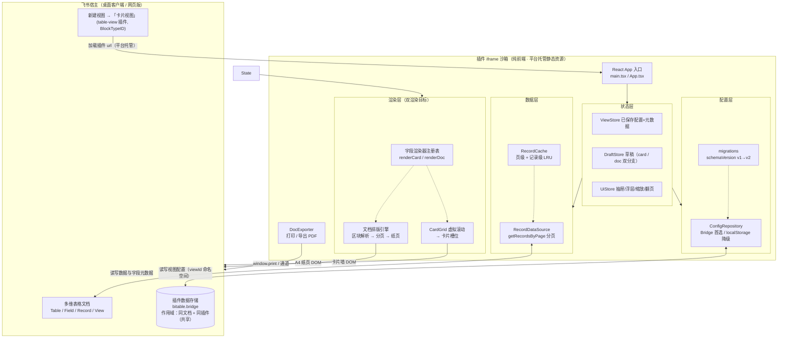
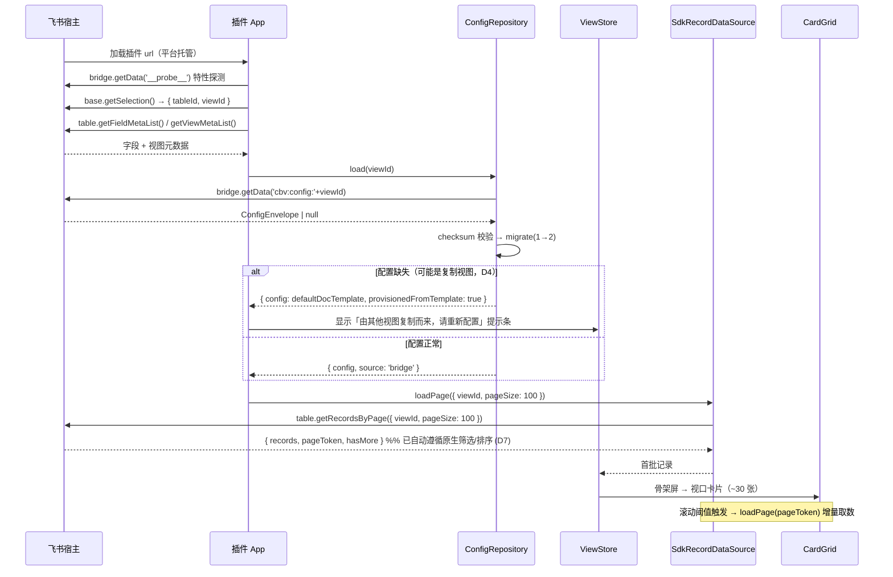
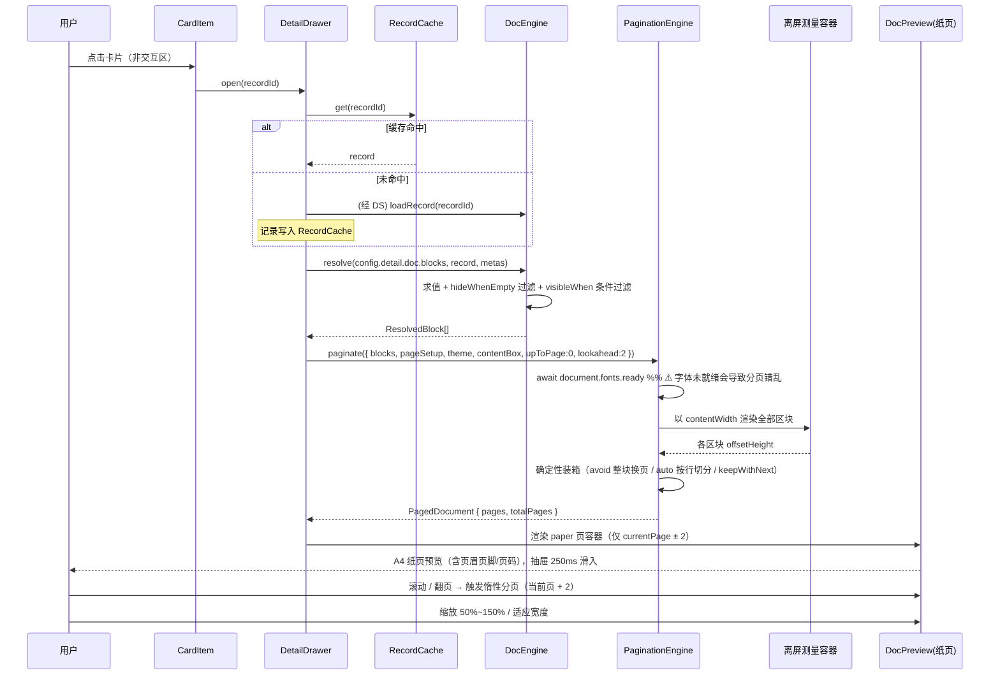
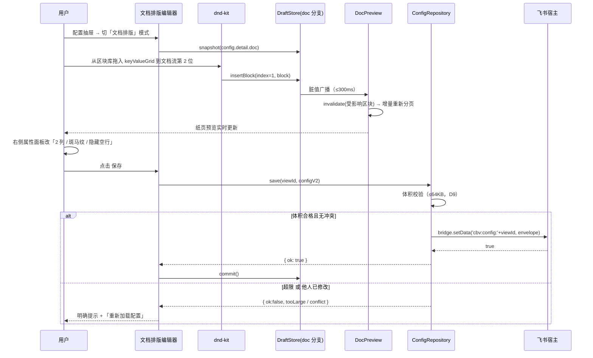
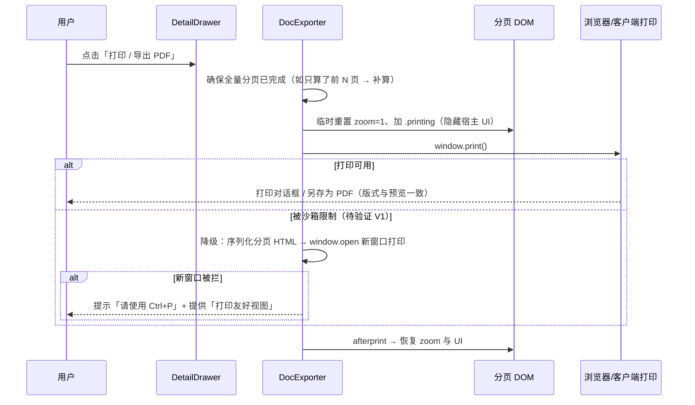
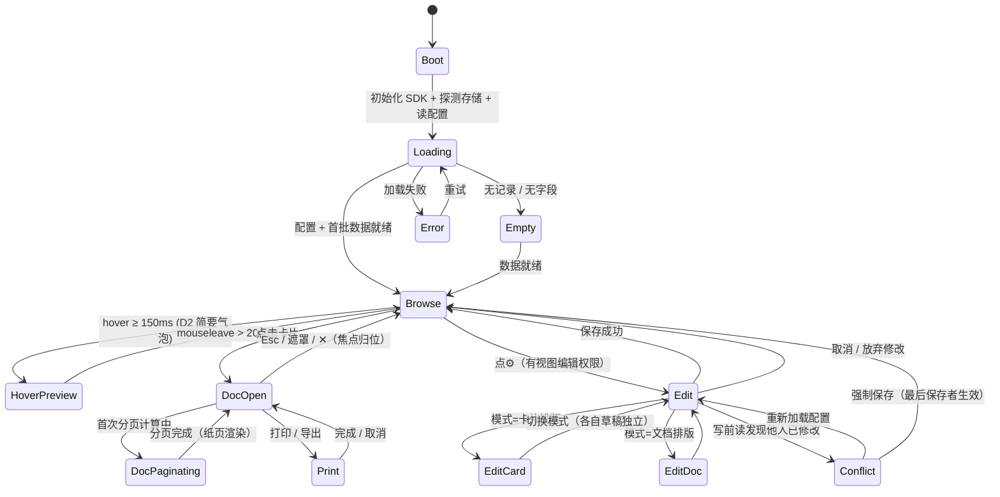
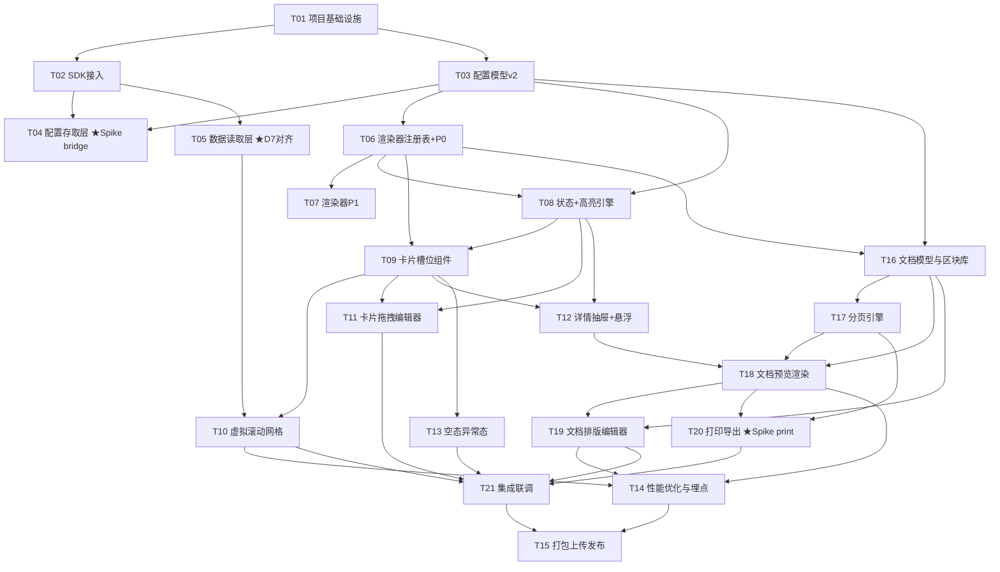

# 开发设计文档｜飞书多维表格扩展视图插件「卡片视图」（Card View）

> 面向工程实施的详细设计文档。上游输入：`01-PRD.md`（v1.1，含决策固化）、`02-技术方案与部署方案.md`、`00-方案总览与待决策清单.md`。
> 版本：v1.0｜日期：2026-09-20｜状态：待评审（Draft）｜适用范围：飞书企业自建应用（多维表格插件 / 数据表视图 table-view）

---

## 0. 决策基线（D1~D10 已确认，全文档以此为准）

| # | 决策点 | 结论 | 设计落点 |
|---|---|---|---|
| **D1** | MVP 是否只读 | **只读**，不写回记录 | §6.2 无写接口；权限基线 `bitable:app:readonly`（免审） |
| **D2** | 悬浮预览范围 | P0 简要气泡 / P1 完整浮层 | §6.5、T12 |
| **D3** | 详情展开形式 | **右侧抽屉 + Word 式分页文档排版预览** | ⭐ **§5 文档排版引擎（本版核心）** |
| **D4** | 复制视图配置 | 不自动跟随；首开提示从模板重配 | §6.3、§5.8 |
| **D5** | 条件高亮表达式 | 单层 AND/OR，不做嵌套 | §6.8 |
| **D6** | 移动端 | **本期不支持**，排除到 P2 | §13 兼容基线仅桌面客户端 + 网页版 |
| **D7** | 原生筛选/排序对齐 | **对齐原生筛选（含排序）**；分组本期不做 | §6.4 |
| **D8** | 国际化 | MVP 仅简体中文，架构预留 i18n | §15.6 |
| **D9** | 配置容量 | ≤64KB + checksum + 超限提示 | §6.3、§12 |
| **D10** | 环境隔离 | dev/staging/prod **各一套企业自建应用** | §18.2 |

### 0.1 UI 评审阶段追加冻结（R1/R2，2026-09-20 用户评审通过）

| 编号 | 事项 | 冻结结论 | 影响 |
|---|---|---|---|
| **R1** | 配置态形态 | **沉浸式三栏编辑模式**（覆盖整屏、编辑时隐藏卡片墙）。左侧字段池/区块库 220px + 中间预览或 A4 画布 + 右侧属性面板 300~320px；顶栏含「卡片排版 / 文档排版」模式切换 + 取消/保存。**原「360px 右侧抽屉」方案废弃** | 覆盖 §10 与 T11/T19；`ConfigDrawer` 语义由"抽屉"改为"沉浸式编辑器容器" |
| **R2** | 详情抽屉默认宽度 | **860px**（默认「适应宽度」、zoom 下限 0.75、可拖宽 560px ~ 满宽、支持全屏）。**原 PRD 480px 废弃** | 覆盖 §4.3 `DrawerConfig.defaultWidthPx`；1280 视口下卡片区仅余约 420px，属已知取舍 |
| **R3~R8** | 卡片密度 / 封面图与头像 / 默认缩放 / 编辑态是否保留卡片墙 / 复制视图首开提示 / token 推导值 | 均按 `04-UI设计说明.md` 第 11 章 R3~R8 的**建议默认值**执行 | 见 `04-UI设计说明.md` §3、§5、§6 |

### 0.2 架构裁定记录（M1 实施反馈，2026-09-20）

> M1（T01~T06）实施过程中，工程师以**实测**推翻了原设计的 4 处细节。以下为架构师（高见远）的**最终裁定**，M2~M4 一律以此为准。
> **依据基线**：官方 `@lark-opdev/block-bitable-webpack-utils@0.1.7` 的 **`dist/index.js` 源码**（路径：`plugin/node_modules/@lark-opdev/block-bitable-webpack-utils/dist/index.js`）+ 工程师实测。

| 编号 | 问题 | 裁定结论 | 依据（实测 / 官方源码） | 影响的章节与任务 | 待办（是否需要工程师改代码） |
|---|---|---|---|---|---|
| **Q1** | **`app.json` 位置语义**：官方 utils 在上一级目录读 `../app.json`、当前目录读 `block.json`；原文档树把二者画成同级 | **采用方案 A（保留同步垫片）**。`plugin/` 保持自包含：`plugin/app.json` 为**源文件**；构建期由 `webpack.config.js` 的 `ensureAppJsonAtParent()` 同步生成 `feishu-card-view/app.json`（**构建产物**）。① 改动最小（QA 正并行验证当前结构）；② 垫片幂等、失败非致命、且在实例化官方插件前执行，无硬性问题；③ 交付物为单一目录、便于整体打包移交。方案 B（改官方布局 `plugin/`=app-dir + `plugin/view/`=view-dir）需移动全部代码/配置并重验 tsconfig·vitest·eslint 路径，成本与回归风险高，**不采用** | 实测 + 官方源码 `function j(){ path.resolve(process.cwd(),"../app.json") … path.resolve(process.cwd(),"block.json") }`（app.json 上一级、block.json 当前级）；`opdevMiddleware` 亦再次调用 `j()`（dev 中间件同样依赖上一级 app.json） | `02§5.1`、`02§5.2`、`03§14`、`03§18.2`；任务 **T01 / T15** | ✅ **已闭环（2026-09-20）**：仓库根确定为 **`feishu-card-view/`**，规则 **`/app.json`**；`feishu-card-view/.gitignore` 已由 team-lead 创建（文件内已注明 `plugin/app.json` 为**源文件**、`feishu-card-view/app.json` 为**构建产物**不提交，改 appId 改 `plugin/app.json` 后跑一次构建自动同步）。代码无需改 |
| **Q2** | **`block.json.url` 语义**：原占位 `http://localhost:9000` 误作 devServer 地址 | **确认**：`url` = 「**调试时要打开的多维表格文档链接**」，**不是** devServer 地址。正确填法：在飞书打开目标多维表格 → **复制浏览器地址栏完整链接**（形如 `https://<domain>.feishu.cn/base/<baseToken>?table=<tblxxxxxx>&view=<vewxxxxxx>`）→ 粘贴到 `url` | 官方源码：`j()` 返回 `bitable:{url:n.url}`；`openBitableURL()` 用该 url（附 `debugPort`）调用 `open()`；`url` 为空时自动**克隆模板文档并把新 url 回写 `block.json`** | `02§13.3`、`03§18.1`、`plugin/README §2.3` | ✅ 无需改（工程师已把占位改为 bitable 链接） |
| **Q3** | **生产构建是否必须显式设置 `NODE_ENV=production`** | **确认**：必须。官方 utils 以 `process.env.NODE_ENV === 'production'` 判定"产出上传物料（`project.config.json`/`index.json`）"还是"打开调试文档"；而 `webpack --mode production` **不设置** Node 进程的 `NODE_ENV`。**CI 与本地构建都必须导出 `NODE_ENV=production`** | 官方源码：`function q(){ return "production" === process.env.NODE_ENV }`；仅 `q()` 为真时 `emitAsset('project.config.json')` / `emitAsset('index.json')`（webpack5 走 `processAssets`、webpack4 走 `additionalAssets`），否则 `hooks.done` 打开调试 url | `02§13.4`、`03§18.1` | ⚠️ 现状：`webpack.config.js` 已在 `mode==='production'` 时于配置进程内强制 `process.env.NODE_ENV='production'`，**本地 `npm run build` 已产出物料，代码无需改**；CI/脚本建议显式导出（命令已写入 `02§13.4`）。**P2 待办**：把 `cross-env NODE_ENV=production` 固化进 `package.json` 的 `build` 脚本，彻底摆脱对 `webpack.config.js` 隐式设置的依赖。**已裁定：做，触发时点 = M4 发布批次**（与 cross-env 固化 NODE_ENV 一并处理） |
| **Q4** | **`DividerBlock.style` 与基类 `DocBlockBase.style` 同名冲突**，无法 `extends` | **改名 `borderStyle`**（`'solid'｜'dashed'｜'dotted'`），并**恢复 `extends DocBlockBase`**（去掉 `Omit` 权宜写法）；分隔线的颜色/线宽复用基类 `style.borderColor` / `style.borderWidth`（与 `borderStyle` 构成 CSS `border-*` 家族，语义清晰，亦为 M3 文档引擎预留） | TypeScript 继承中同名属性类型不兼容（`DocBlockStyle` 对象 vs 字面量联合）→ 编译错误；工程师以 `Omit<DocBlockBase,'style'>` 规避 | `03§4.3`（类型定义）；任务 T03 / T16 | ⚠️ **需改代码（3 处 + 重跑 typecheck）**：<br>① `plugin/src/config/types.ts:288` `extends Omit<DocBlockBase, 'style'>` → `extends DocBlockBase`<br>② `plugin/src/config/types.ts:293-294` 字段名与注释 `style` → `borderStyle`<br>③ `plugin/src/config/defaults.ts:211` `style: 'solid',` → `borderStyle: 'solid',`<br>（全仓仅此 3 处引用，已扫描确认） |
| **Q5-A** | **配置降级策略的实现方式**：偏离原设计的独立装饰器 `FallbackConfigRepository` | **接受**：降级**内聚进 `BridgeConfigRepository`**——构造注入 `options.fallback`；`degraded` 单向闭锁 + `isDegraded()`；`load` 介质失败 → `latchDegrade()` 后委托 fallback（强制 `source:'localStorage'` + `degraded:true`）；`save` 降级后一律走 fallback、**绝不回写 bridge**；`subscribe` 按当前生效介质绑定、降级时解绑 bridge 重绑 fallback。`factory.ts` 在 bridge 可用时注入 localStorage 作 fallback；接口新增 `isDegraded(): boolean`。理由：行为等价、`factory` 返回类型不变、改动面最小（装饰器属可读性优化） | 实测源码 `plugin/src/config/BridgeConfigRepository.ts`（`latchDegrade` L73-81、`loadViaFallback` L84-94、`save` L129-160、`bindMedium` L202-222）；`factory.ts` L32-41；`ConfigRepository.ts` L52-63 | `03§6.3`、`03§12`；任务 **T04** | ✅ 无需改代码。**P2 待办**：若将来引入**第三种**配置介质，再抽象为独立降级装饰器 `FallbackConfigRepository` |
| **Q5-B** | **降级触发口径**：原表述"返回 error 就切介质"不够精确 | **收敛口径**：**只有「介质故障」触发降级**（bridge `getData`/`setData` 抛错，或 `setData` 返回 `false`），且降级为**单向闭锁、不可回退**；**「数据损坏」（checksum 不匹配 / 非法 JSON / 迁移失败）不切换介质**，保持 `source:'bridge'`，继续走「回退默认模板 + 备份原值」路径。理由：损坏时若甩到 localStorage 会**静默呈现空配置、掩盖"配置已损坏"事实**；保持 bridge 才能给出可解释行为与提示 | 实测源码 `BridgeConfigRepository.ts` L11-13（注释明示）、`load` L108-124（介质错误 catch → `latchDegrade`；损坏走 `resolveLoadedConfig` 不降级）、`ConfigRepository.ts` 的 `resolveLoadedConfig` L187-231 | `03§6.3`、`03§12`；任务 **T04** | ✅ 无需改代码；已在 `§6.3` / `§12` 补「介质故障 vs 数据损坏」区分处置 |
| **Q6** | **`unsupportedNewer` 只读强制与错误码 + 只读状态的判定/解除条件** | **确认**实现：两实现各用 `readOnlyViews: Set<string>` 记录 load 时的 `unsupportedNewer`；`save()` 首判 → 返回 `{ ok:false, reason:'unsupported-newer-readonly', error: UNSUPPORTED_NEWER_SAVE_MESSAGE }` 且**不落盘**；`remove()` 清理标记；接口新增 `SaveErrorReason` 与常量 `UNSUPPORTED_NEWER_SAVE_MESSAGE`。**只读解除条件（裁定）**：① 再次 `load(viewId)` 且读到 `schemaVersion <= CURRENT`（每次 load 刷新标记）；② `remove(viewId)` 显式清理。该标记为**运行期内存态、不持久化**，插件重载/换设备会自动重算 | 实测源码 `BridgeConfigRepository.ts` L110-111、L134-136、L190-198；`LocalStorageConfigRepository.ts` L80-81、L96-98、L128-136；`ConfigRepository.ts` L29-50 | `03§4.5`、`03§6.3`；任务 **T04** | ⚠️ **`remove()` 作为清理入口属"预期但不足"**：同一会话内、更高版本客户端把配置降回旧版本后，本端不重新 load 则不会自动解锁可写。**P2 待补（非阻塞）**：`subscribe` 的 `onDataChange` 命中该 viewId 时按新载荷 `schemaVersion` 刷新只读标记。**已裁定：做**，触发时点 = **QA 第二轮回归通过、M2 批次开始时**（作为 M2 首个健壮性补强项派工程师）；不阻塞 M2、**不改 T04 验收标准** |
| **Q7** | **`load` 路径与订阅路径的只读刷新语义不一致**（M2 交付后由 software-engineer-2 上报，未擅自改码）。<br>⚠️ **本条裁定曾一度为"保持现状、不改 `load`"，经 QA 双盲验证实证存在数据丢失路径后，已于 2026-09-20 整体修订（原裁定作废）** | **（已修订）`load` 路径改为 fail-safe，两条路径语义统一。**<br>**最终语义（唯一口径，`load` 与 `subscribe` 一致）**：① `unsupportedNewer:true` → **加锁**；② `degraded:false`（**有效 或 空值**）→ **解锁**；③ `degraded:true`（**损坏 / 迁移失败**）且非升版 → **保持原标记**。<br>**实现口径**：`refreshReadOnlyFromPayload` 第二分支由 `config !== null → delete` 改为 **`!degraded → delete`**；`load` 两处内联分支改调该**共享助手**（一处覆盖两条路径，不绕过共享逻辑）。<br>**被推翻的原判**：曾主张"首次 `load` 无原标记 ⇒ 加固零收益"——该论证**只覆盖首次 load**；真实缺陷出现在"**曾加锁 + 存储后续损坏**"的**重复** load：本端因更高版本加锁 → 存储损坏 → 再次 `load` 误解锁 → `save()` 成功 → **覆盖更高版本客户端配置（不可逆）**。 | **事实**（`ConfigRepository.ts` `resolveLoadedConfig` 四出口）：① 空值 → `config:null, degraded:false, unsupportedNewer:false`（**无 error**）L195-197；② 损坏（反序列化失败 / 校验和不匹配）→ `config:null, degraded:true, unsupportedNewer:false`（**有 error**）L200-209；③ 正常 / 旧版迁移成功 → `config:<cfg>, degraded:false, unsupportedNewer` L212-220；④ 迁移失败 → `config:null, degraded:true, unsupportedNewer`（**保留版本判断**）L221-230。此前 `load` 两处为 `if unsupportedNewer add; else delete;`（`BridgeConfigRepository.ts:110-112`、`LocalStorageConfigRepository.ts:80-82`）→ 损坏 / 空值 / 迁移失败一律解锁。<br>**关键依据**：空值分支**恒为 `degraded:false`**（L195-197），而 `degraded:true` 时 `config` **必为 `null`**（L200-209 / L221-230）——故 **`!degraded` 精确等价于"有效或空值"**。此区分**必须保留**：若简单复用旧助手（把空值也归入"保持"），会在存储被清空时**锁死 provision 默认模板写入与"清除后重配"**（次生缺陷）。<br>**四条理由**：① **成本不对称**——数据丢失**不可逆** vs 误锁**可解**；② **fail-safe 不损害任何合法自愈场景**——从未加锁（存储本来就坏）时仍解锁、用户仍能 `save` 重建，只有"曾加锁"时才锁住（那正是需阻止 `save` 的情形）；③ **单助手方案**可一处覆盖 `load`+`subscribe` 两条路径且不绕过共享逻辑；④ 真正的介质读取故障仍由 `catch → latchDegrade()` 单向闭锁兜底（`BridgeConfigRepository.ts:114-116`）。 | `03§12`（交叉引用，已同步修订）；任务 T04 | ⚠️ **需工程师改代码**（已由 team-lead 派修复批次）：① `refreshReadOnlyFromPayload` 第二分支 `config !== null → delete` → **`!degraded → delete`**；② `BridgeConfigRepository.ts` 与 `LocalStorageConfigRepository.ts` 的 `load` 内联分支改调**共享助手**。复查时点 **M3** |

**§4.3 字段名冲突扫描结论（Q4 附带）**

- **硬冲突（编译错误）**：仅 `DividerBlock.style` 一处 → 按上表 Q4 改名 `borderStyle` 修复。
- **语义冗余（非错误，P2 可选收敛，不阻塞 M2~M4）**：
  1. `ImageBlock.align`（区块级）与 `DocBlockStyle.align`（样式级）语义重叠 → 建议后续统一用 `style.align`。
  2. `MetaFooterBlock.fontSize`（区块级）与 `DocBlockStyle.fontSize` 重叠 → 建议后续统一用 `style.fontSize`。
  3. `DividerBlock.thickness`（区块级线宽）与 `DocBlockStyle.borderWidth` 重叠 → 建议后续统一用 `style.borderWidth`。
- 其余区块（`heading` / `paragraph` / `keyValueGrid` / `fieldList` / `badgeRow` / `table` / `richText` / `spacer` / `pageBreak`）**逐字段扫描后无**与 `DocBlockBase`（`blockId` / `kind` / `visibleWhen` / `style` / `breakInside` / `note`）同名的顶层字段。

#### 0.2.1 经验记录（流程教训，2026-09-20）

> **"裁定在独立验证收口前落盘、且带抑制性措辞，会反向抑制缺陷发现。"**
> - **事实**：Q7 在尚未收到独立验证结论时即固化为"保持现状"，且 `§12` 写有"勿当作缺陷反复上报"；后续一位 QA 据此把另一位 QA 打出的**真实缺陷**判为"过时口径 / 假红"，最终由 team-lead 裁定推翻、Q7 整体重写（见上表 Q7）。
> - **教训**：① 涉及**安全边界**（数据丢失 / 权限 / 数据覆盖）的裁定，应在**独立验证收口之后**再固化；② 若必须提前记录，须显式标注"**未经独立验证、可能被证伪**"；③ **不得在裁定文本中包含抑制上报的措辞**（如"勿当作缺陷反复上报"），尤其不得用其否定其他验证者的独立发现。

> **"验证者之间的横向通气会摧毁双盲独立性，使正确发现被'说服'撤回。"**
> - **事实**：在 Q7 重写**之前**（文档仍为旧版时），两位 QA 之间发生了横向沟通——全量验证者（QA-2）向双盲验证者（QA-1）"**提醒**"了**旧版 Q7 的口径**；QA-1 据此**撤回了自己已经正确的缺陷证据**：把已验证的 D1 从"缺陷"**反转**为"有意设计 / 符合 Q7"，并把断言改成"`load` 损坏 → 解锁 → `save` 可成功"，另加"若日后有人把 `load` 误改为 fail-safe，本组会转红告警"的反向注释；结果**真实缺陷一度被掩盖**，最终由主理人裁定纠正、要求其再次反转回来。
> - **教训**：① **验证者之间不得横向互传结论、不得用文档或裁定说服对方改判**——双盲 / 独立验证的**独立性**是缺陷证据可信的前提，横向通气会让**正确的发现被"说服"撤回**，这比缺陷本身更危险（缺陷至少还暴露在报告里，**被撤回的缺陷是无声的**）；② 分歧（含"同事说你的结论过时""文档不是这么写的"）**一律上报主理人裁定**，验证者不得自行改判。
> - **主理人侧教训**：**不应给成员开"可直发同步"的口子**——此前对工程师、对两位 QA 均放宽过"纯状态同步可直发"，事后**两次都产生了返工或污染**；今后涉及**结论 / 断言正确性**的沟通**必须先经主理人**。

---

## 1. 本次决策带来的需求变更

### 1.1 变更总览

| 类别 | 条目 | 影响面 |
|---|---|---|
| ⭐ **重大新增** | **P0-11 ~ P0-15：文档式详情渲染体系**（纸页渲染、区块编辑器、分页引擎、打印导出、预览控制） | 新增 4 个模块（`doc/`、`pagination/`、`export/`、`components/doc/*`）；配置模型由 v1 升到 v2；任务表新增 5 条（T16~T20） |
| 修订 | P0-06 AC3/AC5：详情渲染目标改为文档模板 | 详情区组件全部重写（不再复用槽位组件） |
| 修订 | P0-05：配置新增 `doc` 分支 + 复制视图首开提示 | 配置模型 v2 + 迁移函数 + 首开引导 |
| 修订 | P0-08：配置态由单模式变**双模式编辑器**（卡片排版 / 文档排版） | 编辑器架构改为可切换模式 |
| 修订 | P0-10：异常态新增「分页失败 / 字体未就绪 / 图片加载失败」 | §12 |
| 升级 | P1-08：对齐原生筛选（含排序） | §6.4 |
| 收敛 | 移动端、分组、写回 —— 本期明确不做 | 范围与排期 |

### 1.2 变更的本质：详情区从「表单」到「文档」

```
修订前：  记录 → 槽位组件（标题/副标题/属性/底部）→ 屏幕上的信息堆叠
修订后：  记录 → 文档模板（页设置 + 主题 + 区块流）→ 分页排版引擎 → A4 纸页序列 → 屏幕预览 / 打印 / PDF
```

**结论：详情区不再是一个展示组件，而是一个排版引擎。** 这是本项目技术复杂度最高的部分（占总工作量约 30%~35%），也是产品差异化的核心。

### 1.3 影响面清单

| 层 | 受影响文件/模块 | 动作 |
|---|---|---|
| 配置模型 | `src/config/types.ts` | **重写**：`schemaVersion` 1→2，新增 `doc` 分支 |
| 配置迁移 | `src/config/migrations.ts` | 新增 `1 → 2` 迁移函数 |
| 配置存储 | `src/config/BridgeConfigRepository.ts` | 体积上限校验 + 超限提示 |
| 状态 | `src/state/DraftStore.ts` `/ UiStore.ts` | 新增文档草稿分支、预览缩放/翻页状态 |
| 渲染 | `src/fields/renderers/*` | 每个渲染器**新增文档态渲染**（`renderDoc`） |
| 新增 | `src/doc/*`、`src/pagination/*`、`src/export/*`、`src/components/doc/*`、`src/components/editor/doc/*` | 全新模块 |
| 编辑器 | `src/components/editor/ConfigEditor.tsx`（原 `ConfigDrawer`） | 改为**沉浸式三栏**双模式容器（R1） |
| 任务 | 任务表 | 由 15 条扩到 21 条 |

---

## 2. 修订后的 P0 范围

| 编号 | 需求 | 归属模块 | 对应任务 |
|---|---|---|---|
| P0-01 | 卡片视图基础渲染 | `components/grid` `components/card` | T01, T09 |
| P0-02 | 卡片槽位结构 | `components/card/Slot*` | T09 |
| P0-03 | 拖拽式排版编辑器（卡片） | `components/editor/*` | T11 |
| P0-04 | 实时预览 | `state/DraftStore` + `PreviewCard` | T11 |
| P0-05 | 配置持久化（v2 + 复制视图提示） | `config/*` | T03, T04 |
| P0-06 | 卡片展开详情（文档式） | `components/detail` `components/doc` | T12, T18 |
| P0-07 | 字段类型适配基础集 | `fields/*` | T06 |
| P0-08 | 浏览态/配置态切换（双模式编辑器） | `components/editor` | T11, T19 |
| P0-09 | 基础性能与虚拟化 | `components/grid` `pagination` | T10, T14, T17 |
| P0-10 | 空态与异常态 | `components/layout` | T13 |
| **P0-11** | **文档式详情渲染（纸页/页眉页脚/页码）** | `components/doc` | T18 |
| **P0-12** | **文档区块排版编辑器** | `components/editor/doc` | T19 |
| **P0-13** | **分页引擎** | `pagination/*` | T17 |
| **P0-14** | **打印与导出 PDF** | `export/*` | T20 |
| **P0-15** | **详情预览控制（宽度/全屏/缩放/翻页）** | `components/detail` | T12, T18 |
| 对齐 | P1-08 提前：原生筛选/排序对齐 | `data/*` `components/layout/Toolbar` | T05 |

---

## 3. 总体架构（更新）



### 3.1 双渲染目标（本版关键结构）

| 渲染目标 | 输入 | 输出 | 组件根 | 配置分支 |
|---|---|---|---|---|
| **卡片视图** | `CardLayoutConfig` + 记录 | 虚拟滚动卡片墙 | `CardGrid` | `config.card` |
| **文档详情** | `DocTemplate` + 单条记录 | A4 纸页序列 | `DocPreview` | `config.detail.doc` |

> 两者**共享**：字段渲染器注册表（不同 `render` 方法）、条件求值引擎、数据缓存、SDK 接入层。
> 两者**解耦**：排版配置、编辑 UI、预览容器完全独立，互不影响。

---

## 4. 数据模型（v2 全量 TypeScript 定义）

### 4.1 配置根对象

```ts
/** 当前配置结构版本。v1 → v2：新增 doc 分支（文档式详情） */
export const CURRENT_SCHEMA_VERSION = 2;

export interface CardViewConfig {
  schemaVersion: number;              // = 2
  meta: ConfigMeta;
  card: CardLayoutConfig;             // 卡片视图排版（原 layout，重命名以免与 doc 混淆）
  detail: DetailConfig;               // 详情配置（含 doc 文档模板）
  theme: StyleTheme;
  density: DensityConfig;
  highlightRules: HighlightRule[];
}

export interface ConfigEnvelope {
  schemaVersion: number;
  pluginVersion: string;
  writtenAt: number;
  checksum: string;
  payload: CardViewConfig;
}

export interface ConfigMeta {
  configId: string;                   // = viewId
  tableId: string;
  createdAt: number;
  updatedAt: number;
  updatedBy: string;
  templateId: string;                 // 来源模板，用于 D4「从模板重配」
  /** D4：本配置是否由「复制视图」首次打开时从模板生成 */
  provisionedFromTemplate?: boolean;
}
```

### 4.2 卡片排版（沿用 v1，仅重命名）

```ts
export type SlotId = 'title' | 'subtitle' | 'attributes' | 'footer';

export interface CardLayoutConfig {
  /** 对应 S3「模板画廊」四档：紧凑 compact / 标准 standard / 大图 cover / 清单 list（+ custom） */
  templateId: 'standard' | 'compact' | 'cover' | 'list' | 'custom';
  slots: Record<SlotId, SlotConfig>;
  /** R4 冻结：默认 false；卡片**不设封面槽位**，"大图"模板经"属性区首图 64×64"实现（非封面图） */
  showCoverImage?: boolean;
  cardAspect: 'auto' | 'square' | 'fixed';
  /** 仅当 cardAspect='fixed' 时生效（宽/高比） */
  fixedAspectRatio?: number;
}

export interface SlotConfig {
  id: SlotId;
  visible: boolean;
  collapsibleWhenEmpty: boolean;
  direction: 'row' | 'column';
  separator: string;                  // 默认 ' · '（副标题多字段分隔）
  /** 槽位内字段条数硬上限；属性区"默认行数"另由 DensityConfig.attributesMaxRows（R3）控制 */
  maxItemsPerCard: number;
  placements: FieldPlacement[];       // 槽位内字段落位（有序）
}

export interface FieldPlacement {
  placementId: string;
  fieldId: string;
  order: number;
  label?: string;
  labelVisible: boolean;
  display: FieldDisplayOptions;
}

export interface FieldDisplayOptions {
  maxLines: number;
  truncate: 'ellipsis' | 'clip' | 'none';
  maxItems: number;
  prefix?: string;
  suffix?: string;
  numberFormat?: NumberFormatOptions;
  dateFormat?: string;
  hideWhenEmpty: boolean;
}

export interface NumberFormatOptions {
  useGrouping: boolean;
  decimals?: number;
  unit?: string;
}
```

> **R4 落点（封面图 / 人员头像）**：① 封面图默认**不显示** → 见 `CardLayoutConfig.showCoverImage = false`（卡片不新增"封面槽位"，保持四槽位模型）；"大图"模板用"属性区首图 64×64 + 张数"实现。② 人员字段在属性区渲染 **20px 圆形头像 + 姓名**，尺寸为**渲染常量**（`radius-pill`，固定 20px，**不随 density 变**），非配置项。

### 4.3 ⭐ 文档排版模型（新增）

```ts
/** 详情区配置：D3 固定为文档式 */
export interface DetailConfig {
  mode: 'document';                   // 预留扩展位，当前恒为 document
  fieldScope: 'all' | 'placed' | 'custom';
  customFieldIds?: string[];
  /** 抽屉外观与预览控制（P0-15） */
  drawer: DrawerConfig;
  /** 文档模板（P0-11 / P0-12） */
  doc: DocTemplate;
}

export interface DrawerConfig {
  defaultWidthPx: number;             // 860（R2）
  minWidthPx: number;                 // 560：拖拽调宽下限（R2；上限 = 视口宽/全屏）
  maximizable: boolean;               // 支持全屏
  rememberWidth: boolean;             // R2：记住用户上次拖拽宽度（默认 true）
  defaultZoom: number;                // 1 = 100%
  zoomPresets: number[];              // [0.5, 0.75, 1, 1.25, 1.5]
  defaultFitToWidth: boolean;         // R5：默认「适应宽度」
  minZoom: number;                    // R5：缩放下限 0.75（低于则居中 + 横向滚动）
  /** R5：分页边界提示默认值（编辑态默认开、浏览态默认关） */
  pageBoundaryHint: { edit: boolean; browse: boolean };
}

/** ===== 文档模板 ===== */
export interface DocTemplate {
  templateId: string;
  pageSetup: PageSetup;
  theme: DocTheme;
  /** 有序区块流：文档渲染的原子序列 */
  blocks: DocBlock[];
}

export interface PageSetup {
  paper: 'A4' | 'A5' | 'Letter';
  orientation: 'portrait' | 'landscape';
  /** 页边距，单位 px（@96dpi 基准；UI 层以 mm 呈现） */
  margin: { top: number; right: number; bottom: number; left: number };
  header?: HeaderFooterConfig;
  footer?: HeaderFooterConfig;
  showPageNumber: boolean;
  pageNumberFormat: 'n' | 'n/total' | 'page-n';  // 1 / 1/3 / 第1页
  headerFooterScope: 'first' | 'all';
}

export interface HeaderFooterConfig {
  enabled: boolean;
  /** 静态文本与字段占位符混排，如 "{记录标题}" 或 "客户档案 · 生成于 {修改时间}" */
  content: string;
  align: 'left' | 'center' | 'right';
  fontSize: number;
  color: string;
  showBorder: boolean;                // 页眉/页脚与正文之间的分隔线
}

export interface DocTheme {
  fontFamily: string;                 // 默认 '"PingFang SC","Microsoft YaHei",sans-serif'
  baseFontSize: number;               // px，默认 14
  lineHeight: number;                 // 默认 1.6
  headingScale: [number, number, number];  // h1/h2/h3 相对倍率，默认 [1.6, 1.35, 1.15]
  headingWeight: 400 | 500 | 600 | 700;
  blockSpacing: number;               // 区块间距 px，默认 12
  paragraphIndent: number;            // 首行缩进 px（中文文档常用 2 字符）
  primaryColor: string;
  textColor: string;
  mutedColor: string;
  dividerColor: string;
}

/** ===== 区块 ===== */
export type DocBlockKind =
  | 'heading'         // 标题（静态文本或绑定字段）
  | 'paragraph'       // 段落（绑定字段的长文本）
  | 'keyValueGrid'    // 键值网格（N 列，「字段名: 值」）
  | 'fieldList'       // 字段清单（纵向单列，可配标签宽度）
  | 'badgeRow'        // 标签行（单选/多选值）
  | 'image'           // 图片（附件字段）
  | 'table'           // 表格（多值/关联记录展开）
  | 'richText'        // 静态富文本（说明文字）
  | 'divider'         // 分隔线
  | 'spacer'          // 垂直间距
  | 'pageBreak'       // 强制分页
  | 'metaFooter';     // 页脚元信息（创建人/时间/记录 ID）

export type BreakInside = 'auto' | 'avoid';

export interface DocBlockStyle {
  fontSize?: number;
  fontWeight?: 400 | 500 | 600 | 700;
  color?: string;
  backgroundColor?: string;
  align?: 'left' | 'center' | 'right' | 'justify';
  marginTop?: number;
  marginBottom?: number;
  paddingX?: number;
  paddingY?: number;
  borderColor?: string;
  borderWidth?: number;
  borderRadius?: number;
}

interface DocBlockBase {
  blockId: string;
  kind: DocBlockKind;
  /** 用于区块分组/条件显隐；复用 highlight 的 RuleCondition */
  visibleWhen?: RuleCondition | null;
  style?: DocBlockStyle;
  /** 分页行为：avoid = 整体不跨页；auto = 允许按行切分 */
  breakInside: BreakInside;
  /** 区块内部标识，供 UI 列表展示（非用户可见文案时用 kind 的中文名） */
  note?: string;
}

/** 1. 标题 */
export interface HeadingBlock extends DocBlockBase {
  kind: 'heading';
  level: 1 | 2 | 3;
  /** 内容来源：静态文本 或 绑定字段 */
  source:
    | { type: 'static'; text: string }
    | { type: 'field'; fieldId: string };
  /** 为 true 时，字段为空则整块不渲染 */
  hideWhenEmpty: boolean;
}

/** 2. 段落 */
export interface ParagraphBlock extends DocBlockBase {
  kind: 'paragraph';
  fieldId: string;
  /** 保留换行 / 折叠空白 */
  preserveLineBreaks: boolean;
  maxLines?: number;                  // 未设 = 不限（文档内建议不限，靠分页）
  hideWhenEmpty: boolean;
}

/** 3. 键值网格 */
export interface KeyValueGridBlock extends DocBlockBase {
  kind: 'keyValueGrid';
  columns: 1 | 2 | 3 | 4;
  rows: Array<{ fieldId: string; labelOverride?: string }>;
  labelWidthPx: number;               // 标签列宽
  showColon: boolean;
  zebra: boolean;                     // 斑马纹
  hideEmptyRows: boolean;
}

/** 4. 字段清单（纵向） */
export interface FieldListBlock extends DocBlockBase {
  kind: 'fieldList';
  items: Array<{ fieldId: string; labelOverride?: string }>;
  showLabels: boolean;
  hideEmptyItems: boolean;
}

/** 5. 标签行 */
export interface BadgeRowBlock extends DocBlockBase {
  kind: 'badgeRow';
  fieldIds: string[];
  maxItems: number;
  showLabels: boolean;
}

/** 6. 图片 */
export interface ImageBlock extends DocBlockBase {
  kind: 'image';
  fieldId: string;                    // 附件字段
  mode: 'first' | 'all' | 'index';
  index: number;
  width: number;                      // px
  height?: number;                    // 未设 = 按比例
  align: 'left' | 'center' | 'right';
  caption?: string;
  hideWhenEmpty: boolean;
}

/** 7. 表格 */
export interface TableBlock extends DocBlockBase {
  kind: 'table';
  /** 列定义：可绑定字段，也可用静态表头 */
  columns: Array<{ fieldId: string; titleOverride?: string; widthPx?: number; align?: 'left'|'center'|'right' }>;
  /** 行来源：关联记录 / 多选展开 / 单条记录字段（当前记录） */
  rowSource: { type: 'linkedRecords'; fieldId: string } | { type: 'currentRecord' };
  showHeader: boolean;
  zebra: boolean;
  maxRows?: number;
}

/** 8. 静态富文本 */
export interface RichTextBlock extends DocBlockBase {
  kind: 'richText';
  /** MVP 支持 markdown 子集：**粗体** / *斜体* / 换行 / - 列表 */
  markdown: string;
}

/**
 * 9. 分隔线
 *
 * ⚠️ M1 实测修正（架构裁定 §0.2 · Q4）：线型原字段名 `style` 与基类
 * `DocBlockBase.style`（DocBlockStyle 通用样式对象）**同名冲突、无法 extends**。
 * 现将其**改名为 `borderStyle`**，可正常 `extends DocBlockBase`；线的颜色/线宽复用
 * 基类的 `style.borderColor` / `style.borderWidth`，与 `borderStyle` 构成 CSS `border-*` 家族。
 */
export interface DividerBlock extends DocBlockBase {
  kind: 'divider';
  /** 线宽（px）；与基类 `style.borderWidth` 二选一，同时存在时优先取 `style.borderWidth` */
  thickness: number;
  /** 线型：solid / dashed / dotted */
  borderStyle: 'solid' | 'dashed' | 'dotted';
}

/** 10. 间距 */
export interface SpacerBlock extends DocBlockBase {
  kind: 'spacer';
  height: number;
}

/** 11. 强制分页 */
export interface PageBreakBlock extends DocBlockBase {
  kind: 'pageBreak';
}

/** 12. 页脚元信息 */
export interface MetaFooterBlock extends DocBlockBase {
  kind: 'metaFooter';
  fields: Array<'createdUser' | 'createdTime' | 'modifiedUser' | 'modifiedTime' | 'recordId'>;
  separator: string;
  fontSize: number;
  muted: boolean;
}

export type DocBlock =
  | HeadingBlock | ParagraphBlock | KeyValueGridBlock | FieldListBlock
  | BadgeRowBlock | ImageBlock | TableBlock | RichTextBlock
  | DividerBlock | SpacerBlock | PageBreakBlock | MetaFooterBlock;
```

### 4.4 条件高亮（v1 沿用，D5 边界）

```ts
export interface HighlightRule {
  ruleId: string;
  name: string;
  enabled: boolean;
  target: HighlightTarget;
  condition: RuleCondition;           // 单层 and/or
  style: HighlightStyle;
  priority: number;
}

export type HighlightTarget =
  | { kind: 'cardBorder' }
  | { kind: 'field'; fieldId: string }
  | { kind: 'badge'; fieldId: string };

/** 单层组合，不支持嵌套（D5） */
export interface RuleCondition {
  logic: 'and' | 'or';
  items: RuleExpr[];
}

export interface RuleExpr {
  fieldId: string;
  operator: RuleOperator;
  value?: unknown;
}

export type RuleOperator =
  | 'eq' | 'neq' | 'gt' | 'gte' | 'lt' | 'lte'
  | 'contains' | 'notContains' | 'isEmpty' | 'isNotEmpty'
  | 'before' | 'after';

export interface HighlightStyle {
  color?: string;
  backgroundColor?: string;
  borderColor?: string;
  borderWidth?: number;
}

export interface StyleTheme {
  preset: string;
  primaryColor: string;
  backgroundColor?: string;
  borderColor?: string;
  borderRadius: number;
  shadowLevel: 0 | 1 | 2 | 3;
  fontScale: number;                  // 0.85 ~ 1.3
  titleWeight: 400 | 500 | 600 | 700;
}

export interface DensityConfig {
  /** R3 冻结：三档密度预设 */
  preset: 'compact' | 'standard' | 'comfortable';
  cardMinWidth: number;               // 紧凑 240 / 标准 280 / 宽松 320
  columnsMode: 'auto' | 'fixed';
  fixedColumns?: number;
  gap: number;                        // 12 / 16 / 20
  padding: number;                    // 10 / 16 / 20
  maxCardHeight: number;              // 160 / 220 / 320
  /** R3 冻结：属性区默认最多**行数**（紧凑 2 / 标准 3 / 宽松 5）；超出按 `SlotConfig.maxItemsPerCard` 截断并显示 `+n` */
  attributesMaxRows: number;
}
```

> **R3 三档密度映射（默认取"标准"）**：紧凑 `240 / gap 12 / pad 10 / maxH 160`·属性 2 行；**标准（默认）** `280 / 16 / 16 / 220`·属性 **3 行**；宽松 `320 / 20 / 20 / 320`·属性 5 行。1280 视口下分别约 5 / 4 / 3 列。

### 4.5 迁移策略（v1 → v2）

```ts
export type ConfigMigration = (input: unknown, fromVersion: number) => unknown;

export const migrations: Record<number, ConfigMigration> = {
  /** v1 → v2：layout → card；新增 detail.doc（默认文档模板） */
  1: (old) => {
    const o = old as Record<string, unknown>;
    return {
      ...o,
      schemaVersion: 2,
      card: o.layout ?? defaultCardLayout(),
      detail: defaultDetailConfig(),      // 生成默认 A4 文档模板
      layout: undefined,                  // 清理旧字段
    };
  },
};
```

| 机制 | 规则 |
|---|---|
| 读旧 | `migrate(envelope.schemaVersion → CURRENT)` 逐级升级；失败 → 默认模板 + 备份原值（`cbv:config:{viewId}:backup:{ts}`） |
| 读新（降级） | `envelope.schemaVersion > CURRENT` → 只读已知字段、忽略未知字段，进入**只读模式**并提示"配置由更高版本创建"，禁止保存 |
| 损坏检测 | `checksum` 校验失败 → 回退默认模板 + 备份 |
| 兼容承诺 | 高版本**必须**能读所有历史 `schemaVersion`；迁移函数只增不改 |

> **只读（`unsupportedNewer`）的判定与解除条件（M1 实现口径，见 §0.2 · Q6）**
> - **判定**：`load(viewId)` 读到的 `envelope.schemaVersion > CURRENT_SCHEMA_VERSION` → `unsupportedNewer=true`，实现侧记入运行期内存集合 `readOnlyViews`（**不持久化**）；该状态下 `save()` 一律返回 `{ ok:false, reason:'unsupported-newer-readonly', error: UNSUPPORTED_NEWER_SAVE_MESSAGE }` 且**不落盘**（避免把更高版本客户端写入的配置降级覆盖）。
> - **解除**：① 再次 `load(viewId)` 且读到 `schemaVersion <= CURRENT`（每次 load 会 `add`/`delete` 刷新该标记）；② `remove(viewId)` 显式清理。插件重载 / 换设备会触发重新 load、自动重算。
> - **已知缺口（P2 待补，非阻塞）**：同一会话内、更高版本客户端把配置降回旧版本后，本端若**不重新 load** 不会自动解锁可写；建议在 `subscribe` 的 `onDataChange` 命中该 viewId 时按新载荷的 `schemaVersion` 刷新只读标记。

---

## 5. ⭐ 文档排版引擎设计（本版核心）

### 5.1 设计目标

| 目标 | 指标 |
|---|---|
| 所见即所得 | 屏幕纸页预览与打印/导出 PDF 版式一致（同一分页结果） |
| 分页正确 | 无内容截断、重叠、丢字；不可切分块不跨页 |
| 响应速度 | 首次分页 ≤ 400ms（典型 20 区块文档）；翻页 ≤ 50ms；缩放 ≤ 100ms |
| 可编辑 | 区块可增删改排序，实时预览 ≤ 300ms |
| 大数据安全 | 文档渲染与卡片虚拟滚动互不干扰 |

### 5.2 区块库（Block Library）

编辑器左侧「区块库」按语义分组，用户拖入文档流：

| 分组 | 区块 | 说明 |
|---|---|---|
| **文本** | `heading` `paragraph` `richText` | 标题层级、字段长文本、静态说明 |
| **字段** | `keyValueGrid` `fieldList` `badgeRow` | 键值网格（最常用）、纵向清单、标签行 |
| **媒体** | `image` `table` | 附件图片、关联记录/多值表格 |
| **结构** | `divider` `spacer` `pageBreak` | 分隔线、间距、强制分页 |
| **元信息** | `metaFooter` | 创建人/时间/记录 ID |

**默认 A4 模板（首次打开生成）**

```
[heading L1]  绑定字段：首个可用文本字段（如「客户名称」）
[divider]
[keyValueGrid 2列] 前 6 个 P0 字段
[spacer 12px]
[heading L2] 静态文本：「详细信息」
[fieldList] 其余字段
[spacer]
[metaFooter] 创建人 · 创建时间 · 修改时间
```

### 5.3 页面与尺寸模型

```ts
/** @96dpi CSS 像素基准 */
export const PAPER_SIZE_PX = {
  A4:     { portrait: { w: 794,  h: 1123 }, landscape: { w: 1123, h: 794  } },
  A5:     { portrait: { w: 559,  h: 794  }, landscape: { w: 794,  h: 559  } },
  Letter: { portrait: { w: 816,  h: 1056 }, landscape: { w: 1056, h: 816  } },
} as const;

export const MM_TO_PX = 96 / 25.4;    // ≈ 3.7795

/** 内容区尺寸（分页的可容纳高度基准） */
export interface ContentBox {
  width: number;      // paper.w - margin.left - margin.right
  height: number;     // paper.h - margin.top - margin.bottom
  originX: number;    // = margin.left
  originY: number;    // = margin.top
}
```

### 5.4 分页引擎（Deterministic Pagination）

**核心思想**：先在离屏测量容器中按**真实内容宽度**逐一测量区块高度，再做确定性装箱，最后按页渲染真实 DOM。**不做浏览器自动分页**，避免屏幕与打印不一致。

```ts
export interface PaginationEngine {
  /** 惰性分页：只计算到 upToPage + lookahead 页 */
  paginate(input: PaginateInput): Promise<PagedDocument>;
  /** 内容/尺寸变化时失效缓存 */
  invalidate(blockIds?: string[]): void;
}

export interface PaginateInput {
  blocks: ResolvedBlock[];            // 已完成字段求值 + 条件过滤的区块
  pageSetup: PageSetup;
  theme: DocTheme;
  contentBox: ContentBox;
  upToPage: number;                   // 惰性目标页
  lookahead: number;                  // 预取页数，默认 2
}

export interface ResolvedBlock {
  block: DocBlock;
  /** 字段求值后的渲染 payload（文本、标签、图片 URL、表格行等） */
  payload: ResolvedPayload;
  /** 字段缺失且 hideWhenEmpty → 已在此阶段剔除 */
  height?: number;                    // 测量后回填
}

export interface PagedDocument {
  pages: DocPage[];
  totalPages: number;                 // 可能为 -1（未全量计算）
  contentBox: ContentBox;
  fontReady: boolean;
}

export interface DocPage {
  pageIndex: number;
  items: PagedItem[];
}

export interface PagedItem {
  blockId: string;
  fragmentIndex: number;              // 该块被切分的第几段（0 起）
  fragmentsTotal: number;
  height: number;
  /** 跨页切分时，段落/表格的起始偏移（行号或字符偏移） */
  slice?: { kind: 'line'; fromLine: number; toLine: number }
       |  { kind: 'row';  fromRow: number;  toRow: number };
  /** 该片段在本页内的累计偏移已由渲染层按顺序累加，无需存储 */
}
```

**算法（伪代码）**

```ts
async function paginate(input: PaginateInput): Promise<PagedDocument> {
  await document.fonts.ready;                 // ⚠️ 关键：字体未就绪测量会偏小 → 分页错乱
  const { blocks, contentBox } = input;

  // 1) 离屏测量：所有区块以 contentBox.width 渲染到隐藏容器
  const heights = await measureBlocks(blocks, contentBox.width, input.theme);

  // 2) 确定性装箱
  const pages: DocPage[] = [];
  let page: DocPage = { pageIndex: 0, items: [] };
  let y = 0;

  for (let i = 0; i < blocks.length; i++) {
    const b = blocks[i];
    const h = heights[i];

    if (b.block.kind === 'pageBreak') {       // 强制分页
      pages.push(page); page = { pageIndex: pages.length, items: [] }; y = 0;
      continue;
    }

    const remain = contentBox.height - y;

    if (h <= remain) {                        // 放得下
      page.items.push({ blockId: b.block.blockId, fragmentIndex: 0, fragmentsTotal: 1, height: h });
      y += h;
      continue;
    }

    // 放不下
    if (b.block.breakInside === 'avoid') {    // 不可切分 → 整块换页
      pages.push(page); page = { pageIndex: pages.length, items: [] }; y = 0;
      page.items.push({ blockId: b.block.blockId, fragmentIndex: 0, fragmentsTotal: 1, height: h });
      y += h;
      continue;
    }

    // 可切分（paragraph / table / fieldList）
    const minKeep = input.theme.baseFontSize * input.theme.lineHeight * 2; // 孤行控制：至少留 2 行
    if (remain < minKeep) {
      pages.push(page); page = { pageIndex: pages.length, items: [] }; y = 0;
      // 重试整块放到新页
      if (h <= contentBox.height) {
        page.items.push({ blockId: b.block.blockId, fragmentIndex: 0, fragmentsTotal: 1, height: h });
        y += h;
        continue;
      }
    }

    // 按行/行组切分，填满当前页后继续下一页
    const slices = splitBlock(b, heights[i], remain, contentBox.height, input.theme);
    for (const s of slices) {
      if (y + s.height > contentBox.height && page.items.length) {
        pages.push(page); page = { pageIndex: pages.length, items: [] }; y = 0;
      }
      page.items.push({
        blockId: b.block.blockId,
        fragmentIndex: s.index,
        fragmentsTotal: slices.length,
        height: s.height,
        slice: s.slice,
      });
      y += s.height;
    }
  }
  pages.push(page);

  return { pages, totalPages: pages.length, contentBox, fontReady: true };
}
```

**切分实现要点**

| 块类型 | 切分粒度 | 实现 |
|---|---|---|
| `paragraph` | 按行 | `Range.getClientRects()` 按行矩形分组 → 二分查找可容纳行数 → 生成两段 |
| `table` | 按行 | 表头重绘（`repeatHeaderOnBreak: true` 时每页重复表头），行组切分 |
| `fieldList` | 按项 | 项边界切分（避免一项被拆成两半） |
| `keyValueGrid` | **不可切分** | 强制 `breakInside: 'avoid'`（网格拆开语义会乱） |
| `heading` | 不可切分 | 与后续首块做**尽量同页**（`keepWithNext`，若下块放不下则标题也下移） |

> ⚠️ `heading` 的 `keepWithNext` 是排版质量的关键细节：实现为装箱时若「标题 + 下一块首行」放不下，则标题一起换页。

**测量实现**

```ts
/**
 * 用一个 position:absolute; visibility:hidden; left:-99999px 的容器
 * 以 contentBox.width 为宽渲染全部区块，读取各自 offsetHeight。
 * 测量完毕即销毁，不进入主渲染树（不影响布局性能）。
 */
async function measureBlocks(blocks: ResolvedBlock[], width: number, theme: DocTheme): Promise<number[]>;
```

### 5.5 方案对比与选型

| 方案 | 屏幕预览一致性 | 打印一致性 | 实现成本 | 性能 | 结论 |
|---|---|---|---|---|---|
| **A. 纯 CSS Paged Media**（`@page` + `break-inside`） | ❌ 屏幕不显示分页 | ✅ 浏览器分页 | 低 | 好 | ❌ 不满足"打印预览"语义 |
| **B. JS 确定性分页（测量 + 装箱）** | ✅ 完全一致 | ✅ 一致（分页 DOM 直接打印） | 高 | 中（可惰性+缓存优化） | ✅ **选为主方案** |
| **C. 屏幕近似 + 打印交给浏览器** | ⚠️ 近似，可能错页 | ✅ | 低 | 好 | ❌ 预览失真，失去意义 |
| D. 服务端排版（Puppeteer/PDF 服务） | ✅ | ✅ | 很高 | 差 | ❌ 需自建服务器，违反"零服务端"结论 |

**最终选型：方案 B**，理由：屏幕上就要看到正确的分页，这是"打印预览"的核心价值；且分页后的 DOM 直接用于打印，天然保证屏幕↔打印一致。

### 5.6 屏幕预览渲染

```tsx
<DocPreview
  pagedDoc={pagedDoc}
  pageSetup={pageSetup}
  theme={theme}
  zoom={zoom}                 // 0.5 ~ 1.5
  fitToWidth={fitToWidth}
/>
```

| 关注点 | 实现 |
|---|---|
| 纸页容器 | 每页一个 `div.doc-page`：`width/height` = 纸张 px；`background:#fff`；`box-shadow` 模拟纸张；`padding` 按 `pageSetup.margin` |
| 页眉/页脚 | 绝对定位于页内 `margin` 区域；`showBorder` 画分隔线；页码按 `pageNumberFormat` 渲染 |
| 缩放 | 外层 `transform: scale(zoom); transform-origin: top center`；容器高度按 `pageCount × pageH × zoom` 计算，避免滚动条错乱 |
| 适应宽度 | `zoom = (containerWidth - padding) / paperWidth`，窗口 resize 时以 `ResizeObserver` 重算 |
| 翻页 | **页级虚拟化**：只渲染 `currentPage ± 2` 的纸页，其余用等高占位；配合右侧页码导航（`n/total`）与「跳转页」 |
| 滚动 | 抽屉内独立滚动容器；滚动位置映射当前页码（吸顶页码指示器） |
| 虚线分页提示 | 可开关「显示分页边界」（编辑态默认开） |
| 打印样式 | `@media print` 下 `transform:none`、隐藏宿主 UI、`page-break-after: always`（见 §5.7） |

### 5.7 打印与导出 PDF（P0-14）

**首选：原生打印 + 分页 DOM**

```css
@media print {
  /* 隐藏宿主与插件 UI，只保留纸页 */
  :global(.host-ui), :global(.plugin-chrome) { display: none !important; }
  .doc-preview { transform: none !important; }
  .doc-page {
    width: var(--paper-w);
    height: var(--paper-h);
    box-shadow: none;
    break-after: page;              /* 每页精确分页 */
    break-inside: avoid;
  }
  .doc-page:last-child { break-after: auto; }
}
@page { size: A4 portrait; margin: 0; }   /* 尺寸由 JS 按 pageSetup 动态注入 */
```

流程：`DocExporter.exportPdf()` → 临时把 `zoom` 重置为 1、隐藏 UI → `window.print()` → `afterprint` 事件恢复。

```ts
export interface DocExporter {
  /** 保真打印：复用已分页 DOM */
  print(container: HTMLElement, setup: PageSetup): Promise<void>;
  /** 导出 PDF（默认走系统打印的"另存为 PDF"） */
  exportPdf(container: HTMLElement, setup: PageSetup, fileName: string): Promise<void>;
}
```

**降级链路**
1. iframe 内 `window.print()` 不可用 → 将分页 HTML + 内联样式序列化，`window.open()` 新窗口 `document.write` 后打印
2. 新窗口被拦 → 提示用户「请使用浏览器打印（Ctrl+P）」，并在页面提供仅含纸页的"打印友好视图"
3. 均失败 → 提供「导出 HTML 文件」兜底

> ⚠️ **待验证项 V1**：飞书客户端 iframe 沙箱内 `window.print()` 是否可用、是否只打印宿主整页。**必须做 Spike**（见 §19）。

### 5.8 文档模板与配置持久化

- 文档模板随 `CardViewConfig.detail.doc` 一起存入 bridge（key：`cbv:config:{viewId}`）
- **D4 首开提示**：若 `meta.provisionedFromTemplate === true`（由复制视图场景写入），首次打开时顶部提示条——「本视图由其他视图复制而来，排版需重新配置」+ 按钮「从模板重配」/「立即配置」
- 体积控制：文档模板通常 5~20KB；连同卡片配置总预算 ≤64KB；超限时保存前拦截并提示（D9）

---

## 6. 模块设计

### 6.1 层次总览

```
┌────────────────────────────────────────────────────────────┐
│ 表现层  components/  (layout | grid | card | detail | doc | editor) │
├────────────────────────────────────────────────────────────┤
│ 状态层  state/       (ViewStore | DraftStore | UiStore)     │
├────────────────────────────────────────────────────────────┤
│ 领域层  doc/ pagination/ fields/ highlight/ export/         │
├────────────────────────────────────────────────────────────┤
│ 数据层  data/        (RecordDataSource | RecordCache)       │
├────────────────────────────────────────────────────────────┤
│ 配置层  config/      (Repository | migrations | defaults)   │
├────────────────────────────────────────────────────────────┤
│ 接入层  sdk/         (base | env)                           │
└────────────────────────────────────────────────────────────┘
```

**依赖方向单向向下**；表现层不得直接调用 `sdk/`，必须经状态层或数据层。

### 6.2 接入层 `src/sdk/`

| 文件 | 职责 | 关键 API |
|---|---|---|
| `base.ts` | `bitable` 单例；封装 `base/table/view` 获取；**所有 SDK 调用集中于此层**，便于 API 变更时一处修复 | `bitable.base.getSelection()`、`table.getFieldMetaList()`、`table.getViewMetaList()` |
| `env.ts` | 环境探测：产品端（客户端/网页）、语言（`bridge.getLanguage()`）、主题、当前 `tableId` / `viewId` | `bitable.bridge.getLanguage()`、`bitable.bridge.getTheme()` |

> **D1 只读约束**：本层**不暴露任何写接口**（`setRecord` / `addRecord` / `deleteRecord` 一律不封装），从架构上杜绝误用。

### 6.3 配置层 `src/config/`

| 文件 | 职责 |
|---|---|
| `types.ts` | §4 全部类型 + `CURRENT_SCHEMA_VERSION = 2` |
| `defaults.ts` | `defaultCardLayout()` / `defaultDetailConfig()` / `defaultDocTemplate()`（A4 模板） |
| `migrations.ts` | 迁移注册表（`1 → 2`） |
| `ConfigRepository.ts` | 存取抽象接口（`load/save/subscribe/remove/getSchemaVersion/isDegraded`）+ envelope 编解码 + 读取编排 `resolveLoadedConfig` + `SaveErrorReason` / `UNSUPPORTED_NEWER_SAVE_MESSAGE` |
| `BridgeConfigRepository.ts` | 首选实现；key `cbv:config:{viewId}`；体积校验；**F2 运行期介质降级（内聚，构造注入 `fallback`，单向闭锁）**；**F5 更高版本只读（`readOnlyViews`）** |
| `LocalStorageConfigRepository.ts` | 降级实现（**不满足跨用户共享**，UI 必须明示）；F5 只读；`isDegraded()` 恒 false（自身即降级介质） |
| `factory.ts` | 运行时特性探测与选型；bridge 可用时**注入 localStorage 作为运行期降级 fallback**（F2） |
| `provision.ts` | D4：检测"复制视图"场景（无配置 + 视图名相似/标记）→ 生成模板配置 + 打 `provisionedFromTemplate` |

```ts
export type ConfigSource = 'bridge' | 'localStorage' | 'default';

export interface ConfigRepository {
  getSchemaVersion(): number;
  load(viewId: string): Promise<LoadResult>;
  save(viewId: string, config: CardViewConfig): Promise<SaveResult>;
  subscribe(viewId: string, cb: (config: CardViewConfig) => void): () => void;
  remove(viewId: string): Promise<boolean>;
  /** F2：是否已发生「介质降级」（运行期 primary 介质失败 → 单向闭锁切 fallback） */
  isDegraded(): boolean;
}

export interface LoadResult {
  config: CardViewConfig | null;
  degraded: boolean;                  // 走了降级（损坏回退 / 介质降级）
  unsupportedNewer: boolean;          // 读到更高版本 → 只读模式
  source: ConfigSource;
  provisionedFromTemplate?: boolean;  // D4 首开提示
  error?: string;                     // 失败原因（诊断用，不直接展示）
}

/** 保存失败错误码（供上层分支，不直接展示） */
export type SaveErrorReason =
  | 'too-large'                    // D9：体积超限（> 64KB）
  | 'unsupported-newer-readonly'   // F5：更高版本只读，禁止保存
  | 'write-failed';                // 底层介质写入失败

export interface SaveResult {
  ok: boolean;
  conflict?: boolean;
  tooLarge?: boolean;                 // D9 超限
  reason?: SaveErrorReason;
  error?: string;
}

/** F5：更高版本只读时，保存被拒的 UI 可展示文案 */
export const UNSUPPORTED_NEWER_SAVE_MESSAGE =
  '当前配置由更高版本的插件写入，为避免覆盖较新数据，本版本仅支持只读浏览，暂不能保存。';
```

> **降级口径（M1 实现，见 §0.2 · Q5-B）**
> - **只有「介质故障」触发降级**：bridge `getData`/`setData` **抛错**，或 `setData` 返回 **`false`**。降级为**单向闭锁**（不可回退），此后 `load/save/subscribe` 一律走 fallback（localStorage）且**不回写 bridge**；`isDegraded()` 置真 → UI 出**常驻**提示条。
> - **「数据损坏」不切换介质**：checksum 不匹配 / 非法 JSON / 迁移失败 → 保持 `source:'bridge'`，继续走「回退默认模板 + 备份原值（`cbv:config:{viewId}:backup:{ts}`）」路径（避免静默呈现空配置、掩盖损坏事实）。

### 6.4 数据层 `src/data/`（D7 对齐原生筛选）

| 文件 | 职责 |
|---|---|
| `RecordDataSource.ts` | 取数抽象：`loadPage` / `loadRecord` / `count` |
| `SdkRecordDataSource.ts` | `table.getRecordsByPage({ viewId, pageSize, pageToken })` 实现 |
| `RecordCache.ts` | 页级 LRU（pageToken → records）+ 记录级 LRU（recordId → record） |

**D7 对齐原生筛选/排序的实现口径**

| 能力 | 实现 | 说明 |
|---|---|---|
| **筛选 + 排序** | 调用 `getRecordsByPage({ viewId })`，**结果自动遵循该视图的原生筛选与排序** | ✅ 天然对齐，无需前端复刻规则 |
| ⚠️ 注意 | 传 `viewId` 时 `sort` / `filter` 入参**失效** | 设计上不再传这两个参数 |
| **插件内搜索** | 优先级 1：读取视图原生筛选条件（`getViewMetaList` / view 元数据）→ 与搜索词**合并**后作为 `filter` 发起请求（此时**不传 viewId**）<br>优先级 2（降级）：仅过滤**已加载页**，并在 UI 明示"搜索结果仅覆盖已加载内容" | ⚠️ **待验证项 V2**：SDK 是否可读视图筛选条件。若不可读 → 采用降级方案 + 工具栏提供「在原生视图中筛选」跳转入口 |
| **分组** | 本期不做（D7） | `getRecordsByPage` 无分组读接口 |

### 6.5 渲染层：字段渲染器（双态）

```ts
export interface FieldRenderer {
  key: string;
  priority: 'P0' | 'P1' | 'P2';
  /** 卡片态：紧凑 */
  renderCard(nv: NormalizedValue, ctx: RenderContext): React.ReactNode;
  /** 文档态：完整、可跨页、支持长文本 */
  renderDoc(nv: NormalizedValue, ctx: DocRenderContext): React.ReactNode;
}

export interface DocRenderContext extends RenderContext {
  /** 该块是否被分页切分（切分时应避免重复画"字段名:"标签） */
  fragmentIndex: number;
  fragmentsTotal: number;
  /** 文档态是否显示标签前缀 */
  showLabel: boolean;
  labelText?: string;
}
```

| FieldType | 值 | 优先级 | 卡片态 | 文档态 |
|---|---|---|---|---|
| Text | 1 | P0 | 单行截断 | 完整段落（可跨页） |
| Number | 2 | P0 | 千分位 | 完整数值 |
| Currency | 99003 | P0 | 货币符号 | 右对齐 |
| SingleSelect | 3 | P0 | 彩色标签 | 彩色标签 |
| MultiSelect | 4 | P0 | N 个 + "+n" | **全部**标签（可换行） |
| DateTime | 5 | P0 | `YYYY-MM-DD` | `YYYY-MM-DD HH:mm` |
| Checkbox | 7 | P0 | 勾/叉 | 是/否 |
| User | 11 / 1003 / 1004 | P1 | 头像 + 名（限 N） | 全部成员 |
| Attachment | 17 | P1 | 首图缩略 + 数量 | 图片块 / 文件列表 |
| Rating | 99004 | P1 | 星级 | 星级 + 数值 |
| Progress | 99002 | P1 | 进度条 | 进度条 + 百分比 |
| Phone / Url | 13 / 15 | P1 | 可点 | 可点（打印时显示为文本 + 链接样式） |
| Formula / Lookup / Link | 20 / 19 / 18 / 21 | P1 | 按结果类型分发 | 多值展开为列表/表格 |
| Created*/Modified*/AutoNumber | 1001~1005 | P1 | 文本/日期 | 文本/日期 |
| Location / GroupChat / Barcode | 22 / 23 / 99001 | P2 | 文本/标签 | 文本/标签 |
| 不支持类型 | — | unsupported | 「该字段类型暂不支持」 | 同左（不阻断分页） |

> **两态共用** `normalize()`（`IOpenCellValue → NormalizedValue`），保证「卡片与文档对同一字段的解读一致」，仅在**呈现密度**上不同。

### 6.6 文档引擎模块 `src/doc/`

| 文件 | 职责 |
|---|---|
| `resolve.ts` | `DocBlock[] + record → ResolvedBlock[]`：字段求值、`hideWhenEmpty` 过滤、`visibleWhen` 条件过滤、图片 URL 解析、表格行解析 |
| `blockDefaults.ts` | 每种区块的默认配置工厂（拖入时的初始值） |
| `blockCatalog.ts` | 区块库元数据（分组、图标、中文名、可拖入约束） |
| `markdown.ts` | `richText` 的 markdown 子集解析（粗体/斜体/换行/列表） |
| `measure.ts` | 离屏测量（§5.4） |

### 6.7 分页模块 `src/pagination/`

| 文件 | 职责 |
|---|---|
| `engine.ts` | `paginate()` 主流程（§5.4 伪代码） |
| `splitBlock.ts` | 按行/按行组切分（paragraph / table / fieldList） |
| `pageMetrics.ts` | 纸张尺寸、`ContentBox` 计算、mm↔px 换算 |
| `heightCache.ts` | 高度缓存（key：`blockId + contentWidth + payloadHash`） |

### 6.8 导出模块 `src/export/`

| 文件 | 职责 |
|---|---|
| `DocExporter.ts` | §5.7 的打印/导出与降级链路 |
| `printStyles.ts` | 动态注入 `@page` 与打印样式 |

### 6.9 高亮规则 `src/highlight/ruleEngine.ts`

- `evaluate(condition, record, fieldMetaMap): boolean`
- 单层 `and` / `or`（D5）；`RuleOperator` 覆盖比较/包含/空值/日期先后
- **复用**于：卡片边框着色、字段着色、标签着色、**文档区块 `visibleWhen`**（同一引擎，避免两套条件实现）

---

## 7. 接口定义汇总

```ts
// 配置存取
export interface ConfigRepository { /* §6.3 */ }

// 数据读取
export interface RecordDataSource {
  loadPage(p: { viewId: string; pageSize: number; pageToken?: string }): Promise<PageResult>;
  loadRecord(recordId: string): Promise<RecordData>;
  search?(p: { keyword: string; viewId: string; pageToken?: string }): Promise<PageResult>;
}

export interface PageResult {
  records: RecordData[];
  pageToken?: string;
  hasMore: boolean;
}

// 文档引擎
export interface DocEngine {
  resolve(blocks: DocBlock[], record: RecordData, metas: FieldMetaMap): ResolvedBlock[];
  paginate(input: PaginateInput): Promise<PagedDocument>;
  invalidate(blockIds?: string[]): void;
}

// 导出
export interface DocExporter { /* §5.7 */ }

// 渲染器
export interface FieldRenderer { /* §6.5 */ }
```

---

## 8. 关键流程时序图

### 8.1 视图首次加载（卡片墙）



### 8.2 ⭐ 文档详情打开与分页渲染（D3 核心流程）



### 8.3 文档排版编辑与保存



### 8.4 打印 / 导出 PDF



---

## 9. 状态管理设计



| Store | 职责 | 关键字段 |
|---|---|---|
| `ViewStore` | 已保存配置、字段元数据、视图元数据、权限、数据源句柄 | `config` `fieldMetas` `viewMeta` `canEdit` |
| `DraftStore` | 草稿（**card / doc 两个独立分支** + 快照栈 + dirty 标记） | `cardDraft` `docDraft` `snapshotStack` `dirty` |
| `UiStore` | 抽屉、浮层、骨架屏、编辑模式、**文档缩放/翻页/当前页**、冲突弹窗、提示条 | `editMode` `zoom` `fitToWidth` `currentPage` `banner` |
| `DocStore` | 当前记录的 `ResolvedBlock[]` 与 `PagedDocument`；分页进度 | `resolved` `paged` `paginationState` |

**编辑期隔离**：卡片排版与文档排版的草稿**互不影响**；「取消」只丢弃当前模式的草稿，「保存」提交两者（保持一次保存写入完整 `CardViewConfig`）。

---

## 10. 编辑器设计（沉浸式三栏 · 双模式）

> **R1（2026-09-20 用户评审冻结）**：配置态形态为**沉浸式三栏编辑模式**（**覆盖整屏、编辑时隐藏卡片墙**，见 R6）；**原「360px 右侧抽屉」方案废弃**，`ConfigDrawer` 语义由"抽屉"改为"沉浸式编辑器容器"（组件更名为 **`ConfigEditor`**）。数值来源：`04-UI设计说明.md` §3.4（`layout-panel-left 220` / `layout-panel-right-card 300` / `layout-panel-right-doc 320` / `layout-toolbar-height 48`）与 §5.3/§5.4 逐屏说明。

```tsx
// components/editor/ConfigEditor.tsx —— 沉浸式双模式编辑器容器（覆盖整屏）
<ConfigEditor mode={editMode} onModeChange={...} onCancel={...} onSave={...}>
  {editMode === 'card' ? <CardLayoutEditor /> : <DocLayoutEditor />}
</ConfigEditor>
```

| 区域 | 卡片排版模式（S3） | 文档排版模式（S4） |
|---|---|---|
| 顶栏 h=48 | `[← 返回浏览]` · 标题 · 分段控件 `(卡片排版｜文档排版)` · `[从模板重配▾]` `[取消]` `[保存]` | 同左（分段控件切"文档排版"，末项为 `[重置为默认模板]`） |
| 左栏 **220px** | 字段池：**已使用 / 未使用 / 不支持** 三组（可拖；不支持项置灰 + tooltip 原因） | **区块库**：5 组 12 类（文本/字段/媒体/结构/元信息） |
| 中栏 弹性（bg `bg-app`/`bg-canvas`） | 预览样例卡（与真实卡同宽，最大 360，标注「示例记录」） | **A4 纸页实时预览** 794×1123（含分页标尺；编辑态默认 100% 缩放） |
| 右栏 **300px**（卡片）/ **320px**（文档） | 槽位配置 / 布局模板 / 样式主题 / 尺寸密度(R3) / 条件高亮 | **区块属性**（按 `kind` 动态表单）/ 页设置 / 文档主题 |
| 底部 | — | 底栏操作提示（h=32，12px） |

**统一交互约束（R1 / S3 / S4）**
- 进入配置态：顶栏 + 三栏立即铺开（120ms 淡入），**卡片墙隐藏**（R6）。
- **「保存」是唯一提交出口**；有未保存修改时，`取消` / `返回浏览` / 关闭需**二次确认** `放弃未保存的修改？`。
- 双模式**草稿互不污染**：切「卡片排版 / 文档排版」时各自草稿保留（`DraftStore` 分 `card` / `doc` 两条分支），点保存时**一并提交**。
- 拖拽反馈：幽灵元素（`opacity .6` + `shadow-drag-ghost`）+ 目标槽位/落点高亮 `#EFF4FF` + **2px 插入指示线** `#3370FF`；非法落点显示禁止光标。
- 改密度（R3 三档）/ 改区块属性 → 预览刷新 **≤300ms**。
- `editMode: 'card' | 'doc'` 属 **`UiStore`** 运行期状态（**非配置项**，见 §9 `UiStore.editMode`）。

**拖拽技术要点（dnd-kit）**
- 使用 `PointerSensor`（**不用 HTML5 原生 DnD**，iframe 沙箱下易失效）
- 跨容器（字段池/区块库 → 槽位/文档流）用 `useDroppable` + `SortableContext`
- 插入位置用 `onDragOver` 计算最近项中点，渲染 2px 插入指示线
- 文档流很长时与页级虚拟化协同：拖拽自动滚动到目标页并**暂停虚拟化**（临时渲染全部页，避免拖到未渲染页失败）

---

## 11. 字段渲染器使用约定

| 约定 | 说明 |
|---|---|
| 单点入口 | 所有字段渲染必须经 `components/card/FieldValue.tsx`（卡片态）或 `components/doc/DocFieldValue.tsx`（文档态），内部查注册表 |
| 兜底 | 单字段渲染异常被 `try/catch` 捕获 → `FallbackRenderer`，**不影响整卡 / 不中断分页** |
| 不外泄原始值 | `normalize()` 保证永不输出原始 ID / JSON（US-5 AC1） |
| 降级标记 | 不支持类型渲染 `unsupportedBadge`，可在编辑态汇总提示「本视图有 N 个字段类型不支持」 |
| 打印友好 | 文档态链接/按钮等交互元素在 `@media print` 下转为纯文本/保留链接样式 |
| 图片 | 统一 `loading="lazy"`、`onError` 占位；打印前需确保已加载（`await Promise.all(imagesLoaded)`） |

> ⚠️ **待验证项 V3**：打印/导出时若图片未加载完成会输出空白。方案：导出前等待所有 `` 的 `complete`，或对未加载图片显示占位并提示。

---

## 12. 错误处理与降级

| 异常态 | 技术兜底 | 来源 |
|---|---|---|
| 无记录 | `EmptyState` | 原 6.5 |
| 无字段 / 无可配置字段 | 字段池空态 + 卡片区空态 | 原 6.5 |
| 首屏加载中 | `CardSkeleton` | 原 6.5 |
| 增量加载中 | 底部加载指示 + 骨架卡 | 原 6.5 |
| 加载失败 | `ErrorState` + 重试 | 原 6.5 |
| 超长文本 | 卡片截断；**文档态不截断，靠分页承载** | 修订 |
| 字段被删除 | 与 `getFieldMetaList()` 比对 → 失效引用自动隐藏 + 编辑态提示 | 原 6.5 |
| 字段类型变更致不支持 | `FallbackRenderer` | 原 6.5 |
| ⭐ **配置数据损坏**（checksum 不匹配 / 非法 JSON / 迁移失败） | **不切换介质**：保持 `source:'bridge'`，回退默认模板 + 备份原值（`cbv:config:{viewId}:backup:{ts}`）+ 提示（避免静默呈现空配置、掩盖损坏事实） | 原 6.5（M1 口径收敛） |
| ⓘ **`load` 与订阅路径的只读刷新语义（已统一）** | **最终语义：空值 → 解锁 / 损坏 → 保持标记，`load` 与 `subscribe` 一致**（`refreshReadOnlyFromPayload` 第二分支 `!degraded → delete`）。此前二者不一致（`load` 在数据损坏时误解锁、曾可覆盖更高版本配置）**属已确认缺陷、已修复**，见 §0.2 · Q7 | 新增（M2 · §0.2 Q7 修订） |
| ⭐ **配置存储介质故障**（bridge `getData`/`setData` 抛错 或 `setData` 返回 `false`） | **单向闭锁降级**到 localStorage（不可回退）：其后 `load/save/subscribe` 全走 fallback、**不回写 bridge**；`isDegraded()` → 常驻提示条 | 新增（M1 · §0.2 Q5-B） |
| **版本不兼容（读到更高版本 `unsupportedNewer`）** | 进入**只读模式**（禁止 `save`，返回 `reason:'unsupported-newer-readonly'`），仅读已知字段；**解除条件**见 §4.5 | 原 6.5（M1 补解除条件） |
| ⭐ **分页失败 / 区块高度测量异常** | 回退为「**单页长文档**」模式（不模拟纸张，连续流式渲染）+ 顶部提示；保证可读性 | **新增** |
| ⭐ **字体未就绪** | 分页前 `await document.fonts.ready`；超时 3s 则用当前字体测量并在字体就绪后**自动重新分页** | **新增** |
| ⭐ **图片加载失败 / 未加载完成** | 图片块占位 + 导出前等待加载（超时 5s 则跳过并记录） | **新增** |
| ⭐ **打印不可用** | 降级链路（§5.7）：新窗口打印 → 提示 Ctrl+P → 导出 HTML | **新增** |
| 配置体积超限 | 保存前拦截 + 明确提示「配置过大，请精简区块/规则」（D9） | 新增 |
| 存储降级（**初始化**：工厂探测 bridge 不可用） | 直接使用 localStorage；顶部常驻提示「配置仅本地保存，其他成员看不到你的排版」（US-4 AC2 不满足） | 新增 |

**全局机制**
- **Error Boundary**：`App.tsx` 顶层 + 卡片区 + 文档区各一个，捕获渲染异常展示降级 UI，**插件不白屏**
- **字段级 try/catch**：`FieldValue` / `DocFieldValue` 包裹每次渲染器调用
- **分页级 try/catch**：`paginate()` 异常 → 单页长文档降级，不阻断详情打开
- **日志**：`utils/log.ts` 的 `logError(scope, err, ctx)`，`ctx` 必带 `viewId / tableId / pluginVersion`

---

## 13. 性能设计

### 13.1 卡片视图（万行级）

| 环节 | 策略 |
|---|---|
| 首批取数 | `getRecordsByPage({ viewId, pageSize: 100 })` |
| 首屏渲染 | 仅渲染视口 + 过扫描缓冲（~30 张） |
| 增量加载 | IntersectionObserver，剩余 < 1 屏触发；100ms 节流 |
| 虚拟化 | 行级虚拟化 + 动态高度测量（`@tanstack/react-virtual`） |
| 缓存 | 页级 LRU + 记录级 LRU |
| 优化 | `React.memo`、字段值懒渲染、事件委托、图片懒加载、避免 render 内新建对象 |

### 13.2 文档详情（新增）

| 环节 | 策略 |
|---|---|
| 测量 | 离屏容器一次性测量**全部**区块（典型 20~40 块，`offsetHeight` 读取为批量同步操作，通常 < 50ms） |
| 分页 | 惰性：只算到 `currentPage + 2`；翻页时增量补算 |
| 高度缓存 | key = `blockId + contentWidth + payloadHash`；同模板翻页复访命中率低，主要收益在**同记录重复打开**与**编辑态增量重算** |
| 增量重算 | 编辑态只 `invalidate(受影响区块)` → 从**该区块所在页**起重算，后续页复用不可行（位置可能变），故采用「从受影响页重算到末尾」+ 防抖 120ms |
| 纸张虚拟化 | 只渲染 `currentPage ± 2` 纸页 DOM |
| 字体 | `await document.fonts.ready`（超时 3s 走降级自动重排） |
| 图片 | 懒加载 + 导出前统一等待 |
| 大文档保护 | 区块数 > 200 或预估页数 > 50 → 提示「文档较长，已切换为精简渲染」并关闭分页边界提示 |

### 13.3 指标与达成路径

| 指标 | 目标 | 路径 |
|---|---|---|
| 卡片首屏可见 | ≤ 3.0s（乐观 1.5s） | 单次取数 100 条 + 只渲染视口 + 骨架先行 |
| 卡片滚动帧率 | ≥ 50 FPS | 行虚拟化 + memo + 懒渲染 |
| 配置→预览刷新（卡片） | ≤ 300ms | 草稿本地即时计算 |
| **文档首次分页** | **≤ 400ms** | 离屏测量 + 确定性装箱 + 惰性分页 |
| **文档翻页** | **≤ 50ms** | 纸页虚拟化 + 高度缓存 |
| **文档缩放** | **≤ 100ms** | 仅改 `transform: scale`（走合成层，不重排） |
| Hover 触发 | 150ms | `useHoverIntent` 定时器 |
| 详情缓存命中 | — | 记录级 LRU，二次打开 0 请求 |

### 13.4 埋点

`utils/metrics.ts` 采集：`init_start → first_paint`、`fetch_page_duration`、`scroll_fps_sample`、`preview_refresh_ms`、`hover_show_ms`、`doc_open_ms`、`doc_paginate_ms`、`doc_page_flip_ms`、`doc_zoom_ms`、`print_invoke_ms`。

上报：MVP 无外部网络 → 写入 `bridge.setData('cbv:metrics:{viewId}')` 或 `?debug=1` 调试面板展示；**不引入白名单**。

---

## 14. 目录结构与文件清单（更新）

```
plugin/                          # 工程根（opdev create 的 view-dir；与文档分离，避免 npm 工具扫描 md）
├── app.json                     # 【官方·源文件】appId（upload 定位目标应用）
├── block.json                   # 【官方·源文件】blockTypeID / projectName / url（调试打开的 bitable 链接，非 devServer 地址）/ manifestVersion
├── debug.json                   # 【官方】可选，v / vb 调试版本（当前目录读取）
├── package.json
├── tsconfig.json
├── webpack.config.js            # 【官方强制】Webpack + @lark-opdev/block-bitable-webpack-utils
├── tailwind.config.ts / postcss.config.js
├── .eslintrc.cjs / .prettierrc / .gitignore
├── public/index.html
└── src/
    ├── main.tsx                 # 入口：挂载、SDK 初始化、顶层 Error Boundary
    ├── App.tsx                  # Boot / Loading / Browse / Edit 分发
    ├── sdk/
    │   ├── base.ts              # bitable 单例、table/view 获取（只读，不含写接口）
    │   └── env.ts               # 产品端 / 语言 / 主题 / tableId / viewId
    ├── config/
    │   ├── types.ts             # §4 全部类型（含 DocTemplate / DocBlock）
    │   ├── defaults.ts          # 默认卡片布局 / 默认 A4 文档模板
    │   ├── migrations.ts        # 1 → 2 迁移
    │   ├── provision.ts         # D4 复制视图场景识别与模板配置生成
    │   ├── ConfigRepository.ts
    │   ├── BridgeConfigRepository.ts
    │   ├── LocalStorageConfigRepository.ts
    │   └── factory.ts
    ├── data/
    │   ├── RecordDataSource.ts
    │   ├── SdkRecordDataSource.ts
    │   └── RecordCache.ts
    ├── doc/                                    # ⭐ 文档引擎
    │   ├── resolve.ts           # 区块 → ResolvedBlock（含条件过滤）
    │   ├── blockCatalog.ts      # 区块库元数据（分组/图标/中文名）
    │   ├── blockDefaults.ts     # 各区块默认配置工厂
    │   ├── markdown.ts          # richText 的 markdown 子集
    │   └── measure.ts           # 离屏测量
    ├── pagination/                             # ⭐ 分页引擎
    │   ├── engine.ts            # paginate() 主流程
    │   ├── splitBlock.ts        # 按行/按行组切分
    │   ├── pageMetrics.ts       # 纸张尺寸 / ContentBox / mm↔px
    │   └── heightCache.ts
    ├── export/                                 # ⭐ 导出
    │   ├── DocExporter.ts       # 打印 / 导出 PDF / 降级链路
    │   └── printStyles.ts
    ├── fields/
    │   ├── fieldTypes.ts        # FieldType 枚举 + 优先级映射
    │   ├── registry.ts          # 渲染器注册表（renderCard / renderDoc）
    │   ├── normalize.ts         # IOpenCellValue → NormalizedValue
    │   └── renderers/           # Text / Number / Tag / Date / Checkbox / User /
    │                            # Attachment / Rating / Progress / Link / Formula /
    │                            # Lookup / Fallback
    ├── state/
    │   ├── ViewStore.ts
    │   ├── DraftStore.ts        # card / doc 双分支 + 快照栈
    │   ├── DocStore.ts          # ⭐ resolved + paged + 分页进度
    │   ├── UiStore.ts           # 抽屉 / 浮层 / 缩放 / 翻页 / 编辑模式
    │   └── selectors.ts
    ├── components/
    │   ├── layout/
    │   │   ├── ViewShell.tsx
    │   │   ├── Toolbar.tsx
    │   │   ├── Banner.tsx       # D4 复制提示 / 存储降级提示 / 超限提示
    │   │   └── EmptyState.tsx
    │   ├── grid/
    │   │   ├── CardGrid.tsx
    │   │   ├── CardItem.tsx
    │   │   ├── CardSkeleton.tsx
    │   │   └── useVirtualGrid.ts
    │   ├── card/
    │   │   ├── CardBody.tsx
    │   │   ├── SlotTitle.tsx / SlotSubtitle.tsx / SlotAttributes.tsx / SlotFooter.tsx
    │   │   └── FieldValue.tsx
    │   ├── detail/
    │   │   ├── DetailDrawer.tsx      # 抽屉容器 + 宽度/全屏/缩放控制（P0-15）
    │   │   ├── HoverPreview.tsx      # D2 简要气泡（P0）/ 完整浮层（P1）
    │   │   ├── PageNavigator.tsx     # 页码导航 n/total + 跳转
    │   │   └── useHoverIntent.ts
    │   ├── doc/                       # ⭐ 文档渲染组件
    │   │   ├── DocPreview.tsx        # 纸页容器 + 缩放 + 页虚拟化
    │   │   ├── DocPage.tsx           # 单页（页边距 + 页眉 + 页脚 + 页码）
    │   │   ├── DocHeader.tsx / DocFooter.tsx
    │   │   ├── DocFieldValue.tsx     # 文档态字段渲染入口
    │   │   └── blocks/               # 12 个区块渲染组件
    │   │       ├── HeadingBlockView.tsx / ParagraphBlockView.tsx / ...
    │   │       └── BlockRenderer.tsx # 按 kind 分发
    │   └── editor/
    │       ├── ConfigEditor.tsx      # 沉浸式三栏双模式容器（R1；原 ConfigDrawer）
    │       ├── card/                 # 卡片排版编辑器（原 editor）
    │       │   ├── FieldPool.tsx / SlotDropZone.tsx / PlacementList.tsx
    │       │   ├── TemplateGallery.tsx / ThemePanel.tsx / DensityPanel.tsx
    │       │   ├── HighlightRulePanel.tsx / PreviewCard.tsx
    │       │   └── dnd/
    │       └── doc/                  # ⭐ 文档排版编辑器
    │           ├── BlockLibrary.tsx      # 区块库（5 组）
    │           ├── DocFlowEditor.tsx     # 文档流拖拽容器
    │           ├── BlockInspector.tsx    # 区块属性面板（按类型动态表单）
    │           ├── PageSetupPanel.tsx    # 纸张/方向/页边距/页眉页脚/页码
    │           ├── DocThemePanel.tsx     # 字体/字号阶梯/行高/间距/颜色
    │           └── dnd/
    ├── highlight/ruleEngine.ts
    ├── hooks/
    │   ├── useCardViewInit.ts
    │   ├── usePermission.ts
    │   ├── useThemeTokens.ts
    │   └── usePagedDocument.ts       # ⭐ 分页编排（resolve → paginate → 惰性补算）
    ├── i18n/{index.ts, zh-CN.ts, en-US.ts}
    ├── constants/{index.ts, keys.ts, paper.ts}
    ├── utils/{hash.ts, format.ts, metrics.ts, log.ts}
    └── styles/{tokens.css, print.css, global.css}
```

> **⚠️ 官方文件的目录位置语义（M1 实测修正，见 §0.2 · Q1）**
> 官方 `@lark-opdev/block-bitable-webpack-utils` 在**上一级目录**读取 `../app.json`、在**当前目录**读取 `block.json` 与 `debug.json`（`opdev create ${app-dir}/${view-dir}` 约定）。故：
> - **源文件**：`plugin/app.json`、`plugin/block.json`、`plugin/debug.json`（本目录）；
> - **构建产物**：`feishu-card-view/app.json`（= 官方期望的 `../app.json`，由 `webpack.config.js` 的 `ensureAppJsonAtParent()` 在实例化官方插件前同步生成，仅缺失或内容不一致时写入）→ **应加入 `.gitignore`**；
> - **`block.json.url`** = 调试时要打开的**多维表格文档链接**（用户在目标表复制地址栏完整链接），**不是** devServer 地址。

---

## 15. 开发规范与协作约定

| 主题 | 约定 |
|---|---|
| 命名 | 组件 PascalCase；hook `useXxx`；类型 PascalCase；常量 `UPPER_SNAKE`；存储 key 前缀 `cbv:` |
| 存储 key | 配置 `cbv:config:{viewId}`；备份 `cbv:config:{viewId}:backup:{ts}`；埋点 `cbv:metrics:{viewId}`；降级 `cbv:config:{appId}:{viewId}` |
| schema 版本 | `CURRENT_SCHEMA_VERSION` 定义于 `config/types.ts`，**只增不改**；变更必须新增迁移函数；与插件版本解耦 |
| 依赖方向 | 表现层 → 状态层 → 领域层 → 数据层 → 配置层 → 接入层；**禁止反向依赖**；表现层不得直接调 SDK |
| SDK 隔离 | 所有 SDK 调用集中在 `sdk/` 与 `data/SdkRecordDataSource.ts`；SDK 变更只改这两处 |
| 只读约束 | `sdk/` 不封装任何写接口；代码评审时禁止引入写 API |
| 单位约定 | 纸张/页边距内部统一 **px（@96dpi）**；UI 呈现时换算为 mm（`MM_TO_PX`） |
| 样式 | 布局用 Tailwind；复杂组件用 CSS Modules；主题走 `styles/tokens.css` CSS 变量；打印样式集中在 `styles/print.css` |
| 错误隔离 | 任何字段渲染、配置读写、数据读取、分页计算必须有 try/catch 或 Error Boundary，**单点失败不扩散** |
| 性能红线 | 卡片/字段/区块组件默认 `memo`；render 内禁止新建对象/函数；图片一律懒加载；缩放只改 transform |
| i18n | 文案键预先定义于 `zh-CN.ts`（按模块 namespace：`editor` / `detail` / `doc` / `empty` / `error`）；MVP 仅简中 |
| 提交规范 | Conventional Commits；一个任务 = 一次可验证提交；提交信息关联任务号（如 `feat(doc): T17 分页引擎`） |

---

## 16. 任务拆解与里程碑

### 16.1 任务清单（21 条）

| ID | 任务名 | 涉及文件 | 依赖 | 完成标准 |
|---|---|---|---|---|
| **T01** | 项目基础设施 | `app.json` `block.json` `debug.json` `package.json` `tsconfig.json` `webpack.config.js` `tailwind.config.ts` `public/index.html` `src/main.tsx` `src/App.tsx` `src/styles/*` | — | `npm run start` 起服务；多维表格「新建视图」可见并打开空壳插件；无控制台报错 |
| **T02** | SDK 接入与环境探测 | `src/sdk/base.ts` `src/sdk/env.ts` `src/hooks/useCardViewInit.ts` `usePermission.ts` `useThemeTokens.ts` `src/constants/*` | T01 | 能打印 `tableId/viewId/字段元数据`；能判断编辑权限；主题 token 注入生效 |
| **T03** | 配置模型 v2 与默认模板 | `src/config/types.ts` `defaults.ts` `migrations.ts` `src/fields/fieldTypes.ts` | T01 | 类型编译通过；`defaultDocTemplate()` 生成合法 A4 模板；`1→2` 迁移函数有单测 |
| **T04** | 配置存取层 | `ConfigRepository.ts` `BridgeConfigRepository.ts` `LocalStorageConfigRepository.ts` `factory.ts` `provision.ts` `utils/hash.ts` | T02, T03 | **Spike：双账号验证 bridge 跨用户共享 + 刷新持久化**；损坏回退默认；降级切换生效；体积超限拦截 |
| **T05** | 数据读取层 | `data/RecordDataSource.ts` `SdkRecordDataSource.ts` `RecordCache.ts` | T02 | `getRecordsByPage` 分页正确；1.2 万行下分页/缓存正常；**验证结果自动遵循原生筛选排序（D7）** |
| **T06** | 渲染器注册表 + P0 渲染器 | `fields/registry.ts` `normalize.ts` `renderers/{Text,Number,Tag,Date,Checkbox,Fallback}Renderer.tsx` | T03 | P0 八类字段**双态**可渲染；无原始 ID/JSON 外泄；单字段异常回落不崩卡 |
| **T07** | 渲染器 P1 扩展 | `renderers/{User,Attachment,Rating,Progress,Link,Formula,Lookup}Renderer.tsx` | T06 | P1 类型双态渲染符合 PRD 第 7 章；有降级兜底 |
| **T08** | 状态管理 + 高亮规则引擎 | `state/{ViewStore,DraftStore,UiStore,selectors}.ts` `highlight/ruleEngine.ts` | T03, T06 | 草稿（card/doc 双分支）快照/回滚可用；单层 AND/OR 求值正确 |
| **T09** | 卡片与槽位渲染组件 | `components/card/*` `components/layout/{ViewShell,Toolbar}.tsx` | T06, T08 | 四槽位按配置渲染；默认与自定义模板均正确；`memo` 生效 |
| **T10** | 虚拟滚动网格 | `components/grid/*` | T05, T09 | 1.2 万行滚动流畅；增量加载触发正确；骨架屏过渡 |
| **T11** | 卡片拖拽排版编辑器 | `components/editor/ConfigEditor.tsx` `editor/card/*` | T08, T09 | **沉浸式三栏（左 220 字段池 / 中预览卡 / 右 300 属性）≡ R1**；顶栏含「卡片排版｜文档排版」模式切换（文档模式落 T19）；字段池三组（已使用/未使用/不支持）；字段池→槽位拖拽/排序/移除 + **2px 插入指示线** + 非法落点禁止光标；**密度三档 + 属性区默认 3 行 ≡ R3**；实时预览 ≤300ms；保存/取消（脏值二次确认）语义正确；dnd-kit 在 iframe 内验证通过 |
| **T12** | 详情抽屉容器 + 悬浮预览（P0-15） | `components/detail/{DetailDrawer,HoverPreview,useHoverIntent}.tsx` | T08, T09 | 抽屉默认 **860px（R2）**、可拖 **560 ~ 全屏**、全屏可还原、**记忆上次宽度**；`Esc` **两级**（退全屏 → 关抽屉）；焦点归位（a11y）；Hover ≥150ms 触发简要气泡（标题 + 副标题 + 前 3 属性，D2） |
| **T13** | 空态/异常态 + 错误边界 | `components/layout/{EmptyState,Banner}.tsx` `App.tsx` 内 ErrorBoundary `grid/CardSkeleton.tsx` | T09 | **`04` S5 状态集 10 类 + 全局 Error Boundary 逐项可见**（PRD 6.5 九类 + 新增五类，细则见 §12）：含「存储降级常驻提示」≡R8、「配置损坏回退」、「复制视图首开提示」≡R7；插件不白屏 |
| **T16** | ⭐ 文档排版模型与区块库 | `doc/{resolve,blockCatalog,blockDefaults,markdown}.ts` `components/doc/blocks/*` | T03, T06 | 12 类区块均可在屏幕正确渲染；条件过滤与 `hideWhenEmpty` 生效 |
| **T17** | ⭐ 分页引擎 | `pagination/{engine,splitBlock,pageMetrics,heightCache}.ts` `doc/measure.ts` | T16 | 20~40 区块文档分页正确（无截断/重叠）；`avoid` 不跨页；长段落/表格按行切分；**首分页 ≤400ms** |
| **T18** | 文档预览渲染（P0-11） | `components/doc/{DocPreview,DocPage,DocHeader,DocFooter,DocFieldValue}.tsx` `hooks/usePagedDocument.ts` `detail/PageNavigator.tsx` | T16, T17, T12 | A4 纸页 + 页眉页脚 + 页码正确；缩放 50~150%；适应宽度；页虚拟化；滚动映射页码 |
| **T19** | 文档排版编辑器（P0-12） | `components/editor/doc/*` | T16, T18 | 区块库拖入/排序/删除可用；属性面板按类型动态；页设置与文档主题生效；实时预览 ≤300ms |
| **T20** | 打印与导出 PDF（P0-14） | `export/{DocExporter,printStyles}.ts` `styles/print.css` | T17, T18 | **Spike：验证 iframe 内 `window.print()`（V1）**；打印输出与预览一致；降级链路可用 |
| **T14** | 性能优化与埋点 | `utils/{metrics,log,format}.ts` 全组件 memo/懒渲染/图片懒加载 | T10, T18, T19 | 卡片首屏 ≤3s、滚动 ≥50FPS、预览刷新 ≤300ms；文档首分页 ≤400ms、翻页 ≤50ms、缩放 ≤100ms（埋点可验证） |
| **T21** | 集成联调与视觉走查 | 全量；`README`（使用说明） | T10, T11, T13, T19, T20 | 卡片 ↔ 文档 双态联动无冲突；双模式编辑器切换草稿不串；视觉走查通过 |
| **T15** | 打包上传与发布 | `app.json` `block.json`（生产值）版本号 | T14, T21 | `npm run upload` 成功；后台发布链路走通；上线检查清单（技术方案 13.9）全绿 |

### 16.2 依赖图



### 16.3 里程碑

| 里程碑 | 包含任务 | 交付判据（Demo 可演示） |
|---|---|---|
| **M1 骨架打通** | T01~T06 | 打开卡片视图能看到真实数据渲染出的卡片；配置能存能读 |
| **M2 卡片视图可用** | T07~T13 | 拖拽排版卡片、保存配置、空态/异常态完备；万行级滚动流畅 |
| **M3 文档详情可用** | T16~T20 | 点击卡片看到 A4 纸页文档、可翻页缩放、可打印导出 |
| **M4 双态联调与发布** | T14, T21, T15 | 性能达标；上传发布成功，团队可安装使用 |

---

## 17. 测试策略与验收

### 17.1 测试分层

| 层 | 工具 | 覆盖重点 |
|---|---|---|
| 单元测试 | Vitest | `migrations`（v1→v2）、`ruleEngine` 条件求值、**`splitBlock` 切分算法**、**`paginate` 装箱算法**、`normalize` 各字段类型、`format`、`hash` |
| 组件测试 | React Testing Library | `DocPage` 页眉页脚页码、`BlockRenderer` 各区块、`FieldValue` 异常回落、`DetailDrawer` 焦点管理 |
| 端到端 | Playwright | 在真实多维表格中：新建视图 → 拖拽排版 → 保存 → 刷新校验 → 点击展开文档 → 缩放/翻页 → 打印路径 |
| 性能测试 | Playwright + Performance API | 1.2 万行表：首屏、滚动帧率；文档：首分页、翻页、缩放 |
| 兼容性 | 手工 | 飞书桌面客户端（Win/Mac）+ 网页版（Chrome/Edge 新版）；**不含移动端（D6）** |

### 17.2 分页引擎专项测试用例（关键）

| 用例 | 输入 | 期望 |
|---|---|---|
| 恰好填满 | 区块总高 = 内容区高 | 单页，无溢出 |
| 溢出 1px | 区块总高 = 内容区高 + 1 | 换页，无截断 |
| 不可切分块跨页 | `keyValueGrid` 高度 > 剩余高度 | **整块换页**，不拆开 |
| 长段落跨页 | 段落高度 = 3 页 | 按行切分 3 段，无丢字、无重复行 |
| 长表格跨页 | 50 行表格 | 按行切分，每页重复表头 |
| 标题孤行 | `heading` 后跟大块 | 标题随内容一起换页（`keepWithNext`） |
| 强制分页 | 中间含 `pageBreak` | 精确在此处断页，前后无空白残留 |
| 空文档 | 全部区块 `hideWhenEmpty` 且字段全空 | 显示「该记录无可展示内容」空态，不崩溃 |
| 超长文档 | 200 区块 / 60 页 | 触发大文档保护，切换精简渲染并提示 |
| 缩放一致性 | 同文档 zoom 50% / 100% / 150% | 分页结果**完全一致**（分页基于 px，与 zoom 无关） |

### 17.3 验收清单（对齐 P0）

- [ ] P0-01 新建视图可见「卡片视图」并正确渲染
- [ ] P0-02 四槽位按配置渲染，空槽位收合
- [ ] P0-03 卡片拖拽排版可用（含排序、移除、插入指示线）
- [ ] P0-04 配置改动 ≤300ms 反映到预览
- [ ] P0-05 配置持久化；刷新/重进不丢；**双账号看到同一配置**；复制视图首开有提示
- [ ] P0-06 点击展开文档式详情；Esc/遮罩/✕ 关闭并焦点归位
- [ ] P0-07 P0 八类字段双态渲染正确，无原始 ID 外泄
- [ ] P0-08 无权限用户看不到配置入口；双模式编辑器切换正常
- [ ] P0-09 1.2 万行首屏 ≤3s、滚动 ≥50FPS
- [ ] P0-10 九类 + 新增五类异常态均可复现且降级正确
- [ ] **P0-11 详情以 A4 纸页渲染，含页眉页脚与页码**
- [ ] **P0-12 区块库 12 类区块可拖入/排序/删除/配置**
- [ ] **P0-13 分页正确（§17.2 专项用例全过）**
- [ ] **P0-14 打印/导出 PDF 与屏幕预览版式一致**
- [ ] **P0-15 抽屉宽度可调/全屏/缩放/页导航可用**
- [ ] P1-08（提前）插件视图筛选排序结果与原生一致
- [ ] 可访问性：Tab 聚焦、Enter 开详情、Esc 关闭
- [ ] 无任何外部网络请求（开发者后台无白名单需求）

---

## 18. 部署与发布

### 18.1 发布链路（沿用技术方案 13.1~13.5）

7 步：`npm run upload`（语义化递增版本号）→ 开发者后台「数据表视图」选版本 + 图标 + 名称介绍 → 保存 → 「版本管理与发布」创建版本 → 确认权限与可见范围 → 申请线上发布 → 管理员审核 → 用户在「新建视图」安装使用。

**本版新增的发布注意点**

| 注意点 | 说明 |
|---|---|
| 配置 schema 升级 | v1→v2 迁移必须在 T03 完成并单测通过，**否则老视图配置会损坏** |
| 打印相关能力 | 若 V1（`window.print`）不可用，需确认降级方案已上线，避免该功能对用户不可用 |
| 权限 | D1 只读 → 主要依赖 `bitable:app:readonly`（免审，可先行）；无需申请写权限 |
| **生产构建环境变量（§0.2 · Q3）** | `webpack --mode production` **不设置** `process.env.NODE_ENV`；官方 utils 据此判定是否产出上传物料（`project.config.json`/`index.json`）。**CI 与本地构建都必须导出 `NODE_ENV=production`**：`NODE_ENV=production npm run build && NODE_ENV=production npm run upload`（Windows：`$env:NODE_ENV="production"; npm run build; npm run upload`）。详见技术方案 §13.4 |
| **`block.json.url` 语义（§0.2 · Q2）** | `url` 是**调试时要打开的多维表格文档链接**（用户在目标表复制地址栏完整链接），**不是** devServer 地址；发布前确认其指向生产联调文档，而非个人开发文档 |
| **`app.json` 位置（§0.2 · Q1）** | 官方 utils 读上一级 `../app.json`（= `feishu-card-view/app.json`，构建产物）；CI 注入环境对应 `app.json` 时须确保构建能同步到该位置（当前由 `webpack.config.js` 垫片保证） |

### 18.2 环境隔离（D10）

**dev / staging / prod 各一套企业自建应用**（各持独立 `appId` + `BlockTypeID`），通过 CI 注入对应 `app.json` / `block.json`。

| 环境 | 应用 | 用途 | 数据 |
|---|---|---|---|
| dev | 自建应用 A | 本地开发调试 | 个人测试表 |
| staging | 自建应用 B | 预发验证（含 1.2 万行性能表） | 测试表集 |
| prod | 自建应用 C | 生产 | 真实业务表 |

> 参考飞书视图插件的部署方式：均走「企业自建应用 + 数据表视图能力 + 管理员审核发布」，不使用商店应用。

### 18.3 上线检查清单（在技术方案 13.9 基础上新增）

- [ ] 配置 v1→v2 迁移函数已覆盖单测，且用旧版配置实测通过
- [ ] `defaultDocTemplate()` 在无配置时能正确生成（新视图首开体验）
- [ ] D4 复制视图首开提示条逻辑验证通过
- [ ] 存储降级（localStorage）时提示文案可见
- [ ] 配置体积超限提示可用（构造 64KB+ 配置实测）
- [ ] 打印/导出在飞书桌面客户端（Win + Mac）与网页版均验证
- [ ] 分页专项用例（§17.2）10 条全过
- [ ] 图片未加载完成时导出有占位或等待，不输出空白页
- [ ] 200 区块大文档保护触发正常

---

## 19. 风险与待验证项（更新）

### 19.1 本版新增/升级的风险

| # | 风险 | 影响 | 概率 | 应对 | 触发信号 |
|---|---|---|---|---|---|
| **R12** | **iframe 沙箱内 `window.print()` 不可用或只打印宿主整页** | **High** | 中 | ⚠️ **待验证项 V1，T20 阶段第一件事做 Spike**；降级链路见 §5.7 | 打印对话框内容错误 / 打印为空白 |
| **R13** | **字体未就绪导致分页错乱**（测量偏小 → 内容溢出纸页） | **High** | 中 | `await document.fonts.ready`（超时 3s）+ 字体就绪后自动重排 | 纸页出现内容溢出裁切 |
| **R14** | **文档排版引擎工作量超预期**（确定性分页 + 切分算法 + 属性面板） | **High** | **高** | 明确分期：先支持「不可切分块」分页（`keyValueGrid`/`fieldList`/`heading`/`image` + 短段落）打 M3；长段落/表格切分算法**作为 M3 后半段独立任务**，必要时延后到 P1 | T17 进度延期 > 30% |
| R15 | 大文档（200+ 区块）分页性能退化 | 中 | 中 | 惰性分页 + 高度缓存 + 大文档保护降级 | 首分页 > 1s |
| R16 | 打印输出图片空白 | 中 | 中 | 导出前等待 `img.complete`（超时 5s）+ 占位提示 | PDF 中图片位置空白 |
| R17 | 卡片与文档双态配置相互污染 | 中 | 低 | 草稿双分支隔离 + 单测覆盖 | 改卡片排版影响文档模板 |

### 19.2 沿用风险（技术方案第 14 章）

R1 配置持久化介质（**仍为最高优先级，T04 Spike**）、R2 万行级性能、R3 WebView 兼容、R4 SDK API 废弃、R5 字段类型新增、R6 权限审批阻塞、R7 宿主 API 变更、R8 拖拽与 iframe 兼容、R9 bridge 容量、R10 并写冲突、R11 附件资源加载。

### 19.3 待验证项汇总（Spike 清单）

| 编号 | 待验证 | 阶段 | 若失败的对策 |
|---|---|---|---|
| **V1** | iframe 沙箱内 `window.print()` 可用性与打印范围 | T20 前 | 新窗口打印 → 提示 Ctrl+P → 导出 HTML |
| **V2** | SDK 是否可读取视图原生筛选条件（用于插件内搜索合并） | T05 | 搜索降级为「仅过滤已加载页」+ 明示提示 + 跳转原生筛选入口 |
| **V3** | 打印时图片资源是否可正常加载输出 | T20 | 导出前等待加载 + 占位提示 |
| **V4** | `bitable.bridge` 跨用户共享与持久化的真实行为（两账号验证） | T04 | 启用"隐藏配置表"次级方案（需写权限，需重新评估 D1） |
| **V5** | dnd-kit 在飞书 iframe 内的指针事件与自动滚动表现 | T11 / T19 | 降级为「点击添加 + 上下移动按钮」的非拖拽编辑 |

---

## 20. 需求追踪矩阵

| 需求 | 设计章节 | 任务 | 验收 |
|---|---|---|---|
| P0-01 卡片视图基础渲染 | §3, §6.5 | T01, T09 | §17.3 |
| P0-02 卡片槽位结构 | §4.2, §6.5 | T09 | §17.3 |
| P0-03 拖拽式排版编辑器 | §10 | T11 | §17.3 |
| P0-04 实时预览 | §9, §10 | T11 | ≤300ms |
| P0-05 配置持久化（v2 + D4） | §4.5, §6.3, §5.8 | T03, T04 | 双账号一致 |
| P0-06 展开详情（文档式） | §5, §6.6, §8.2 | T12, T16, T18 | §17.2 |
| P0-07 字段类型适配 | §6.5 | T06 | 无原始值外泄 |
| P0-08 浏览/配置态（双模式） | §9, §10 | T11, T19 | §17.3 |
| P0-09 性能与虚拟化 | §13 | T10, T14, T17 | 指标表 |
| P0-10 空态与异常态 | §12 | T13 | 14 类全过 |
| **P0-11 文档式详情渲染** | **§5.3, §5.6** | **T18** | 版式一致 |
| **P0-12 文档区块编辑器** | **§5.2, §10** | **T19** | 拖拽可用 |
| **P0-13 分页引擎** | **§5.4** | **T17** | §17.2 十条 |
| **P0-14 打印与导出 PDF** | **§5.7** | **T20** | 与预览一致 |
| **P0-15 详情预览控制** | **§5.6, §6.9** | **T12, T18** | 缩放/翻页流畅 |
| P1-08 对齐原生筛选（提前） | §6.4 | T05 | 与原生一致 |
| D4 复制视图提示 | §5.8, §6.3 | T04 | 提示可见 |
| D9 容量限制 | §6.3, §12 | T04 | 超限拦截 |
| D10 环境隔离 | §18.2 | T15 | 三套应用 |

---

## 附录 · 关键文档链接（已核实）

| 主题 | 链接 |
|---|---|
| 数据表视图开发指南（创建/调试/发布/代码上传原理） | https://open.feishu.cn/document/base-extensions/base-table-view-extension-development-guide |
| Bridge 模块（setData / getData / onDataChange） | https://lark-base-team.github.io/js-sdk-docs/zh/api/bridge |
| Table 模块（getRecordsByPage，含性能建议） | https://lark-base-team.github.io/js-sdk-docs/zh/api/table |
| View 模块 | http://lark-base-team.github.io/js-sdk-docs/zh/api/view |
| FieldType 枚举（官方值） | https://open.feishu.cn/document/base-extension/base-view-extensions/data-type/fieldtype |
| view.getVisibleRecordIdList（有序记录 ID） | https://open.feishu.cn/document/base-extension/base-view-extensions/api/view/view_getvisiblerecordidlist |
| 社区参考实现 | https://github.com/Lark-Base-Team/bitable-extention |

> **未覆盖项声明**：`bitable.bridge.setData` 的容量上限与精确持久化周期在官方文档中未明确说明；iframe 内 `window.print()` 的可用性官方文档亦未说明。二者分别列为 V4 与 V1 待验证项。
