# 开发设计文档｜飞书多维表格扩展视图插件「卡片视图」（Card View）

> 面向工程实施的详细设计文档。上游输入：`01-PRD.md`（v1.1，含决策固化）、`02-技术方案与部署方案.md`、`00-方案总览与待决策清单.md`。
> 版本：v1.0｜日期：2026-09-20｜状态：待评审（Draft）｜适用范围：飞书企业自建应用（多维表格插件 / 数据表视图 table-view）

---

## 0. 决策基线（D1~D10 已确认，全文档以此为准）

| # | 决策点 | 结论 | 设计落点 |
|---|---|---|---|
| **D1** | MVP 是否只读 | **只读**，不写回记录 | §6.2 无写接口；权限基线 `bitable:app:readonly`（免审） |
| **D2** | 悬浮预览范围 | P0 简要气泡 / P1 完整浮层 | §6.5、T12 |
| **D3** | 详情展开形式 | **右侧抽屉 + Word 式分页文档排版预览** | ⭐ **§5 文档排版引擎（本版核心）** |
| **D4** | 复制视图配置 | 不自动跟随；首开提示从模板重配 | §6.3、§5.8 |
| **D5** | 条件高亮表达式 | 单层 AND/OR，不做嵌套 | §6.8 |
| **D6** | 移动端 | **本期不支持**，排除到 P2 | §13 兼容基线仅桌面客户端 + 网页版 |
| **D7** | 原生筛选/排序对齐 | **对齐原生筛选（含排序）**；分组本期不做 | §6.4 |
| **D8** | 国际化 | MVP 仅简体中文，架构预留 i18n | §15.6 |
| **D9** | 配置容量 | ≤64KB + checksum + 超限提示 | §6.3、§12 |
| **D10** | 环境隔离 | dev/staging/prod **各一套企业自建应用** | §18.2 |

### 0.1 UI 评审阶段追加冻结（R1/R2，2026-09-20 用户评审通过）

| 编号 | 事项 | 冻结结论 | 影响 |
|---|---|---|---|
| **R1** | 配置态形态 | **沉浸式三栏编辑模式**（覆盖整屏、编辑时隐藏卡片墙）。左侧字段池/区块库 220px + 中间预览或 A4 画布 + 右侧属性面板 300~320px；顶栏含「卡片排版 / 文档排版」模式切换 + 取消/保存。**原「360px 右侧抽屉」方案废弃** | 覆盖 §10 与 T11/T19；`ConfigDrawer` 语义由"抽屉"改为"沉浸式编辑器容器" |
| **R2** | 详情抽屉默认宽度 | **860px**（默认「适应宽度」、zoom 下限 0.75、可拖宽 560px ~ 满宽、支持全屏）。**原 PRD 480px 废弃** | 覆盖 §4.3 `DrawerConfig.defaultWidthPx`；1280 视口下卡片区仅余约 420px，属已知取舍 |
| **R3~R8** | 卡片密度 / 封面图与头像 / 默认缩放 / 编辑态是否保留卡片墙 / 复制视图首开提示 / token 推导值 | 均按 `04-UI设计说明.md` 第 11 章 R3~R8 的**建议默认值**执行 | 见 `04-UI设计说明.md` §3、§5、§6 |

### 0.2 架构裁定记录（M1 实施反馈，2026-09-20）

> M1（T01~T06）实施过程中，工程师以**实测**推翻了原设计的 4 处细节。以下为架构师（高见远）的**最终裁定**，M2~M4 一律以此为准。
> **依据基线**：官方 `@lark-opdev/block-bitable-webpack-utils@0.1.7` 的 **`dist/index.js` 源码**（路径：`plugin/node_modules/@lark-opdev/block-bitable-webpack-utils/dist/index.js`）+ 工程师实测。

| 编号 | 问题 | 裁定结论 | 依据（实测 / 官方源码） | 影响的章节与任务 | 待办（是否需要工程师改代码） |
|---|---|---|---|---|---|
| **Q1** | **`app.json` 位置语义**：官方 utils 在上一级目录读 `../app.json`、当前目录读 `block.json`；原文档树把二者画成同级 | **采用方案 A（保留同步垫片）**。`plugin/` 保持自包含：`plugin/app.json` 为**源文件**；构建期由 `webpack.config.js` 的 `ensureAppJsonAtParent()` 同步生成 `feishu-card-view/app.json`（**构建产物**）。① 改动最小（QA 正并行验证当前结构）；② 垫片幂等、失败非致命、且在实例化官方插件前执行，无硬性问题；③ 交付物为单一目录、便于整体打包移交。方案 B（改官方布局 `plugin/`=app-dir + `plugin/view/`=view-dir）需移动全部代码/配置并重验 tsconfig·vitest·eslint 路径，成本与回归风险高，**不采用** | 实测 + 官方源码 `function j(){ path.resolve(process.cwd(),"../app.json") … path.resolve(process.cwd(),"block.json") }`（app.json 上一级、block.json 当前级）；`opdevMiddleware` 亦再次调用 `j()`（dev 中间件同样依赖上一级 app.json） | `02§5.1`、`02§5.2`、`03§14`、`03§18.2`；任务 **T01 / T15** | ✅ **已闭环（2026-09-20）**：仓库根确定为 **`feishu-card-view/`**，规则 **`/app.json`**；`feishu-card-view/.gitignore` 已由 team-lead 创建（文件内已注明 `plugin/app.json` 为**源文件**、`feishu-card-view/app.json` 为**构建产物**不提交，改 appId 改 `plugin/app.json` 后跑一次构建自动同步）。代码无需改 |
| **Q2** | **`block.json.url` 语义**：原占位 `http://localhost:9000` 误作 devServer 地址 | **确认**：`url` = 「**调试时要打开的多维表格文档链接**」，**不是** devServer 地址。正确填法：在飞书打开目标多维表格 → **复制浏览器地址栏完整链接**（形如 `https://<domain>.feishu.cn/base/<baseToken>?table=<tblxxxxxx>&view=<vewxxxxxx>`）→ 粘贴到 `url` | 官方源码：`j()` 返回 `bitable:{url:n.url}`；`openBitableURL()` 用该 url（附 `debugPort`）调用 `open()`；`url` 为空时自动**克隆模板文档并把新 url 回写 `block.json`** | `02§13.3`、`03§18.1`、`plugin/README §2.3` | ✅ 无需改（工程师已把占位改为 bitable 链接） |
| **Q3** | **生产构建是否必须显式设置 `NODE_ENV=production`** | **确认**：必须。官方 utils 以 `process.env.NODE_ENV === 'production'` 判定"产出上传物料（`project.config.json`/`index.json`）"还是"打开调试文档"；而 `webpack --mode production` **不设置** Node 进程的 `NODE_ENV`。**CI 与本地构建都必须导出 `NODE_ENV=production`** | 官方源码：`function q(){ return "production" === process.env.NODE_ENV }`；仅 `q()` 为真时 `emitAsset('project.config.json')` / `emitAsset('index.json')`（webpack5 走 `processAssets`、webpack4 走 `additionalAssets`），否则 `hooks.done` 打开调试 url | `02§13.4`、`03§18.1` | ⚠️ 现状：`webpack.config.js` 已在 `mode==='production'` 时于配置进程内强制 `process.env.NODE_ENV='production'`，**本地 `npm run build` 已产出物料，代码无需改**；CI/脚本建议显式导出（命令已写入 `02§13.4`）。**P2 待办**：把 `cross-env NODE_ENV=production` 固化进 `package.json` 的 `build` 脚本，彻底摆脱对 `webpack.config.js` 隐式设置的依赖。**已裁定：做，触发时点 = M4 发布批次**（与 cross-env 固化 NODE_ENV 一并处理） |
| **Q4** | **`DividerBlock.style` 与基类 `DocBlockBase.style` 同名冲突**，无法 `extends` | **改名 `borderStyle`**（`'solid'｜'dashed'｜'dotted'`），并**恢复 `extends DocBlockBase`**（去掉 `Omit` 权宜写法）；分隔线的颜色/线宽复用基类 `style.borderColor` / `style.borderWidth`（与 `borderStyle` 构成 CSS `border-*` 家族，语义清晰，亦为 M3 文档引擎预留） | TypeScript 继承中同名属性类型不兼容（`DocBlockStyle` 对象 vs 字面量联合）→ 编译错误；工程师以 `Omit<DocBlockBase,'style'>` 规避 | `03§4.3`（类型定义）；任务 T03 / T16 | ⚠️ **需改代码（3 处 + 重跑 typecheck）**：<br>① `plugin/src/config/types.ts:288` `extends Omit<DocBlockBase, 'style'>` → `extends DocBlockBase`<br>② `plugin/src/config/types.ts:293-294` 字段名与注释 `style` → `borderStyle`<br>③ `plugin/src/config/defaults.ts:211` `style: 'solid',` → `borderStyle: 'solid',`<br>（全仓仅此 3 处引用，已扫描确认） |
| **Q5-A** | **配置降级策略的实现方式**：偏离原设计的独立装饰器 `FallbackConfigRepository` | **接受**：降级**内聚进 `BridgeConfigRepository`**——构造注入 `options.fallback`；`degraded` 单向闭锁 + `isDegraded()`；`load` 介质失败 → `latchDegrade()` 后委托 fallback（强制 `source:'localStorage'` + `degraded:true`）；`save` 降级后一律走 fallback、**绝不回写 bridge**；`subscribe` 按当前生效介质绑定、降级时解绑 bridge 重绑 fallback。`factory.ts` 在 bridge 可用时注入 localStorage 作 fallback；接口新增 `isDegraded(): boolean`。理由：行为等价、`factory` 返回类型不变、改动面最小（装饰器属可读性优化） | 实测源码 `plugin/src/config/BridgeConfigRepository.ts`（`latchDegrade` L73-81、`loadViaFallback` L84-94、`save` L129-160、`bindMedium` L202-222）；`factory.ts` L32-41；`ConfigRepository.ts` L52-63 | `03§6.3`、`03§12`；任务 **T04** | ✅ 无需改代码。**P2 待办**：若将来引入**第三种**配置介质，再抽象为独立降级装饰器 `FallbackConfigRepository` |
| **Q5-B** | **降级触发口径**：原表述"返回 error 就切介质"不够精确 | **收敛口径**：**只有「介质故障」触发降级**（bridge `getData`/`setData` 抛错，或 `setData` 返回 `false`），且降级为**单向闭锁、不可回退**；**「数据损坏」（checksum 不匹配 / 非法 JSON / 迁移失败）不切换介质**，保持 `source:'bridge'`，继续走「回退默认模板 + 备份原值」路径。理由：损坏时若甩到 localStorage 会**静默呈现空配置、掩盖"配置已损坏"事实**；保持 bridge 才能给出可解释行为与提示 | 实测源码 `BridgeConfigRepository.ts` L11-13（注释明示）、`load` L108-124（介质错误 catch → `latchDegrade`；损坏走 `resolveLoadedConfig` 不降级）、`ConfigRepository.ts` 的 `resolveLoadedConfig` L187-231 | `03§6.3`、`03§12`；任务 **T04** | ✅ 无需改代码；已在 `§6.3` / `§12` 补「介质故障 vs 数据损坏」区分处置 |
| **Q6** | **`unsupportedNewer` 只读强制与错误码 + 只读状态的判定/解除条件** | **确认**实现：两实现各用 `readOnlyViews: Set<string>` 记录 load 时的 `unsupportedNewer`；`save()` 首判 → 返回 `{ ok:false, reason:'unsupported-newer-readonly', error: UNSUPPORTED_NEWER_SAVE_MESSAGE }` 且**不落盘**；`remove()` 清理标记；接口新增 `SaveErrorReason` 与常量 `UNSUPPORTED_NEWER_SAVE_MESSAGE`。**只读解除条件（裁定）**：① 再次 `load(viewId)` 且读到 `schemaVersion <= CURRENT`（每次 load 刷新标记）；② `remove(viewId)` 显式清理。该标记为**运行期内存态、不持久化**，插件重载/换设备会自动重算 | 实测源码 `BridgeConfigRepository.ts` L110-111、L134-136、L190-198；`LocalStorageConfigRepository.ts` L80-81、L96-98、L128-136；`ConfigRepository.ts` L29-50 | `03§4.5`、`03§6.3`；任务 **T04** | ⚠️ **`remove()` 作为清理入口属"预期但不足"**：同一会话内、更高版本客户端把配置降回旧版本后，本端不重新 load 则不会自动解锁可写。**P2 待补（非阻塞）**：`subscribe` 的 `onDataChange` 命中该 viewId 时按新载荷 `schemaVersion` 刷新只读标记。**已裁定：做**，触发时点 = **QA 第二轮回归通过、M2 批次开始时**（作为 M2 首个健壮性补强项派工程师）；不阻塞 M2、**不改 T04 验收标准** |
| **Q7** | **`load` 路径与订阅路径的只读刷新语义不一致**（M2 交付后由 software-engineer-2 上报，未擅自改码）。<br>⚠️ **本条裁定曾一度为"保持现状、不改 `load`"，经 QA 双盲验证实证存在数据丢失路径后，已于 2026-09-20 整体修订（原裁定作废）** | **（已修订）`load` 路径改为 fail-safe，两条路径语义统一。**<br>**最终语义（唯一口径，`load` 与 `subscribe` 一致）**：① `unsupportedNewer:true` → **加锁**；② `degraded:false`（**有效 或 空值**）→ **解锁**；③ `degraded:true`（**损坏 / 迁移失败**）且非升版 → **保持原标记**。<br>**实现口径**：`refreshReadOnlyFromPayload` 第二分支由 `config !== null → delete` 改为 **`!degraded → delete`**；`load` 两处内联分支改调该**共享助手**（一处覆盖两条路径，不绕过共享逻辑）。<br>**被推翻的原判**：曾主张"首次 `load` 无原标记 ⇒ 加固零收益"——该论证**只覆盖首次 load**；真实缺陷出现在"**曾加锁 + 存储后续损坏**"的**重复** load：本端因更高版本加锁 → 存储损坏 → 再次 `load` 误解锁 → `save()` 成功 → **覆盖更高版本客户端配置（不可逆）**。 | **事实**（`ConfigRepository.ts` `resolveLoadedConfig` 四出口）：① 空值 → `config:null, degraded:false, unsupportedNewer:false`（**无 error**）L195-197；② 损坏（反序列化失败 / 校验和不匹配）→ `config:null, degraded:true, unsupportedNewer:false`（**有 error**）L200-209；③ 正常 / 旧版迁移成功 → `config:<cfg>, degraded:false, unsupportedNewer` L212-220；④ 迁移失败 → `config:null, degraded:true, unsupportedNewer`（**保留版本判断**）L221-230。此前 `load` 两处为 `if unsupportedNewer add; else delete;`（`BridgeConfigRepository.ts:110-112`、`LocalStorageConfigRepository.ts:80-82`）→ 损坏 / 空值 / 迁移失败一律解锁。<br>**关键依据**：空值分支**恒为 `degraded:false`**（L195-197），而 `degraded:true` 时 `config` **必为 `null`**（L200-209 / L221-230）——故 **`!degraded` 精确等价于"有效或空值"**。此区分**必须保留**：若简单复用旧助手（把空值也归入"保持"），会在存储被清空时**锁死 provision 默认模板写入与"清除后重配"**（次生缺陷）。<br>**四条理由**：① **成本不对称**——数据丢失**不可逆** vs 误锁**可解**；② **fail-safe 不损害任何合法自愈场景**——从未加锁（存储本来就坏）时仍解锁、用户仍能 `save` 重建，只有"曾加锁"时才锁住（那正是需阻止 `save` 的情形）；③ **单助手方案**可一处覆盖 `load`+`subscribe` 两条路径且不绕过共享逻辑；④ 真正的介质读取故障仍由 `catch → latchDegrade()` 单向闭锁兜底（`BridgeConfigRepository.ts:114-116`）。 | `03§12`（交叉引用，已同步修订）；任务 T04 | ⚠️ **需工程师改代码**（已由 team-lead 派修复批次）：① `refreshReadOnlyFromPayload` 第二分支 `config !== null → delete` → **`!degraded → delete`**；② `BridgeConfigRepository.ts` 与 `LocalStorageConfigRepository.ts` 的 `load` 内联分支改调**共享助手**。复查时点 **M3** |

**§4.3 字段名冲突扫描结论（Q4 附带）**

- **硬冲突（编译错误）**：仅 `DividerBlock.style` 一处 → 按上表 Q4 改名 `borderStyle` 修复。
- **语义冗余（非错误，P2 可选收敛，不阻塞 M2~M4）**：
  1. `ImageBlock.align`（区块级）与 `DocBlockStyle.align`（样式级）语义重叠 → 建议后续统一用 `style.align`。
  2. `MetaFooterBlock.fontSize`（区块级）与 `DocBlockStyle.fontSize` 重叠 → 建议后续统一用 `style.fontSize`。
  3. `DividerBlock.thickness`（区块级线宽）与 `DocBlockStyle.borderWidth` 重叠 → 建议后续统一用 `style.borderWidth`。
- 其余区块（`heading` / `paragraph` / `keyValueGrid` / `fieldList` / `badgeRow` / `table` / `richText` / `spacer` / `pageBreak`）**逐字段扫描后无**与 `DocBlockBase`（`blockId` / `kind` / `visibleWhen` / `style` / `breakInside` / `note`）同名的顶层字段。

#### 0.2.1 经验记录（流程教训，2026-09-20）

> **"裁定在独立验证收口前落盘、且带抑制性措辞，会反向抑制缺陷发现。"**
> - **事实**：Q7 在尚未收到独立验证结论时即固化为"保持现状"，且 `§12` 写有"勿当作缺陷反复上报"；后续一位 QA 据此把另一位 QA 打出的**真实缺陷**判为"过时口径 / 假红"，最终由 team-lead 裁定推翻、Q7 整体重写（见上表 Q7）。
> - **教训**：① 涉及**安全边界**（数据丢失 / 权限 / 数据覆盖）的裁定，应在**独立验证收口之后**再固化；② 若必须提前记录，须显式标注"**未经独立验证、可能被证伪**"；③ **不得在裁定文本中包含抑制上报的措辞**（如"勿当作缺陷反复上报"），尤其不得用其否定其他验证者的独立发现。

> **"验证者之间的横向通气会摧毁双盲独立性，使正确发现被'说服'撤回。"**
> - **事实**：在 Q7 重写**之前**（文档仍为旧版时），两位 QA 之间发生了横向沟通——全量验证者（QA-2）向双盲验证者（QA-1）"**提醒**"了**旧版 Q7 的口径**；QA-1 据此**撤回了自己已经正确的缺陷证据**：把已验证的 D1 从"缺陷"**反转**为"有意设计 / 符合 Q7"，并把断言改成"`load` 损坏 → 解锁 → `save` 可成功"，另加"若日后有人把 `load` 误改为 fail-safe，本组会转红告警"的反向注释；结果**真实缺陷一度被掩盖**，最终由主理人裁定纠正、要求其再次反转回来。
> - **教训**：① **验证者之间不得横向互传结论、不得用文档或裁定说服对方改判**——双盲 / 独立验证的**独立性**是缺陷证据可信的前提，横向通气会让**正确的发现被"说服"撤回**，这比缺陷本身更危险（缺陷至少还暴露在报告里，**被撤回的缺陷是无声的**）；② 分歧（含"同事说你的结论过时""文档不是这么写的"）**一律上报主理人裁定**，验证者不得自行改判。
> - **主理人侧教训**：**不应给成员开"可直发同步"的口子**——此前对工程师、对两位 QA 均放宽过"纯状态同步可直发"，事后**两次都产生了返工或污染**；今后涉及**结论 / 断言正确性**的沟通**必须先经主理人**。

### 0.3 架构裁定 · SDK 迁移（`@lark-base-open/js-sdk` → `@lark-opdev/block-bitable-api`，2026-09-20）

> **标注约定**：本节每条结论前以 **【实测】**（已在本仓源码 / 真机输出 / npm 产物中核实）或 **【推断】**（基于既有证据的推理，可能被证伪）标注。**不得把【推断】当结论使用** —— 本项目已多次因"把推断写死"造成返工。

#### 0.3.0 裁定摘要

| 项 | 裁定 |
|---|---|
| **是否迁移** | **✅ 已实施并上传（2026-09-20），待真机验证。** 前置条件（宿主实现 `iframe-block` 协议）已由真机诊断**确证**（见 0.3.1）。⚠️ **验收仍以 §0.3.7 真机判据为准 —— 本地全绿 ≠ 迁移成功**。 |
| **迁移理由（唯一口径）** | **协议不兼容**：宿主实现的是 `iframe-block`，旧 SDK 走 `proactive handshake`。**严禁使用"旧包过时/版本更新"作为理由** —— 时间线是反直觉的：`js-sdk@1.0.2` 发布 **2026-01-21**，比 `block-bitable-api@0.4.1-alpha.11`（**2024-11-15**）**新约 14 个月**，且后者停在 alpha、已 22 个月未更新。 |
| **配置持久化方案** | **不需要重设计**。【实测】新 SDK 有 `bridge.getData/setData/onDataChange`，`onDataChange` 载荷 `{data:{keys:string[]}}` + 返回 unsubscribe，与本仓 `src/sdk/base.ts:108` 的 `extractChangedKeys` **完全一致**（工程师 17 项对照结论）。 |
| **运行时改动面** | **2 个文件**：`src/sdk/base.ts`、`src/sdk/env.ts`（仅此两处做 `import { bitable }` 值导入）。 |
| **类型改动面** | **24 个文件**（`import type`，编译期擦除；其中 7 个测试文件）。这是被工程师初判**遗漏**的一部分，见 0.3.2。 |
| **适配层** | **做，但只做"类型端口" `src/sdk/port.ts`**；运行时端口已存在（`BridgeStore` / `BaseSelection`），不重复造。见 0.3.2。 |
| **React 双实例** | **不是新风险**。【实测】当前在用的 `js-sdk` **已经内联了 react-dom**（产物含 `Minified React error` 字符串）。见 0.3.3。 |
| **测试策略** | **在 `@/sdk/*` 缝上 mock（沿用现有做法）+ 新增 1 个隔离的"真实包冒烟"用例**。422 用例预期**零改动**。见 0.3.4。 |
| **不白屏** | **前置条件**：先把 `main.tsx` 改为动态 `import('./App')` + catch 兜底，**再**换包。顺序不可颠倒。见 0.3.5。 |
| **实施结果** | 【实测】已装包（`node_modules/@lark-opdev/block-bitable-api`，手动解包自 `0.4.1-alpha.11` tarball）并上传。`base.ts:10-11` / `env.ts:12` 已切到新包；`src/sdk/port.ts` 已建，成为全仓**唯一** SDK 类型引用点；`main.tsx:51` 动态 import 已落地、`main.tsx:38` `renderFatal()` 纯 DOM 兜底已落地；`public/index.html` 含内联探针。**团队负责人亲自重跑**：`vitest run` → **Test Files 30 passed / Tests 422 passed / EXIT=0**；`tsc --noEmit` → **EXIT=0**。确认了 §0.3.4「422 零改动」的预期。 |
| **意外收益（原先未预算）** | 【实测】动态 import 带来**首屏入口体积 -84%**：1,212,690 → **194,314**（gzip 364,761 → **59,320**）；总 raw 基本持平（1,373,193 → 1,363,885）。即 §0.3.5 方案 A 不只是"防白屏"，还顺带把 1MB 的 SDK 挪出了首屏关键路径 —— **R-S2（体积）被显著缓解**。产物：`index.cd7d767f6f769e1ac48c.js`（194,314，入口）+ `709.*.chunk.js`（1,049,796，App+SDK）+ `63.*.chunk.js`（119,775）。 |
| **`base.ts` 为何不参与类型收敛** | `src/sdk/base.ts` **刻意保留** 2 行直连 SDK 的 import（`:10` 值导入、`:11` 类型导入）。**这是裁定保留的正确取舍，不是遗漏 —— 严禁"顺手修复"**。理由见 §0.3.2-E。 |
| **回退** | 判据见 0.3.7；回退保留 `port.ts` / 不白屏改造 / `hostProbe`，仅回退依赖与接入层 import。 |

#### 0.3.1 实测证据链（真机诊断原文，逐条标注）

**用户真机诊断面板逐字原文**（已生效的新版产物输出）：

```
加载失败
getEnvSnapshot: time out

—— 错误原始形态 ——
formatError(err)      = time out
String(err)           = time out
typeof err            = string
err instanceof Error  = false

—— 环境诊断（请截图给开发）——
window.name   = {"blockTypeId":"blk_6aaf898df2018cd7544bdf7c","channel":"1b0a9943-599d-400c-880f-4f39f73195f8"}
协议判定      = iframe-block ✓（宿主实现 Pack SDK 协议，换 SDK 有依据）
在 iframe 内  = true
是否顶层      = false
祖先层级      = 2+（有父窗口，更深层跨域取不到）
href          = https://blk_6aaf898df2018cd7544bdf7c.feishupkg.com/-/bitable/blk_6aaf898df2018cd7544bdf7c/1789956769340_0c40ff9c2sa/index.html?tenantId=7417633862035505153&osBucket=larkdeveloper
origin        = https://blk_6aaf898df2018cd7544bdf7c.feishupkg.com
UA            = Mozilla/5.0 (Windows NT 10.0; Win64; x64) AppleWebKit/537.36 (KHTML, like Gecko) Chrome/153.0.0.0 Safari/537.36
referrer      = https://ocnlt4yry748.feishu.cn/
```

| # | 证据 | 性质 | 论证 |
|---|---|---|---|
| **E1** | `window.name = {blockTypeId, channel}` 由宿主写入 | **【实测】** | 这正是 `block-bitable-api` 要求的宿主契约（**无握手**，靠 `window.name` 建立 channel）。→ 宿主实现 **iframe-block / Pack SDK 协议**。 |
| **E1-b** | `blockTypeId = blk_6aaf898df2018cd7544bdf7c` | **【实测】**（本仓独立复核） | 与本仓 `plugin/block.json` 的 `"blockTypeID": "blk_6aaf898df2018cd7544bdf7c"` **逐字一致** —— 不只是"某个 blockTypeId"，而是**我们自己的**。排除"读到别人的 window.name"。 |
| **E2** | `err` 是**字符串** `"time out"`（两词）、`instanceof Error === false` | **【实测】** | 与工程师从旧 SDK 产物挖到的握手失败字面量**逐字一致**（`reject("time out")`，5 次重试 `2e3+2**n` ms）。→ **不是权限错误**（权限错误是对象形态 `{code,msg}`），**是握手无应答**。 |
| **E3** | `origin = https://blk_6aaf898df2018cd7544bdf7c.feishupkg.com`，`href` 带 `tenantId` | **【实测】** | 插件运行在飞书按 blockTypeID 分配的独立域（`feishupkg.com` 托管）。→ 是**平台正规挂载的 block 沙箱**，排除容器/部署配置错误。 |
| **E4** | `在 iframe 内 = true`、`是否顶层 = false` | **【实测】** | 排除 `judgeHostProtocol` 的 `not-in-iframe` 分支（那一类换 SDK **无效**）。 |
| **E5** | `bitable` 值导入后所有 API 统一超时（连 `getLocale`/`getTheme` 都超时） | **【实测】**（现象）+ **【推断】**（机理） | 机理：旧 SDK 每个 API 都是 `invokeApi(){ yield this._handshakePromise; ... }`，握手不过则**全挂**。该机理来自工程师对产物源码的核对，我未逐行复核。 |

**结论**：`judgeHostProtocol` 三分支中命中 **`iframe-block`** → **换 SDK 有依据**；"宿主未实现 iframe-block"这一前置失败情形**已被排除**。

> ⚠️ **仍属【推断】的残余**：E1 证明宿主**写了** `window.name`，但**尚未证明**宿主会正确应答 `signature:'iframe-block'` 的全部消息。协议握手是"写了契约"的必要非充分条件。**真机验证仍是最终判据**（见 0.3.7）。

#### 0.3.2 迁移范围（确切文件清单）

**（A）运行时值导入 —— 2 个文件**（`import { bitable } from '@lark-base-open/js-sdk'`）

| 文件 | 行 | 现状 | 迁移动作 |
|---|---|---|---|
| `src/sdk/base.ts` | 10 | `import { bitable } from '@lark-base-open/js-sdk'` | 改为 `import { bitable } from '@lark-opdev/block-bitable-api'`；按 0.3.2-D 清单逐项核对 API 名与返回形态 |
| `src/sdk/env.ts` | 12 | 同上 | 同上 |

**（B）编译期类型导入 —— 24 个文件**（`import type`，**编译期擦除，不进产物**）

> ⚠️ **这是对工程师初判"只有 base.ts / env.ts"的修正**：该初判对**运行时**成立，对**编译期**不成立。删掉旧包后这 24 个文件会**全部 typecheck 失败**，必须一并处理。

| 类型 | 文件数 | 文件 |
|---|---|---|
| `IRecord` | **24** | `data/RecordDataSource.ts`、`data/recordPages.ts`、`data/RecordCache.ts`、`data/SdkRecordDataSource.ts`、`state/selectors.ts`、`state/ViewStore.ts`、`components/card/{Card,CardBody,CardItem,FieldValue,SlotTitle,SlotSubtitle,SlotAttributes,SlotFooter,slotContent}.tsx|ts`、`components/detail/DetailDrawer.tsx`、`components/grid/grid.fix.test.tsx`、`components/editor/sampleRecord.ts`、`components/layout/layout.fix.test.tsx`、`components/card/{slots.qa2,fieldValue.fix}.test.tsx`、`fields/renderers.qa.test.ts`、`data/{SdkRecordDataSource.qa,paging.qa2}.test.ts` |
| `ITable` | 3 | `sdk/base.ts`、`data/SdkRecordDataSource.ts`、`data/SdkRecordDataSource.qa.test.ts` |
| `IFieldMeta` / `IView` | 1 | `sdk/base.ts` |

（其中测试文件 7 个；`src/utils/hostProbe.ts` 与 `src/highlight/types.ts` 仅在**注释**中提及 SDK 名，无 import，无需改。）

**（C）配置层 —— 0 个文件，确认无 SDK 依赖**【实测】

- `src/config/BridgeConfigRepository.ts:21` 仅 `import type { BridgeStore } from '@/sdk/base'`，**无 SDK 运行时依赖**；
- `src/config/factory.ts:11` 仅取 `isBridgeAvailable/getBridgeStore/getAppId` 三个**已抽象函数**。
- → **配置持久化（`bridge` 介质）完全不受迁移影响**，与工程师"配置方案不需要重设计"的结论一致。

**（D）必须逐项核对的运行时调用点 —— 19 处**【推断：新包未安装，尚未逐项验证】

> 工程师的"17 项 API 对照"与本表的口径未必 1:1，请以**本表为准**复核（本表由本仓源码grep得出）。

| 必需（缺即功能断，11 处） | 位置 |
|---|---|
| `bitable.base.getSelection()` | `sdk/base.ts:25` |
| `bitable.base.getTableById(tableId)` | `sdk/base.ts:42` |
| `ITable.getFieldMetaList()` | `sdk/base.ts:55` |
| `ITable.getViewMetaList()` | `sdk/base.ts:67` |
| `ITable.getViewById(viewId)` | `sdk/base.ts:49` |
| `bitable.bridge.getData(key)` | `sdk/base.ts:144` |
| `bitable.bridge.setData(key, value)` | `sdk/base.ts:146` |
| `bitable.bridge.onDataChange(cb)` | `sdk/base.ts:149` |
| `ITable.getRecordsByPage({viewId,pageSize,pageToken})` | `data/SdkRecordDataSource.ts:62` |
| `ITable.getRecordById(id)` | `data/SdkRecordDataSource.ts:86` |
| `IView.getVisibleRecordIdList()` | `data/SdkRecordDataSource.ts:99` |

| 可选（缺则**静默降级**，已有 `?.()` 或 try/catch，8 处） | 位置 |
|---|---|
| `bitable.base.isEditable()` / `getPermission()` | `sdk/base.ts:181` / `190` |
| `bitable.base.getAppId()` ← **已知 ❌ 缺口** | `sdk/base.ts:208` |
| `bridge.getLocale` / `getLanguage` / `getTheme` / `getProductType` / `getEnv` / `getUserId` / `onThemeChange` | `sdk/env.ts:52,58,69,83,88,102,135` |

> `getAppId()` 缺失属**既有现状非迁移引入**：旧 SDK 同样没有，本仓本就降级为 `'unknown'`（`sdk/base.ts:215`）。影响仅限降级存储 key 少一个 appId 维度（`constants/keys.ts:27` `degradedConfigKey`），**不阻塞迁移**；用 `Selection.baseId` 替代是**独立议题，不得混入本次迁移动机**。

**（E）适配层判断：做 `src/sdk/port.ts`（仅类型端口）**

**判断：做。** 但**只做类型端口，不做运行时端口**。

- **运行时端口已经有了，不重复造**【实测】：`BridgeStore`（`base.ts:89`）、`BaseSelection`（`base.ts:15`）、`ViewMetaLite`、`FieldMetaLite`、`RecordFields`（`RecordDataSource.ts:42`）—— 配置层与领域层对 SDK 已是**零运行时依赖**。
- **唯一没抽象的是类型**：`IRecord` 泄漏进 24 个文件。
- **成本**：24 个文件各改 **1 行** import（可脚本化），`npm run typecheck` 即验收门，无行为变更。
- **收益**：换 SDK 从"改 26 个文件"降为"改 2 个文件"。
- **这不是新增发明，是补完既有意图**【实测】：`src/highlight/types.ts:19` 注释已写明"刻意与 `@lark-base-open/js-sdk` 的 `IRecord` 解耦"。
- **反方意见（诚实列出）**：这是"为将来做准备"，若本次迁移后不再换包，此层是额外间接层。**仍建议做**，因为① 我们已在 SDK 选型上摔过一次；② 新包是**22 个月未更新的 alpha**，二次更换概率不可忽略。

**已实施的最终形态**（与本节原草案不同 —— 采纳工程师更优的实现，以实际代码为准）：

```ts
// src/sdk/port.ts —— 全仓唯一的 SDK 类型引用点（零运行时代码）
import type { IFieldMeta, IRecord, ITable, IView } from '@lark-opdev/block-bitable-api';
export type SdkRecord    = IRecord;      // 领域层只经 getRecordFields/getRecordId 读取
export type SdkTable     = ITable;
export type SdkFieldMeta = IFieldMeta;
export type SdkView      = IView;
```

- ✅ **比原草案更好**：原草案建议 `SdkRecord { recordId?: string; fields?: unknown }`（有意放宽以求兼容），实际采用的是 **`type A = B` 精确别名**。别名**结构等价**，**不会静默改变 25 个消费方的类型检查语义**；而手写宽松 interface 会丧失类型精度。**采纳实际实现，原草案作废。**
- **三条不变式**（违反即失效，已在 `port.ts` 文件头注释固化）：① 本文件**只允许** `import type`，绝不引入运行时代码（否则会把 SDK 的 import 期副作用带回所有消费方，破坏 §0.3.5 不白屏方案）；② 别名一律 `type A = B`，不得改宽/改窄；③ `src/utils/hostProbe.ts` 与本文件无关，**必须保持零 SDK 依赖**（§0.3.5 方案 C）。
- 口径澄清：`port.ts` 注释写的"25 个文件"= 24 个纯 `import type` 文件 **+ `base.ts`**（兼有值导入与类型导入），与 0.3.2-B 的"24"是不同计数口径，**两者均正确**。

> **📌 裁定：`src/sdk/base.ts` 刻意不参与类型收敛 —— 这是正确取舍，予以保留（2026-09-20 主理人裁定）**
>
> **为什么**：§0.3.4 的 **T-1 硬约束**要求 `base.ts` / `env.ts` **对外导出签名一字不改**，这是"422 用例零改动"的唯一前提。而 `base.ts` 的导出签名里带有 SDK 原生类型（`getTable(): Promise<ITable>`、`getView(): Promise<IView>`、`getFieldMetaList(): Promise<IFieldMeta[]>`）。若把 `base.ts` 也收敛到 port.ts，这些签名就会从 `ITable` 变成 `SdkTable` —— **虽然结构等价，但已属"改签名"，踩了 T-1 红线**。
>
> **代价**：`base.ts` 保留 2 行直连 SDK 的 import（`:10` 值导入、`:11` 类型导入）。
>
> **收益**：保住了"422 用例零改动"，实测 422 全绿已验证。
>
> ⚠️ **后人须知**：这不是遗漏。**不要把它"修复"成经由 port.ts 收敛** —— 那会破坏 T-1，反而可能牵动 `factory.qa.test.ts` 的 mock 与全部下游消费方。真要彻底收敛，正确做法是**先改 `port.ts` 一行 import，再评估是否连同 `base.ts` 导出签名一起升级（需重跑 422 并更新 mock）**，属独立议题。

**执行顺序（关键）**：**先做 (E) 类型收敛 → 再做 (A) 换包**。类型收敛完成后，旧包的引用只剩 2 处值导入，此时可**直接替换**、无需并存。

#### 0.3.3 依赖与构建

**（1）直接替换 vs 并存 —— 裁定：先收敛类型，再直接替换（不并存）**

- 类型收敛后旧包仅剩 `base.ts` / `env.ts` 两处值导入 → 移除旧包只需改 2 行，**直接替换**最干净。
- **并存的反方理由（故不采纳）**：并存会显著提高"误引用旧包"概率，且产物可能同时打进两个 ~1MB 包。
- **若进度不允许先做类型收敛**，才退而采用「过渡期并存」，且必须：**验收通过后立即卸载旧包** + 用 grep 校验 `src/` 中不再出现 `@lark-base-open/js-sdk` 的**值导入**。

**（2）React 双实例 —— 重点评估结论：不是新风险，本项目已在承受**【实测】

| 事实 | 来源 |
|---|---|
| 当前在用的 `js-sdk@1.0.2` **已内联 react-dom**：`node_modules/@lark-base-open/js-sdk/dist/chunk-L3XSIM3S.mjs` 含 `Minified React error` 字符串（仅 react-dom 产物才有） | 本仓产物 grep |
| `js-sdk@1.0.2` 的 `package.json` **无 `dependencies` 字段**（只有 devDependencies）→ React 是**打包进 dist**，非依赖声明 | `node_modules/.../package.json` |
| M1/M2 全量验证 + 422 用例 + 组件测试（`createRoot` 渲染）至今全绿，无 hook 失效 | 现有测试结果 |

**结论**：新包"自带 React 副本"**在性质上与现状相同**，只是体积更大。**该风险不由本次迁移引入。**

- **共存不冲突的机理**【推断】：两份 React 只要**不跨树渲染**即可相安 —— 我们的组件树由我们自己的 React 渲染，SDK 内的 React 只服务其自身内部 UI。
- **⚠️ 必须写死的架构约束**：① **不得**把我们的组件/JSX 交给 SDK 渲染；② **不得**把 SDK 返回的 React 元素放进我们的树。本仓目前只调用数据与环境变量 API，**未违反**。
- **⚠️ webpack `resolve.alias` 去重不了**【推断，但很确定】：alias 只对源码中的 `import 'react'` **模块请求**生效；SDK dist 里的 React 已被内联为字面代码，不再是模块请求。npm dedupe 同样无效（SDK 未声明 react 为依赖）。→ **不要浪费时间尝试 alias 去重**。

**验证方法（照此执行）**：
1. **体积基线**：迁移前记录 `npm run build` 产物大小；迁移后对比，量化增量。
2. **hook 冒烟**：调试文档/真机打开插件，确认**无** `Invalid hook call` / `Cannot read properties of null (reading 'useState')`。
3. **组件测试**：422 用例中含 `createRoot` 渲染的用例全绿 = hooks 未失效的**强证据**（成本低、可回归）。
4. **（可选）渲染器计数**：装 React DevTools 后看 `__REACT_DEVTOOLS_GLOBAL_HOOK__.renderers.size`；`>1` 只说明存在多份 React，**不等于坏**，勿据此判失败。

**（3）webpack 是否需要调整 —— 预计不需要**【推断，需构建验证】

- ESM-only 不是新问题【实测】：当前 `js-sdk` 的 `main` 已是 `./dist/index.mjs`，webpack 5 原生支持 ESM。
- `moduleResolution` 已是 **`"Bundler"`**【实测，`tsconfig.json:7`】→ 支持 `exports` 字段，纯 ESM 包解析无障碍。
- `resolve.mainFields` 默认 `['browser','module','main']`【推断】：新包 main/module 同指 `dist/index.js`，可命中，无需改。
- ⚠️ 若新包用到 `import.meta` 或顶层 `await`，webpack 5 支持但需留意 `output.environment`；**构建时若报错再对症处理**，不预先改配置。

#### 0.3.4 测试策略（422 个用例如何继续跑）

**先纠正一个认知**【实测】：**422 个用例今天根本没有加载过真实 SDK。**

- 全仓 30 个测试文件中，**只有 `src/config/factory.qa.test.ts`** 触及 SDK 运行时，且它用 `vi.mock('@/sdk/base', ...)` 在 **`@/sdk` 缝**上打桩；
- 其余 29 个文件对 SDK 全是 `import type`（编译期擦除）或压根不涉及。
- → **真实 SDK 在当前任何一次测试运行中都不会被求值。**（这也正是真机协议故障从未被 CI 发现的根因 —— 记为**既有缺口**，非迁移引入。）

**裁定方案（三选一中的第一项，理由如下）**：

| 候选 | 裁定 | 理由 |
|---|---|---|
| **① 在 `@/sdk/*` 缝上 mock（沿用现有做法）** | ✅ **采纳** | 现状**已证明可行**（`factory.qa.test.ts` 就是这么做的）；只要 `base.ts`/`env.ts` **对外导出签名不变**，422 用例**零改动**；不需要伪造 `window.name`、不需要补 `FileList` 全局、不需要 `setupFiles` → 改动面最小、风险最低 |
| ② vitest `alias` 指向 stub | ❌ | 与 ① 效果等价，但**多引入一层配置**；且 ① 已被本仓验证过，无必要替换 |
| ③ setup 里伪造 `window.name` + 补 `FileList` 全局 | ⚠️ **降级为"仅用于 1 个冒烟用例"** | 会让**全部 422 个用例**依赖"伪造环境"这一脆弱前提；新包在 import 期读 `window.name` 并调 `base.getBasePermission()`，任何一处变动都会让**整个测试套件**崩掉。成本远大于收益 |

**具体实施（可直接照做）**：

- **T-1（P0，硬约束）**：**保持 `src/sdk/base.ts` 与 `src/sdk/env.ts` 对外导出的函数名、参数、返回类型完全不变**（`getSelection`/`getTable`/`getView`/`getFieldMetaList`/`getViewMetaList`/`isBridgeAvailable`/`getBridgeStore`/`canEditTable`/`getAppId`；`getLanguage`/`getTheme`/`getProductType`/`getUserId`/`getEnvSnapshot`/`subscribeThemeChange`）。**这是"422 零改动"的唯一前提。**
- **T-2（P0）**：迁移后 `npm run test` + `npm run typecheck` + `npm run lint` 全绿即视为测试侧通过。
- **T-3（P1，新增 1 个用例，非必须但建议）**：新增 **`src/sdk/sdkPackage.smoke.test.ts`**，**单独文件、单独环境**，专门验证真实包可 import：
  ```
  // 隔离：伪造 window.name 后动态 import 真实包，断言 bitable.base / bitable.bridge 存在
  ```
  - 必须在**该文件的 setup** 里伪造 `window.name = JSON.stringify({blockTypeId, channel})` 并补 `FileList` 全局（Node 缺 `FileList`，浏览器无此问题）—— **只影响这一个文件**，不污染其余 421 个用例。
  - **能抓到**：包没装、导出名变了、`window.name` 契约变了。
  - **抓不到（诚实说明边界）**：**宿主不应答**。那只能靠真机。
- **T-4（P2，既有缺口登记）**：现有 422 用例对"SDK ↔ 宿主协议是否匹配"提供**零保护**。建议后续补一个协议层契约测试，**但不得因此阻塞本次迁移**。

#### 0.3.5 不白屏保证与可观测（迁移的前置条件）

**问题定性**【实测】：`src/main.tsx:6` **静态** `import App from './App'` → `App` → `useCardViewInit` → `@/sdk/base` → **SDK 在 React 挂载之前就被求值**。新包在 import 期即抛 `Block client only running in Block host` → **整个 bundle 求值失败 → `createRoot()` 从未执行 → 白屏**。

更关键的是：**我们的诊断能力在崩溃点的下游**【实测】—— `formatHostProbe` / `formatErrorShape` 由 `App.tsx:48-49` 渲染，而 `App.tsx` 正是那个可能 import 失败模块的**上游消费者**。诊断能力必须**移到 SDK 之前**，否则等于没有。

**方案 A（P0，前置条件 —— 先做这个，再换包）**：`main.tsx` 改为动态 `import()` + catch 兜底

```tsx
// src/main.tsx（示意，未实施）
import { createRoot } from 'react-dom/client';
import { ErrorBoundary } from './components/ErrorBoundary';
import { collectHostProbe, formatHostProbe } from '@/utils/hostProbe';  // ← SDK-free，安全
import './styles/tokens.css';
import './styles/globals.css';

const container = document.getElementById('root');
if (!container) throw new Error('未找到挂载节点 #root，请检查 public/index.html');

void (async () => {
  try {
    const { default: App } = await import('./App');   // ← SDK 在此才被求值；抛错可被 catch
    createRoot(container).render(
      <ErrorBoundary variant="app"><App /></ErrorBoundary>,
    );
  } catch (err) {
    // 纯 DOM 兜底：不依赖 React（React 本身可能也不可用）
    container.textContent =
      `初始化失败：${String(err)}\n\n${formatHostProbe(collectHostProbe())}`;
  }
})();
```

- **为什么有效**：webpack 会把 `./App` 拆成独立 chunk，其顶层求值（含 SDK import）发生在 `await import()` 时 → **在 try/catch 内** → promise reject 可捕获 → 渲染可读文本而非白屏。
- **为什么兜底用纯 DOM 而非 React**：区分两类失败 —— `import('./App')` 抛错（依赖层崩）→ 纯 DOM；App **内部渲染**抛错 → 交给已有 `ErrorBoundary`（`main.tsx:18`）。两者职责不重叠。
- ⚠️【推断，须验证】`output.publicPath: ''`（`webpack.config.js:131`）+ 动态 chunk 在**平台托管**环境下能否正确解析相对路径。**验证方法**：`npm run build` 后确认 `dist/` 生成了 chunk 文件且 `index.html` 正确引用；再在调试文档打开，确认 Network 无 chunk 404。**若失败，改用方案 B 兜底。**

**方案 B（P1，加固）**：`public/index.html` 注入**不依赖任何 SDK/React** 的独立内联探针
- 在 `<div id="root">` 内预置一段静态文本/内联 `<script>`，把 `window.name`、`window.parent !== window`、`location.href` 写入 DOM。
- **价值**：覆盖方案 A 覆盖不到的情形 —— bundle 本身没跑起来（网络失败 / CSP / chunk 404）。
- **局限（诚实）**：它**无法捕获 SDK 的 import 期错误**（那时 bundle 已经死了）；它的作用是"即使全崩也有诊断可截图"。

**方案 C（P0，不变式）**：**`src/utils/hostProbe.ts` 必须保持零 SDK 依赖**
- 【实测】它当前只 `import { formatError } from './errorText'`，**不依赖任何 SDK** —— 这是方案 A 能成立的**前提**。
- 写入开发规范：**任何情况下不得让 `hostProbe` 引入 SDK**。它是本轮最有价值的可观测资产。

**执行顺序（不可颠倒）**：**方案 A → 换包 → 真机验证**。方案 A 对当前旧 SDK 亦无害（旧 SDK 不在 import 期抛错，动态 import 只是让它晚一点加载），可**立即实施、不必等迁移**。

**✅ 实施回执（已落地，勿回退）+ 两处优于原设计的实现 refinement**

落地形态【实测】：`main.tsx:51` `const { default: App } = await import('./App')`；`main.tsx:38` `renderFatal(err)` 纯 DOM 兜底；`public/index.html` 内联探针 `__cbvProbe__`。

1. **兜底采用 append 而非 replace**【实测 `main.tsx:32-45`】：`renderFatal` 用 `container.appendChild(panel)` **追加**，且只有 `import('./App')` **成功后**才 `container.innerHTML = ''` 清除探针占位文本。
   → 两段诊断（内联探针 + 宿主取证）**叠加**，截图信息量最大；且 bundle 未跑起来时占位文本必然保留。**严禁"简化"为先清空再渲染** —— 那会在 import 失败时抹掉唯一的诊断来源。
2. **意外收益（原设计未预算）**【实测】：动态 import 顺带把 ~1MB 的 SDK 挪出首屏关键路径 —— **首屏入口 -84%**（194,314，gzip 59,320）。详见 §0.3.0「意外收益」与 R-S2。
3. **隔离实验佐证**【实测，工程师在 `plugin/_sdktmp/wp5` 做的纯 webpack 5 对照】：动态 import 组入口仅 2,794 bytes、SDK 全落入 `initial=false` 的独立 chunk，加载失败被 catch 且**无未捕获异常**；对照组（静态 import）失败时**入口整块崩溃、进程 exit=1，连 catch 的机会都没有** —— 反向印证了本节的问题定性。

#### 0.3.6 风险与前置条件

**前置条件状态：✅ 已确证成立**（0.3.1 E1–E4）。原先"是否先等真机诊断再动手"的答案是：**诊断已到、证据链闭合、可直接动手** —— 且**迁移已于 2026-09-20 实施完成并上传**。

> ⚠️ **当前阶段：实施完成 → 待真机验证。** 本地 `vitest`（422 全绿）+ `tsc`（EXIT=0）+ 构建均已通过，但**这些都不构成 §0.3.7 的成功判据** —— 本地测试从不加载真实宿主，无法证明协议通。**唯一判据是 §0.3.7 的真机结果。**

| # | 风险 | 性质 | 处置 |
|---|---|---|---|
| **R-S1** | 新包是 **22 个月未更新的 alpha**（`0.4.1-alpha.11`，无 stable tag）→ 可能缺 API / `.d.ts` 不全 / 带 bug | 【实测】版本事实 +【推断】后果 | `skipLibCheck: true`【实测 `tsconfig.json:14`】可缓解 `.d.ts` 问题；真机出现新错误即按 0.3.7 回退 |
| **R-S2** | 产物体积 +~1MB（内联 React）→ 首屏变慢 | 【推断】→ **【实测】已大幅缓解** | ⚠️ **内联的 React 无干净办法剔除**（见 0.3.3）。但**实测**动态 import 把 SDK 挪出首屏关键路径：**首屏入口 1,212,690 → 194,314（-84%）**，gzip **364,761 → 59,320**，总 raw 基本持平。**R-S2 降级为"体积总量增加、首屏反而变快"**，不再构成回退理由。 |
| **R-S3** | 动态 chunk 在平台 `publicPath: ''` 下相对路径解析失败 | 【推断】→ **【实测】产物层已确认** | **产物层已确认**【实测】：`dist/index.html` 写入的是**相对路径** `src=index.cd7d767f6f769e1ac48c.js`，三个产物（入口 194,314 / App+SDK chunk 1,049,796 / chunk 119,775）齐备。<br>⚠️ **仍未验证**：平台托管环境下浏览器**实际能否加载**那两个 chunk。真机判定：DevTools Network 若出现 chunk **404** 即命中；页面表现为白屏或停留在内联探针文本上。届时退到方案 B 兜底，并考虑放弃代码分割改回静态 import（须同步重建其它兜底）。 |
| **R-S4** | 宿主写了 `window.name` 但**不应答** `iframe-block` 消息 | 【推断】 | 0.3.1 残余风险；真机是唯一判据。失败信号：真机报 `Block client only running in Block host` 或再次超时 |
| **R-S5** | `getAppId()` 缺失 | 【实测】已知 | 既有现状，降级 `'unknown'`；独立议题，不阻塞。`sdkPackage.smoke.test.ts:69` 已专门断言"这是既有现状、非迁移引入" |
| **R-S6** | 迁移期间误引用旧包（若采用并存方案） | 【推断】 | grep 校验 `src/` 中无 `@lark-base-open/js-sdk` 值导入。**已消解**【实测】：采用了「先类型收敛 → 直接替换」路线，未走并存；全仓 grep 仅余**注释**提及旧包名（`SdkRecordDataSource.ts:7,97`、`base.ts:48,171`、`env.ts:5`、`highlight/types.ts:19`、`hostProbe.ts:7,13,22,23`），无残留值导入 |
| **R-S7** | ⚠️ **SDK 是否会往我们的 React 树里注入组件**（是否真的创建 root 并渲染） | 【实测】静态事实 +【**未验证**】运行期行为 | 见下方专项说明。**主理人裁定：不在本地继续排查**，等真机信号 |

**R-S7 专项说明（登记于实施阶段，来源：工程师阶段 4 发现）**

| | 内容 |
|---|---|
| **已知静态事实**【实测】 | 新 SDK dist 内含 `createElement` **×480**、`useState` **×102**、`createRoot` **×7**，自带一份 **react-dom@18.3.1**。DevTools 钩子实测：单独 import SDK 注册 **1 个** renderer，再 import 我们的 React 变 **2 个** renderer。 |
| **未知（关键）**【未验证】 | 它是否会在**插件进程里真的创建 root、往我们的 React 树注入组件**。静态计数高 ≠ 运行期真的渲染（`createRoot` 可能只是死代码或未触达分支）。**本地无法证伪**（jsdom 里宿主不存在，触达不到真实渲染路径）。 |
| **真机判定信号** | 出现 **`Invalid hook call`** 或 **`Cannot read properties of null (reading 'useState')`** 即命中 R-S7。 |
| **处置** | 本地**不深挖**（成本高于收益）；真机命中后再考虑"把 SDK 隔离到独立 realm"。**主理人已裁定：不在本地继续排查。** |
| **为何风险可控**【推断】 | ① 0.3.3 已确认**旧 SDK 同样内联 react-dom**，本项目长期处于"两份 React 共存"且从未出事；② 我们只调用数据与环境变量 API，**从不把组件交给 SDK 渲染、也不把 SDK 的 React 元素放进我们的树**；③ 422 用例含 `createRoot` 真实渲染且全绿。三者共同指向"大概率不会跨树"，但**这是推断，真机才是判据**。 |

**实施阶段新登记的实测缺口（迁移前未登记，来源：工程师阶段 4）**

| # | 缺口 | 性质 | 说明与处置 |
|---|---|---|---|
| **G-1** | **新 SDK `bridge` 没有 `getProductType`** | 【实测】`dist/index.d.ts` 中该标识符出现 **0 次** | `src/sdk/env.ts:83` 用的是**可选调用** `shortcuts.getProductType?.()`，缺失时静默降级走 `getEnv()` + UA 判断（→ `'unknown'` / `'client'` / `'web'`）。**不阻断迁移**，与 0.3.2-D「可选」清单一致。<br>📌 **双向断言的设计意图（勿删）**：`sdkPackage.smoke.test.ts:50-67` 刻意**同时**断言两个方向 —— ① `shouldExist` 六个环境 API 必须存在（防"该有的消失"）；② `knownMissing: ['getProductType']` 必须**确实缺失**（防"登记为缺失的悄悄出现"）。**后者一旦转红，意味着新包能力面变了，需要重新评估，而不是悄悄放过。** 后人若觉得"断言一个不存在的东西很怪"而删掉它，会丢掉这个变更哨兵。 |
| **G-2** | **内联探针可能被宿主 CSP 拦截** | 【推断】本地无法证伪 | 内联 `<script>` 的固有风险。判定信号：真机**连探针文本都没出现**（连"环境诊断加载中…"占位都没有），优先怀疑 CSP，而非 bundle 加载失败。<br>处置：若确认被拦截，退化为 `<meta>` 或非内联方案；**在拿到真机证据前不做改动**。 |
| **G-3** | **`package-lock.json` 未与新包同步** | 【实测】已知取舍 | 新包是**手动解包自 tarball**安装的，不写锁文件。这是**刻意取舍**：跑 `npm install` 会触发已知 arborist bug（`fsevents Invalid Version`），跑 yarn 会重解析整棵依赖树。<br>⚠️ **遗留风险**：`npm ci` / 干净环境重装**无法复现当前 node_modules**。<br>处置：待 npm 环境修好后**单独**执行 `npm install --package-lock-only` 补锁，**不得**并入本次迁移。 |

> ⚠️ **口径提醒**：G-1 / G-2 / G-3 均为**实施过程中暴露的新事实**，迁移前的 §0.3 未覆盖。它们都不阻断迁移，但都会在**下一次重新安装依赖 / 下一次换包**时放大，故一并归档于此。

#### 0.3.7 验收判据与回退

**✅ 迁移成功（全部满足）**
1. 真机打开插件：**不再出现 `time out`**；`init` 各步骤（`getEnvSnapshot` → `getTable` → `getFieldMetaList` → `getViewMetaList` → `configLoad` → `canEditTable` → `loadPage` → `count`）全部完成，状态进入 **`browse`**；
2. console 打印出 `tableId` / `viewId`（T02 原始判据）；
3. **配置可保存并在刷新后保留**（证明 `bridge.getData/setData/onDataChange` 在新 SDK 下真的通）；
4. `npm run typecheck` / `npm run test`（422）/ `npm run lint` / `npm run build` **全绿**，产物可上传；
5. **不白屏**：在非 block 宿主（如本地直接打开 `dist/index.html`）显示**可读诊断文本**而非空白（0.3.5 方案 A 生效）；
6. 产物体积增量已量化并**被主理人接受**。

**❌ 失败需回退（任一命中）**
1. 真机仍 `time out`，**或**出现 `Block client only running in Block host`（→ 说明真机 `window.name` 未被写入，与 E1 诊断矛盾，**回退并重新取证**）；
2. `bridge` 配置读写失效（配置保存后刷新丢失）→ 数据安全问题，**立即回退**；
3. 出现 React 双实例导致的 hook 报错；
4. 产物体积/首屏劣化不可接受。

**回退方式**：`git revert` 迁移提交；**保留** `port.ts` 类型收敛、0.3.5 不白屏改造、`hostProbe`（这些对旧 SDK 同样有价值），**仅回退** `package.json` 依赖与 `base.ts`/`env.ts` 的 import 来源。

---

## 1. 本次决策带来的需求变更

### 1.1 变更总览

| 类别 | 条目 | 影响面 |
|---|---|---|
| ⭐ **重大新增** | **P0-11 ~ P0-15：文档式详情渲染体系**（纸页渲染、区块编辑器、分页引擎、打印导出、预览控制） | 新增 4 个模块（`doc/`、`pagination/`、`export/`、`components/doc/*`）；配置模型由 v1 升到 v2；任务表新增 5 条（T16~T20） |
| 修订 | P0-06 AC3/AC5：详情渲染目标改为文档模板 | 详情区组件全部重写（不再复用槽位组件） |
| 修订 | P0-05：配置新增 `doc` 分支 + 复制视图首开提示 | 配置模型 v2 + 迁移函数 + 首开引导 |
| 修订 | P0-08：配置态由单模式变**双模式编辑器**（卡片排版 / 文档排版） | 编辑器架构改为可切换模式 |
| 修订 | P0-10：异常态新增「分页失败 / 字体未就绪 / 图片加载失败」 | §12 |
| 升级 | P1-08：对齐原生筛选（含排序） | §6.4 |
| 收敛 | 移动端、分组、写回 —— 本期明确不做 | 范围与排期 |

### 1.2 变更的本质：详情区从「表单」到「文档」

```
修订前：  记录 → 槽位组件（标题/副标题/属性/底部）→ 屏幕上的信息堆叠
修订后：  记录 → 文档模板（页设置 + 主题 + 区块流）→ 分页排版引擎 → A4 纸页序列 → 屏幕预览 / 打印 / PDF
```

**结论：详情区不再是一个展示组件，而是一个排版引擎。** 这是本项目技术复杂度最高的部分（占总工作量约 30%~35%），也是产品差异化的核心。

### 1.3 影响面清单

| 层 | 受影响文件/模块 | 动作 |
|---|---|---|
| 配置模型 | `src/config/types.ts` | **重写**：`schemaVersion` 1→2，新增 `doc` 分支 |
| 配置迁移 | `src/config/migrations.ts` | 新增 `1 → 2` 迁移函数 |
| 配置存储 | `src/config/BridgeConfigRepository.ts` | 体积上限校验 + 超限提示 |
| 状态 | `src/state/DraftStore.ts` `/ UiStore.ts` | 新增文档草稿分支、预览缩放/翻页状态 |
| 渲染 | `src/fields/renderers/*` | 每个渲染器**新增文档态渲染**（`renderDoc`） |
| 新增 | `src/doc/*`、`src/pagination/*`、`src/export/*`、`src/components/doc/*`、`src/components/editor/doc/*` | 全新模块 |
| 编辑器 | `src/components/editor/ConfigEditor.tsx`（原 `ConfigDrawer`） | 改为**沉浸式三栏**双模式容器（R1） |
| 任务 | 任务表 | 由 15 条扩到 21 条 |

---

## 2. 修订后的 P0 范围

| 编号 | 需求 | 归属模块 | 对应任务 |
|---|---|---|---|
| P0-01 | 卡片视图基础渲染 | `components/grid` `components/card` | T01, T09 |
| P0-02 | 卡片槽位结构 | `components/card/Slot*` | T09 |
| P0-03 | 拖拽式排版编辑器（卡片） | `components/editor/*` | T11 |
| P0-04 | 实时预览 | `state/DraftStore` + `PreviewCard` | T11 |
| P0-05 | 配置持久化（v2 + 复制视图提示） | `config/*` | T03, T04 |
| P0-06 | 卡片展开详情（文档式） | `components/detail` `components/doc` | T12, T18 |
| P0-07 | 字段类型适配基础集 | `fields/*` | T06 |
| P0-08 | 浏览态/配置态切换（双模式编辑器） | `components/editor` | T11, T19 |
| P0-09 | 基础性能与虚拟化 | `components/grid` `pagination` | T10, T14, T17 |
| P0-10 | 空态与异常态 | `components/layout` | T13 |
| **P0-11** | **文档式详情渲染（纸页/页眉页脚/页码）** | `components/doc` | T18 |
| **P0-12** | **文档区块排版编辑器** | `components/editor/doc` | T19 |
| **P0-13** | **分页引擎** | `pagination/*` | T17 |
| **P0-14** | **打印与导出 PDF** | `export/*` | T20 |
| **P0-15** | **详情预览控制（宽度/全屏/缩放/翻页）** | `components/detail` | T12, T18 |
| 对齐 | P1-08 提前：原生筛选/排序对齐 | `data/*` `components/layout/Toolbar` | T05 |

---

## 3. 总体架构（更新）

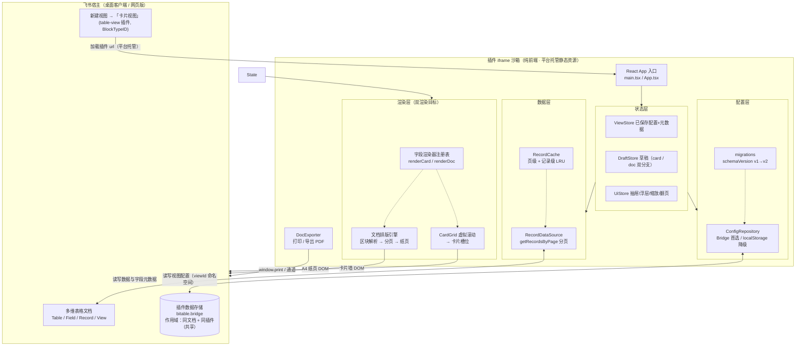

### 3.1 双渲染目标（本版关键结构）

| 渲染目标 | 输入 | 输出 | 组件根 | 配置分支 |
|---|---|---|---|---|
| **卡片视图** | `CardLayoutConfig` + 记录 | 虚拟滚动卡片墙 | `CardGrid` | `config.card` |
| **文档详情** | `DocTemplate` + 单条记录 | A4 纸页序列 | `DocPreview` | `config.detail.doc` |

> 两者**共享**：字段渲染器注册表（不同 `render` 方法）、条件求值引擎、数据缓存、SDK 接入层。
> 两者**解耦**：排版配置、编辑 UI、预览容器完全独立，互不影响。

---

## 4. 数据模型（v2 全量 TypeScript 定义）

### 4.1 配置根对象

```ts
/** 当前配置结构版本。v1 → v2：新增 doc 分支（文档式详情） */
export const CURRENT_SCHEMA_VERSION = 2;

export interface CardViewConfig {
  schemaVersion: number;              // = 2
  meta: ConfigMeta;
  card: CardLayoutConfig;             // 卡片视图排版（原 layout，重命名以免与 doc 混淆）
  detail: DetailConfig;               // 详情配置（含 doc 文档模板）
  theme: StyleTheme;
  density: DensityConfig;
  highlightRules: HighlightRule[];
}

export interface ConfigEnvelope {
  schemaVersion: number;
  pluginVersion: string;
  writtenAt: number;
  checksum: string;
  payload: CardViewConfig;
}

export interface ConfigMeta {
  configId: string;                   // = viewId
  tableId: string;
  createdAt: number;
  updatedAt: number;
  updatedBy: string;
  templateId: string;                 // 来源模板，用于 D4「从模板重配」
  /** D4：本配置是否由「复制视图」首次打开时从模板生成 */
  provisionedFromTemplate?: boolean;
}
```

### 4.2 卡片排版（沿用 v1，仅重命名）

```ts
export type SlotId = 'title' | 'subtitle' | 'attributes' | 'footer';

export interface CardLayoutConfig {
  /** 对应 S3「模板画廊」四档：紧凑 compact / 标准 standard / 大图 cover / 清单 list（+ custom） */
  templateId: 'standard' | 'compact' | 'cover' | 'list' | 'custom';
  slots: Record<SlotId, SlotConfig>;
  /** R4 冻结：默认 false；卡片**不设封面槽位**，"大图"模板经"属性区首图 64×64"实现（非封面图） */
  showCoverImage?: boolean;
  cardAspect: 'auto' | 'square' | 'fixed';
  /** 仅当 cardAspect='fixed' 时生效（宽/高比） */
  fixedAspectRatio?: number;
}

export interface SlotConfig {
  id: SlotId;
  visible: boolean;
  collapsibleWhenEmpty: boolean;
  direction: 'row' | 'column';
  separator: string;                  // 默认 ' · '（副标题多字段分隔）
  /** 槽位内字段条数硬上限；属性区"默认行数"另由 DensityConfig.attributesMaxRows（R3）控制 */
  maxItemsPerCard: number;
  placements: FieldPlacement[];       // 槽位内字段落位（有序）
}

export interface FieldPlacement {
  placementId: string;
  fieldId: string;
  order: number;
  label?: string;
  labelVisible: boolean;
  display: FieldDisplayOptions;
}

export interface FieldDisplayOptions {
  maxLines: number;
  truncate: 'ellipsis' | 'clip' | 'none';
  maxItems: number;
  prefix?: string;
  suffix?: string;
  numberFormat?: NumberFormatOptions;
  dateFormat?: string;
  hideWhenEmpty: boolean;
}

export interface NumberFormatOptions {
  useGrouping: boolean;
  decimals?: number;
  unit?: string;
}
```

> **R4 落点（封面图 / 人员头像）**：① 封面图默认**不显示** → 见 `CardLayoutConfig.showCoverImage = false`（卡片不新增"封面槽位"，保持四槽位模型）；"大图"模板用"属性区首图 64×64 + 张数"实现。② 人员字段在属性区渲染 **20px 圆形头像 + 姓名**，尺寸为**渲染常量**（`radius-pill`，固定 20px，**不随 density 变**），非配置项。

### 4.3 ⭐ 文档排版模型（新增）

```ts
/** 详情区配置：D3 固定为文档式 */
export interface DetailConfig {
  mode: 'document';                   // 预留扩展位，当前恒为 document
  fieldScope: 'all' | 'placed' | 'custom';
  customFieldIds?: string[];
  /** 抽屉外观与预览控制（P0-15） */
  drawer: DrawerConfig;
  /** 文档模板（P0-11 / P0-12） */
  doc: DocTemplate;
}

export interface DrawerConfig {
  defaultWidthPx: number;             // 860（R2）
  minWidthPx: number;                 // 560：拖拽调宽下限（R2；上限 = 视口宽/全屏）
  maximizable: boolean;               // 支持全屏
  rememberWidth: boolean;             // R2：记住用户上次拖拽宽度（默认 true）
  defaultZoom: number;                // 1 = 100%
  zoomPresets: number[];              // [0.5, 0.75, 1, 1.25, 1.5]
  defaultFitToWidth: boolean;         // R5：默认「适应宽度」
  minZoom: number;                    // R5：缩放下限 0.75（低于则居中 + 横向滚动）
  /** R5：分页边界提示默认值（编辑态默认开、浏览态默认关） */
  pageBoundaryHint: { edit: boolean; browse: boolean };
}

/** ===== 文档模板 ===== */
export interface DocTemplate {
  templateId: string;
  pageSetup: PageSetup;
  theme: DocTheme;
  /** 有序区块流：文档渲染的原子序列 */
  blocks: DocBlock[];
}

export interface PageSetup {
  paper: 'A4' | 'A5' | 'Letter';
  orientation: 'portrait' | 'landscape';
  /** 页边距，单位 px（@96dpi 基准；UI 层以 mm 呈现） */
  margin: { top: number; right: number; bottom: number; left: number };
  header?: HeaderFooterConfig;
  footer?: HeaderFooterConfig;
  showPageNumber: boolean;
  pageNumberFormat: 'n' | 'n/total' | 'page-n';  // 1 / 1/3 / 第1页
  headerFooterScope: 'first' | 'all';
}

export interface HeaderFooterConfig {
  enabled: boolean;
  /** 静态文本与字段占位符混排，如 "{记录标题}" 或 "客户档案 · 生成于 {修改时间}" */
  content: string;
  align: 'left' | 'center' | 'right';
  fontSize: number;
  color: string;
  showBorder: boolean;                // 页眉/页脚与正文之间的分隔线
}

export interface DocTheme {
  fontFamily: string;                 // 默认 '"PingFang SC","Microsoft YaHei",sans-serif'
  baseFontSize: number;               // px，默认 14
  lineHeight: number;                 // 默认 1.6
  headingScale: [number, number, number];  // h1/h2/h3 相对倍率，默认 [1.6, 1.35, 1.15]
  headingWeight: 400 | 500 | 600 | 700;
  blockSpacing: number;               // 区块间距 px，默认 12
  paragraphIndent: number;            // 首行缩进 px（中文文档常用 2 字符）
  primaryColor: string;
  textColor: string;
  mutedColor: string;
  dividerColor: string;
}

/** ===== 区块 ===== */
export type DocBlockKind =
  | 'heading'         // 标题（静态文本或绑定字段）
  | 'paragraph'       // 段落（绑定字段的长文本）
  | 'keyValueGrid'    // 键值网格（N 列，「字段名: 值」）
  | 'fieldList'       // 字段清单（纵向单列，可配标签宽度）
  | 'badgeRow'        // 标签行（单选/多选值）
  | 'image'           // 图片（附件字段）
  | 'table'           // 表格（多值/关联记录展开）
  | 'richText'        // 静态富文本（说明文字）
  | 'divider'         // 分隔线
  | 'spacer'          // 垂直间距
  | 'pageBreak'       // 强制分页
  | 'metaFooter';     // 页脚元信息（创建人/时间/记录 ID）

export type BreakInside = 'auto' | 'avoid';

export interface DocBlockStyle {
  fontSize?: number;
  fontWeight?: 400 | 500 | 600 | 700;
  color?: string;
  backgroundColor?: string;
  align?: 'left' | 'center' | 'right' | 'justify';
  marginTop?: number;
  marginBottom?: number;
  paddingX?: number;
  paddingY?: number;
  borderColor?: string;
  borderWidth?: number;
  borderRadius?: number;
}

interface DocBlockBase {
  blockId: string;
  kind: DocBlockKind;
  /** 用于区块分组/条件显隐；复用 highlight 的 RuleCondition */
  visibleWhen?: RuleCondition | null;
  style?: DocBlockStyle;
  /** 分页行为：avoid = 整体不跨页；auto = 允许按行切分 */
  breakInside: BreakInside;
  /** 区块内部标识，供 UI 列表展示（非用户可见文案时用 kind 的中文名） */
  note?: string;
}

/** 1. 标题 */
export interface HeadingBlock extends DocBlockBase {
  kind: 'heading';
  level: 1 | 2 | 3;
  /** 内容来源：静态文本 或 绑定字段 */
  source:
    | { type: 'static'; text: string }
    | { type: 'field'; fieldId: string };
  /** 为 true 时，字段为空则整块不渲染 */
  hideWhenEmpty: boolean;
}

/** 2. 段落 */
export interface ParagraphBlock extends DocBlockBase {
  kind: 'paragraph';
  fieldId: string;
  /** 保留换行 / 折叠空白 */
  preserveLineBreaks: boolean;
  maxLines?: number;                  // 未设 = 不限（文档内建议不限，靠分页）
  hideWhenEmpty: boolean;
}

/** 3. 键值网格 */
export interface KeyValueGridBlock extends DocBlockBase {
  kind: 'keyValueGrid';
  columns: 1 | 2 | 3 | 4;
  rows: Array<{ fieldId: string; labelOverride?: string }>;
  labelWidthPx: number;               // 标签列宽
  showColon: boolean;
  zebra: boolean;                     // 斑马纹
  hideEmptyRows: boolean;
}

/** 4. 字段清单（纵向） */
export interface FieldListBlock extends DocBlockBase {
  kind: 'fieldList';
  items: Array<{ fieldId: string; labelOverride?: string }>;
  showLabels: boolean;
  hideEmptyItems: boolean;
}

/** 5. 标签行 */
export interface BadgeRowBlock extends DocBlockBase {
  kind: 'badgeRow';
  fieldIds: string[];
  maxItems: number;
  showLabels: boolean;
}

/** 6. 图片 */
export interface ImageBlock extends DocBlockBase {
  kind: 'image';
  fieldId: string;                    // 附件字段
  mode: 'first' | 'all' | 'index';
  index: number;
  width: number;                      // px
  height?: number;                    // 未设 = 按比例
  align: 'left' | 'center' | 'right';
  caption?: string;
  hideWhenEmpty: boolean;
}

/** 7. 表格 */
export interface TableBlock extends DocBlockBase {
  kind: 'table';
  /** 列定义：可绑定字段，也可用静态表头 */
  columns: Array<{ fieldId: string; titleOverride?: string; widthPx?: number; align?: 'left'|'center'|'right' }>;
  /** 行来源：关联记录 / 多选展开 / 单条记录字段（当前记录） */
  rowSource: { type: 'linkedRecords'; fieldId: string } | { type: 'currentRecord' };
  showHeader: boolean;
  zebra: boolean;
  maxRows?: number;
}

/** 8. 静态富文本 */
export interface RichTextBlock extends DocBlockBase {
  kind: 'richText';
  /** MVP 支持 markdown 子集：**粗体** / *斜体* / 换行 / - 列表 */
  markdown: string;
}

/**
 * 9. 分隔线
 *
 * ⚠️ M1 实测修正（架构裁定 §0.2 · Q4）：线型原字段名 `style` 与基类
 * `DocBlockBase.style`（DocBlockStyle 通用样式对象）**同名冲突、无法 extends**。
 * 现将其**改名为 `borderStyle`**，可正常 `extends DocBlockBase`；线的颜色/线宽复用
 * 基类的 `style.borderColor` / `style.borderWidth`，与 `borderStyle` 构成 CSS `border-*` 家族。
 */
export interface DividerBlock extends DocBlockBase {
  kind: 'divider';
  /** 线宽（px）；与基类 `style.borderWidth` 二选一，同时存在时优先取 `style.borderWidth` */
  thickness: number;
  /** 线型：solid / dashed / dotted */
  borderStyle: 'solid' | 'dashed' | 'dotted';
}

/** 10. 间距 */
export interface SpacerBlock extends DocBlockBase {
  kind: 'spacer';
  height: number;
}

/** 11. 强制分页 */
export interface PageBreakBlock extends DocBlockBase {
  kind: 'pageBreak';
}

/** 12. 页脚元信息 */
export interface MetaFooterBlock extends DocBlockBase {
  kind: 'metaFooter';
  fields: Array<'createdUser' | 'createdTime' | 'modifiedUser' | 'modifiedTime' | 'recordId'>;
  separator: string;
  fontSize: number;
  muted: boolean;
}

export type DocBlock =
  | HeadingBlock | ParagraphBlock | KeyValueGridBlock | FieldListBlock
  | BadgeRowBlock | ImageBlock | TableBlock | RichTextBlock
  | DividerBlock | SpacerBlock | PageBreakBlock | MetaFooterBlock;
```

### 4.4 条件高亮（v1 沿用，D5 边界）

```ts
export interface HighlightRule {
  ruleId: string;
  name: string;
  enabled: boolean;
  target: HighlightTarget;
  condition: RuleCondition;           // 单层 and/or
  style: HighlightStyle;
  priority: number;
}

export type HighlightTarget =
  | { kind: 'cardBorder' }
  | { kind: 'field'; fieldId: string }
  | { kind: 'badge'; fieldId: string };

/** 单层组合，不支持嵌套（D5） */
export interface RuleCondition {
  logic: 'and' | 'or';
  items: RuleExpr[];
}

export interface RuleExpr {
  fieldId: string;
  operator: RuleOperator;
  value?: unknown;
}

export type RuleOperator =
  | 'eq' | 'neq' | 'gt' | 'gte' | 'lt' | 'lte'
  | 'contains' | 'notContains' | 'isEmpty' | 'isNotEmpty'
  | 'before' | 'after';

export interface HighlightStyle {
  color?: string;
  backgroundColor?: string;
  borderColor?: string;
  borderWidth?: number;
}

export interface StyleTheme {
  preset: string;
  primaryColor: string;
  backgroundColor?: string;
  borderColor?: string;
  borderRadius: number;
  shadowLevel: 0 | 1 | 2 | 3;
  fontScale: number;                  // 0.85 ~ 1.3
  titleWeight: 400 | 500 | 600 | 700;
}

export interface DensityConfig {
  /** R3 冻结：三档密度预设 */
  preset: 'compact' | 'standard' | 'comfortable';
  cardMinWidth: number;               // 紧凑 240 / 标准 280 / 宽松 320
  columnsMode: 'auto' | 'fixed';
  fixedColumns?: number;
  gap: number;                        // 12 / 16 / 20
  padding: number;                    // 10 / 16 / 20
  maxCardHeight: number;              // 160 / 220 / 320
  /** R3 冻结：属性区默认最多**行数**（紧凑 2 / 标准 3 / 宽松 5）；超出按 `SlotConfig.maxItemsPerCard` 截断并显示 `+n` */
  attributesMaxRows: number;
}
```

> **R3 三档密度映射（默认取"标准"）**：紧凑 `240 / gap 12 / pad 10 / maxH 160`·属性 2 行；**标准（默认）** `280 / 16 / 16 / 220`·属性 **3 行**；宽松 `320 / 20 / 20 / 320`·属性 5 行。1280 视口下分别约 5 / 4 / 3 列。

### 4.5 迁移策略（v1 → v2）

```ts
export type ConfigMigration = (input: unknown, fromVersion: number) => unknown;

export const migrations: Record<number, ConfigMigration> = {
  /** v1 → v2：layout → card；新增 detail.doc（默认文档模板） */
  1: (old) => {
    const o = old as Record<string, unknown>;
    return {
      ...o,
      schemaVersion: 2,
      card: o.layout ?? defaultCardLayout(),
      detail: defaultDetailConfig(),      // 生成默认 A4 文档模板
      layout: undefined,                  // 清理旧字段
    };
  },
};
```

| 机制 | 规则 |
|---|---|
| 读旧 | `migrate(envelope.schemaVersion → CURRENT)` 逐级升级；失败 → 默认模板 + 备份原值（`cbv:config:{viewId}:backup:{ts}`） |
| 读新（降级） | `envelope.schemaVersion > CURRENT` → 只读已知字段、忽略未知字段，进入**只读模式**并提示"配置由更高版本创建"，禁止保存 |
| 损坏检测 | `checksum` 校验失败 → 回退默认模板 + 备份 |
| 兼容承诺 | 高版本**必须**能读所有历史 `schemaVersion`；迁移函数只增不改 |

> **只读（`unsupportedNewer`）的判定与解除条件（M1 实现口径，见 §0.2 · Q6）**
> - **判定**：`load(viewId)` 读到的 `envelope.schemaVersion > CURRENT_SCHEMA_VERSION` → `unsupportedNewer=true`，实现侧记入运行期内存集合 `readOnlyViews`（**不持久化**）；该状态下 `save()` 一律返回 `{ ok:false, reason:'unsupported-newer-readonly', error: UNSUPPORTED_NEWER_SAVE_MESSAGE }` 且**不落盘**（避免把更高版本客户端写入的配置降级覆盖）。
> - **解除**：① 再次 `load(viewId)` 且读到 `schemaVersion <= CURRENT`（每次 load 会 `add`/`delete` 刷新该标记）；② `remove(viewId)` 显式清理。插件重载 / 换设备会触发重新 load、自动重算。
> - **已知缺口（P2 待补，非阻塞）**：同一会话内、更高版本客户端把配置降回旧版本后，本端若**不重新 load** 不会自动解锁可写；建议在 `subscribe` 的 `onDataChange` 命中该 viewId 时按新载荷的 `schemaVersion` 刷新只读标记。

---

## 5. ⭐ 文档排版引擎设计（本版核心）

### 5.1 设计目标

| 目标 | 指标 |
|---|---|
| 所见即所得 | 屏幕纸页预览与打印/导出 PDF 版式一致（同一分页结果） |
| 分页正确 | 无内容截断、重叠、丢字；不可切分块不跨页 |
| 响应速度 | 首次分页 ≤ 400ms（典型 20 区块文档）；翻页 ≤ 50ms；缩放 ≤ 100ms |
| 可编辑 | 区块可增删改排序，实时预览 ≤ 300ms |
| 大数据安全 | 文档渲染与卡片虚拟滚动互不干扰 |

### 5.2 区块库（Block Library）

编辑器左侧「区块库」按语义分组，用户拖入文档流：

| 分组 | 区块 | 说明 |
|---|---|---|
| **文本** | `heading` `paragraph` `richText` | 标题层级、字段长文本、静态说明 |
| **字段** | `keyValueGrid` `fieldList` `badgeRow` | 键值网格（最常用）、纵向清单、标签行 |
| **媒体** | `image` `table` | 附件图片、关联记录/多值表格 |
| **结构** | `divider` `spacer` `pageBreak` | 分隔线、间距、强制分页 |
| **元信息** | `metaFooter` | 创建人/时间/记录 ID |

**默认 A4 模板（首次打开生成）**

```
[heading L1]  绑定字段：首个可用文本字段（如「客户名称」）
[divider]
[keyValueGrid 2列] 前 6 个 P0 字段
[spacer 12px]
[heading L2] 静态文本：「详细信息」
[fieldList] 其余字段
[spacer]
[metaFooter] 创建人 · 创建时间 · 修改时间
```

### 5.3 页面与尺寸模型

```ts
/** @96dpi CSS 像素基准 */
export const PAPER_SIZE_PX = {
  A4:     { portrait: { w: 794,  h: 1123 }, landscape: { w: 1123, h: 794  } },
  A5:     { portrait: { w: 559,  h: 794  }, landscape: { w: 794,  h: 559  } },
  Letter: { portrait: { w: 816,  h: 1056 }, landscape: { w: 1056, h: 816  } },
} as const;

export const MM_TO_PX = 96 / 25.4;    // ≈ 3.7795

/** 内容区尺寸（分页的可容纳高度基准） */
export interface ContentBox {
  width: number;      // paper.w - margin.left - margin.right
  height: number;     // paper.h - margin.top - margin.bottom
  originX: number;    // = margin.left
  originY: number;    // = margin.top
}
```

### 5.4 分页引擎（Deterministic Pagination）

**核心思想**：先在离屏测量容器中按**真实内容宽度**逐一测量区块高度，再做确定性装箱，最后按页渲染真实 DOM。**不做浏览器自动分页**，避免屏幕与打印不一致。

```ts
export interface PaginationEngine {
  /** 惰性分页：只计算到 upToPage + lookahead 页 */
  paginate(input: PaginateInput): Promise<PagedDocument>;
  /** 内容/尺寸变化时失效缓存 */
  invalidate(blockIds?: string[]): void;
}

export interface PaginateInput {
  blocks: ResolvedBlock[];            // 已完成字段求值 + 条件过滤的区块
  pageSetup: PageSetup;
  theme: DocTheme;
  contentBox: ContentBox;
  upToPage: number;                   // 惰性目标页
  lookahead: number;                  // 预取页数，默认 2
}

export interface ResolvedBlock {
  block: DocBlock;
  /** 字段求值后的渲染 payload（文本、标签、图片 URL、表格行等） */
  payload: ResolvedPayload;
  /** 字段缺失且 hideWhenEmpty → 已在此阶段剔除 */
  height?: number;                    // 测量后回填
}

export interface PagedDocument {
  pages: DocPage[];
  totalPages: number;                 // 可能为 -1（未全量计算）
  contentBox: ContentBox;
  fontReady: boolean;
}

export interface DocPage {
  pageIndex: number;
  items: PagedItem[];
}

export interface PagedItem {
  blockId: string;
  fragmentIndex: number;              // 该块被切分的第几段（0 起）
  fragmentsTotal: number;
  height: number;
  /** 跨页切分时，段落/表格的起始偏移（行号或字符偏移） */
  slice?: { kind: 'line'; fromLine: number; toLine: number }
       |  { kind: 'row';  fromRow: number;  toRow: number };
  /** 该片段在本页内的累计偏移已由渲染层按顺序累加，无需存储 */
}
```

**算法（伪代码）**

```ts
async function paginate(input: PaginateInput): Promise<PagedDocument> {
  await document.fonts.ready;                 // ⚠️ 关键：字体未就绪测量会偏小 → 分页错乱
  const { blocks, contentBox } = input;

  // 1) 离屏测量：所有区块以 contentBox.width 渲染到隐藏容器
  const heights = await measureBlocks(blocks, contentBox.width, input.theme);

  // 2) 确定性装箱
  const pages: DocPage[] = [];
  let page: DocPage = { pageIndex: 0, items: [] };
  let y = 0;

  for (let i = 0; i < blocks.length; i++) {
    const b = blocks[i];
    const h = heights[i];

    if (b.block.kind === 'pageBreak') {       // 强制分页
      pages.push(page); page = { pageIndex: pages.length, items: [] }; y = 0;
      continue;
    }

    const remain = contentBox.height - y;

    if (h <= remain) {                        // 放得下
      page.items.push({ blockId: b.block.blockId, fragmentIndex: 0, fragmentsTotal: 1, height: h });
      y += h;
      continue;
    }

    // 放不下
    if (b.block.breakInside === 'avoid') {    // 不可切分 → 整块换页
      pages.push(page); page = { pageIndex: pages.length, items: [] }; y = 0;
      page.items.push({ blockId: b.block.blockId, fragmentIndex: 0, fragmentsTotal: 1, height: h });
      y += h;
      continue;
    }

    // 可切分（paragraph / table / fieldList）
    const minKeep = input.theme.baseFontSize * input.theme.lineHeight * 2; // 孤行控制：至少留 2 行
    if (remain < minKeep) {
      pages.push(page); page = { pageIndex: pages.length, items: [] }; y = 0;
      // 重试整块放到新页
      if (h <= contentBox.height) {
        page.items.push({ blockId: b.block.blockId, fragmentIndex: 0, fragmentsTotal: 1, height: h });
        y += h;
        continue;
      }
    }

    // 按行/行组切分，填满当前页后继续下一页
    const slices = splitBlock(b, heights[i], remain, contentBox.height, input.theme);
    for (const s of slices) {
      if (y + s.height > contentBox.height && page.items.length) {
        pages.push(page); page = { pageIndex: pages.length, items: [] }; y = 0;
      }
      page.items.push({
        blockId: b.block.blockId,
        fragmentIndex: s.index,
        fragmentsTotal: slices.length,
        height: s.height,
        slice: s.slice,
      });
      y += s.height;
    }
  }
  pages.push(page);

  return { pages, totalPages: pages.length, contentBox, fontReady: true };
}
```

**切分实现要点**

| 块类型 | 切分粒度 | 实现 |
|---|---|---|
| `paragraph` | 按行 | `Range.getClientRects()` 按行矩形分组 → 二分查找可容纳行数 → 生成两段 |
| `table` | 按行 | 表头重绘（`repeatHeaderOnBreak: true` 时每页重复表头），行组切分 |
| `fieldList` | 按项 | 项边界切分（避免一项被拆成两半） |
| `keyValueGrid` | **不可切分** | 强制 `breakInside: 'avoid'`（网格拆开语义会乱） |
| `heading` | 不可切分 | 与后续首块做**尽量同页**（`keepWithNext`，若下块放不下则标题也下移） |

> ⚠️ `heading` 的 `keepWithNext` 是排版质量的关键细节：实现为装箱时若「标题 + 下一块首行」放不下，则标题一起换页。

**测量实现**

```ts
/**
 * 用一个 position:absolute; visibility:hidden; left:-99999px 的容器
 * 以 contentBox.width 为宽渲染全部区块，读取各自 offsetHeight。
 * 测量完毕即销毁，不进入主渲染树（不影响布局性能）。
 */
async function measureBlocks(blocks: ResolvedBlock[], width: number, theme: DocTheme): Promise<number[]>;
```

### 5.5 方案对比与选型

| 方案 | 屏幕预览一致性 | 打印一致性 | 实现成本 | 性能 | 结论 |
|---|---|---|---|---|---|
| **A. 纯 CSS Paged Media**（`@page` + `break-inside`） | ❌ 屏幕不显示分页 | ✅ 浏览器分页 | 低 | 好 | ❌ 不满足"打印预览"语义 |
| **B. JS 确定性分页（测量 + 装箱）** | ✅ 完全一致 | ✅ 一致（分页 DOM 直接打印） | 高 | 中（可惰性+缓存优化） | ✅ **选为主方案** |
| **C. 屏幕近似 + 打印交给浏览器** | ⚠️ 近似，可能错页 | ✅ | 低 | 好 | ❌ 预览失真，失去意义 |
| D. 服务端排版（Puppeteer/PDF 服务） | ✅ | ✅ | 很高 | 差 | ❌ 需自建服务器，违反"零服务端"结论 |

**最终选型：方案 B**，理由：屏幕上就要看到正确的分页，这是"打印预览"的核心价值；且分页后的 DOM 直接用于打印，天然保证屏幕↔打印一致。

### 5.6 屏幕预览渲染

```tsx
<DocPreview
  pagedDoc={pagedDoc}
  pageSetup={pageSetup}
  theme={theme}
  zoom={zoom}                 // 0.5 ~ 1.5
  fitToWidth={fitToWidth}
/>
```

| 关注点 | 实现 |
|---|---|
| 纸页容器 | 每页一个 `div.doc-page`：`width/height` = 纸张 px；`background:#fff`；`box-shadow` 模拟纸张；`padding` 按 `pageSetup.margin` |
| 页眉/页脚 | 绝对定位于页内 `margin` 区域；`showBorder` 画分隔线；页码按 `pageNumberFormat` 渲染 |
| 缩放 | 外层 `transform: scale(zoom); transform-origin: top center`；容器高度按 `pageCount × pageH × zoom` 计算，避免滚动条错乱 |
| 适应宽度 | `zoom = (containerWidth - padding) / paperWidth`，窗口 resize 时以 `ResizeObserver` 重算 |
| 翻页 | **页级虚拟化**：只渲染 `currentPage ± 2` 的纸页，其余用等高占位；配合右侧页码导航（`n/total`）与「跳转页」 |
| 滚动 | 抽屉内独立滚动容器；滚动位置映射当前页码（吸顶页码指示器） |
| 虚线分页提示 | 可开关「显示分页边界」（编辑态默认开） |
| 打印样式 | `@media print` 下 `transform:none`、隐藏宿主 UI、`page-break-after: always`（见 §5.7） |

### 5.7 打印与导出 PDF（P0-14）

**首选：原生打印 + 分页 DOM**

```css
@media print {
  /* 隐藏宿主与插件 UI，只保留纸页 */
  :global(.host-ui), :global(.plugin-chrome) { display: none !important; }
  .doc-preview { transform: none !important; }
  .doc-page {
    width: var(--paper-w);
    height: var(--paper-h);
    box-shadow: none;
    break-after: page;              /* 每页精确分页 */
    break-inside: avoid;
  }
  .doc-page:last-child { break-after: auto; }
}
@page { size: A4 portrait; margin: 0; }   /* 尺寸由 JS 按 pageSetup 动态注入 */
```

流程：`DocExporter.exportPdf()` → 临时把 `zoom` 重置为 1、隐藏 UI → `window.print()` → `afterprint` 事件恢复。

```ts
export interface DocExporter {
  /** 保真打印：复用已分页 DOM */
  print(container: HTMLElement, setup: PageSetup): Promise<void>;
  /** 导出 PDF（默认走系统打印的"另存为 PDF"） */
  exportPdf(container: HTMLElement, setup: PageSetup, fileName: string): Promise<void>;
}
```

**降级链路**
1. iframe 内 `window.print()` 不可用 → 将分页 HTML + 内联样式序列化，`window.open()` 新窗口 `document.write` 后打印
2. 新窗口被拦 → 提示用户「请使用浏览器打印（Ctrl+P）」，并在页面提供仅含纸页的"打印友好视图"
3. 均失败 → 提供「导出 HTML 文件」兜底

> ⚠️ **待验证项 V1**：飞书客户端 iframe 沙箱内 `window.print()` 是否可用、是否只打印宿主整页。**必须做 Spike**（见 §19）。

### 5.8 文档模板与配置持久化

- 文档模板随 `CardViewConfig.detail.doc` 一起存入 bridge（key：`cbv:config:{viewId}`）
- **D4 首开提示**：若 `meta.provisionedFromTemplate === true`（由复制视图场景写入），首次打开时顶部提示条——「本视图由其他视图复制而来，排版需重新配置」+ 按钮「从模板重配」/「立即配置」
- 体积控制：文档模板通常 5~20KB；连同卡片配置总预算 ≤64KB；超限时保存前拦截并提示（D9）

---

## 6. 模块设计

### 6.1 层次总览

```
┌────────────────────────────────────────────────────────────┐
│ 表现层  components/  (layout | grid | card | detail | doc | editor) │
├────────────────────────────────────────────────────────────┤
│ 状态层  state/       (ViewStore | DraftStore | UiStore)     │
├────────────────────────────────────────────────────────────┤
│ 领域层  doc/ pagination/ fields/ highlight/ export/         │
├────────────────────────────────────────────────────────────┤
│ 数据层  data/        (RecordDataSource | RecordCache)       │
├────────────────────────────────────────────────────────────┤
│ 配置层  config/      (Repository | migrations | defaults)   │
├────────────────────────────────────────────────────────────┤
│ 接入层  sdk/         (base | env)                           │
└────────────────────────────────────────────────────────────┘
```

**依赖方向单向向下**；表现层不得直接调用 `sdk/`，必须经状态层或数据层。

### 6.2 接入层 `src/sdk/`

| 文件 | 职责 | 关键 API |
|---|---|---|
| `base.ts` | `bitable` 单例；封装 `base/table/view` 获取；**所有 SDK 调用集中于此层**，便于 API 变更时一处修复 | `bitable.base.getSelection()`、`table.getFieldMetaList()`、`table.getViewMetaList()` |
| `env.ts` | 环境探测：产品端（客户端/网页）、语言（`bridge.getLanguage()`）、主题、当前 `tableId` / `viewId` | `bitable.bridge.getLanguage()`、`bitable.bridge.getTheme()` |

> **D1 只读约束**：本层**不暴露任何写接口**（`setRecord` / `addRecord` / `deleteRecord` 一律不封装），从架构上杜绝误用。

### 6.3 配置层 `src/config/`

| 文件 | 职责 |
|---|---|
| `types.ts` | §4 全部类型 + `CURRENT_SCHEMA_VERSION = 2` |
| `defaults.ts` | `defaultCardLayout()` / `defaultDetailConfig()` / `defaultDocTemplate()`（A4 模板） |
| `migrations.ts` | 迁移注册表（`1 → 2`） |
| `ConfigRepository.ts` | 存取抽象接口（`load/save/subscribe/remove/getSchemaVersion/isDegraded`）+ envelope 编解码 + 读取编排 `resolveLoadedConfig` + `SaveErrorReason` / `UNSUPPORTED_NEWER_SAVE_MESSAGE` |
| `BridgeConfigRepository.ts` | 首选实现；key `cbv:config:{viewId}`；体积校验；**F2 运行期介质降级（内聚，构造注入 `fallback`，单向闭锁）**；**F5 更高版本只读（`readOnlyViews`）** |
| `LocalStorageConfigRepository.ts` | 降级实现（**不满足跨用户共享**，UI 必须明示）；F5 只读；`isDegraded()` 恒 false（自身即降级介质） |
| `factory.ts` | 运行时特性探测与选型；bridge 可用时**注入 localStorage 作为运行期降级 fallback**（F2） |
| `provision.ts` | D4：检测"复制视图"场景（无配置 + 视图名相似/标记）→ 生成模板配置 + 打 `provisionedFromTemplate` |

```ts
export type ConfigSource = 'bridge' | 'localStorage' | 'default';

export interface ConfigRepository {
  getSchemaVersion(): number;
  load(viewId: string): Promise<LoadResult>;
  save(viewId: string, config: CardViewConfig): Promise<SaveResult>;
  subscribe(viewId: string, cb: (config: CardViewConfig) => void): () => void;
  remove(viewId: string): Promise<boolean>;
  /** F2：是否已发生「介质降级」（运行期 primary 介质失败 → 单向闭锁切 fallback） */
  isDegraded(): boolean;
}

export interface LoadResult {
  config: CardViewConfig | null;
  degraded: boolean;                  // 走了降级（损坏回退 / 介质降级）
  unsupportedNewer: boolean;          // 读到更高版本 → 只读模式
  source: ConfigSource;
  provisionedFromTemplate?: boolean;  // D4 首开提示
  error?: string;                     // 失败原因（诊断用，不直接展示）
}

/** 保存失败错误码（供上层分支，不直接展示） */
export type SaveErrorReason =
  | 'too-large'                    // D9：体积超限（> 64KB）
  | 'unsupported-newer-readonly'   // F5：更高版本只读，禁止保存
  | 'write-failed';                // 底层介质写入失败

export interface SaveResult {
  ok: boolean;
  conflict?: boolean;
  tooLarge?: boolean;                 // D9 超限
  reason?: SaveErrorReason;
  error?: string;
}

/** F5：更高版本只读时，保存被拒的 UI 可展示文案 */
export const UNSUPPORTED_NEWER_SAVE_MESSAGE =
  '当前配置由更高版本的插件写入，为避免覆盖较新数据，本版本仅支持只读浏览，暂不能保存。';
```

> **降级口径（M1 实现，见 §0.2 · Q5-B）**
> - **只有「介质故障」触发降级**：bridge `getData`/`setData` **抛错**，或 `setData` 返回 **`false`**。降级为**单向闭锁**（不可回退），此后 `load/save/subscribe` 一律走 fallback（localStorage）且**不回写 bridge**；`isDegraded()` 置真 → UI 出**常驻**提示条。
> - **「数据损坏」不切换介质**：checksum 不匹配 / 非法 JSON / 迁移失败 → 保持 `source:'bridge'`，继续走「回退默认模板 + 备份原值（`cbv:config:{viewId}:backup:{ts}`）」路径（避免静默呈现空配置、掩盖损坏事实）。

### 6.4 数据层 `src/data/`（D7 对齐原生筛选）

| 文件 | 职责 |
|---|---|
| `RecordDataSource.ts` | 取数抽象：`loadPage` / `loadRecord` / `count` |
| `SdkRecordDataSource.ts` | `table.getRecordsByPage({ viewId, pageSize, pageToken })` 实现 |
| `RecordCache.ts` | 页级 LRU（pageToken → records）+ 记录级 LRU（recordId → record） |

**D7 对齐原生筛选/排序的实现口径**

| 能力 | 实现 | 说明 |
|---|---|---|
| **筛选 + 排序** | 调用 `getRecordsByPage({ viewId })`，**结果自动遵循该视图的原生筛选与排序** | ✅ 天然对齐，无需前端复刻规则 |
| ⚠️ 注意 | 传 `viewId` 时 `sort` / `filter` 入参**失效** | 设计上不再传这两个参数 |
| **插件内搜索** | 优先级 1：读取视图原生筛选条件（`getViewMetaList` / view 元数据）→ 与搜索词**合并**后作为 `filter` 发起请求（此时**不传 viewId**）<br>优先级 2（降级）：仅过滤**已加载页**，并在 UI 明示"搜索结果仅覆盖已加载内容" | ⚠️ **待验证项 V2**：SDK 是否可读视图筛选条件。若不可读 → 采用降级方案 + 工具栏提供「在原生视图中筛选」跳转入口 |
| **分组** | 本期不做（D7） | `getRecordsByPage` 无分组读接口 |

### 6.5 渲染层：字段渲染器（双态）

```ts
export interface FieldRenderer {
  key: string;
  priority: 'P0' | 'P1' | 'P2';
  /** 卡片态：紧凑 */
  renderCard(nv: NormalizedValue, ctx: RenderContext): React.ReactNode;
  /** 文档态：完整、可跨页、支持长文本 */
  renderDoc(nv: NormalizedValue, ctx: DocRenderContext): React.ReactNode;
}

export interface DocRenderContext extends RenderContext {
  /** 该块是否被分页切分（切分时应避免重复画"字段名:"标签） */
  fragmentIndex: number;
  fragmentsTotal: number;
  /** 文档态是否显示标签前缀 */
  showLabel: boolean;
  labelText?: string;
}
```

| FieldType | 值 | 优先级 | 卡片态 | 文档态 |
|---|---|---|---|---|
| Text | 1 | P0 | 单行截断 | 完整段落（可跨页） |
| Number | 2 | P0 | 千分位 | 完整数值 |
| Currency | 99003 | P0 | 货币符号 | 右对齐 |
| SingleSelect | 3 | P0 | 彩色标签 | 彩色标签 |
| MultiSelect | 4 | P0 | N 个 + "+n" | **全部**标签（可换行） |
| DateTime | 5 | P0 | `YYYY-MM-DD` | `YYYY-MM-DD HH:mm` |
| Checkbox | 7 | P0 | 勾/叉 | 是/否 |
| User | 11 / 1003 / 1004 | P1 | 头像 + 名（限 N） | 全部成员 |
| Attachment | 17 | P1 | 首图缩略 + 数量 | 图片块 / 文件列表 |
| Rating | 99004 | P1 | 星级 | 星级 + 数值 |
| Progress | 99002 | P1 | 进度条 | 进度条 + 百分比 |
| Phone / Url | 13 / 15 | P1 | 可点 | 可点（打印时显示为文本 + 链接样式） |
| Formula / Lookup / Link | 20 / 19 / 18 / 21 | P1 | 按结果类型分发 | 多值展开为列表/表格 |
| Created*/Modified*/AutoNumber | 1001~1005 | P1 | 文本/日期 | 文本/日期 |
| Location / GroupChat / Barcode | 22 / 23 / 99001 | P2 | 文本/标签 | 文本/标签 |
| 不支持类型 | — | unsupported | 「该字段类型暂不支持」 | 同左（不阻断分页） |

> **两态共用** `normalize()`（`IOpenCellValue → NormalizedValue`），保证「卡片与文档对同一字段的解读一致」，仅在**呈现密度**上不同。

### 6.6 文档引擎模块 `src/doc/`

| 文件 | 职责 |
|---|---|
| `resolve.ts` | `DocBlock[] + record → ResolvedBlock[]`：字段求值、`hideWhenEmpty` 过滤、`visibleWhen` 条件过滤、图片 URL 解析、表格行解析 |
| `blockDefaults.ts` | 每种区块的默认配置工厂（拖入时的初始值） |
| `blockCatalog.ts` | 区块库元数据（分组、图标、中文名、可拖入约束） |
| `markdown.ts` | `richText` 的 markdown 子集解析（粗体/斜体/换行/列表） |
| `measure.ts` | 离屏测量（§5.4） |

### 6.7 分页模块 `src/pagination/`

| 文件 | 职责 |
|---|---|
| `engine.ts` | `paginate()` 主流程（§5.4 伪代码） |
| `splitBlock.ts` | 按行/按行组切分（paragraph / table / fieldList） |
| `pageMetrics.ts` | 纸张尺寸、`ContentBox` 计算、mm↔px 换算 |
| `heightCache.ts` | 高度缓存（key：`blockId + contentWidth + payloadHash`） |

### 6.8 导出模块 `src/export/`

| 文件 | 职责 |
|---|---|
| `DocExporter.ts` | §5.7 的打印/导出与降级链路 |
| `printStyles.ts` | 动态注入 `@page` 与打印样式 |

### 6.9 高亮规则 `src/highlight/ruleEngine.ts`

- `evaluate(condition, record, fieldMetaMap): boolean`
- 单层 `and` / `or`（D5）；`RuleOperator` 覆盖比较/包含/空值/日期先后
- **复用**于：卡片边框着色、字段着色、标签着色、**文档区块 `visibleWhen`**（同一引擎，避免两套条件实现）

---

## 7. 接口定义汇总

```ts
// 配置存取
export interface ConfigRepository { /* §6.3 */ }

// 数据读取
export interface RecordDataSource {
  loadPage(p: { viewId: string; pageSize: number; pageToken?: string }): Promise<PageResult>;
  loadRecord(recordId: string): Promise<RecordData>;
  search?(p: { keyword: string; viewId: string; pageToken?: string }): Promise<PageResult>;
}

export interface PageResult {
  records: RecordData[];
  pageToken?: string;
  hasMore: boolean;
}

// 文档引擎
export interface DocEngine {
  resolve(blocks: DocBlock[], record: RecordData, metas: FieldMetaMap): ResolvedBlock[];
  paginate(input: PaginateInput): Promise<PagedDocument>;
  invalidate(blockIds?: string[]): void;
}

// 导出
export interface DocExporter { /* §5.7 */ }

// 渲染器
export interface FieldRenderer { /* §6.5 */ }
```

---

## 8. 关键流程时序图

### 8.1 视图首次加载（卡片墙）

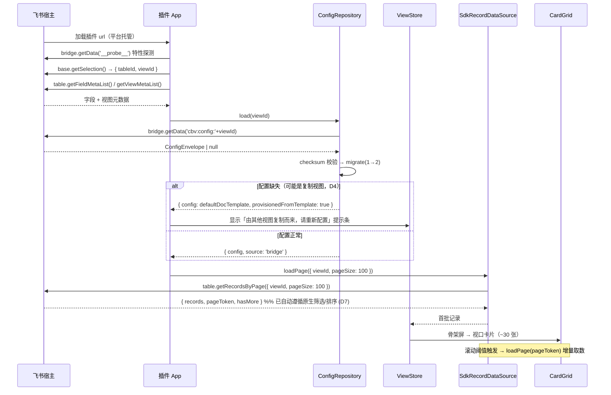

### 8.2 ⭐ 文档详情打开与分页渲染（D3 核心流程）

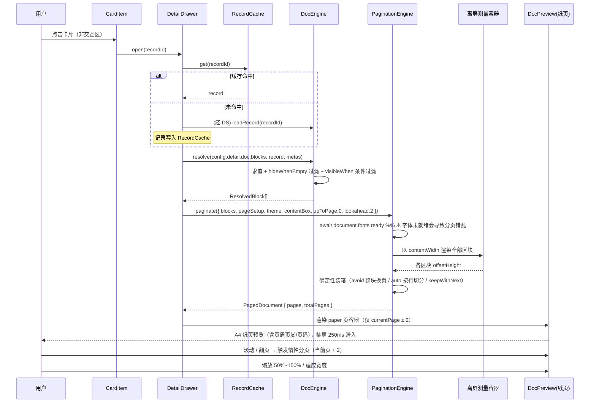

### 8.3 文档排版编辑与保存

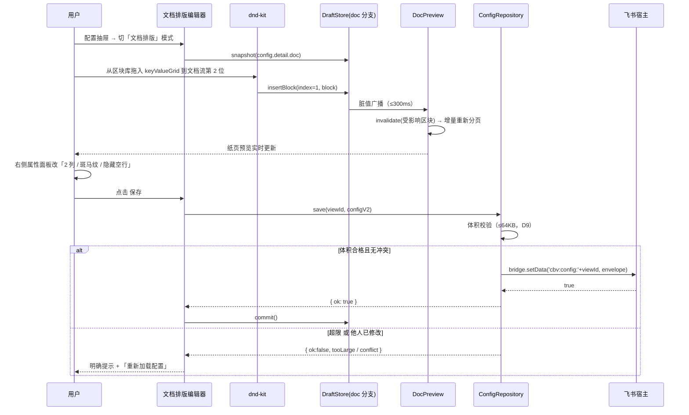

### 8.4 打印 / 导出 PDF

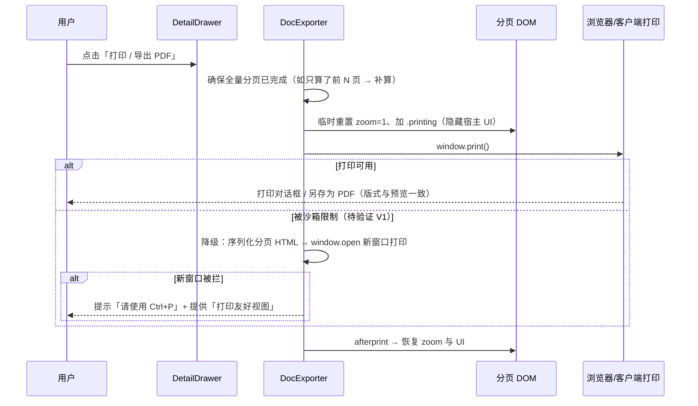

---

## 9. 状态管理设计

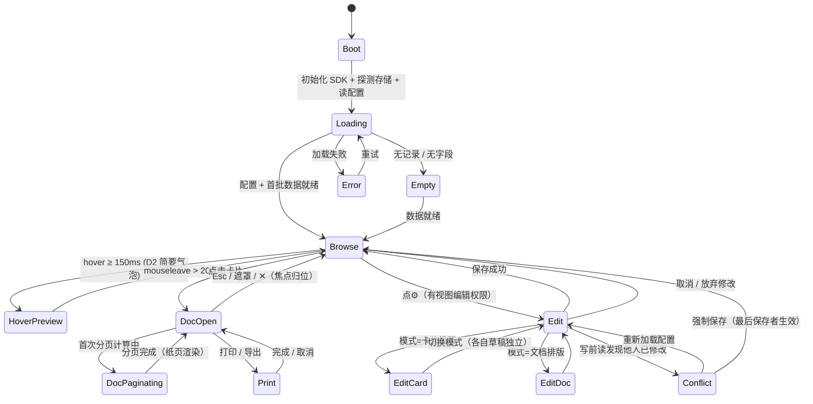

| Store | 职责 | 关键字段 |
|---|---|---|
| `ViewStore` | 已保存配置、字段元数据、视图元数据、权限、数据源句柄 | `config` `fieldMetas` `viewMeta` `canEdit` |
| `DraftStore` | 草稿（**card / doc 两个独立分支** + 快照栈 + dirty 标记） | `cardDraft` `docDraft` `snapshotStack` `dirty` |
| `UiStore` | 抽屉、浮层、骨架屏、编辑模式、**文档缩放/翻页/当前页**、冲突弹窗、提示条 | `editMode` `zoom` `fitToWidth` `currentPage` `banner` |
| `DocStore` | 当前记录的 `ResolvedBlock[]` 与 `PagedDocument`；分页进度 | `resolved` `paged` `paginationState` |

**编辑期隔离**：卡片排版与文档排版的草稿**互不影响**；「取消」只丢弃当前模式的草稿，「保存」提交两者（保持一次保存写入完整 `CardViewConfig`）。

---

## 10. 编辑器设计（沉浸式三栏 · 双模式）

> **R1（2026-09-20 用户评审冻结）**：配置态形态为**沉浸式三栏编辑模式**（**覆盖整屏、编辑时隐藏卡片墙**，见 R6）；**原「360px 右侧抽屉」方案废弃**，`ConfigDrawer` 语义由"抽屉"改为"沉浸式编辑器容器"（组件更名为 **`ConfigEditor`**）。数值来源：`04-UI设计说明.md` §3.4（`layout-panel-left 220` / `layout-panel-right-card 300` / `layout-panel-right-doc 320` / `layout-toolbar-height 48`）与 §5.3/§5.4 逐屏说明。

```tsx
// components/editor/ConfigEditor.tsx —— 沉浸式双模式编辑器容器（覆盖整屏）
<ConfigEditor mode={editMode} onModeChange={...} onCancel={...} onSave={...}>
  {editMode === 'card' ? <CardLayoutEditor /> : <DocLayoutEditor />}
</ConfigEditor>
```

| 区域 | 卡片排版模式（S3） | 文档排版模式（S4） |
|---|---|---|
| 顶栏 h=48 | `[← 返回浏览]` · 标题 · 分段控件 `(卡片排版｜文档排版)` · `[从模板重配▾]` `[取消]` `[保存]` | 同左（分段控件切"文档排版"，末项为 `[重置为默认模板]`） |
| 左栏 **220px** | 字段池：**已使用 / 未使用 / 不支持** 三组（可拖；不支持项置灰 + tooltip 原因） | **区块库**：5 组 12 类（文本/字段/媒体/结构/元信息） |
| 中栏 弹性（bg `bg-app`/`bg-canvas`） | 预览样例卡（与真实卡同宽，最大 360，标注「示例记录」） | **A4 纸页实时预览** 794×1123（含分页标尺；编辑态默认 100% 缩放） |
| 右栏 **300px**（卡片）/ **320px**（文档） | 槽位配置 / 布局模板 / 样式主题 / 尺寸密度(R3) / 条件高亮 | **区块属性**（按 `kind` 动态表单）/ 页设置 / 文档主题 |
| 底部 | — | 底栏操作提示（h=32，12px） |

**统一交互约束（R1 / S3 / S4）**
- 进入配置态：顶栏 + 三栏立即铺开（120ms 淡入），**卡片墙隐藏**（R6）。
- **「保存」是唯一提交出口**；有未保存修改时，`取消` / `返回浏览` / 关闭需**二次确认** `放弃未保存的修改？`。
- 双模式**草稿互不污染**：切「卡片排版 / 文档排版」时各自草稿保留（`DraftStore` 分 `card` / `doc` 两条分支），点保存时**一并提交**。
- 拖拽反馈：幽灵元素（`opacity .6` + `shadow-drag-ghost`）+ 目标槽位/落点高亮 `#EFF4FF` + **2px 插入指示线** `#3370FF`；非法落点显示禁止光标。
- 改密度（R3 三档）/ 改区块属性 → 预览刷新 **≤300ms**。
- `editMode: 'card' | 'doc'` 属 **`UiStore`** 运行期状态（**非配置项**，见 §9 `UiStore.editMode`）。

**拖拽技术要点（dnd-kit）**
- 使用 `PointerSensor`（**不用 HTML5 原生 DnD**，iframe 沙箱下易失效）
- 跨容器（字段池/区块库 → 槽位/文档流）用 `useDroppable` + `SortableContext`
- 插入位置用 `onDragOver` 计算最近项中点，渲染 2px 插入指示线
- 文档流很长时与页级虚拟化协同：拖拽自动滚动到目标页并**暂停虚拟化**（临时渲染全部页，避免拖到未渲染页失败）

---

## 11. 字段渲染器使用约定

| 约定 | 说明 |
|---|---|
| 单点入口 | 所有字段渲染必须经 `components/card/FieldValue.tsx`（卡片态）或 `components/doc/DocFieldValue.tsx`（文档态），内部查注册表 |
| 兜底 | 单字段渲染异常被 `try/catch` 捕获 → `FallbackRenderer`，**不影响整卡 / 不中断分页** |
| 不外泄原始值 | `normalize()` 保证永不输出原始 ID / JSON（US-5 AC1） |
| 降级标记 | 不支持类型渲染 `unsupportedBadge`，可在编辑态汇总提示「本视图有 N 个字段类型不支持」 |
| 打印友好 | 文档态链接/按钮等交互元素在 `@media print` 下转为纯文本/保留链接样式 |
| 图片 | 统一 `loading="lazy"`、`onError` 占位；打印前需确保已加载（`await Promise.all(imagesLoaded)`） |

> ⚠️ **待验证项 V3**：打印/导出时若图片未加载完成会输出空白。方案：导出前等待所有 `` 的 `complete`，或对未加载图片显示占位并提示。

---

## 12. 错误处理与降级

| 异常态 | 技术兜底 | 来源 |
|---|---|---|
| 无记录 | `EmptyState` | 原 6.5 |
| 无字段 / 无可配置字段 | 字段池空态 + 卡片区空态 | 原 6.5 |
| 首屏加载中 | `CardSkeleton` | 原 6.5 |
| 增量加载中 | 底部加载指示 + 骨架卡 | 原 6.5 |
| 加载失败 | `ErrorState` + 重试 | 原 6.5 |
| 超长文本 | 卡片截断；**文档态不截断，靠分页承载** | 修订 |
| 字段被删除 | 与 `getFieldMetaList()` 比对 → 失效引用自动隐藏 + 编辑态提示 | 原 6.5 |
| 字段类型变更致不支持 | `FallbackRenderer` | 原 6.5 |
| ⭐ **配置数据损坏**（checksum 不匹配 / 非法 JSON / 迁移失败） | **不切换介质**：保持 `source:'bridge'`，回退默认模板 + 备份原值（`cbv:config:{viewId}:backup:{ts}`）+ 提示（避免静默呈现空配置、掩盖损坏事实） | 原 6.5（M1 口径收敛） |
| ⓘ **`load` 与订阅路径的只读刷新语义（已统一）** | **最终语义：空值 → 解锁 / 损坏 → 保持标记，`load` 与 `subscribe` 一致**（`refreshReadOnlyFromPayload` 第二分支 `!degraded → delete`）。此前二者不一致（`load` 在数据损坏时误解锁、曾可覆盖更高版本配置）**属已确认缺陷、已修复**，见 §0.2 · Q7 | 新增（M2 · §0.2 Q7 修订） |
| ⭐ **配置存储介质故障**（bridge `getData`/`setData` 抛错 或 `setData` 返回 `false`） | **单向闭锁降级**到 localStorage（不可回退）：其后 `load/save/subscribe` 全走 fallback、**不回写 bridge**；`isDegraded()` → 常驻提示条 | 新增（M1 · §0.2 Q5-B） |
| **版本不兼容（读到更高版本 `unsupportedNewer`）** | 进入**只读模式**（禁止 `save`，返回 `reason:'unsupported-newer-readonly'`），仅读已知字段；**解除条件**见 §4.5 | 原 6.5（M1 补解除条件） |
| ⭐ **分页失败 / 区块高度测量异常** | 回退为「**单页长文档**」模式（不模拟纸张，连续流式渲染）+ 顶部提示；保证可读性 | **新增** |
| ⭐ **字体未就绪** | 分页前 `await document.fonts.ready`；超时 3s 则用当前字体测量并在字体就绪后**自动重新分页** | **新增** |
| ⭐ **图片加载失败 / 未加载完成** | 图片块占位 + 导出前等待加载（超时 5s 则跳过并记录） | **新增** |
| ⭐ **打印不可用** | 降级链路（§5.7）：新窗口打印 → 提示 Ctrl+P → 导出 HTML | **新增** |
| 配置体积超限 | 保存前拦截 + 明确提示「配置过大，请精简区块/规则」（D9） | 新增 |
| 存储降级（**初始化**：工厂探测 bridge 不可用） | 直接使用 localStorage；顶部常驻提示「配置仅本地保存，其他成员看不到你的排版」（US-4 AC2 不满足） | 新增 |

**全局机制**
- **Error Boundary**：`App.tsx` 顶层 + 卡片区 + 文档区各一个，捕获渲染异常展示降级 UI，**插件不白屏**
- **字段级 try/catch**：`FieldValue` / `DocFieldValue` 包裹每次渲染器调用
- **分页级 try/catch**：`paginate()` 异常 → 单页长文档降级，不阻断详情打开
- **日志**：`utils/log.ts` 的 `logError(scope, err, ctx)`，`ctx` 必带 `viewId / tableId / pluginVersion`

---

## 13. 性能设计

### 13.1 卡片视图（万行级）

| 环节 | 策略 |
|---|---|
| 首批取数 | `getRecordsByPage({ viewId, pageSize: 100 })` |
| 首屏渲染 | 仅渲染视口 + 过扫描缓冲（~30 张） |
| 增量加载 | IntersectionObserver，剩余 < 1 屏触发；100ms 节流 |
| 虚拟化 | 行级虚拟化 + 动态高度测量（`@tanstack/react-virtual`） |
| 缓存 | 页级 LRU + 记录级 LRU |
| 优化 | `React.memo`、字段值懒渲染、事件委托、图片懒加载、避免 render 内新建对象 |

### 13.2 文档详情（新增）

| 环节 | 策略 |
|---|---|
| 测量 | 离屏容器一次性测量**全部**区块（典型 20~40 块，`offsetHeight` 读取为批量同步操作，通常 < 50ms） |
| 分页 | 惰性：只算到 `currentPage + 2`；翻页时增量补算 |
| 高度缓存 | key = `blockId + contentWidth + payloadHash`；同模板翻页复访命中率低，主要收益在**同记录重复打开**与**编辑态增量重算** |
| 增量重算 | 编辑态只 `invalidate(受影响区块)` → 从**该区块所在页**起重算，后续页复用不可行（位置可能变），故采用「从受影响页重算到末尾」+ 防抖 120ms |
| 纸张虚拟化 | 只渲染 `currentPage ± 2` 纸页 DOM |
| 字体 | `await document.fonts.ready`（超时 3s 走降级自动重排） |
| 图片 | 懒加载 + 导出前统一等待 |
| 大文档保护 | 区块数 > 200 或预估页数 > 50 → 提示「文档较长，已切换为精简渲染」并关闭分页边界提示 |

### 13.3 指标与达成路径

| 指标 | 目标 | 路径 |
|---|---|---|
| 卡片首屏可见 | ≤ 3.0s（乐观 1.5s） | 单次取数 100 条 + 只渲染视口 + 骨架先行 |
| 卡片滚动帧率 | ≥ 50 FPS | 行虚拟化 + memo + 懒渲染 |
| 配置→预览刷新（卡片） | ≤ 300ms | 草稿本地即时计算 |
| **文档首次分页** | **≤ 400ms** | 离屏测量 + 确定性装箱 + 惰性分页 |
| **文档翻页** | **≤ 50ms** | 纸页虚拟化 + 高度缓存 |
| **文档缩放** | **≤ 100ms** | 仅改 `transform: scale`（走合成层，不重排） |
| Hover 触发 | 150ms | `useHoverIntent` 定时器 |
| 详情缓存命中 | — | 记录级 LRU，二次打开 0 请求 |

### 13.4 埋点

`utils/metrics.ts` 采集：`init_start → first_paint`、`fetch_page_duration`、`scroll_fps_sample`、`preview_refresh_ms`、`hover_show_ms`、`doc_open_ms`、`doc_paginate_ms`、`doc_page_flip_ms`、`doc_zoom_ms`、`print_invoke_ms`。

上报：MVP 无外部网络 → 写入 `bridge.setData('cbv:metrics:{viewId}')` 或 `?debug=1` 调试面板展示；**不引入白名单**。

---

## 14. 目录结构与文件清单（更新）

```
plugin/                          # 工程根（opdev create 的 view-dir；与文档分离，避免 npm 工具扫描 md）
├── app.json                     # 【官方·源文件】appId（upload 定位目标应用）
├── block.json                   # 【官方·源文件】blockTypeID / projectName / url（调试打开的 bitable 链接，非 devServer 地址）/ manifestVersion
├── debug.json                   # 【官方】可选，v / vb 调试版本（当前目录读取）
├── package.json
├── tsconfig.json
├── webpack.config.js            # 【官方强制】Webpack + @lark-opdev/block-bitable-webpack-utils
├── tailwind.config.ts / postcss.config.js
├── .eslintrc.cjs / .prettierrc / .gitignore
├── public/index.html
└── src/
    ├── main.tsx                 # 入口：挂载、SDK 初始化、顶层 Error Boundary
    ├── App.tsx                  # Boot / Loading / Browse / Edit 分发
    ├── sdk/
    │   ├── base.ts              # bitable 单例、table/view 获取（只读，不含写接口）
    │   └── env.ts               # 产品端 / 语言 / 主题 / tableId / viewId
    ├── config/
    │   ├── types.ts             # §4 全部类型（含 DocTemplate / DocBlock）
    │   ├── defaults.ts          # 默认卡片布局 / 默认 A4 文档模板
    │   ├── migrations.ts        # 1 → 2 迁移
    │   ├── provision.ts         # D4 复制视图场景识别与模板配置生成
    │   ├── ConfigRepository.ts
    │   ├── BridgeConfigRepository.ts
    │   ├── LocalStorageConfigRepository.ts
    │   └── factory.ts
    ├── data/
    │   ├── RecordDataSource.ts
    │   ├── SdkRecordDataSource.ts
    │   └── RecordCache.ts
    ├── doc/                                    # ⭐ 文档引擎
    │   ├── resolve.ts           # 区块 → ResolvedBlock（含条件过滤）
    │   ├── blockCatalog.ts      # 区块库元数据（分组/图标/中文名）
    │   ├── blockDefaults.ts     # 各区块默认配置工厂
    │   ├── markdown.ts          # richText 的 markdown 子集
    │   └── measure.ts           # 离屏测量
    ├── pagination/                             # ⭐ 分页引擎
    │   ├── engine.ts            # paginate() 主流程
    │   ├── splitBlock.ts        # 按行/按行组切分
    │   ├── pageMetrics.ts       # 纸张尺寸 / ContentBox / mm↔px
    │   └── heightCache.ts
    ├── export/                                 # ⭐ 导出
    │   ├── DocExporter.ts       # 打印 / 导出 PDF / 降级链路
    │   └── printStyles.ts
    ├── fields/
    │   ├── fieldTypes.ts        # FieldType 枚举 + 优先级映射
    │   ├── registry.ts          # 渲染器注册表（renderCard / renderDoc）
    │   ├── normalize.ts         # IOpenCellValue → NormalizedValue
    │   └── renderers/           # Text / Number / Tag / Date / Checkbox / User /
    │                            # Attachment / Rating / Progress / Link / Formula /
    │                            # Lookup / Fallback
    ├── state/
    │   ├── ViewStore.ts
    │   ├── DraftStore.ts        # card / doc 双分支 + 快照栈
    │   ├── DocStore.ts          # ⭐ resolved + paged + 分页进度
    │   ├── UiStore.ts           # 抽屉 / 浮层 / 缩放 / 翻页 / 编辑模式
    │   └── selectors.ts
    ├── components/
    │   ├── layout/
    │   │   ├── ViewShell.tsx
    │   │   ├── Toolbar.tsx
    │   │   ├── Banner.tsx       # D4 复制提示 / 存储降级提示 / 超限提示
    │   │   └── EmptyState.tsx
    │   ├── grid/
    │   │   ├── CardGrid.tsx
    │   │   ├── CardItem.tsx
    │   │   ├── CardSkeleton.tsx
    │   │   └── useVirtualGrid.ts
    │   ├── card/
    │   │   ├── CardBody.tsx
    │   │   ├── SlotTitle.tsx / SlotSubtitle.tsx / SlotAttributes.tsx / SlotFooter.tsx
    │   │   └── FieldValue.tsx
    │   ├── detail/
    │   │   ├── DetailDrawer.tsx      # 抽屉容器 + 宽度/全屏/缩放控制（P0-15）
    │   │   ├── HoverPreview.tsx      # D2 简要气泡（P0）/ 完整浮层（P1）
    │   │   ├── PageNavigator.tsx     # 页码导航 n/total + 跳转
    │   │   └── useHoverIntent.ts
    │   ├── doc/                       # ⭐ 文档渲染组件
    │   │   ├── DocPreview.tsx        # 纸页容器 + 缩放 + 页虚拟化
    │   │   ├── DocPage.tsx           # 单页（页边距 + 页眉 + 页脚 + 页码）
    │   │   ├── DocHeader.tsx / DocFooter.tsx
    │   │   ├── DocFieldValue.tsx     # 文档态字段渲染入口
    │   │   └── blocks/               # 12 个区块渲染组件
    │   │       ├── HeadingBlockView.tsx / ParagraphBlockView.tsx / ...
    │   │       └── BlockRenderer.tsx # 按 kind 分发
    │   └── editor/
    │       ├── ConfigEditor.tsx      # 沉浸式三栏双模式容器（R1；原 ConfigDrawer）
    │       ├── card/                 # 卡片排版编辑器（原 editor）
    │       │   ├── FieldPool.tsx / SlotDropZone.tsx / PlacementList.tsx
    │       │   ├── TemplateGallery.tsx / ThemePanel.tsx / DensityPanel.tsx
    │       │   ├── HighlightRulePanel.tsx / PreviewCard.tsx
    │       │   └── dnd/
    │       └── doc/                  # ⭐ 文档排版编辑器
    │           ├── BlockLibrary.tsx      # 区块库（5 组）
    │           ├── DocFlowEditor.tsx     # 文档流拖拽容器
    │           ├── BlockInspector.tsx    # 区块属性面板（按类型动态表单）
    │           ├── PageSetupPanel.tsx    # 纸张/方向/页边距/页眉页脚/页码
    │           ├── DocThemePanel.tsx     # 字体/字号阶梯/行高/间距/颜色
    │           └── dnd/
    ├── highlight/ruleEngine.ts
    ├── hooks/
    │   ├── useCardViewInit.ts
    │   ├── usePermission.ts
    │   ├── useThemeTokens.ts
    │   └── usePagedDocument.ts       # ⭐ 分页编排（resolve → paginate → 惰性补算）
    ├── i18n/{index.ts, zh-CN.ts, en-US.ts}
    ├── constants/{index.ts, keys.ts, paper.ts}
    ├── utils/{hash.ts, format.ts, metrics.ts, log.ts}
    └── styles/{tokens.css, print.css, global.css}
```

> **⚠️ 官方文件的目录位置语义（M1 实测修正，见 §0.2 · Q1）**
> 官方 `@lark-opdev/block-bitable-webpack-utils` 在**上一级目录**读取 `../app.json`、在**当前目录**读取 `block.json` 与 `debug.json`（`opdev create ${app-dir}/${view-dir}` 约定）。故：
> - **源文件**：`plugin/app.json`、`plugin/block.json`、`plugin/debug.json`（本目录）；
> - **构建产物**：`feishu-card-view/app.json`（= 官方期望的 `../app.json`，由 `webpack.config.js` 的 `ensureAppJsonAtParent()` 在实例化官方插件前同步生成，仅缺失或内容不一致时写入）→ **应加入 `.gitignore`**；
> - **`block.json.url`** = 调试时要打开的**多维表格文档链接**（用户在目标表复制地址栏完整链接），**不是** devServer 地址。

---

## 15. 开发规范与协作约定

| 主题 | 约定 |
|---|---|
| 命名 | 组件 PascalCase；hook `useXxx`；类型 PascalCase；常量 `UPPER_SNAKE`；存储 key 前缀 `cbv:` |
| 存储 key | 配置 `cbv:config:{viewId}`；备份 `cbv:config:{viewId}:backup:{ts}`；埋点 `cbv:metrics:{viewId}`；降级 `cbv:config:{appId}:{viewId}` |
| schema 版本 | `CURRENT_SCHEMA_VERSION` 定义于 `config/types.ts`，**只增不改**；变更必须新增迁移函数；与插件版本解耦 |
| 依赖方向 | 表现层 → 状态层 → 领域层 → 数据层 → 配置层 → 接入层；**禁止反向依赖**；表现层不得直接调 SDK |
| SDK 隔离 | 所有 SDK 调用集中在 `sdk/` 与 `data/SdkRecordDataSource.ts`；SDK 变更只改这两处 |
| 只读约束 | `sdk/` 不封装任何写接口；代码评审时禁止引入写 API |
| 单位约定 | 纸张/页边距内部统一 **px（@96dpi）**；UI 呈现时换算为 mm（`MM_TO_PX`） |
| 样式 | 布局用 Tailwind；复杂组件用 CSS Modules；主题走 `styles/tokens.css` CSS 变量；打印样式集中在 `styles/print.css` |
| 错误隔离 | 任何字段渲染、配置读写、数据读取、分页计算必须有 try/catch 或 Error Boundary，**单点失败不扩散** |
| 性能红线 | 卡片/字段/区块组件默认 `memo`；render 内禁止新建对象/函数；图片一律懒加载；缩放只改 transform |
| i18n | 文案键预先定义于 `zh-CN.ts`（按模块 namespace：`editor` / `detail` / `doc` / `empty` / `error`）；MVP 仅简中 |
| 提交规范 | Conventional Commits；一个任务 = 一次可验证提交；提交信息关联任务号（如 `feat(doc): T17 分页引擎`） |

---

## 16. 任务拆解与里程碑

### 16.1 任务清单（21 条）

| ID | 任务名 | 涉及文件 | 依赖 | 完成标准 |
|---|---|---|---|---|
| **T01** | 项目基础设施 | `app.json` `block.json` `debug.json` `package.json` `tsconfig.json` `webpack.config.js` `tailwind.config.ts` `public/index.html` `src/main.tsx` `src/App.tsx` `src/styles/*` | — | `npm run start` 起服务；多维表格「新建视图」可见并打开空壳插件；无控制台报错 |
| **T02** | SDK 接入与环境探测 | `src/sdk/base.ts` `src/sdk/env.ts` `src/hooks/useCardViewInit.ts` `usePermission.ts` `useThemeTokens.ts` `src/constants/*` | T01 | 能打印 `tableId/viewId/字段元数据`；能判断编辑权限；主题 token 注入生效 |
| **T03** | 配置模型 v2 与默认模板 | `src/config/types.ts` `defaults.ts` `migrations.ts` `src/fields/fieldTypes.ts` | T01 | 类型编译通过；`defaultDocTemplate()` 生成合法 A4 模板；`1→2` 迁移函数有单测 |
| **T04** | 配置存取层 | `ConfigRepository.ts` `BridgeConfigRepository.ts` `LocalStorageConfigRepository.ts` `factory.ts` `provision.ts` `utils/hash.ts` | T02, T03 | **Spike：双账号验证 bridge 跨用户共享 + 刷新持久化**；损坏回退默认；降级切换生效；体积超限拦截 |
| **T05** | 数据读取层 | `data/RecordDataSource.ts` `SdkRecordDataSource.ts` `RecordCache.ts` | T02 | `getRecordsByPage` 分页正确；1.2 万行下分页/缓存正常；**验证结果自动遵循原生筛选排序（D7）** |
| **T06** | 渲染器注册表 + P0 渲染器 | `fields/registry.ts` `normalize.ts` `renderers/{Text,Number,Tag,Date,Checkbox,Fallback}Renderer.tsx` | T03 | P0 八类字段**双态**可渲染；无原始 ID/JSON 外泄；单字段异常回落不崩卡 |
| **T07** | 渲染器 P1 扩展 | `renderers/{User,Attachment,Rating,Progress,Link,Formula,Lookup}Renderer.tsx` | T06 | P1 类型双态渲染符合 PRD 第 7 章；有降级兜底 |
| **T08** | 状态管理 + 高亮规则引擎 | `state/{ViewStore,DraftStore,UiStore,selectors}.ts` `highlight/ruleEngine.ts` | T03, T06 | 草稿（card/doc 双分支）快照/回滚可用；单层 AND/OR 求值正确 |
| **T09** | 卡片与槽位渲染组件 | `components/card/*` `components/layout/{ViewShell,Toolbar}.tsx` | T06, T08 | 四槽位按配置渲染；默认与自定义模板均正确；`memo` 生效 |
| **T10** | 虚拟滚动网格 | `components/grid/*` | T05, T09 | 1.2 万行滚动流畅；增量加载触发正确；骨架屏过渡 |
| **T11** | 卡片拖拽排版编辑器 | `components/editor/ConfigEditor.tsx` `editor/card/*` | T08, T09 | **沉浸式三栏（左 220 字段池 / 中预览卡 / 右 300 属性）≡ R1**；顶栏含「卡片排版｜文档排版」模式切换（文档模式落 T19）；字段池三组（已使用/未使用/不支持）；字段池→槽位拖拽/排序/移除 + **2px 插入指示线** + 非法落点禁止光标；**密度三档 + 属性区默认 3 行 ≡ R3**；实时预览 ≤300ms；保存/取消（脏值二次确认）语义正确；dnd-kit 在 iframe 内验证通过 |
| **T12** | 详情抽屉容器 + 悬浮预览（P0-15） | `components/detail/{DetailDrawer,HoverPreview,useHoverIntent}.tsx` | T08, T09 | 抽屉默认 **860px（R2）**、可拖 **560 ~ 全屏**、全屏可还原、**记忆上次宽度**；`Esc` **两级**（退全屏 → 关抽屉）；焦点归位（a11y）；Hover ≥150ms 触发简要气泡（标题 + 副标题 + 前 3 属性，D2） |
| **T13** | 空态/异常态 + 错误边界 | `components/layout/{EmptyState,Banner}.tsx` `App.tsx` 内 ErrorBoundary `grid/CardSkeleton.tsx` | T09 | **`04` S5 状态集 10 类 + 全局 Error Boundary 逐项可见**（PRD 6.5 九类 + 新增五类，细则见 §12）：含「存储降级常驻提示」≡R8、「配置损坏回退」、「复制视图首开提示」≡R7；插件不白屏 |
| **T16** | ⭐ 文档排版模型与区块库 | `doc/{resolve,blockCatalog,blockDefaults,markdown}.ts` `components/doc/blocks/*` | T03, T06 | 12 类区块均可在屏幕正确渲染；条件过滤与 `hideWhenEmpty` 生效 |
| **T17** | ⭐ 分页引擎 | `pagination/{engine,splitBlock,pageMetrics,heightCache}.ts` `doc/measure.ts` | T16 | 20~40 区块文档分页正确（无截断/重叠）；`avoid` 不跨页；长段落/表格按行切分；**首分页 ≤400ms** |
| **T18** | 文档预览渲染（P0-11） | `components/doc/{DocPreview,DocPage,DocHeader,DocFooter,DocFieldValue}.tsx` `hooks/usePagedDocument.ts` `detail/PageNavigator.tsx` | T16, T17, T12 | A4 纸页 + 页眉页脚 + 页码正确；缩放 50~150%；适应宽度；页虚拟化；滚动映射页码 |
| **T19** | 文档排版编辑器（P0-12） | `components/editor/doc/*` | T16, T18 | 区块库拖入/排序/删除可用；属性面板按类型动态；页设置与文档主题生效；实时预览 ≤300ms |
| **T20** | 打印与导出 PDF（P0-14） | `export/{DocExporter,printStyles}.ts` `styles/print.css` | T17, T18 | **Spike：验证 iframe 内 `window.print()`（V1）**；打印输出与预览一致；降级链路可用 |
| **T14** | 性能优化与埋点 | `utils/{metrics,log,format}.ts` 全组件 memo/懒渲染/图片懒加载 | T10, T18, T19 | 卡片首屏 ≤3s、滚动 ≥50FPS、预览刷新 ≤300ms；文档首分页 ≤400ms、翻页 ≤50ms、缩放 ≤100ms（埋点可验证） |
| **T21** | 集成联调与视觉走查 | 全量；`README`（使用说明） | T10, T11, T13, T19, T20 | 卡片 ↔ 文档 双态联动无冲突；双模式编辑器切换草稿不串；视觉走查通过 |
| **T15** | 打包上传与发布 | `app.json` `block.json`（生产值）版本号 | T14, T21 | `npm run upload` 成功；后台发布链路走通；上线检查清单（技术方案 13.9）全绿 |

### 16.2 依赖图

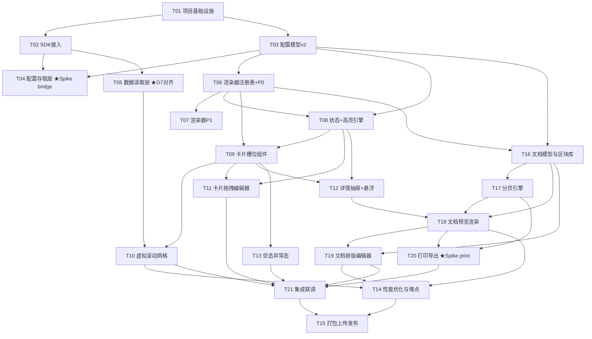

### 16.3 里程碑

| 里程碑 | 包含任务 | 交付判据（Demo 可演示） |
|---|---|---|
| **M1 骨架打通** | T01~T06 | 打开卡片视图能看到真实数据渲染出的卡片；配置能存能读 |
| **M2 卡片视图可用** | T07~T13 | 拖拽排版卡片、保存配置、空态/异常态完备；万行级滚动流畅 |
| **M3 文档详情可用** | T16~T20 | 点击卡片看到 A4 纸页文档、可翻页缩放、可打印导出 |
| **M4 双态联调与发布** | T14, T21, T15 | 性能达标；上传发布成功，团队可安装使用 |

---

## 17. 测试策略与验收

### 17.1 测试分层

| 层 | 工具 | 覆盖重点 |
|---|---|---|
| 单元测试 | Vitest | `migrations`（v1→v2）、`ruleEngine` 条件求值、**`splitBlock` 切分算法**、**`paginate` 装箱算法**、`normalize` 各字段类型、`format`、`hash` |
| 组件测试 | React Testing Library | `DocPage` 页眉页脚页码、`BlockRenderer` 各区块、`FieldValue` 异常回落、`DetailDrawer` 焦点管理 |
| 端到端 | Playwright | 在真实多维表格中：新建视图 → 拖拽排版 → 保存 → 刷新校验 → 点击展开文档 → 缩放/翻页 → 打印路径 |
| 性能测试 | Playwright + Performance API | 1.2 万行表：首屏、滚动帧率；文档：首分页、翻页、缩放 |
| 兼容性 | 手工 | 飞书桌面客户端（Win/Mac）+ 网页版（Chrome/Edge 新版）；**不含移动端（D6）** |

### 17.2 分页引擎专项测试用例（关键）

| 用例 | 输入 | 期望 |
|---|---|---|
| 恰好填满 | 区块总高 = 内容区高 | 单页，无溢出 |
| 溢出 1px | 区块总高 = 内容区高 + 1 | 换页，无截断 |
| 不可切分块跨页 | `keyValueGrid` 高度 > 剩余高度 | **整块换页**，不拆开 |
| 长段落跨页 | 段落高度 = 3 页 | 按行切分 3 段，无丢字、无重复行 |
| 长表格跨页 | 50 行表格 | 按行切分，每页重复表头 |
| 标题孤行 | `heading` 后跟大块 | 标题随内容一起换页（`keepWithNext`） |
| 强制分页 | 中间含 `pageBreak` | 精确在此处断页，前后无空白残留 |
| 空文档 | 全部区块 `hideWhenEmpty` 且字段全空 | 显示「该记录无可展示内容」空态，不崩溃 |
| 超长文档 | 200 区块 / 60 页 | 触发大文档保护，切换精简渲染并提示 |
| 缩放一致性 | 同文档 zoom 50% / 100% / 150% | 分页结果**完全一致**（分页基于 px，与 zoom 无关） |

### 17.3 验收清单（对齐 P0）

- [ ] P0-01 新建视图可见「卡片视图」并正确渲染
- [ ] P0-02 四槽位按配置渲染，空槽位收合
- [ ] P0-03 卡片拖拽排版可用（含排序、移除、插入指示线）
- [ ] P0-04 配置改动 ≤300ms 反映到预览
- [ ] P0-05 配置持久化；刷新/重进不丢；**双账号看到同一配置**；复制视图首开有提示
- [ ] P0-06 点击展开文档式详情；Esc/遮罩/✕ 关闭并焦点归位
- [ ] P0-07 P0 八类字段双态渲染正确，无原始 ID 外泄
- [ ] P0-08 无权限用户看不到配置入口；双模式编辑器切换正常
- [ ] P0-09 1.2 万行首屏 ≤3s、滚动 ≥50FPS
- [ ] P0-10 九类 + 新增五类异常态均可复现且降级正确
- [ ] **P0-11 详情以 A4 纸页渲染，含页眉页脚与页码**
- [ ] **P0-12 区块库 12 类区块可拖入/排序/删除/配置**
- [ ] **P0-13 分页正确（§17.2 专项用例全过）**
- [ ] **P0-14 打印/导出 PDF 与屏幕预览版式一致**
- [ ] **P0-15 抽屉宽度可调/全屏/缩放/页导航可用**
- [ ] P1-08（提前）插件视图筛选排序结果与原生一致
- [ ] 可访问性：Tab 聚焦、Enter 开详情、Esc 关闭
- [ ] 无任何外部网络请求（开发者后台无白名单需求）

---

## 18. 部署与发布

### 18.1 发布链路（沿用技术方案 13.1~13.5）

7 步：`npm run upload`（语义化递增版本号）→ 开发者后台「数据表视图」选版本 + 图标 + 名称介绍 → 保存 → 「版本管理与发布」创建版本 → 确认权限与可见范围 → 申请线上发布 → 管理员审核 → 用户在「新建视图」安装使用。

**本版新增的发布注意点**

| 注意点 | 说明 |
|---|---|
| 配置 schema 升级 | v1→v2 迁移必须在 T03 完成并单测通过，**否则老视图配置会损坏** |
| 打印相关能力 | 若 V1（`window.print`）不可用，需确认降级方案已上线，避免该功能对用户不可用 |
| 权限 | D1 只读 → 主要依赖 `bitable:app:readonly`（免审，可先行）；无需申请写权限 |
| **生产构建环境变量（§0.2 · Q3）** | `webpack --mode production` **不设置** `process.env.NODE_ENV`；官方 utils 据此判定是否产出上传物料（`project.config.json`/`index.json`）。**CI 与本地构建都必须导出 `NODE_ENV=production`**：`NODE_ENV=production npm run build && NODE_ENV=production npm run upload`（Windows：`$env:NODE_ENV="production"; npm run build; npm run upload`）。详见技术方案 §13.4 |
| **`block.json.url` 语义（§0.2 · Q2）** | `url` 是**调试时要打开的多维表格文档链接**（用户在目标表复制地址栏完整链接），**不是** devServer 地址；发布前确认其指向生产联调文档，而非个人开发文档 |
| **`app.json` 位置（§0.2 · Q1）** | 官方 utils 读上一级 `../app.json`（= `feishu-card-view/app.json`，构建产物）；CI 注入环境对应 `app.json` 时须确保构建能同步到该位置（当前由 `webpack.config.js` 垫片保证） |

### 18.2 环境隔离（D10）

**dev / staging / prod 各一套企业自建应用**（各持独立 `appId` + `BlockTypeID`），通过 CI 注入对应 `app.json` / `block.json`。

| 环境 | 应用 | 用途 | 数据 |
|---|---|---|---|
| dev | 自建应用 A | 本地开发调试 | 个人测试表 |
| staging | 自建应用 B | 预发验证（含 1.2 万行性能表） | 测试表集 |
| prod | 自建应用 C | 生产 | 真实业务表 |

> 参考飞书视图插件的部署方式：均走「企业自建应用 + 数据表视图能力 + 管理员审核发布」，不使用商店应用。

### 18.3 上线检查清单（在技术方案 13.9 基础上新增）

- [ ] 配置 v1→v2 迁移函数已覆盖单测，且用旧版配置实测通过
- [ ] `defaultDocTemplate()` 在无配置时能正确生成（新视图首开体验）
- [ ] D4 复制视图首开提示条逻辑验证通过
- [ ] 存储降级（localStorage）时提示文案可见
- [ ] 配置体积超限提示可用（构造 64KB+ 配置实测）
- [ ] 打印/导出在飞书桌面客户端（Win + Mac）与网页版均验证
- [ ] 分页专项用例（§17.2）10 条全过
- [ ] 图片未加载完成时导出有占位或等待，不输出空白页
- [ ] 200 区块大文档保护触发正常

---

## 19. 风险与待验证项（更新）

### 19.1 本版新增/升级的风险

| # | 风险 | 影响 | 概率 | 应对 | 触发信号 |
|---|---|---|---|---|---|
| **R12** | **iframe 沙箱内 `window.print()` 不可用或只打印宿主整页** | **High** | 中 | ⚠️ **待验证项 V1，T20 阶段第一件事做 Spike**；降级链路见 §5.7 | 打印对话框内容错误 / 打印为空白 |
| **R13** | **字体未就绪导致分页错乱**（测量偏小 → 内容溢出纸页） | **High** | 中 | `await document.fonts.ready`（超时 3s）+ 字体就绪后自动重排 | 纸页出现内容溢出裁切 |
| **R14** | **文档排版引擎工作量超预期**（确定性分页 + 切分算法 + 属性面板） | **High** | **高** | 明确分期：先支持「不可切分块」分页（`keyValueGrid`/`fieldList`/`heading`/`image` + 短段落）打 M3；长段落/表格切分算法**作为 M3 后半段独立任务**，必要时延后到 P1 | T17 进度延期 > 30% |
| R15 | 大文档（200+ 区块）分页性能退化 | 中 | 中 | 惰性分页 + 高度缓存 + 大文档保护降级 | 首分页 > 1s |
| R16 | 打印输出图片空白 | 中 | 中 | 导出前等待 `img.complete`（超时 5s）+ 占位提示 | PDF 中图片位置空白 |
| R17 | 卡片与文档双态配置相互污染 | 中 | 低 | 草稿双分支隔离 + 单测覆盖 | 改卡片排版影响文档模板 |

### 19.2 沿用风险（技术方案第 14 章）

R1 配置持久化介质（**仍为最高优先级，T04 Spike**）、R2 万行级性能、R3 WebView 兼容、R4 SDK API 废弃、R5 字段类型新增、R6 权限审批阻塞、R7 宿主 API 变更、R8 拖拽与 iframe 兼容、R9 bridge 容量、R10 并写冲突、R11 附件资源加载。

### 19.3 待验证项汇总（Spike 清单）

| 编号 | 待验证 | 阶段 | 若失败的对策 |
|---|---|---|---|
| **V1** | iframe 沙箱内 `window.print()` 可用性与打印范围 | T20 前 | 新窗口打印 → 提示 Ctrl+P → 导出 HTML |
| **V2** | SDK 是否可读取视图原生筛选条件（用于插件内搜索合并） | T05 | 搜索降级为「仅过滤已加载页」+ 明示提示 + 跳转原生筛选入口 |
| **V3** | 打印时图片资源是否可正常加载输出 | T20 | 导出前等待加载 + 占位提示 |
| **V4** | `bitable.bridge` 跨用户共享与持久化的真实行为（两账号验证） | T04 | 启用"隐藏配置表"次级方案（需写权限，需重新评估 D1） |
| **V5** | dnd-kit 在飞书 iframe 内的指针事件与自动滚动表现 | T11 / T19 | 降级为「点击添加 + 上下移动按钮」的非拖拽编辑 |

---

## 20. 需求追踪矩阵

| 需求 | 设计章节 | 任务 | 验收 |
|---|---|---|---|
| P0-01 卡片视图基础渲染 | §3, §6.5 | T01, T09 | §17.3 |
| P0-02 卡片槽位结构 | §4.2, §6.5 | T09 | §17.3 |
| P0-03 拖拽式排版编辑器 | §10 | T11 | §17.3 |
| P0-04 实时预览 | §9, §10 | T11 | ≤300ms |
| P0-05 配置持久化（v2 + D4） | §4.5, §6.3, §5.8 | T03, T04 | 双账号一致 |
| P0-06 展开详情（文档式） | §5, §6.6, §8.2 | T12, T16, T18 | §17.2 |
| P0-07 字段类型适配 | §6.5 | T06 | 无原始值外泄 |
| P0-08 浏览/配置态（双模式） | §9, §10 | T11, T19 | §17.3 |
| P0-09 性能与虚拟化 | §13 | T10, T14, T17 | 指标表 |
| P0-10 空态与异常态 | §12 | T13 | 14 类全过 |
| **P0-11 文档式详情渲染** | **§5.3, §5.6** | **T18** | 版式一致 |
| **P0-12 文档区块编辑器** | **§5.2, §10** | **T19** | 拖拽可用 |
| **P0-13 分页引擎** | **§5.4** | **T17** | §17.2 十条 |
| **P0-14 打印与导出 PDF** | **§5.7** | **T20** | 与预览一致 |
| **P0-15 详情预览控制** | **§5.6, §6.9** | **T12, T18** | 缩放/翻页流畅 |
| P1-08 对齐原生筛选（提前） | §6.4 | T05 | 与原生一致 |
| D4 复制视图提示 | §5.8, §6.3 | T04 | 提示可见 |
| D9 容量限制 | §6.3, §12 | T04 | 超限拦截 |
| D10 环境隔离 | §18.2 | T15 | 三套应用 |

---

## 附录 · 关键文档链接（已核实）

| 主题 | 链接 |
|---|---|
| 数据表视图开发指南（创建/调试/发布/代码上传原理） | https://open.feishu.cn/document/base-extensions/base-table-view-extension-development-guide |
| Bridge 模块（setData / getData / onDataChange） | https://lark-base-team.github.io/js-sdk-docs/zh/api/bridge |
| Table 模块（getRecordsByPage，含性能建议） | https://lark-base-team.github.io/js-sdk-docs/zh/api/table |
| View 模块 | http://lark-base-team.github.io/js-sdk-docs/zh/api/view |
| FieldType 枚举（官方值） | https://open.feishu.cn/document/base-extension/base-view-extensions/data-type/fieldtype |
| view.getVisibleRecordIdList（有序记录 ID） | https://open.feishu.cn/document/base-extension/base-view-extensions/api/view/view_getvisiblerecordidlist |
| 社区参考实现 | https://github.com/Lark-Base-Team/bitable-extention |

> **未覆盖项声明**：`bitable.bridge.setData` 的容量上限与精确持久化周期在官方文档中未明确说明；iframe 内 `window.print()` 的可用性官方文档亦未说明。二者分别列为 V4 与 V1 待验证项。

---

## 21. M3 文档排版实现方案与任务分解（2026-09-20 追加 · 架构师 software-architect-2）

> **本节的定位**：M1/M2 已交付（`vitest run` 30 文件 / 422 用例全绿，`tsc --noEmit` / `eslint .` 均 EXIT=0）。本节是 **M3（文档详情可用）** 的实现交底：把 §5 / §6.6~§6.8 / §10 / §13.2 的设计落成**可编码的文件、接口与有序小步任务**。
> **不改既有章节**：§5/§6.7/§14/§16/§17 保持原样；本节只在**实现细节、接口签名、任务粒度**上做细化与**明确裁定**，凡与既有文字冲突处，均以本节「§21.10 待明确事项」显式登记，不静默覆盖。

### 21.0 冻结口径与已确认资产（务必对齐，不得重新发明）

| 项 | 冻结结论 | 落点 |
|---|---|---|
| **「文档排版即卡片详情排版」** | **D3 唯一口径**：不存在第二套详情配置。浏览态抽屉与编辑器「文档排版」模式**读写同一份** `config.detail.doc` / `draft.docDraft`。区块流定义「哪些字段、以何形态出现」，因此**文档态不再使用 `DetailConfig.fieldScope`**（`all/placed/custom` 仅对 M2 过渡的字段清单有意义，文档态由 `blocks` 决定字段范围） | `types.ts` L94-102；`DraftStore.updateDoc` |
| 详情恒为文档式 | `DetailConfig.mode` **恒为 `'document'`**，**不做 card/document 二选一** | `types.ts` L95 |
| 纸张尺寸 | A4 = 794×1123 @96dpi、`MM_TO_PX`、`getContentBox()` **已完成，直接复用** | `constants/paper.ts` |
| 默认模板 | `defaultDocTemplate()` 产 8 区块（heading/divider/keyValueGrid/spacer/heading/fieldList/spacer/metaFooter） | `defaults.ts` L191 |
| 区块模型 | **12 种** `DocBlockKind`（文本 heading/paragraph/richText · 字段 keyValueGrid/fieldList/badgeRow · 媒体 image/table · 结构 divider/spacer/pageBreak · 元信息 metaFooter）+ `DocBlockBase{blockId,kind,visibleWhen,style,breakInside,note}`（⚠️ 原交底误写「11 类」，2026-09-20 已更正为 **12 类**，见 §21.10-⑩） | `types.ts` L158-318 |
| 字段值出口 | 文档态统一走渲染器注册表 `renderDoc(nv, DocRenderContext)`；**禁止另写一套字段渲染** | `fields/registry.ts`、`fields/fieldTypes.ts` |
| DnD 基建 | dnd-kit **`PointerSensor`**（禁 HTML5 原生 DnD）；id 命名空间用前缀解析；纯逻辑下沉到 `*Math.ts` 便于单测 | `editor/{dragIds,placementMath}.ts`、`SlotLanes.tsx`、`FieldPool.tsx` |
| 状态 | `ViewStore`（`config`）/ `DraftStore`（`card`/`doc` 双分支）/ `UiStore`（`drawer`：`zoom/fitToWidth/currentPage/totalPages/paginating/paginationFailed/showBoundary` **已就位**） | `state/*` |
| 只读约束 | **D1**：不写表格数据、不写视图筛选/排序；`sdk/` 无任何写接口 | 全篇 |
| 构建 | Webpack 5（`@lark-opdev/block-bitable-webpack-utils` 约束，**不能换 Vite**） | 全篇 |

### 21.1 实现方案（整体思路 · 数据流 · 衔接点）

**核心思路**：**「一次离屏测量 + 一次确定性装箱 + 按页渲染真实 DOM」**（§5.4 方案 B），屏幕预览与打印共用**同一份分页结果**，从根上保证「所见即所得」。

**关键工程裁定（相对 §5.4 的细化）**：
1. **测量器做成可注入依赖 `Measurer`**，生产实现走离屏 DOM（读 `offsetHeight`），测试注入**确定性 stub**。理由：分页是最高风险点，必须能在 `vitest`（**无真实浏览器布局**）下 100% 覆盖。
2. **装箱算法拆成纯函数 `packPages()`**（单文件、无 DOM、无 React、无 SDK），输入 `区块序列 + 尺寸表 + 内容盒`，输出 `页列表`。纯函数可被穷举单测（§17.2 十条用例全部落在这一层）。
3. **分层**：`pagination/`（纯算法 + 测量器 + 控制器，**不依赖 components**）↔ `doc/`（区块解析/目录/默认值/markdown）↔ `components/doc/`（渲染）。依赖方向单向向下，与 §6.1 一致。

**数据流（浏览态打开详情）**：

```
config.detail.doc (DocTemplate)
   │  resolve(blocks, record, fieldMetas, ruleEngine)     ← doc/resolve.ts（字段求值 + hideWhenEmpty + visibleWhen + 图片/表格行解析）
   ▼
ResolvedBlock[]  ──►  渲染层把全部区块渲染进「离屏宿主」(visibility:hidden; position:absolute; width=contentBox.width)
   │                                                   ▲
   │  Measurer.measureBlocks(host, blocks) ────────────┘  ← 读 offsetHeight（+ 行级 Range.getClientRects）→ BlockMetrics[]
   ▼
packPages({ blocks, metrics, contentHeight })  ← 纯函数：确定性装箱 → PagedPage[]
   ▼
PagedDocument { pages, totalPages, fontReady, degraded }
   ▼
<DocPreview>（缩放/翻页/纸页虚拟化） → <DocPaper>×N → blocksById[blockId] → <BlockRenderer> → <DocFieldValue> → renderDoc()
```

**与现有资产的衔接点**：

| 衔接点 | 现状 | M3 动作 |
|---|---|---|
| `ConfigDrawer.tsx` L259-270 | `mode==='doc'` 渲染 `<div className="cbv-state__title">文档排版即将上线</div>`（**用户报的 bug**） | 替换为 `<DocLayoutEditor template={docDraft} fields={fields} onChange={draft.updateDoc} …/>`；**该占位字符串的移除会导致 QA 断言失效，见 §21.10** |
| `DetailDrawer.tsx` L248-269 | 过渡实现：`cbv-doc-list` 简易字段清单（`DocRow`） | 替换为 `<DocPreview pagedDoc=… />`；**保留**头部工具栏（适应宽度/缩放/全屏/Esc 两级/焦点归位）与 `ResizeObserver` 适应宽度逻辑，直接驱动 `UiStore.drawer` |
| `DraftStore.updateDoc` | 已支持 `DocTemplate` 草稿 + 快照/回滚 | 编辑器文档模式**只用** `updateDoc` + `snapshot`，不新增状态 |
| `UiStore.drawer.{currentPage,totalPages,paginating,paginationFailed,showBoundary}` | 已就位（M2 仅占位） | M3 由 `usePagedDocument` 接管：`setPaginating/setTotalPages/setPaginationFailed` |
| `editor/{dragIds,placementMath}.ts` | 卡片 DnD 基建 | **扩展**（新增前缀 + 新增 `blockMath.ts` 纯逻辑），**不重写** |
| `registry.renderDoc` / `DocRenderContext` | 已就位（`fragmentIndex`/`fragmentsTotal`/`showLabel` 防跨页重复标签） | 直接复用；跨页片段把 `fragmentIndex/fragmentsTotal` 透传给渲染器 |
| `constants/paper.ts` | 已完成 | **零改动复用**（不再新建 `pagination/pageMetrics.ts` 重算，见 §21.10 待明确-①） |

### 21.2 文件清单（新增 N / 修改 M）

> 路径均相对 `plugin/src/`；「≈行数」为**预估值**（含必要注释与类型）。

**A. 分页领域层（`pagination/`）— 新增**

| 文件 | 职责 | ≈行数 |
|---|---|---|
| `pagination/types.ts` (N) | **本层类型集中地**（T01 起如雪球累积）：`Measurer` / `BlockMetrics` / `PackInput` / `PackResult` / `PagedItem` / `PagedPage` / `PackOptions` + `DEFAULT_PACK_OPTIONS`，**以及 `PagedDocument` / `PaginateInput` / `PaginationController` / `HeightCache`**（**纯类型**，仅 `import type`） | 110 |
| `pagination/pack.ts` (N) | ⭐ **纯函数 `packPages()`**：确定性装箱（分页语义全部在此） | 190 |
| `pagination/pack.test.ts` (N) | §17.2 十条用例 + 边界（空文档/单块超大/连续 pageBreak/keepWithNext） | 220 |
| `pagination/measurer.ts` (N) | `createDomMeasurer()`：从已渲染的离屏宿主读 `offsetHeight`（含段落行级 `Range.getClientRects`） | 110 |
| `pagination/measurer.stub.ts` (N) | `createStubMeasurer(table)`：确定性 stub，供单测与组件测试 | 50 |
| `pagination/engine.ts` (N) | `createPaginationController()`（**仅实现**；`PagedDocument`/`PaginateInput`/`PaginationController` 类型定义在 `types.ts`）：`awaitFonts` → 测量（带 `heightCache`）→ `packPages`，异常 → 单页长文档降级 | 130 |
| `pagination/engine.test.ts` (N) | 控制器编排测试（注入 stub measurer + 假 `awaitFonts`） | 120 |
| `pagination/heightCache.ts` (N) | `createHeightCache()` + `metricsKey(blockId, contentWidth, payloadHash)`（`HeightCache` 类型定义在 `types.ts`） | 60 |

**B. 文档领域层（`doc/`）— 新增**

| 文件 | 职责 | ≈行数 |
|---|---|---|
| `doc/resolve.ts` (N) | `DocBlock[] + record + fieldMetas → ResolvedBlock[]`：字段求值、`hideWhenEmpty`、`visibleWhen`（复用 `highlight/ruleEngine`）、附件 URL、表格行解析 | 220 |
| `doc/blockDefaults.ts` (N) | 每 `kind` 的默认配置工厂（拖入时的初始值）+ **导出 `createBlockIdFactory(options?)`**：区块 id 生成**可注入**（`options.makeId`），默认实现**确定性**（不用 `Math.random()`/`Date.now()`）。⚠️ **不得复用** `defaults.ts` 的 `createId`（其含 `Math.random()`/`Date.now()`，与「确定性可单测」冲突；见 §21.10-⑪） | 150 |
| `doc/blockCatalog.ts` (N) | 区块库元数据：**5 分组 / 12 类**（文本3+字段3+媒体2+结构3+元信息1）/ 中文名 / 图标 / 可拖入约束（纯数据，供左栏与测试） | 90 |
| `doc/markdown.ts` (N) | `richText` 的 markdown 子集（`**粗**`/`*斜*`/换行/`- 列表`）→ 安全节点数组（**纯函数**） | 110 |
| `doc/markdown.test.ts` (N) | markdown 子集单测 | 90 |
| `doc/resolve.test.ts` (N) | 条件过滤 / hideWhenEmpty / 失效字段引用隐藏 | 130 |

**C. 文档渲染层（`components/doc/`）— 新增**

| 文件 | 职责 | ≈行数 |
|---|---|---|
| `components/doc/DocFieldValue.tsx` (N) | 文档态字段值**唯一出口**（内部 `normalize` + `renderDoc` + try/catch → Fallback） | 90 |
| `components/doc/blocks/BlockRenderer.tsx` (N) | 按 `kind` 分发到具体区块渲染器（`memo`，未知 kind → 占位） | 70 |
| `components/doc/blocks/TextBlocks.tsx` (N) | `heading` / `paragraph` / `richText` 三渲染器 | 170 |
| `components/doc/blocks/FieldBlocks.tsx` (N) | `keyValueGrid` / `fieldList` / `badgeRow` 三渲染器（复用 `DocFieldValue`） | 190 |
| `components/doc/blocks/MediaBlocks.tsx` (N) | `image` / `table` 两渲染器（图片懒加载、表格重复表头钩子） | 180 |
| `components/doc/blocks/StructureBlocks.tsx` (N) | `divider` / `spacer` / `metaFooter` 三渲染器（`pageBreak` **不渲染**） | 100 |
| `components/doc/DocPaper.tsx` (N) | 单张纸页：`width/height`=纸张、`padding`=margin、页眉/页脚锚位、内容盒内绝对定位摆放 `items` | 150 |
| `components/doc/DocHeaderFooter.tsx` (N) | 页眉/页脚渲染（`{字段占位符}` 解析、`showBorder`、页码按 `pageNumberFormat`） | 120 |
| `components/doc/DocPreview.tsx` (N) | 容器：`transform:scale` 缩放、`ResizeObserver` 适应宽度、纸页虚拟化（`currentPage±2`）、滚动↔页码映射、分页边界提示 | 200 |
| `components/doc/PrintButton.tsx` (N) | 触发 `DocExporter`（打印/导出）的小组件（**P1：随 §21.7 本期移出，暂不实现**） | 40 |
| `components/detail/PageNavigator.tsx` (N) | 右侧页码导航（`n/total`、上一页/下一页/跳转） | 90 |
| `hooks/usePagedDocument.ts` (N) | 编排：`resolve → 渲染离屏宿主 → measure → pack → UiStore 回写`；记录级缓存与失效 | 170 |

**D. 导出（`export/`）— 新增 —— ⚠️ 本期（M3）**移出**，降为 P1（见 §21.7）**

| 文件 | 职责 | ≈行数 |
|---|---|---|
| `export/printStyles.ts` (N) | 动态注入 `@page{size;margin:0}` 与打印期类名（**非**静态 CSS） | 80 |
| `export/DocExporter.ts` (N) | `print()` / `exportPdf()` + §5.7 降级链路（新窗口 → 提示 Ctrl+P → 导出 HTML） | 160 |
| `styles/print.css` (N) | `@media print` 规则（隐藏宿主 UI、`transform:none`、`break-after:page`） | 60 |

**E. 编辑器（`components/editor/doc/`）— 新增**

| 文件 | 职责 | ≈行数 |
|---|---|---|
| `components/editor/doc/blockMath.ts` (N) | ⭐ **纯逻辑**：`insertBlock/moveBlock/removeBlock/updateBlock/findBlock`（镜像 `placementMath.ts` 风格） | 130 |
| `components/editor/doc/blockMath.test.ts` (N) | 增删排序纯逻辑单测 | 110 |
| `components/editor/doc/BlockLibrary.tsx` (N) | 左栏 220px：5 分组区块库，可拖（`useDraggable`，id=`blocklib:{kind}`） | 120 |
| `components/editor/doc/DocCanvas.tsx` (N) | 中栏：A4 纸页实时预览（复用 `DocPreview` + `buildSampleRecord`）+ 文档流插入槽（`useDroppable`） | 160 |
| `components/editor/doc/DocLayoutEditor.tsx` (N) | 文档模式三栏容器（`DndContext` + 拖拽 overlay + 复用现有 `PointerSensor` 配置） | 170 |
| `components/editor/doc/BlockPropertyForm.tsx` (N) | 按 `kind` 动态表单（字段选择器 / 列数 / 标签宽度 / 分页行为 …） | 200 |
| `components/editor/doc/PageSetupPanel.tsx` (N) | 页设置（纸张/朝向/页边距 mm/页眉页脚/页码格式） | 140 |
| `components/editor/doc/DocThemePanel.tsx` (N) | 文档主题（字体/字号/行高/字阶/间距/配色） | 110 |
| `components/editor/doc/DocPropertyPanel.tsx` (N) | 右栏 320px 容器（区块属性 / 页设置 / 主题 三折叠） | 90 |

**F. 修改既有文件（M）**

| 文件 | 改动 | 风险 |
|---|---|---|
| `components/editor/dragIds.ts` (M) | 新增 3 前缀 `blocklib:` / `docblock:` / `docslot:` 与其 `*DragId()` 工厂、`parseDragId` 分支；**不动既有 3 前缀** | 低（纯增） |
| `components/editor/ConfigDrawer.tsx` (M) | L259-270 **删除占位**，`mode==='doc'` 时渲染 `<DocLayoutEditor/>`；`DndContext` 需覆盖两模式（或各自包一层） | **中**：触发 QA 断言反转 |
| `components/detail/DetailDrawer.tsx` (M) | 正文区替换为 `<DocPreview/>` + `<PageNavigator/>` + `<PrintButton/>`；删除 `DocRow`（过渡实现）；保留全部交互与 `Esc`/焦点逻辑 | **中**：现有 `detail.fix/qa2` 测试需核对 |

> **估计总量**：新增约 **30 文件 / ~3.9k 行**（含测试），修改 3 文件。测试文件与实现文件同目录、`*.test.ts(x)` 命名，遵守现有约定。

### 21.3 数据结构与接口（TypeScript 签名）

#### 21.3.1 分页引擎输入输出（`pagination/types.ts`）

```ts
import type { BreakInside, DocBlockKind, DocTheme } from '@/config/types';

/** 单个区块的测量结果（尺寸表的一行） */
export interface BlockMetrics {
  blockId: string;
  kind: DocBlockKind;
  /** 整块「外高」px（含区块自身 margin；区块间距由渲染层 CSS 决定并被一并计入） */
  outerHeight: number;
  /**
   * 可切分块（paragraph/fieldList/table）的**原子单元**高度序列：
   * paragraph → 每行高；fieldList → 每项高；table → 每数据行高。
   * 不可切分块为 undefined。
   */
  units?: number[];
  /** 表格续页需重复的表头高度（0/undefined = 不重复） */
  repeatHeaderHeight?: number;
}

/** ⭐ 可注入测量器：生产走离屏 DOM，测试注入确定性 stub */
export interface Measurer {
  /** 从「已渲染好的离屏宿主」同步读取尺寸；host 内各区块根节点须带 data-block-id */
  measureBlocks(
    host: HTMLElement,
    blocks: ReadonlyArray<{ blockId: string; kind: DocBlockKind }>,
  ): BlockMetrics[];
}

/** 纯函数装箱输入（无 DOM / 无 React / 无 SDK / 无 config 运行时依赖） */
export interface PackBlock {
  blockId: string;
  kind: DocBlockKind;
  breakInside: BreakInside;
  /** 标题等需与「下一块首单元」同页（§17.2「标题孤行」） */
  keepWithNext?: boolean;
}

export interface PackOptions {
  /** 页底至少保留的原子单元数（孤行控制），<1 视为 1 */
  minUnitsAtBottom: number;
  /** 换页后页顶至少保留的原子单元数（寡行控制），<1 视为 1 */
  minUnitsAtTop: number;
  /** 是否启用孤行/寡行控制；本期默认 false（仅保证每页 ≥1 单元） */
  enableWidowOrphan: boolean;
}

export const DEFAULT_PACK_OPTIONS: PackOptions = {
  minUnitsAtBottom: 1,
  minUnitsAtTop: 1,
  enableWidowOrphan: false,
};

export interface PackInput {
  blocks: ReadonlyArray<PackBlock>;
  /** 与 blocks 同序等长 */
  metrics: ReadonlyArray<BlockMetrics>;
  /** = ContentBox.height（纸张高 − 上下页边距） */
  contentHeight: number;
  options?: Partial<PackOptions>;
}

export interface PagedItem {
  blockId: string;
  fragmentIndex: number;   // 该块第几段（0 起）
  fragmentsTotal: number;  // 该块总段数
  height: number;          // 本片段高度
  /** 原子切片区间 [from, to)（行号 / 项号 / 数据行号） */
  slice?: { from: number; to: number };
}

export interface PagedPage {
  pageIndex: number;
  items: PagedItem[];
  usedHeight: number;      // 本页已用高度（边界提示 / 断言用）
}

export interface PackResult {
  pages: PagedPage[];
  totalPages: number;
  /** 单块 > 一整页且不可切分 → 已独占一页并裁剪；此处登记以触发降级提示（§21.4 规则 4） */
  overflowBlockIds: string[];
}
```

#### 21.3.2 分页控制器（类型定义在 `pagination/types.ts`；实现为 `pagination/engine.ts`）

> ⚠️ **类型出处（裁定）**：`PagedDocument` / `PaginateInput` / `PaginationController` / `HeightCache` 定义在 **`pagination/types.ts`**（该层类型集中地，T01 已落地）；`engine.ts` 只导出实现函数 `createPaginationController`，`heightCache.ts` 只导出 `createHeightCache`/`metricsKey`。**T02/T06/T07 请从 `types.ts` 取类型**，不要去 `engine.ts` 找。

```ts
import type { HeightCache, PaginateInput, PagedDocument, PaginationController } from '@/pagination/types';

// —— 以下 interface 均定义在 pagination/types.ts（此处仅示形状） ——
export interface PaginateInput {
  blocks: PackBlock[];
  metrics: BlockMetrics[];   // 由调用方（usePagedDocument）提供：先测量、再落缓存
  contentHeight: number;
}

export interface PagedDocument {
  pages: PagedPage[];
  totalPages: number;
  fontReady: boolean;
  /** 分页失败 → 单页长文档降级（§12） */
  degraded: boolean;
}

export interface PaginationController {
  paginate(input: PaginateInput): PagedDocument;
  invalidate(blockIds?: string[]): void;
}

export interface HeightCache {
  get(key: string): BlockMetrics | undefined;
  set(key: string, value: BlockMetrics): void;
  invalidate(blockIds?: string[]): void;
}

// —— 以下为实现导出（engine.ts / heightCache.ts / measurer*.ts） ——
export function createPaginationController(deps: {
  options?: Partial<PackOptions>;
  cache?: HeightCache;
}): PaginationController;

export function createHeightCache(): HeightCache;
export function metricsKey(blockId: string, contentWidth: number, payloadHash: string): string;

/** 生产测量器（`pagination/measurer.ts`） */
export function createDomMeasurer(): Measurer;
/** 确定性 stub（`pagination/measurer.stub.ts`） */
export function createStubMeasurer(
  table: Record<string, Partial<BlockMetrics>>,
  fallback?: Partial<BlockMetrics>,
): Measurer;
```

#### 21.3.3 文档领域层（`doc/`）

```ts
import type { DocBlock, DocTemplate } from '@/config/types';
import type { FieldMetaLite } from '@/fields/fieldTypes';
import type { SdkRecord } from '@/sdk/port';

/** 求值后的区块：渲染层与测量层都只消费它 */
export interface ResolvedBlock {
  block: DocBlock;
  /** 该区块引用的字段（无则空） */
  fieldIds: string[];
  /** 渲染/测量所需的 payload hash（用于高度缓存键） */
  payloadHash: string;
  /** 图片块解析出的 URL（已 await 加载完成后可为空数组） */
  imageUrls?: string[];
  /** 表格块解析出的行（currentRecord / linkedRecords） */
  rows?: Array<Record<string, unknown>>;
}

export function resolveBlocks(args: {
  blocks: ReadonlyArray<DocBlock>;
  record: SdkRecord;
  fields: ReadonlyArray<FieldMetaLite>;
  locale: string;
}): ResolvedBlock[];

export function defaultBlockFor(kind: DocBlock['kind'], fields: ReadonlyArray<FieldMetaLite>): DocBlock;

export interface BlockCatalogEntry {
  kind: DocBlock['kind'];
  group: 'text' | 'field' | 'media' | 'structure' | 'meta';
  label: string;           // 中文名
  icon: string;            // 图标 key
  defaultBreakInside: 'auto' | 'avoid';
}
export const BLOCK_CATALOG: ReadonlyArray<BlockCatalogEntry>;
export const BLOCK_GROUP_LABEL: Readonly<Record<BlockCatalogEntry['group'], string>>;

/** markdown 子集 → 安全节点（纯函数，不产 HTML 字符串） */
export type MarkdownNode =
  | { kind: 'text'; text: string; bold?: boolean; italic?: boolean }
  | { kind: 'break' }
  | { kind: 'listItem'; index: number; nodes: MarkdownNode[] };
export function parseMarkdown(src: string): MarkdownNode[];
```

#### 21.3.4 渲染组件树 props（`components/doc/`）

```ts
import type { CSSProperties } from 'react';
import type { DocTheme, PageSetup } from '@/config/types';
import type { ResolvedBlock } from '@/doc/resolve';
import type { PagedDocument, PagedItem } from '@/pagination/types';
import type { FieldMetaLite } from '@/fields/fieldTypes';
import type { SdkRecord } from '@/sdk/port';

export interface DocPreviewProps {
  pagedDoc: PagedDocument;
  pageSetup: PageSetup;
  theme: DocTheme;
  zoom: number;                 // 0.75 ~ 1.5（与 UiStore 一致）
  fitToWidth: boolean;
  currentPage: number;
  onPageChange(page: number): void;
  showBoundary: boolean;
  blocksById: Record<string, ResolvedBlock>;
  record: SdkRecord | null;
  fieldsById: Record<string, FieldMetaLite>;
  locale: string;
  /** 打印态：由 DocExporter 置位（重排/隐藏 UI） */
  printing?: boolean;
}

export interface DocPaperProps {
  pageIndex: number;
  totalPages: number;
  items: PagedItem[];
  pageSetup: PageSetup;
  theme: DocTheme;
  blocksById: Record<string, ResolvedBlock>;
  record: SdkRecord | null;
  fieldsById: Record<string, FieldMetaLite>;
  locale: string;
  /** 是否渲染页眉/页脚（打印与预览均需；第一页受 headerFooterScope 控制） */
  showHeaderFooter: boolean;
}

export interface DocHeaderFooterProps {
  variant: 'header' | 'footer';
  pageIndex: number;
  totalPages: number;
  setup: PageSetup;
  theme: DocTheme;
  record: SdkRecord | null;
  fieldsById: Record<string, FieldMetaLite>;
  locale: string;
}

export interface BlockRendererProps {
  resolved: ResolvedBlock;
  fragmentIndex: number;
  fragmentsTotal: number;
  /** 原子切片区间（段落/表格/清单跨页时由分页结果透传） */
  slice?: { from: number; to: number };
  theme: DocTheme;
  locale: string;
  record: SdkRecord | null;
  fieldsById: Record<string, FieldMetaLite>;
  /** 内容盒宽度 px（网格/表格列宽换算基准 = ContentBox.width） */
  contentWidth: number;
  style?: CSSProperties;   // 由 DocPaper 计算出的绝对定位样式
}

export interface DocFieldValueProps {
  fieldId: string;
  record: SdkRecord;
  fieldsById: Record<string, FieldMetaLite>;
  theme: DocTheme;
  locale: string;
  showLabel: boolean;
  labelText?: string;
  fragmentIndex: number;
  fragmentsTotal: number;
}
```

#### 21.3.5 编辑器侧（`components/editor/doc/`）

```ts
import type { DocBlock, DocTemplate } from '@/config/types';
import type { FieldMetaLite } from '@/fields/fieldTypes';

export interface DocLayoutEditorProps {
  template: DocTemplate;
  fields: FieldMetaLite[];
  /** 变更入口：内部调用 DraftStore.updateDoc（已是不可变更新） */
  onChange(updater: (t: DocTemplate) => DocTemplate): void;
  /** 变更前快照（撤销） */
  onBeforeChange(): void;
  locale: string;
}

/** 纯逻辑（blockMath.ts） */
export function insertBlock(t: DocTemplate, block: DocBlock, index: number): DocTemplate;
export function moveBlock(t: DocTemplate, blockId: string, toIndex: number): DocTemplate;
export function removeBlock(t: DocTemplate, blockId: string): DocTemplate;
export function updateBlock<T extends DocBlock>(t: DocTemplate, blockId: string, patch: Partial<T>): DocTemplate;
export function findBlock(t: DocTemplate, blockId: string): { block: DocBlock; index: number } | null;
```

#### 21.3.6 导出（`export/`）

```ts
import type { PageSetup } from '@/config/types';
export interface DocExporter {
  /** 保真打印：复用已分页 DOM；内部临时 zoom=1 + 隐藏 UI + 注入 @page */
  print(container: HTMLElement, setup: PageSetup): Promise<void>;
  /** 导出 PDF（默认走系统打印的「另存为 PDF」） */
  exportPdf(container: HTMLElement, setup: PageSetup, fileName: string): Promise<void>;
}
export function createDocExporter(deps?: { printImpl?: () => void }): DocExporter;
export function applyPrintPageRule(setup: PageSetup): () => void; // 返回还原函数
```

### 21.4 分页算法设计（重点）

#### 21.4.1 纯函数装箱 `packPages(input): PackResult`（`pagination/pack.ts`）

**不变式（Invariants，逐条可断言）**
1. `pages[i].usedHeight = Σ items[j].height`，且 `usedHeight ≤ contentHeight`（**唯一例外**：规则 4 的「超高不可切分块独占一页」）。
2. 除 `pageBreak` 外，输入 `blocks` 中每个块在输出中**至少出现一次**，且其所有 `fragmentIndex` 连续、`fragmentsTotal` 一致。
3. 对同一输入，输出**完全确定**（无随机、无时间、无 DOM 依赖）。
4. **进度保证**：每次循环必须至少消费 1 个原子单元或推进 1 个块，杜绝死循环。
5. 每页至少含 1 个 `item`（除非文档为空 → `pages = []`，由渲染层出空态）。

**规则（逐条对应 §17.2 用例）**

| # | 规则 | 说明 |
|---|---|---|
| **1 页容量** | 容量 = `contentHeight`；`y` 从 0 累加 | 页眉/页脚**不占用**容量（见 21.4.3） |
| **2 恰好填满 / 溢出 1px** | `h ≤ capacity − y` → 放入本页；否则进入规则 3/4/5 | `≤` 而非 `<`，「总高 = 内容高」必须单页 |
| **3 不可切分块**（`breakInside==='avoid'`，或 `kind ∈ {heading, keyValueGrid, image, divider, spacer, metaFooter}`） | 放不下 → **整块换页**（不拆） | 对应「不可切分块跨页 → 整块换页」 |
| **4 超高不可切分块** | 若 `outerHeight > capacity`（**连一整页都放不下**）→ **独占一页**、按 `capacity` 裁剪、`blockId` 记入 `overflowBlockIds` | 保证进度、不丢 DOM；渲染层据此出「内容超页」提示并允许降级为单页长文档 |
| **5 可切分块**（`breakInside==='auto'` 且 `units` 非空：paragraph / fieldList / table） | 按 `units` **贪心填充**：只要 `unit ≤ 剩余` 就继续；放不下则换页继续 | 对应「长段落跨页 → 按行切分」「长表格跨页」 |
| **6 表格续页表头** | 续页（`fragmentIndex>0`）顶部**先扣减** `repeatHeaderHeight` 再填行 | 对应「每页重复表头」 |
| **7 孤行/寡行（widow/orphan）** | `enableWidowOrphan` **本期默认 false**；为 true 时：页底保留 ≥`minUnitsAtBottom` 单元、页顶保留 ≥`minUnitsAtTop` 单元，否则整块换页 | **本期不启用**（见 §21.10 待明确-②）；`false` 时等价「至少 1 单元」，即规则 5 的自然结果 |
| **8 `keepWithNext`（标题孤行）** | 放置 `keepWithNext` 块后**前瞻 1 块**：若下一块（跳过 `pageBreak`）的首个单元放不进剩余空间 → **回退**，标题连同下一块一起换页 | 对应「标题孤行 → 标题随内容换页」 |
| **9 `pageBreak` 语义** | 该块**永不渲染**；语义 = 「**在此处强制结束当前页**」。① 出现在文档**首部**的连续 `pageBreak` **忽略**（不产生空白首页）；② 连续多个 `pageBreak` **折叠为一**（不产生连续空白页）；③ 出现在**末尾**的 `pageBreak` **忽略**（不产生尾随空白页）；④ 若当前页为空且已判定要断页，则不产生空页 | 对应「强制分页 → 精确断页、前后无空白残留」 |
| **10 空文档** | 输入 `blocks` 全被 `resolve` 剔除（`hideWhenEmpty`）→ `blocks.length===0` → `pages=[]`、`totalPages=0` | 渲染层据此出「该记录无可展示内容」空态，**不崩溃** |
| **11 超长文档** | 不做硬限制（纯函数无副作用）；由**控制器/渲染层**在 `blocks.length>200` 或 `totalPages>50` 时切「精简渲染」（关边界提示、关纸页虚拟化的 `±2` 缓冲） | 对应「超长文档 → 大文档保护」 |
| **12 缩放无关** | 分页**只依赖 px 内容盒**，与 `zoom` 完全解耦；缩放只改 `transform: scale` | 对应「缩放一致性 → 分页结果完全一致」 |

**算法骨架（伪代码，与实现 1:1）**

```ts
export function packPages(input: PackInput): PackResult {
  const opts = { ...DEFAULT_PACK_OPTIONS, ...input.options };
  const cap = input.contentHeight;
  const pages: PagedPage[] = [];
  const overflow: string[] = [];
  let items: PagedItem[] = [];
  let y = 0;
  const flush = (): void => { if (items.length > 0) { pages.push({ pageIndex: pages.length, items, usedHeight: y }); items = []; y = 0; } };
  const capacityLeft = (): number => cap - y;

  for (let i = 0; i < input.blocks.length; i++) {
    const blk = input.blocks[i];
    const m = input.metrics[i];

    if (blk.kind === 'pageBreak') { flush(); continue; }               // 规则 9（③/④ 由 flush 天然满足）

    const atomic = m.units === undefined;                              // 规则 3/5 判定
    const h = m.outerHeight;

    // —— 不可切分 ——
    if (atomic) {
      if (h > cap) {                                                   // 规则 4
        flush();
        items.push({ blockId: blk.blockId, fragmentIndex: 0, fragmentsTotal: 1, height: cap });
        y = cap; overflow.push(blk.blockId); flush();
        continue;
      }
      if (h > capacityLeft()) flush();                                 // 规则 3
      items.push({ blockId: blk.blockId, fragmentIndex: 0, fragmentsTotal: 1, height: h });
      y += h;
      if (blk.keepWithNext) maybeUndoKeepWithNext(...);                // 规则 8（前瞻下一块首单元）
      continue;
    }

    // —— 可切分 ——：按 units 贪心切片
    const units = m.units as number[];
    const slices: Array<{ from: number; to: number; height: number }> = [];
    let u = 0;
    while (u < units.length) {
      if (y >= cap) flush();                                           // 进度保证：先确保有空间
      let from = u;
      let used = 0;
      // 续页表头：非首页片段且需要重复表头 → 先占位（规则 6）
      const headerReserve = slices.length > 0 ? (m.repeatHeaderHeight ?? 0) : 0;
      const room = cap - y - headerReserve;
      while (u < units.length && used + units[u] <= room) { used += units[u]; u++; }
      if (u === from) { u = from + 1; used = units[from]; }            // 进度保证：单单元也放不进 → 强行放 1 个
      slices.push({ from, to: u, height: used + headerReserve });
    }
    const total = slices.length;
    for (let s = 0; s < slices.length; s++) {
      const sl = slices[s];
      if (sl.height > capacityLeft() && items.length > 0) flush();     // 放不进则换页
      items.push({ blockId: blk.blockId, fragmentIndex: s, fragmentsTotal: total, height: sl.height, slice: { from: sl.from, to: sl.to } });
      y += sl.height;
    }
  }
  flush();                                                             // 规则 10：空输入 → pages=[]
  return { pages, totalPages: pages.length, overflowBlockIds: overflow };
}
```

> `maybeUndoKeepWithNext` 为规则 8 的前瞻实现：若 `i+1` 块（跳过 `pageBreak`）在 `capacityLeft()` 内连「1 个原子单元（或整块，若不可切分）」都放不下，则**弹出刚放入的标题并先 `flush()`**，再重新放标题。

#### 21.4.2 集成式伪代码（§5.4 伪代码的**实现级细化**）

见 §21.3.2 的 `PaginationController` 与 `usePagedDocument` 编排：控制器只做「**已验证的度量 → 纯装箱**」，**不自己做测量**（测量由组件层渲染离屏宿主后调用 `Measurer` 完成），从而让「测量（有 DOM）」与「装箱（无 DOM）」彻底解耦 —— **这正是可单测的关键**。

#### 21.4.3 页眉/页脚占位（裁定）

- **页眉/页脚落在「页边距带」内**（页顶 margin 区 / 页底 margin 区），**不占用 `ContentBox.height`**。因此分页只依赖 `getContentBox()` 的结果，§5.4 的 `PagedItem.height` 语义保持「正文高度」。
- 约束：页眉/页脚高度需 ≤ 对应 margin；若开启页眉建议 `margin.top ≥ 24px`（16px 字号 + 边距）。**默认模板 margin 已满足**（见 `defaults.ts` `defaultPageSetup()`）。
- `headerFooterScope: 'first' | 'all'`：`'first'` = 仅第 0 页渲染页眉、页脚仍全页渲染（页码需全页）；`'all'` = 每页都渲染。
- **`metaFooter` 区块 ≠ 页脚**（见 §21.10 待明确-④）：`metaFooter` 是**文档流内的元信息块**（随流分页，可能落在任意页），而 `PageSetup.footer` 是**每页固定页脚**。二者独立。

#### 21.4.4 万行级取舍（性能）

- 详情只渲染**单条记录**，压力在**区块数量**（典型 20~40 块）而非记录数。
- 因此**不做**页级渐进式流式分页的复杂调度；采用：① 离屏测量**一次**（全块一次读 `offsetHeight`，通常 < 50ms）；② `packPages` 为 **O(总原子单元数)**；③ **高度缓存** key=`blockId + contentWidth + payloadHash`，命中率收益主要在「同记录重复打开」与「编辑态增量重算」；④ **纸页虚拟化**只渲染 `currentPage ± 2`；⑤ 大文档保护阈值（>200 块 / >50 页）切精简渲染。

### 21.5 渲染组件树（层级与职责）

```
<DocPreview>                                  容器：缩放 / 适应宽度 / 翻页 / 纸页虚拟化 / 滚动↔页码 / 边界提示 / printing 态
├── <DocPaper pageIndex=0>                   单页纸：尺寸=纸张 px，padding=margin，box-shadow
│   ├── <DocHeaderFooter variant="header">   页眉（headerFooterScope 允许时）
│   ├── <div.cbv-paper__body>                内容盒：width=ContentBox.width，绝对定位 items
│   │   └── <BlockRenderer style={top}>      按 PagedItem.height 顺次 top 累加定位
│   │       ├── TextBlocks   → heading / paragraph / richText
│   │       ├── FieldBlocks  → keyValueGrid / fieldList / badgeRow   ─┐
│   │       ├── MediaBlocks  → image / table                          ├─► <DocFieldValue> ─► normalize() + renderDoc()
│   │       └── StructureBlocks → divider / spacer / metaFooter      ─┘   （唯一字段值出口，try/catch → FallbackRenderer）
│   ├── <DocHeaderFooter variant="footer">   页脚（含页码，按 pageNumberFormat）
│   └── （pageBreak 不渲染）
├── <DocPaper pageIndex=1> …                虚拟化：仅 currentPage±2 渲染；其余等高占位
└── <PageNavigator>                          右侧页码导航（n/total、上一页/下一页/跳转）
```

**职责边界**
- `DocPreview`：**唯一的**缩放/滚动/翻页状态持有者（与 `UiStore.drawer` 双向同步）；**不**解析字段。
- `DocPaper`：把 `PagedItem[]` 摆放成绝对定位的区块块（`top` = 前缀 `height` 累加）；负责首/续页的表头（表格）与续页标签抑制（把 `fragmentIndex/fragmentsTotal` 透传）。
- `BlockRenderer`：`switch(kind)` 分发 + `memo`；未知 kind → 占位区块（不崩）。
- `DocFieldValue`：**唯一**字段值出口（§11 已冻结），内部 `normalize` → `renderDoc(nv, ctx)` → 异常回落。
- **区块渲染器不重算分页**：只按传入的 `slice` 决定展示哪些行/项（避免二次测量）。

### 21.6 编辑器侧设计（`ConfigDrawer` doc 模式）

**三栏布局（≡ §10 S4 表）**

| 区域 | 组件 | 内容 |
|---|---|---|
| 顶栏 h=48 | 复用 `ConfigDrawer` 顶栏 | 分段控件 `(卡片排版｜文档排版)`、`撤销`、`取消`、`保存`；文档模式末项加 `重置为默认模板` |
| 左栏 **220px** | `BlockLibrary.tsx` | **区块库**：**5 分组 / 12 类**（文本3+字段3+媒体2+结构3+元信息1），`useDraggable`（id=`blocklib:{kind}`），拖出即 `defaultBlockFor(kind, fields)` |
| 中栏 弹性 | `DocCanvas.tsx` | **A4 纸页实时预览**：`buildSampleRecord(fields)` + 复用 `<DocPreview>`（`zoom=1`、`showBoundary=true`）+ **文档流插入槽**（每两区块之间一个 `useDroppable`，id=`docslot:{index}`）+ 区块选中态 |
| 右栏 **320px** | `DocPropertyPanel.tsx` | 三折叠：`BlockPropertyForm`（选中区块的属性）/ `PageSetupPanel` / `DocThemePanel` |
| 底栏 h=32 | 提示条 | 操作提示 + `已用 N 块 / 预计 M 页` |

**DnD 复用策略（关键）**
- **沿用** `PointerSensor`（`activationConstraint: { distance: 4 }`）与 `<DragOverlay>` 幽灵（`cbv-drag-ghost`），**不引入 HTML5 原生 DnD**。
- `dragIds.ts` **新增**三前缀（不破坏既有）：
  - `blocklib:{kind}` — 从区块库拖出（新块）；
  - `docblock:{blockId}` — 画布内已放置区块（排序/移动）；
  - `docslot:{index}` — 文档流插入槽（`useDroppable` 目标）。
- `ConfigDrawer` 的 `onDragStart/onDragEnd` 需**按 `editMode` 分流**：`card` 走既有 `placementMath`，`doc` 走新 `blockMath`。**建议**：把两模式的 `<DndContext>` 各自包一层（同层 switch 时 dnd-kit 需保证 sensors/context 一致），**不得**在同一个 `DndContext` 里混用两套 id 语义而只改 `onDragEnd`。
- **实时预览 ≤300ms**：`DocCanvas` 依 `template` 引用重算（`updateDoc` 已产出新对象）→ 重新 `resolve`（样例记录，几乎零成本）→ `measure`（离屏，**注意**：编辑器用 **stub 度量或真实离屏度量**二选一，见 §21.10 待明确-⑤）→ `packPages`。**采用防抖 120ms**（§13.2）折叠连续拖拽。

### 21.7 打印与导出（⚠️ 本期（M3）**移出**，降为 **P1**）

**结论（2026-09-20 修订，按用户裁定）：本期（M3）不实现打印/导出，P0-14 顺延为 **P1**。** 原因：M3 聚焦「文档详情可用 + 编辑器可用」，打印受 **Spike V1**（iframe 内 `window.print()` 是否可用）未决门控，且非「详情可用」的必要条件。**本节保留为 P1 的预留设计**（实现方式不变，待 P1 启动时按此落地）；对应文件（`export/printStyles.ts`、`export/DocExporter.ts`、`styles/print.css`、`components/doc/PrintButton.tsx`）**本期不创建**。

> **预留点（P1 启动前需先做 Spike V1）**：先验证 iframe 内 `window.print()` 是否可用、是否只打印宿主整页，再据结论选择默认链路。

**（P1 预留）实现方式：`window.print()` + 动态 `@page` 规则 + 复用已分页 DOM**。

```ts
// export/printStyles.ts —— 动态注入（尺寸来自 pageSetup，不能写死）
export function applyPrintPageRule(setup: PageSetup): () => void {
  const css = `@page { size: ${setup.paper} ${setup.orientation}; margin: 0; }`;
  // 注入 <style id="cbv-print-page">，返回还原函数（打印结束后移除）
}
```

```css
/* styles/print.css */
@media print {
  body > *:not(.cbv-print-root) { display: none !important; }   /* 隐藏宿主与插件 UI */
  .cbv-doc-preview { transform: none !important; }
  .cbv-doc-preview__toolbar, .cbv-page-navigator { display: none !important; }
  .cbv-paper { box-shadow: none !important; break-after: page; break-inside: avoid; }
  .cbv-paper:last-child { break-after: auto; }
}
```

**流程**：`createDocExporter().print(container, setup)` → ① 确保全量分页已完成（若只算了前 N 页 → 补算）；② 临时 `zoom=1` + 加 `.cbv-printing`（隐藏宿主 UI）+ 注入 `@page`；③ `window.print()`；④ `afterprint` 事件恢复（还原 zoom / UI / 移除 `@page`）。

**降级链路（§5.7）**：① iframe 内 `window.print()` 不可用 → 序列化分页 HTML + 内联样式 → `window.open()` 新窗口 `document.write` 后打印；② 新窗口被拦 → 提示「请使用 Ctrl+P」+ 提供「打印友好视图」；③ 均失败 → 提供「导出 HTML 文件」兜底。

**门控与预留**：`PrintButton` 在 Spike 失败时默认走「新窗口打印」链路；若两者皆不可用，按钮降级为「导出 HTML」并出提示。**图片**：导出前 `await` 所有 `.complete`（超时 5s 跳过并记录，§11 V3）。

### 21.8 任务列表（M3 · 有序 · 小步 · 按依赖）

> **粒度原则**：每任务 **≤3~5 个文件**、**单次可交付可自测**（团队教训：工程师曾因任务过大被中断而误报完成 → 宁可更碎）。任务号沿用文档既有语境：**M3-Txx**（映射既有 T16~T20，见括号）。

| ID | 任务名（映射） | 源文件（create/modify） | 依赖 | 优先级 | 完成标准 |
|---|---|---|---|---|---|
| **M3-T01** | ⭐ 分页纯算法与类型（T17 前半） | `pagination/types.ts`(c) `pagination/pack.ts`(c) `pagination/pack.test.ts`(c) | — | **P0** | `packPages` 纯函数通过 §17.2 **全部十条**用例 + 边界（空文档/单块超大/连续 pageBreak/keepWithNext）；`tsc` 通过 |
| **M3-T02** | 测量器（可注入）+ 分页控制器（T17 后半） | `pagination/measurer.ts`(c) `pagination/measurer.stub.ts`(c) `pagination/engine.ts`(c) `pagination/heightCache.ts`(c) `pagination/engine.test.ts`(c) | M3-T01 | **P0** | 注入 stub 可跑通「测量→装箱」；`awaitFonts` 可注入；异常 → `degraded:true` 单页降级；缓存命中生效 |
| **M3-T03** | 文档领域层：解析 / 默认值 / 目录 / markdown（T16 前半） | `doc/resolve.ts`(c) `doc/blockDefaults.ts`(c) `doc/blockCatalog.ts`(c) `doc/markdown.ts`(c) `doc/*.test.ts`(c) | — | **P0** | **12 类**区块默认值合法；`hideWhenEmpty`/`visibleWhen` 过滤正确；markdown 子集纯函数有单测；区块 id 生成走 `createBlockIdFactory`（可注入、确定性） |
| **M3-T04** | 区块渲染器（文本 + 字段）（T16 后半·a） | `components/doc/DocFieldValue.tsx`(c) `components/doc/blocks/BlockRenderer.tsx`(c) `components/doc/blocks/TextBlocks.tsx`(c) `components/doc/blocks/FieldBlocks.tsx`(c) | M3-T03 | **P0** | 6 类区块（heading/paragraph/richText/keyValueGrid/fieldList/badgeRow）在测试渲染器下正确输出；字段异常回落不崩 |
| **M3-T05** | 区块渲染器（媒体 + 结构）（T16 后半·b） | `components/doc/blocks/MediaBlocks.tsx`(c) `components/doc/blocks/StructureBlocks.tsx`(c) | M3-T04 | **P0** | `image`/`table`/`divider`/`spacer`/`metaFooter` 正确；`pageBreak` 不产生 DOM；图片懒加载 + onError 占位 |
| **M3-T06** | 纸页 + 页眉页脚 + 预览容器（T18 前半） | `components/doc/DocPaper.tsx`(c) `components/doc/DocHeaderFooter.tsx`(c) `components/doc/DocPreview.tsx`(c) `components/detail/PageNavigator.tsx`(c) | M3-T02, M3-T05 | **P0** | A4 纸页尺寸/边距正确；页码 `n` / `n/total` / `page-n` 正确；缩放 0.75~1.5；适应宽度；`currentPage±2` 虚拟化 |
| **M3-T07** | 详情抽屉接入文档渲染（替换过渡实现） | `hooks/usePagedDocument.ts`(c) `components/detail/DetailDrawer.tsx`(m) | M3-T02, M3-T03, M3-T06 | **P0** | 点击卡片 → A4 纸页文档（非字段清单）；`UiStore.drawer` 回写 `totalPages/paginating/paginationFailed`；`Esc` 两级/焦点归位**回归不破** |
| **M3-T08** | 编辑器：区块纯逻辑 + 左栏区块库 + 中栏画布（T19 前半） | `components/editor/doc/blockMath.ts`(c) `blockMath.test.ts`(c) `components/editor/doc/BlockLibrary.tsx`(c) `components/editor/doc/DocCanvas.tsx`(c) | M3-T05, M3-T06 | **P0** | `blockMath` 增删排序纯逻辑单测过；区块库 5 组可见；画布显示 A4 实时预览；插入槽可投放 |
| **M3-T09** | 编辑器：文档三栏容器 + 属性/页设置/主题面板（T19 后半） | `components/editor/doc/DocLayoutEditor.tsx`(c) `components/editor/doc/DocPropertyPanel.tsx`(c) `components/editor/doc/BlockPropertyForm.tsx`(c) `components/editor/doc/PageSetupPanel.tsx`(c) `components/editor/doc/DocThemePanel.tsx`(c) | M3-T08 | **P0** | 拖入/排序/删除可用；属性按 `kind` 动态；页设置/主题生效；预览刷新 ≤300ms |
| **M3-T10** | `ConfigDrawer` 接入 doc 模式（**移除占位**） | `components/editor/ConfigDrawer.tsx`(m) `components/editor/dragIds.ts`(m) | M3-T09 | **P0** | 切「文档排版」→ 真实编辑器（**占位字符串消失**）；`card` 模式**回归不破**；双模式草稿互不污染 |
| **M3-T11** | 打印 / 导出（含 Spike V1）（T20）—— ⚠️ **本期（M3）移出，降为 P1，本批不实施** | `export/printStyles.ts`(c) `export/DocExporter.ts`(c) `styles/print.css`(c) `components/doc/PrintButton.tsx`(c) | M3-T06 | **P1** | （P1 启动时）**先做 Spike**：记录 iframe 内 `window.print()` 结论；打印输出与预览一致；降级链路可用。**本期仅保留设计（§21.7），不创建文件** |
| **M3-T12** | ⚠️ QA 断言同步（**由 QA 执行，非工程师**） | `components/editor/editor.qa2.test.tsx`(m, **仅 QA**) | M3-T10 | **P0** | 反转 L245 `expect(html).toContain('文档排版即将上线')` + L246 `not.toContain('A4')`，改为断言**真实编辑器**出现（见 §21.10 待明确-③） |
| **M3-T13** | M3 集成自检与视觉走查（T21 部分） | 全量（只读走查，无新增业务文件） | M3-T07, M3-T10（T11 移出后不阻塞） | P1 | 卡片↔文档双态联动无冲突；`vitest run` / `tsc --noEmit` / `eslint .` 全绿；万行表下打开详情不卡顿 |

**任务数 13**（M3 专属）；其中 **T11（打印/导出）本期移出、降为 P1**，本批实际实施 **T01~T10 + T12 + T13**。此粒度**有意**细于 §16 的 T16~T20（原 5 条），以适配「小步交付」的团队纪律。

### 21.9 共享约定（跨文件必须一致）

| 主题 | 约定 |
|---|---|
| **CSS 类名前缀** | 统一 **`cbv-`**（既有），M3 新增命名空间：纸页 `cbv-paper*`、文档预览 `cbv-doc-preview*`、区块 `cbv-block*`（+ `cbv-block--{kind}`）、页眉页脚 `cbv-doc-head/foot*`、编辑器 `cbv-editor__doc-*`、区块库 `cbv-blocklib*`、打印 `cbv-printing` / `cbv-print-root` / `cbv-print-page`。**禁止**新增无前缀类名 |
| **数据属性** | 测量锚点：区块根节点必须带 `data-block-id`；原子单元带 `data-unit-index`（供 `Measurer` 行级测量）；纸页 `data-page-index`；插入槽 `data-docslot-index` |
| **常量位置** | 纸张/换算 **只**在 `constants/paper.ts`（复用，不重算）；分页默认 `DEFAULT_PACK_OPTIONS` 在 `pagination/types.ts`；区块库元数据在 `doc/blockCatalog.ts`；**禁止**散落 magic number |
| **单位** | 内部一律 **px @96dpi**；UI 呈现 mm 用 `mmToPx/pxToMm`（`constants/paper.ts`）；`ContentBox` 由 `getContentBox()` 产出 |
| **命名** | 组件 `PascalCase`；纯函数文件 `xxxMath.ts` / `pack.ts`；类型 `PascalCase`；常量 `UPPER_SNAKE`；区块 id 前缀 `blk_*`，生成走 **`doc/blockDefaults.ts` 的 `createBlockIdFactory(options?)`**（可注入、默认确定性）；**不得**用 `defaults.ts` 的 `createId`（含 `Math.random()`/`Date.now()`） |
| **错误码 / 日志 scope** | 复用 `utils/log.ts` 的 `logError(scope, err, ctx)`，`ctx` 必带 `viewId/tableId/pluginVersion`。M3 新增 scope：`doc.resolve` / `doc.measure` / `doc.paginate` / `doc.print` / `editor.doc`。**不新增** `SaveErrorReason`（既有 `too-large`/`unsupported-newer-readonly`/`write-failed` 已覆盖） |
| **只读铁律** | M3 全部能力不得引入任何写表格/写视图设置的 API；`doc/` 与 `pagination/` 不得 `import` `sdk/` |
| **依赖方向** | `components/doc` → `doc` → `pagination`（纯） → `config/types`；`pagination` **不得** import `components`（测量宿主由组件层注入）。与 §6.1 单向向下一致 |
| **缓存键** | 高度缓存 key = `metricsKey(blockId, contentWidth, payloadHash)`；`payloadHash` 由 `resolve.ts` 产出（可复用 `utils/hash.ts`） |
| **测试** | 纯函数（`pack`/`markdown`/`blockMath`）**必须**有单测；`Measurer` 单测一律注入 `createStubMeasurer`；组件测试用 `renderToStaticMarkup`（沿用 `editor.qa2.test.tsx` 现状）**不依赖真实浏览器布局** |
| **工具链命令（环境事实）** | 本工程 `node_modules/.bin` 缺失、`npx` 在 Windows 下不可用 → **统一用等价 `node` 直调**：`node node_modules/vitest/vitest.mjs run <path>`、`node node_modules/typescript/bin/tsc --noEmit`、`node node_modules/eslint/bin/eslint.js <path>`。**后续所有任务（含 QA）一律使用此三式**，不得用 `npx`/`npm run` |

### 21.10 待明确事项（需 team-lead / 用户拍板）

| # | 事项 | 我的建议 | 影响 |
|---|---|---|---|
| **①** | **模块路径命名冲突**：交底提到 `plugin/src/data/paging.ts`，而既有 §6.7/§14 冻结为 `src/pagination/` | **采用 `src/pagination/`**（与既有冻结章节、§16 T17 一致）；`data/` 保持「取数」语义（`RecordDataSource` 已在用，混入分页会混淆层次） | 若坚持 `data/paging.ts`，需同步改 §6.7/§14/§16 与本节，**请明示** |
| **②** | **孤行/寡行（widow/orphan）本期是否启用** | **默认关闭**（`enableWidowOrphan:false`，仅保证每页 ≥1 原子单元）。理由：确定性更强、实现更简、§17.2 未强制要求；接口已预留 `PackOptions`，后续开启零破坏 | 若要求本期开启，M3-T01 工时 +约 0.5d，需补 2 条单测 |
| **③** | ⭐ **QA 断言处置**：`editor.qa2.test.tsx:245` 断言 `'文档排版即将上线'`、L246 `not.toContain('A4')`；M3-T10 移除占位后**必然失效** | **按团队铁律：断言处置权归 QA**。工程师**不得**自行修改任何 `*.qa*.test.tsx`。实现方（M3-T10）移除占位后**立即通知 QA**，由 **M3-T12**（QA 执行）**反转**为：断言文档编辑器真实渲染（出现 A4 纸页容器 / 区块库 / 不再含 `'文档排版即将上线'`） | **阻塞 M3-T10 的「测试全绿」判据**；必须先排 M3-T12 的负责人（QA-1 或 QA-2） |
| **④** | **`metaFooter` 语义**：文档流内元信息块 还是 每页页脚？ | **文档流内块**（随流分页）；每页页脚由 `PageSetup.footer` 独立承担。`metaFooter` 保持「在文档末尾追加记录元信息」的默认用法 | 若要求「每页页脚」，需改 §4.3 类型语义（破坏性） |
| **⑤** | **编辑器画布的测量方式**：真实离屏 DOM 测量 vs 确定性 stub | **真实离屏 DOM 测量**（编辑器目标即「所见即所得」，且构建已在浏览器内运行）；单测（`blockMath.test`）只测纯逻辑，不测渲染 | 若为求稳用 stub，编辑态预览分页会失真（不建议） |
| **⑥** | **无后缀页面变高的容忍**：不可切分块 > 一整页（规则 4） | **独占一页 + 按容量裁剪 + `overflowBlockIds` 提示**（不动态变高，保持纸页尺寸一致） | 用户可能希望「该页自动变长」；如需变高，需改 `DocPaper` 与打印 `@page` 逻辑 |
| **⑦** | **图片高度测量时序**：图片未加载 → 高度未知 | 测量前 `await` 图片（`complete`，超时 3s），已给 `width/height` 按之、否则按自然宽高比；加载完成后 `invalidate(blockId)` → 自动重排 | 影响首分页耗时上限；超时策略需与 §13.2 的 3s 字体超时统一口径 |
| **⑧** | **`DetailConfig.fieldScope` 在文档态的地位** | **保留字段**（配置兼容、v2 schema 不改），但**文档态渲染完全由 `blocks` 驱动**，`fieldScope` 不再参与；UI 不再暴露该开关 | 若不需保留，可在 v3 迁移中移除；本期**不改 schema** |
| **⑨** | **打印 Spike（V1）结论** | ⚠️ **本期（M3）已按用户裁定移出打印/导出，降为 P1**（§21.7 / M3-T11）。P1 启动时**先做 Spike** 再决定默认链路；**不阻塞** M3 其余任务 | M3 不产出 print 相关文件；P0-14 顺延 P1，需产品确认可接受 |
| **⑩** | ⭐ **原交底误写「11 类区块」，已更正为 12 类**（2026-09-20） | **以 12 类为准**（文本3+字段3+媒体2+结构3+元信息1；佐证：`config/types.ts` `DocBlockKind`、§5.2、§16 T16、P0-12）。§21 内所有「11 类 / 11 种 / 5 组 11 类」表述已统一改为 **12 类**。若不更正，做渲染器与区块库的工程师会漏掉一类，导致该类区块**无法从区块库拖入** | 已修 §21.0 / §21.2 / §21.6 / §21.8(T03) / §21.13(P0-12) |
| **⑪** | ⭐ **区块 id 生成器**：§21 原建议「复用 `defaults.ts` 的 `createId`」 | **不采用**。`createId` 含 `Math.random()`/`Date.now()`，与「确定性、可单测」硬约束冲突（`blockDefaults` 产出的 id 必须可预测才能断言）。**采纳工程师做法**：`doc/blockDefaults.ts` 导出 `createBlockIdFactory(options?)`，支持注入 `options.makeId`，默认实现确定性 | 已修 §21.2(B) / §21.9(命名) / §21.8(T03) |

---

### 21.11 M3 任务依赖图

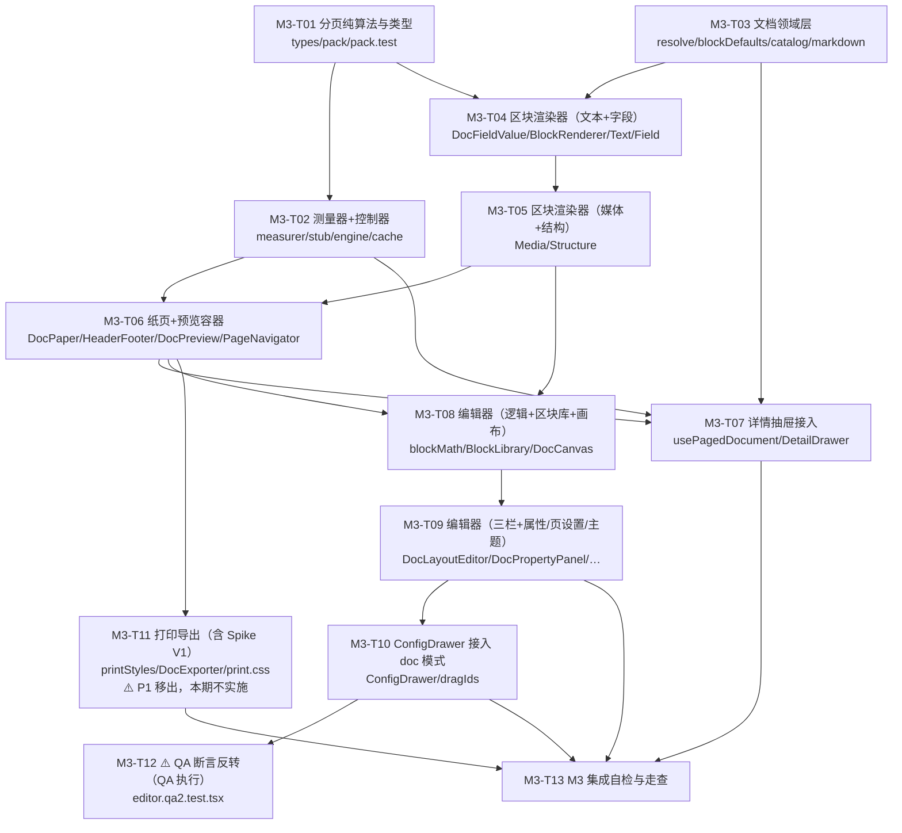

> **关键路径**：T01 → T04 → T05 → T06 → T07（详情可用）∥ T05 → T08 → T09 → T10 → T12（编辑器可用）。
> **T01 与 T03 可并行启动**（互不依赖）；T02 与 T04 可并行（T02 仅依赖 T01，T04 仅依赖 T01/T03）。
> **T11（打印）本期移出、降为 P1**（用户裁定），其边在图中保留仅表示「P1 启动时的依赖」；**不阻塞** T13。P1 启动时**必须先出 Spike V1 结论**再定默认链路。

### 21.12 M3 关键流程时序图（详情打开 → 分页 → 渲染）

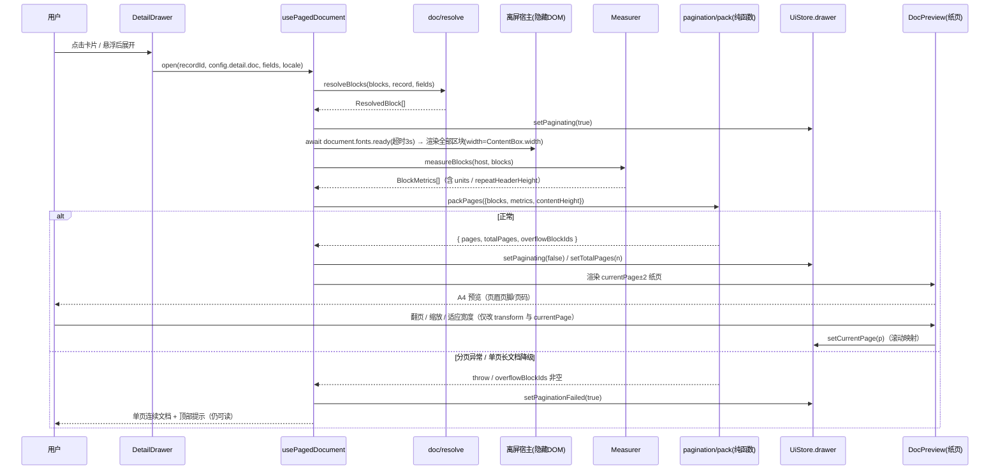

### 21.13 M3 完成判据（对齐 §17.3 P0-11~P0-15）

- [ ] **P0-11** 详情以 A4 纸页渲染，含页眉页脚与页码（`DocPaper` 通过）
- [ ] **P0-12** 区块库 **5 组 12 类**区块可拖入/排序/删除/配置（`BlockLibrary` + `blockMath` 通过）
- [ ] **P0-13** 分页正确（§17.2 十条专项用例**全过**，`pack.test.ts` 覆盖）
- [ ] **P0-14** 打印/导出与屏幕预览版式一致 —— ⚠️ **本期移出，降为 P1**（§21.7 / M3-T11），M3 不作为完成判据
- [ ] **P0-15** 抽屉宽度可调/全屏/缩放/页导航可用（回归 M2 行为不破）
- [ ] **基线不破（含工具链口径）**：**统一用 `node` 直调**（本工程 `node_modules/.bin` 缺失、`npx` 在 Windows 不可用）——
      `node node_modules/vitest/vitest.mjs run`（现基线：**32 文件 / 474 用例**，含 M3-T01/T03a 已交付；M3-T12 反转后应继续全绿）、
      `node node_modules/typescript/bin/tsc --noEmit`（EXIT=0）、
      `node node_modules/eslint/bin/eslint.js .`（EXIT=0）
- [ ] **测试断言归属**：`*.qa*.test.tsx` 仅由 QA 修改（M3-T12），工程师零改动 QA 断言

---

## 22. 字段筛选（Field Filter）实现方案与任务分解（2026-09-20 追加 · 架构师 software-architect-filter）

> **本节定位**：用户需求「增加字段筛选功能，与原表格的筛选一致」。经与用户澄清后口径为：**插件内自建筛选器**（选字段 → 选算子 → 填值，支持多层「与/或」），**结果 = 原生筛选 ∩ 插件筛选**，**算子语义对齐飞书原生筛选**，**筛选条件存入插件配置（bridge），绝不改动原表筛选设置**。这是**记录级条件筛选**，不是字段显隐。
>
> **章节号说明**：并行进行的 M3 文档排版章节已占用 **§21**；本节选用 **§22** 以避免冲突。
>
> **标注约定**（沿用 §0.3）：每条关键结论前以 **【实测】**（已在本仓源码 / SDK `dist/index.d.ts` / 既有断言中核实）或 **【推断】**（基于既有证据的推理，可能被证伪）标注。**不得把【推断】当结论使用**。
>
> **不改既有章节**：§4 / §6.4 / §9 / §14 / §16 / §17 保持原样；本节只在实现细节、接口签名、任务粒度上细化，冲突处一律登记在 §22.10，不静默覆盖。
>
> ⚠️ **需主理人协调的文件合并顺序**：本节实现需修改 `plugin/src/config/types.ts`、`plugin/src/config/defaults.ts`、`plugin/src/config/migrations.ts` 三个文件，**与并行进行的 M3 文档排版章节在这些文件上存在写冲突**（M3 亦修改 `types.ts` 的 `DividerBlock`、`ConfigDrawer.tsx` 等）。**需由主理人确定合并顺序**；建议**先落 M3、再落本节**（本节为纯新增顶层可选字段，冲突面积小）。

### 22.0 冻结口径（务必对齐，不得重新发明）

| 项 | 冻结结论 | 依据 |
|---|---|---|
| **D1 只读**（不可动摇） | 筛选**只读**：不写表格数据；**不调用** `view.setFilter/addFilterCondition/updateFilterCondition/...` 等写接口，**绝不改原表筛选设置** | §0 D1；`sdk/base.ts` 无写接口 |
| **D7 扩展** | 原 D7「对齐原生筛选（含排序）」= 仅沿用原生。本节**扩展**为：**原生筛选（服务端，`viewId` 隐式生效）∩ 插件筛选（客户端，本特性新增）**。排序仍**纯沿用原生**，本期不做插件排序 | §0 D7、§6.4 |
| **结果语义** | `结果 = 原生筛选 ∩ 插件筛选 ∩（可选）搜索关键词`，三者**叠加（AND）** | 用户澄清 |
| **算子对齐** | 插件算子标识**逐字复用** SDK `FilterOperator` 枚举值（`'is' \| 'isNot' \| 'contains' \| ...`），使「对齐原生」可审计、可守卫 | 【实测】`_sdktmp/x0411/package/dist/index.d.ts` L1487–1508 |
| **持久化** | 筛选条件随配置持久化（`cbv:config:{viewId}`）；**走既有配置模型 + 读取容错**（`types.ts` / `defaults.ts` / `migrations.ts`） | 用户澄清、§6.3 |
| **版本策略** | **不提升** `CURRENT_SCHEMA_VERSION`（保持 2）；`filter` 为**可选顶层字段**（缺省即「不筛」）。理由见 §22.2.3 | §4.5 兼容承诺 |
| **作用对象** | **默认仅对「已加载记录」求值**（UI 诚实标注覆盖范围），并提供「加载全部并重新筛选」显式入口；**未经用户显式升级，UI 不得暗示结果覆盖全量** | 见 §22.11（核心裁定） |
| **零新增依赖** | 纯 TS 纯函数 + 现有 React / zustand；**不新增第三方包** | 技术栈锁定（React 18 + TS + Webpack 5） |

#### 22.0.1 实施期裁定一览（F1/F2 交付后追加，与实现一致）

> 以下 8 条是 F1 / F2 实施过程中产生、并由主理人**裁定**的对初版 §22 的偏离 / 待明确事项收口。**文档已按裁定回改**，实现以本表为准。

| # | 偏离 | 裁定 | 落点 |
|---|---|---|---|
| 1 | 日期类算子集漏了 `isNot` | **补上**（对齐原生「不等于某天」，属遗漏而非有意排除）；日期类定为六件套 `is, isNot, isGreater, isLess, isEmpty, isNotEmpty`；`doesNotContain` 不补 | §22.3.1 |
| 2 | `evaluateCondition` 返回布尔，`false` 会把**无效条件**误当「不命中」，导致记录消失 | **数据可见性优先于筛选精确性**：引入三态 `'match' \| 'noMatch' \| 'invalid'`；`evaluateConditionState()` 为唯一真源；布尔签名**保持不变**；`evaluateFilter` 丢弃 invalid、**有效条件数为 0 → `true`（不筛选）** | §22.4.5 |
| 3 | 「类型 × 算子」校验是否一律判 `invalid` | **`isEmpty` / `isNotEmpty` 是唯一豁免，永不判 `invalid`**。判断标准：是否**依赖字段类型语义**（空值判断类型无关 → 豁免；值比较类型相关 → 必须校验） | §22.3.2 |
| 4 | §22.3 给复选框只 `is`，与 §22.9.1-③「每类型至少含空值算子」冲突 | **按 §22.3 表**：复选框算子集裁定为 `['is']`，测试中作为**唯一例外**断言 | §22.3 表、§22.9.1-③ |
| 5 | `doesNotContain` 是否含空值未定（§22.10-③ 半开放） | **含空值**（与 `isNot` 一致，§22.10-③ **已完全收敛**）。依据：对称性 / 实现自然如此 / 用户直觉 | §22.4.3、§22.10-③ |
| 6 | 无效条件被引擎丢弃后，UI 无任何提示 → 用户以为「这就是筛选结果」 | **采纳**：F4 条件行**必须**复用 `isConditionValid()` 即时校验；无效条件**行内标红 + 文案**；状态行提示「有 N 个条件未生效」 | **§22.5.6** |
| 7 | §22.10-⑨：新旧混用，旧端保存会丢 `filter` | **接受为「已知限制」，不做兼容层**（旧端无筛选 UI，属功能不可用而非静默欺骗；兼容层会引入第三套真相）。触发重评条件：旧端占比上升或出现投诉 | §22.10-⑨、**§22.10.1** |
| 8 | §22.10-⑪：`config` 三件套与 M3 的合并顺序 | **已闭环：无竞争，无需排序**。M3 未改动 config 三件套（§21.0「复用零改动」）；后续路径已分开；唯一交集 `config/types.ts` **F1 已改完**，两边后续都不再碰 | §22.10-⑪ |

> **环境事实（命令示例统一口径）**：本仓 `node_modules/.bin` 缺失，一律使用
> `node node_modules/vitest/vitest.mjs run <path>` / `node node_modules/typescript/bin/tsc --noEmit` / `node node_modules/eslint/bin/eslint.js <path>`。

### 22.1 实现方案

#### 22.1.1 关键约束与难点（先说清「为什么难」）

1. **服务端筛不了（D1 + 语义冲突）**：【实测】`ITable.getRecordsByPage(params)` 支持 `filter?: IFilterInfo`，但官方注释明确 **「当传入 filter/sort 时，该属性（`viewId`）会被忽略」**（`index.d.ts` L1694）。即**一旦把插件条件推给服务端，就会丢掉原生筛选**，违反「原生 ∩ 插件」。故**插件筛选必须在客户端做**。
2. **万行级 + 分页增量加载**：客户端只有「已加载的若干页」，插件筛选天然只能覆盖已加载集 → 结果可能不完整。这是本设计的**核心裁定点**（§22.11）。
3. **「所见即所筛」**：SDK 返回的是**原始值**（数字为 `number`、日期为**毫秒时间戳**、单选为选项名字符串、多选为字符串/对象数组…），而卡片上显示的是**格式化文本**（千分位、货币符号、`YYYY-MM-DD`）。若按显示文本比较，会出现「看起来等于却筛不到」。必须**统一经 `normalize()` 取语义值再比较**（§22.4.4）。
4. **不破坏测试基线**：现基线 `vitest run` 30 文件 / 422 用例全绿，`tsc --noEmit`、`eslint .` 均 EXIT=0。本设计**只新增纯函数与组件，不改变既有函数签名**（`selectCountLabel`、`filterRecordsByQuery` 均保留原样），把基线影响降到最低。

#### 22.1.2 插入点：**选择器层（selector layer）**

**决策：筛选求值挂在「选择器层」**（`state/selectors.ts` 调用 `filter/engine.ts` 的纯函数），**不放在数据层、也不放在 store 层**。

| 候选层 | 结论 | 理由 |
|---|---|---|
| 数据层 `data/` | ❌ | 数据层是**网络边界**（分页/缓存/游标）。客户端纯求值放这里会污染取数职责，且诱导「顺手推给服务端」（见难点 1 → 会丢原生筛选） |
| store 层 `ViewStore` | ❌ | 过滤是**纯派生**。写进 store 会与 `records` 形成「两份真相」，破坏 `total / loaded` 计数语义与虚拟滚动的数据基准 |
| **选择器层 `selectors.ts`** | ✅ | 与既有 `filterRecordsByQuery`（搜索）、`selectCountLabel` **同层同构**；纯函数、可 `useMemo`、**无浏览器 100% 单测**；`records` 保持「已加载原始集」不变，覆盖率可由 `records.length / total / hasMore` 精确推导 |

**数据流（浏览态）**：

```
SDK: table.getRecordsByPage({ viewId })        ← 服务端：原生筛选 ∩ 原生排序（D7，现有行为不变）
  │
  ▼
ViewStore.records   （已加载页集合，增量追加；RecordCache 支撑滚动加载）
  │
  ├─► [新增] applyFilterConditions(records, filter, fieldsById)   ← 插件筛选（客户端纯函数，filter/engine.ts）
  │        │
  │        └─ computeFilterScope → { loaded, matched, total, hasMore, fullCoverage } → 状态行文案
  ▼
filterRecordsByQuery(filtered, layout, fieldsById, searchQuery)   ← 搜索（现有，纯函数，二次收窄）
  │
  ▼
VirtualCardGrid（虚拟滚动）
```

**叠加关系的一句话表达**：**「原生」在服务端（`viewId` 隐式生效，插件只读不改）；「插件条件」与「搜索」在客户端顺序收窄（AND）**。三者交集即最终可见集。

#### 22.1.3 `Toolbar.tsx` 文件头注释的更新口径

现有 `Toolbar.tsx` L1-10 的口径「筛选 / 排序沿用视图原生设置……故此处不提供独立筛选器」**已被用户推翻**。更新为：

- **搜索**：仍为客户端过滤（对**已加载**记录，`selectors.filterRecordsByQuery`）。
- **筛选**：**改为插件内自建筛选器**（`FilterPanel`），对**已加载**记录做结构化条件筛选；结果 = **原生筛选 ∩ 插件筛选**；条件持久化到插件配置，**绝不写回原表**。
- **排序**：**仍沿用视图原生设置**（本期不变，面板保留原说明）。

### 22.2 数据模型与版本迁移

#### 22.2.1 类型定义（新增 `plugin/src/filter/types.ts`）

```ts
/**
 * 字段筛选数据模型（纯类型模块，零运行时依赖，可被任意层 import type）。
 *
 * ⭐ 算子标识逐字复用 SDK FilterOperator 枚举值 —— 使「语义对齐原生筛选」可审计：
 *   【实测】plugin/_sdktmp/x0411/package/dist/index.d.ts L1487-1508。
 *   任何新增算子都必须能在该枚举中找到同名字面量（由 operatorMatrix.test.ts 守卫）。
 */
export type FilterOperator =
  | 'is'             // 等于
  | 'isNot'          // 不等于
  | 'contains'       // 包含
  | 'doesNotContain' // 不包含
  | 'isEmpty'        // 为空
  | 'isNotEmpty'     // 不为空
  | 'isGreater'      // 大于 / 晚于
  | 'isGreaterEqual' // 大于或等于
  | 'isLess'         // 小于 / 早于
  | 'isLessEqual';   // 小于或等于

/** 与 SDK FilterConjunction 同构（单层，不做嵌套） */
export type FilterConjunction = 'and' | 'or';

/** 单条筛选条件 */
export interface FilterCondition {
  /** 稳定 id（UI key / 删除定位用），由 createId('flt') 生成 */
  conditionId: string;
  fieldId: string;
  operator: FilterOperator;
  /** 依算子与字段类型而定；isEmpty / isNotEmpty 无值（undefined） */
  value?: unknown;
}

/** 筛选配置（嵌入 CardViewConfig.filter） */
export interface FilterConfig {
  /** 预留开关；P0 恒 true。conditions 为空即等价「不筛」 */
  enabled: boolean;
  conjunction: FilterConjunction;
  conditions: FilterCondition[];
}
```

#### 22.2.2 嵌入既有配置结构（`config/types.ts` 增量）

```ts
// CardViewConfig 新增一个顶层字段（纯增）
export interface CardViewConfig {
  schemaVersion: number;      // = 2（不变）
  meta: ConfigMeta;
  card: CardLayoutConfig;
  detail: DetailConfig;
  theme: StyleTheme;
  density: DensityConfig;
  highlightRules: HighlightRule[];
  filter: FilterConfig;       // ⭐ 新增；缺省 = { enabled: true, conjunction: 'and', conditions: [] }
}
```

`config/defaults.ts` 增量：

```ts
/** 空筛选配置（= 不筛） */
export function defaultFilterConfig(): FilterConfig {
  return { enabled: true, conjunction: 'and', conditions: [] };
}
// createDefaultConfig() 的返回对象追加： filter: defaultFilterConfig(),
```

`config/migrations.ts` 增量（**不改迁移链**，只在 `assertCardViewConfig()` 的结构补全处补一行）：

```ts
// assertCardViewConfig() 的返回对象追加：
//   filter: sanitizeFilterConfig(raw.filter),
```

#### 22.2.3 版本迁移方案（**不升版**，理由充分）

**裁定：`CURRENT_SCHEMA_VERSION` 保持 2；`filter` 作为「可选顶层字段 + 读取容错」引入。**

| 场景 | 行为 | 依据 |
|---|---|---|
| 旧配置（v2，**无** `filter`） | `sanitizeFilterConfig(undefined)` → 默认空筛选 → 用户看到「无筛选」，**不报错、不迁移、不丢其它字段** | 兼容承诺 §4.5 |
| 新配置（v2，**有** `filter`）+ 本版插件 | 正常读取；逐条 sanitize（丢弃非法项） | — |
| 新配置 + **旧版插件**（也认 v2） | 旧版 `assertCardViewConfig` 构造的返回对象**不含** `filter` → 该字段被**丢弃**；旧版随后保存则筛选**丢失**（旧端无筛选 UI，故用户不会「看到条件再消失」，属功能不可用而非静默欺骗） | ⚠️ **已知限制（已接受，不做兼容层）**，详见 §22.10.1 |
| 若**升到 v3** 会怎样 | 旧版插件读到 v3 → `schemaVersion > CURRENT` → **`unsupportedNewer` 只读** → 旧版**完全无法保存**（比丢筛选严重得多） | `ConfigRepository.ts` L212 |

> **结论**：升版会把「旧客户端仅丢一个可选字段」放大为「旧客户端整个只读」，**代价不对等**，故**不升版**。代价是新旧混用期旧端保存会丢筛选——与任何「新增可选字段」同构，登记为待明确项。

`sanitizeFilterConfig`（新增纯函数，放 `filter/sanitize.ts`）：

```ts
export function sanitizeFilterConfig(raw: unknown): FilterConfig;
// 规则：非对象 → defaultFilterConfig()；
//       conjunction 非 'and'/'or' → 'and'；
//       conditions 非数组 → []；
//       每条：fieldId 为非空串 且 operator ∈ ALL_FILTER_OPERATORS 白名单 → 保留（补 conditionId），否则丢弃；
//       enabled 非布尔 → true。
```

### 22.3 算子矩阵（字段类型 × 算子）

**【实测】** 下列「原生可用算子」逐条取自 SDK `dist/index.d.ts` 各 `IFilter*Condition` 的 `operator` 联合类型（L517–L1559）；插件**只暴露原生支持的算子**，以保证语义一致。

图例：**✅ 完全一致** = 与原生同集合同语义；**≈ 近似** = 同算子名但取值口径不同（已注明）；**⬇ 降级** = 类型不可知或原生受限，只提供子集。

| 字段类型（`FieldType`） | 插件可用算子 | 值形态 | 对齐度 |
|---|---|---|---|
| 文本 Text(1) / 电话 Phone(13) / 链接 Url(15) / 条码 Barcode(99001) | `is` `isNot` `contains` `doesNotContain` `isEmpty` `isNotEmpty` | 字符串 | ✅ |
| 数字 Number(2) / 自动编号 AutoNumber(1005) / 货币 Currency(99003) / 评分 Rating(99004) / 进度 Progress(99002) | `is` `isNot` `isGreater` `isGreaterEqual` `isLess` `isLessEqual` `isEmpty` `isNotEmpty` | 数字 | ✅ |
| 单选 SingleSelect(3) | `is` `isNot` `contains` `doesNotContain` `isEmpty` `isNotEmpty` | 选项名 | ✅ |
| 多选 MultiSelect(4) | `is` `isNot` `contains` `doesNotContain` `isEmpty` `isNotEmpty` | 选项名（多值语义见 §22.4.3） | ✅ |
| 日期 DateTime(5) / 创建时间(1001) / 修改时间(1002) | `is` `isNot` `isGreater`(晚于) `isLess`(早于) `isEmpty` `isNotEmpty` | 日期（→ 本地 0 点时间戳） | ≈ **原生 `is` 还支持时间/相对日期（`FilterDuration`），本期仅支持「选择某一天 / 某个时间点」；`isGreater/isLess` 按原生注释「晚于/早于」；`isNot` 为裁定补充（见 §22.3.1）** |
| 复选框 Checkbox(7) | `is` | 布尔 | ✅ **（唯一例外：原生复选框仅支持 `is`，算子集为 `['is']`，不含 `isEmpty`/`isNotEmpty`）** |
| 成员 User(11) / 创建人(1003) / 修改人(1004) / 群聊 GroupChat(23) | `contains` `doesNotContain` `isEmpty` `isNotEmpty` | 成员**显示名** | ≈ **原生按其内部 id（userId）匹配；客户端只有显示名，同名成员可能误命中**（见 §22.10-⑥） |
| 附件 Attachment(17) | `isEmpty` `isNotEmpty` | —（无值） | ✅（原生也仅支持空值判断） |
| 单向关联 Link(18) / 双向关联 DuplexLink(21) / 查找引用 Lookup(19) | `contains` `doesNotContain` `isEmpty` `isNotEmpty` | 关联记录标题文本 | ≈（原生多按关联记录 id；客户端只有标题文本） |
| 地理位置 Location(22) | `contains` `doesNotContain` `isEmpty` `isNotEmpty` | 地址文本 | ≈ |
| 公式 Formula(20) | **`isEmpty` `isNotEmpty` `contains` `doesNotContain`** | 文本（保守） | ⬇ 类型不可知（取决于公式结果类型），只提供「空值 + 文本包含」子集；UI 提示「公式字段仅支持简单的空值/包含判断」 |
| 其它 / 未知类型 | `isEmpty` `isNotEmpty` | — | ⬇ |

**UI 降级规则（必须实现）**：

1. 算子下拉**只列出**上表允许的算子；切换字段时若当前算子不在新字段允许集内，**自动回落到该字段第一个可用算子**并清空值。
2. `isEmpty` / `isNotEmpty` 时**隐藏值输入框**。
3. 对 ⬇ / ≈ 行，列表项旁给出 `title` 提示（如「按显示名匹配，可能同名」「公式字段仅支持空值/包含」）。
4. 值输入控件按字段类型分派：文本类→输入框；数字类→数字输入；日期类→日期选择器；单选/多选→**选项下拉（来自 `meta.property.options[].name`）**；复选框→是/否；关联/成员/位置→文本输入；附件→无值。
5. **不可筛字段**（`unsupported` 类型）**不列入**字段下拉（从源头规避 §22.10-⑩）。

> **不引入原生不存在的算子**：由 `operatorMatrix.test.ts` 断言「所有插件算子 ∈ SDK `FilterOperator` 值集合」与「每类型算子集 = 上表」双向守卫（§22.9）。

#### 22.3.1 裁定补充：日期类补 `isNot`（对齐原生「不等于某天」）

> **偏离登记（实施期裁定，2026-09-20）**：初版 §22.3 的日期行只有 `is` `isGreater` `isLess` `isEmpty` `isNotEmpty` —— 在做「类型 × 算子」校验时，「日期 `isNot`」被判为无效条件，才暴露出**矩阵里根本没有 `isNot`**。

**裁定：补上。** 依据两层：

1. **需求口径**：用户的需求原话是「与原表格的筛选一致」。飞书原生日期筛选**存在**「不等于某天」，缺了即为不一致。
2. **性质认定**：初版在做「日期不支持原生时间粒度/相对日期」的**降级裁剪**时，把 `isNot` 一并省掉了，属**遗漏而非有意排除**——`isNot` 与 `FilterDuration`（时间粒度/相对日期）无关，不应连坐。

**现日期类算子集（适用 `DateTime` / `CreatedTime` / `ModifiedTime`）定为六件套**：

```
is, isNot, isGreater, isLess, isEmpty, isNotEmpty
```

- **`isNot` 语义**：`is` 的**朴素否定**，**含空值记录**（与 §22.4.3 的 `isNot` 口径一致，即空值满足 `isNot`）。
- **`doesNotContain` 不补**：对日期无语义意义（原生亦不支持）。
- 其余四项语义不变：`is`/`isNot` 按**本地天**比较（§22.4.4），`isGreater` = 晚于（次日 0 点及以后），`isLess` = 早于（该日 0 点之前）。

#### 22.3.2 类型 × 算子校验的**唯一豁免**：`isEmpty` / `isNotEmpty` 永不判 `invalid`

实施期引入 `isTypeOperatorMatch()` 做「字段类型 × 算子」校验，不匹配即判 `invalid`（→ 该条件被丢弃，见 §22.4.2）。但 **`isEmpty` / `isNotEmpty` 是唯一例外，`isEmpty`/`isNotEmpty` 对任何字段类型都**永不判 `invalid`**。

**豁免的判断标准（不是「矩阵有没有列出它」，而是「该算子求值是否依赖字段类型语义」）**：

| 类别 | 算子 | 是否依赖类型语义 | 类型不匹配时 | 校验结论 |
|---|---|---|---|---|
| **空值类** | `isEmpty` `isNotEmpty` | ❌ **不依赖** | 由 `normalize()` 的 `nv.isEmpty` **直接求值**，对任何类型都是同一确定答案 | **永不 `invalid`（豁免）** |
| **值比较类** | `is` `isNot` `contains` `doesNotContain` `isGreater` `isGreaterEqual` `isLess` `isLessEqual` | ✅ **依赖** | 类型不匹配会**走错语义**（日期按天 vs 数字 ±1e-9 vs 多选任一命中） | 不匹配 → `invalid` |

> 一句话：**空值判断是「类型无关」的确定答案；值比较是「类型相关」的语义分派。** 故前者豁免、后者必须校验。

### 22.4 求值引擎设计

新增 `plugin/src/filter/engine.ts`（**纯函数；仅依赖 `normalize()` 与 `getRecordFields()`；无 React / 无 DOM / 无 SDK / 无 store**）。

#### 22.4.1 签名

```ts
import type { SdkRecord } from '@/sdk/port';
import type { FieldMetaLite } from '@/fields/fieldTypes';
import type { FilterConfig, FilterCondition } from './types';

export type FieldMetaMap = Record<string, FieldMetaLite>;

/**
 * ⭐ 单条条件的**三态**求值结果（实施期引入，详见 §22.4.5）。
 *  - 'match'   ：命中
 *  - 'noMatch' ：确定不命中（参与了求值，但结果为否）
 *  - 'invalid' ：**条件无效**（未知算子 / 字段类型×算子不匹配 / 字段缺失 / 求值异常）
 *                —— **不参与**筛选判断，该条件被丢弃
 */
export type ConditionResult = 'match' | 'noMatch' | 'invalid';

/** ⭐ 三态求值的**唯一真源**（新增） */
export function evaluateConditionState(
  cond: FilterCondition,
  record: SdkRecord | null | undefined,
  metas: FieldMetaMap,
): ConditionResult;

/** 条件是否「有效」（算子合法 且 字段类型×算子匹配；不含求值结果） */
export function isConditionValid(cond: FilterCondition, metas: FieldMetaMap): boolean;

/**
 * 单条条件求值（**布尔签名与返回值保持不变**：`true` 仅当 `'match'`；
 * `'noMatch'` 与 `'invalid'` 都返回 `false`，绝不上抛）。
 *
 * ⚠️ 保留此布尔签名是为了**不破坏** F3 与 QA 按 §22.4.1 写的既有引用；
 *    但**语义差异**（'noMatch' vs 'invalid'）只能经 `evaluateConditionState()` 区分，
 *    判断「记录是否应被筛掉」时必须走 §22.4.5 的三态语义，不能只靠本函数的 `false`。
 */
export function evaluateCondition(
  cond: FilterCondition,
  record: SdkRecord | null | undefined,
  metas: FieldMetaMap,
): boolean;

/**
 * 条件组求值（单层 and/or）。
 *  - **丢弃**所有 `'invalid'` 条件（不参与 and/or 判断）；
 *  - **有效条件数为 0 时返回 `true`（= 不筛选）** —— 见 §22.4.5 裁定「数据可见性优先」；
 *  - 旧口径「空 conditions → false（不命中）」**已作废**，以本节为准。
 */
export function evaluateFilter(
  filter: FilterConfig | null | undefined,
  record: SdkRecord | null | undefined,
  metas: FieldMetaMap,
): boolean;

/**
 * 主入口：对记录数组求值。
 * **无任一条件 `isConditionValid` 时直接返回入参原引用**（= 不筛选，便于 React memo）。
 */
export function applyFilterConditions<T extends SdkRecord>(
  records: readonly T[],
  filter: FilterConfig | null | undefined,
  metas: FieldMetaMap,
): T[];

/** 覆盖率信息（供状态行文案；纯计算，无副作用） */
export interface FilterScope {
  active: boolean;     // conditions.length > 0 且 enabled
  loaded: number;
  matched: number;
  total: number;       // 原生可见总数（ViewStore.total）
  hasMore: boolean;    // 是否仍有未加载页
  fullCoverage: boolean; // 仅当 !hasMore（已加载全部）时为 true
}
export function computeFilterScope(
  filter: FilterConfig | null | undefined,
  loaded: number,
  matched: number,
  total: number,
  hasMore: boolean,
): FilterScope;
```

**纯函数化要求（硬性）**：`engine.ts` 不得 `import` 任何 `@/state/*`、`@/components/*`、`react`、SDK 值；仅允许 `import type`。这样可在 node 环境下 100% 单测（与 `highlight/ruleEngine.ts` 同构）。

#### 22.4.2 取「语义值」的唯一通道

```ts
function nvOf(record, fieldId, metas): NormalizedValue | null {
  const meta = metas[fieldId];
  if (!meta || !record) return null;
  try { return normalize(getRecordFields(record)[fieldId], meta); }
  catch { return null; }
}
```

与 `highlight/ruleEngine.ts` 的 `valueOf`、渲染层**同源**（都走 `normalize`）。**铁律**：比较一律基于 `NormalizedValue` 的语义字段（`text` / `number` / `timestamp` / `boolean` / `items` / `isEmpty`），**绝不**基于原始 `fields` 结构、原始 ID 或 JSON。

#### 22.4.3 边界值语义（逐条可断言）

| 场景 | 语义 | 说明 |
|---|---|---|
| **空值判定** | 基于 `nv.isEmpty`（`normalize` 已把 `null/undefined/''/[]/{}` 判为空） | 不自行判断原始值 |
| `isEmpty` | `nv.isEmpty === true` | |
| `isNotEmpty` | `nv.isEmpty === false` | `unsupported` 类型的 `isEmpty` 为 `false` → 会被判为「不为空」（已知取舍，见 §22.10-⑩） |
| `is`（文本类） | `!nv.isEmpty && nv.text === String(value ?? '')` | 严格相等，**区分大小写**（对齐原生；见 §22.10-②） |
| `is`（布尔/复选框） | `nv.boolean === Boolean(value)` | |
| `is`（数字类） | `numericEq(nv.number, toFiniteNumber(value))`（`±1e-9` 容差） | 不比较 `display`（千分位） |
| `is`（日期类） | **按天比较**：`sameLocalDay(nv.timestamp, Number(value))` | ⭐ 见 §22.4.4 |
| `isNot` | `eq` 的**朴素否定**：空值**满足** `isNot` | ✅ **已裁定收敛：含空值**。与 `highlight` 的 `neq` 一致；对齐原生「不等于（含空）」。若需「不等于且非空」，用两条条件 |
| `contains`（文本/电话/链接/位置） | `!nv.isEmpty && nv.text.includes(kw)` | 区分大小写 |
| `contains`（多选/成员/附件/关联） | `(nv.items ?? []).some(it => it.text.includes(kw))` | **任一项命中即命中**（原生多选「包含」语义） |
| `contains`（其他/单值） | 回落 `nv.text.includes(kw)` | |
| `doesNotContain` | `contains` 的朴素否定（**空值满足**） | ✅ **已裁定收敛：含空值**。与 `highlight.notContains` 一致 |
| ⭐ **空值在否定算子中的语义（裁定收敛）** | `isNot` 与 `doesNotContain` **均含空值** → 空值记录**命中**这两个否定算子；`is` / `contains` 则要求**非空**才可能命中 | ✅ **实施期裁定**（§22.10-③ 已收敛）。三条依据：① **对称性**——两者分别是 `is`/`contains` 的朴素否定，若 `isNot` 含而 `doesNotContain` 不含，用户在同一组条件里会得到两套相反的空值语义，无从预期；② **实现自然如此**——`!contains(nv, kw)` 对空值返回 `true`（空值确实「不包含任何关键词」），要排除空值需**主动**加 `&& !nv.isEmpty`，那是**引入**不对称而非消除；③ **用户直觉**——筛「不包含 A」，一条压根没填该字段的记录，当然算「不包含 A」 |
| `isGreater`/`isGreaterEqual`/`isLess`/`isLessEqual`（数字类） | 基于 `nv.number` 与 `toFiniteNumber(value)`；任一非有限 → `false` | |
| `isGreater`（日期类，晚于） | `nv.timestamp >= dayStart(value) + 86_400_000` | 「晚于该日」= 次日 0 点及以后 |
| `isLess`（日期类，早于） | `nv.timestamp < dayStart(value)` | 「早于该日」= 该日 0 点之前 |
| **数字与文本混排** | 数字字段值为非数字脏数据 → `normalize` → `empty` → `false`（**不假装命中**） | 诚实优先 |
| **多值 vs `is`/`isNot`** | 对多选/成员用 `is`：比较 `nv.text`（`、` 连接）——**几乎不会命中**；故 UI 对这些字段**只暴露** `contains/doesNotContain/isEmpty/isNotEmpty`（§22.3） | 从源头避免误用 |
| **单条异常 / 未知算子 / 字段类型×算子不匹配** | 三态 → **`'invalid'`**：该条件被**丢弃**（不参与 and/or），记录**保留**（不被筛掉）；布尔版 `evaluateCondition` 仍返回 `false` | ⭐ 见 §22.4.5「数据可见性优先于筛选精确性」；与 `highlight` / `registry` 的「异常不上抛」一致 |

#### 22.4.4 ⭐ 「所见即所筛」——原始值 vs 格式化值（核心）

**问题**：SDK 返回**原始值**，屏幕显示**格式化文本**。若比较错对象，会出现「看起来等于却筛不到」。

| 字段 | SDK 原始值（【实测】`normalize` 入参） | 屏幕显示（`display`） | **筛选应基于** | 若误用显示值的后果 |
|---|---|---|---|---|
| 数字 | `number`（如 `1234.5`） | `1,234.50`（千分位） | `nv.number` | 输入 `1234.5` 筛不到（display 含逗号） |
| 货币 | `number` | `¥1,234.50` | `nv.number` | 同理 |
| 日期 | `number`（**毫秒时间戳**，含时分秒） | `2024-05-01`（`YYYY-MM-DD`） | `nv.timestamp`，`is` **按天** | 输入 `2024-05-01` 筛不到（实际值 `…T09:30:00`） |
| 单选/多选 | 选项**名字符串** / 字符串数组 | 选项名（标签） | `nv.items[].text`（= 选项名） | 用 option id 会筛不到 |
| 复选框 | `boolean` | `是`/`否` | `nv.boolean` | 用 `'是'` 文本比较会筛不到 |
| 成员 | 对象数组（含 `name`/`avatarUrl`） | 成员显示名 | `nv.items[].text`（显示名） | 用 userId 会筛不到（且客户端多半拿不到） |
| 附件 | 对象数组（含 `name`/`tmpUrl`） | 文件名 | 仅空值判断 | — |

**结论（写死为约定）**：**筛选一律基于 `normalize()` 产出的语义值；日期 `is` 采用「按本地天」比较；数字按数值比较；文本类按 `text`（人可见文本，绝不落原始 ID/JSON）比较。** 这既是「所见即所筛」的实现，也顺带满足 US-5 铁律（`normalize` 保证 `text/display` 不含原始 ID/JSON）。

**日期按天比较的实现**（避免时区/时分秒误差）：

```ts
function dayStart(ts: number): number { const d = new Date(ts); d.setHours(0, 0, 0, 0); return d.getTime(); }
function sameLocalDay(a: number, b: number): boolean { return dayStart(a) === dayStart(b); }
```

> 用**本地时区**取值（用户选的是本地日期）。取舍：跨时区协作用户看到的日期可能不一致——但卡片显示也走同一本地格式化（`formatDate`），故**显示与筛选在同一时区口径下自洽**。

#### 22.4.5 ⭐ 「条件无效」三态语义（实施期裁定 · 数据可见性优先于筛选精确性）

> **偏离登记（实施期裁定，2026-09-20）**：初版 §22.4 的 `evaluateCondition` 返回布尔，未知算子 / 异常走 `default: return false`。实施中发现**这个方向是反的**。

**为什么「反了」**：`false` 的语义是「这条记录不命中 → 被筛掉」。当条件本身**无效**（未知算子、字段类型 × 算子不匹配、字段已删除、求值异常）时，用它去筛的结果是**记录被凭空消失**——用户看到空白视图或记录减少，且**无从察觉原因**。这比「筛选没生效」严重得多，且属于**不可逆的体验欺骗**（用户会误以为"确实没有符合条件的记录"）。

**裁定：**

> **数据可见性优先于筛选精确性 —— 宁可筛选不生效，也不能让记录消失。**

**实现落点（已交付）**：

| 元素 | 语义 |
|---|---|
| `ConditionResult = 'match' \| 'noMatch' \| 'invalid'` | 三态：命中 / 确定不命中 / **条件无效** |
| `evaluateConditionState()` | 三态求值的**唯一真源** |
| `evaluateCondition()` | **布尔签名与返回值保持不变**（`true` 仅当 `'match'`；`'noMatch'` 与 `'invalid'` 均返回 `false`）。保留旧签名是为了不破坏 F3 与 QA 按 §22.4.1 写的既有引用 |
| `isConditionValid()` | 判断条件是否「有效」：算子合法 **且** 字段类型 × 算子匹配（见 §22.3.2 的 `isEmpty`/`isNotEmpty` 豁免） |
| `evaluateFilter()` | **丢弃**所有 `'invalid'` 条件；**有效条件数为 0 时返回 `true`（= 不筛选）** |
| `applyFilterConditions()` | 无任一条件 `isConditionValid` 时**直接返回入参原引用**（= 不筛选） |

**求值表（`evaluateFilter` / `applyFilterConditions` 视角）**：

| 有效条件数 | 行为 | 用户看到 |
|---|---|---|
| 0（全部 invalid 或本就为空） | **不筛选**（`evaluateFilter` → `true`） | 全部已加载记录（等价于无筛选） |
| ≥1 | 仅按**有效**条件做 and/or 求值 | 正常收窄 |
| 部分 invalid | 丢弃 invalid，仅按有效条件求值 | 正常收窄（**不**因部分条件无效而清空） |

> **与 §22.4.3 的关系**：§22.4.3 的「单条异常 → `false`」现按三态细分——**异常/无效 → `'invalid'`（该条件被丢弃，记录**保留**）**，而**确定不命中 → `'noMatch'`（记录被筛掉）**。二者在布尔版 `evaluateCondition()` 里都返回 `false`，**区分必须走 `evaluateConditionState()`**。
>
> **测试注意**：写「条件无效」相关断言时，**必须**用 `evaluateConditionState()` 断言 `'invalid'`，或断言 `applyFilterConditions` **保留**了记录；若只用布尔版断言 `false`，会与 `'noMatch'` 混淆，属于**无法证伪的假绿断言**（见 §22.9.3）。

### 22.5 UI 设计

#### 22.5.1 工具栏接入

`Toolbar.tsx` 现有 `panel: 'filter' | 'sort' | null` 状态机**保留**；改动：

- `panel === 'filter'` 时渲染 **`<FilterPanel />`**（替换原纯文案 note 面板）。
- `panel === 'sort'` 时**保留**原「排序沿用原生」说明面板。
- 「筛选」按钮增加**筛选态视觉标识（条件数）**：
  - `className`：无条件 `cbv-btn`；有条件 `cbv-btn cbv-btn--active`。
  - 文案：`筛选` → 有条件时 `筛选 (2)`。
  - a11y：`aria-label={active ? \`筛选（已启用 ${n} 个条件）\` : '筛选'}`，`aria-expanded`。
  - `data-testid="toolbar-filter"`。
- **最小改动**：沿用 Toolbar 内部 `panel` state，**不新增** `UiStore.filterPanelOpen`（减少与 M3 在 UiStore 上的争用）。

#### 22.5.2 `FilterPanel` 结构

```
┌─ 筛选 ─────────────────────────────────────────────┐
│ 条件 1: [字段 ▾][算子 ▾][值 ______]           [✕] │
│ 条件 2: [字段 ▾][算子 ▾][值 ______]           [✕] │
│ [+ 添加条件]                    [与 ▾ / 或 ▾]      │   ← 「与/或」在条件 ≥2 时出现
├───────────────────────────────────────────────────┤
│ ⓘ 已在已加载的 200 / 共 12,480 条中筛选，命中 37 条 │   ← 覆盖范围（诚实）★
│ [加载全部并重新筛选]                                │   ← 仅 active && hasMore 时显示
├───────────────────────────────────────────────────┤
│ [清空]                                     [应用] │
└───────────────────────────────────────────────────┘
```

- **字段下拉**：按 `FieldType` 分组，显示类型中文名（复用 `getFieldTypeLabel`）；不可筛类型不列入。
- **算子下拉**：来自 §22.3 矩阵，中文标签（等于/不等于/包含/不包含/为空/不为空/大于/大于或等于/小于/小于或等于；日期显示「晚于/早于」）。
- **值输入**：按字段类型/算子分派（§22.3 UI 降级规则 4）。
- **与/或**：分段控件，写回 `filter.conjunction`。
- **清空**：`clearFilter()`。
- **应用**：**确认并收起面板**（本设计采用「**即时生效 + 防抖持久化**」；`应用` 语义为「确认并收起」，见 §22.5.4 与 §22.10-⑤）。
- **★ 覆盖范围状态行**：见 §22.11，是本特性「不假绿」的关键 UI 约束。

#### 22.5.3 筛选态与视觉标识

| 位置 | 标识 |
|---|---|
| 工具栏「筛选」按钮 | `cbv-btn--active` + `筛选 (n)` |
| 工具栏记录数（`countLabel`） | 有筛选且已加载全部：`共 12,480 条（已筛选 37 条）`；有筛选且**未**加载全部：`共 12,480 条（已在已加载 200 条中筛选，命中 37 条）` —— 由新选择器生成（§22.5.5） |
| 筛选面板状态行 | 常驻覆盖范围文案（同上口径） |
| 空结果（筛选后 0 命中） | 复用 `EmptyState`，新增一种 kind（`filterEmpty`）：「没有符合筛选条件的记录」+「清空筛选」动作 |

#### 22.5.4 与「搜索」框的关系：**叠加（AND），不合并**

**裁定：筛选与搜索**并存叠加**（先插件筛选，再搜索收窄），**不合并为一个控件**。理由：① 语义不同（结构化条件 vs 模糊关键词）；② 搜索是「临时找一下」的低成本入口，合并会抬高使用门槛；③ 二者已是独立纯函数，叠加即 `records → applyFilterConditions → filterRecordsByQuery`，零额外成本。`countLabel` 同时体现两者（`hasFilter || hasSearch` → 过滤态）。

**持久化时机**：筛选**即时生效**（写入 `UiStore.filter`），并**防抖 ≈500ms** 调用 `persistConfig({ ...config, filter })`；**仅当** `canEditConfig === true && unsupportedNewer === false` 时才持久化（只读/无权限用户仍可运行时使用，§22.10-⑦）。

#### 22.5.5 计数文案选择器（新增，**不改** `selectCountLabel`）

为**不破坏现有测试**（【实测】`selectCountLabel` 在 `layout.fix.test.tsx` 有 4 条断言），**保留 `selectCountLabel` 原样**，新增：

```ts
export interface FilterScopeLabelInput {
  total: number; loaded: number; matched: number;
  hasFilter: boolean; hasSearch: boolean; hasMore: boolean;
}
export function selectFilterScopeLabel(input: FilterScopeLabelInput): string;
```

文案规则（**禁止假绿**）：

- 无筛选无搜索：沿用 `共 N 条` / `已加载 N 条` / `共 0 条`。
- 有筛选且 **`!hasMore`（已加载全部）**：`共 N 条（已筛选 M 条）` —— **此时可称全量**。
- 有筛选且 **`hasMore`（未加载全部）**：**必须**含「已加载」字样，如 `共 N 条 · 已在已加载的 L 条中筛选，命中 M 条`。**严禁**输出单独出现的 `共 M 条` 这类暗示全量的文案（由 QA 断言守卫，§22.9.4）。

#### 22.5.6 ⭐ 无效条件必须在 UI 上显式告知（F4 强制项）

> **裁定（实施期追加，2026-09-20）**：F4 的条件行**必须**复用 `isConditionValid()` 做即时校验，并给出明确视觉标识。

**为什么这不是「体验优化」而是硬要求**

无效条件会被 `evaluateFilter` **丢弃**（§22.4.5），此时用户看到的是**全部记录**。若 UI 不给任何提示，用户会以为「这就是筛选结果」。

这与 §22.11.4 的另一条底线——**「任何情况下 UI 不得暗示结果已覆盖全量」**——是**同一类问题**：都是让用户对结果的**覆盖范围/生效范围**产生错误认知。

| 底线 | 防止的错误认知 | 兜底手段 |
|---|---|---|
| §22.11.4 | **谎报筛过了全量**（其实只筛了已加载的部分） | 覆盖率状态行常驻 + 「加载全部」CTA |
| **本节** | **谎报筛选生效了**（其实条件无效、被丢弃） | 条件行即时校验标识 + 状态行提示「有 N 个条件未生效」 |

> 两者都**不能只靠引擎语义正确**来兜住——引擎的 fail-safe（不筛掉记录）反而会放大用户的错误认知。故**必须由 UI 显式告知**。

**实现要求（F4 验收项）**

1. **条件行即时校验**：`FilterConditionRow` 渲染时对当前条件调用 `isConditionValid(cond, metas)`（§22.4.1），**不得**自行再写一套校验。
2. **明确视觉标识**（**不得静默忽略**）：无效条件行**行内标红**（如 `.cbv-filter-row--invalid`）+ 文案说明（如「该条件不会生效：所选算子不适用于此字段类型」）。建议附 `title` 与 `aria-invalid="true"`。
3. **与覆盖率状态行的关系**：存在无效条件时，状态行**必须**额外提示「有 N 个条件未生效」——**不能只显示匹配数**。建议文案：`已在已加载的 200 / 共 12,480 条中筛选，命中 37 条（其中 1 个条件未生效）`。
4. **空值算子的豁免在 UI 同样适用**：`isEmpty` / `isNotEmpty` 永不判无效（§22.3.2），不得在 UI 上标红。

**测试要求（判定标准同 §22.9.3：断言必须能证伪）**

```ts
// ✅ 有效条件不标红：能证伪「一律标红」的实现
expect(renderRow(validCond).container.querySelector('.cbv-filter-row--invalid')).toBeNull();
// ✅ 无效条件标红 + 有说明文案：能证伪「完全不校验 / 只标红无文案」的实现
expect(renderRow(invalidCond).container.querySelector('.cbv-filter-row--invalid')).not.toBeNull();
expect(screen.getByText(/不会生效/)).toBeTruthy();
// ✅ 状态行：存在无效条件时必须提示「未生效」数量，且**同时**仍显示匹配数
expect(scopeText).toContain('1 个条件未生效');
expect(scopeText).toContain('命中 37 条');
// ✅ 空值算子豁免：isEmpty 对任意类型都不得被判无效（能证伪「按矩阵硬校验」的实现）
expect(isConditionValid({ operator: 'isEmpty', fieldId: anyFieldId }, metas)).toBe(true);
// ❌ 假绿：只断言「渲染不报错」/「组件存在」——任何实现都通过
expect(screen.getByTestId('filter-panel')).toBeTruthy();
```

> ⚠️ 上述断言**属 QA 权属**（§22.9.4），工程师不得自行编写/修改 `*.qa*.test.tsx` 中的断言。

### 22.6 文件清单

> 路径相对 `plugin/src/`；「≈行数」为预估值（含必要注释，不含测试）。

**A. 领域层（`filter/`）— 新增**

| 文件 | 职责 | ≈行数 |
|---|---|---|
| `filter/types.ts` (N) | `FilterOperator` / `FilterConjunction` / `FilterCondition` / `FilterConfig`，**纯类型** | 60 |
| `filter/operatorMatrix.ts` (N) | 字段类型→可用算子矩阵、算子中文标签、值输入形态、`ALL_FILTER_OPERATORS` 常量集 | 130 |
| `filter/engine.ts` (N) | ⭐ 纯函数求值引擎：`evaluateCondition` / `evaluateFilter` / `applyFilterConditions` / `computeFilterScope` | 170 |
| `filter/sanitize.ts` (N) | `sanitizeFilterConfig()` / `defaultFilterConfig()`（配置读写容错） | 80 |

**B. 组件层（`components/filter/`）— 新增**

| 文件 | 职责 | ≈行数 |
|---|---|---|
| `components/filter/FilterPanel.tsx` (N) | 面板容器：条件列表 + 增删 + 与或切换 + 清空/应用 + **覆盖范围状态行** + 「加载全部并重新筛选」 | 220 |
| `components/filter/FilterConditionRow.tsx` (N) | 单条件行：字段/算子/值 + 删除 | 180 |
| `components/filter/FilterValueInput.tsx` (N) | 按字段类型与算子渲染值输入（文本/数字/日期/选项/布尔/无） | 160 |

**C. 修改既有文件（M）**

| 文件 | 改动 | 风险 / 冲突 |
|---|---|---|
| `config/types.ts` (M) | `CardViewConfig` 增 `filter: FilterConfig`；`import type` 引 `filter/types` | ⚠️ **与 M3 冲突**（M3 亦改本文件 `DividerBlock`） |
| `config/defaults.ts` (M) | `defaultFilterConfig()`；`createDefaultConfig` 纳入 | ⚠️ **与 M3 冲突**（同文件） |
| `config/migrations.ts` (M) | `assertCardViewConfig` 补 `filter: sanitizeFilterConfig(raw.filter)` | ⚠️ **与 M3 冲突**（同文件） |
| `state/UiStore.ts` (M) | 新增 `filter: FilterConfig`、`setFilter(f)`、`clearFilter()`、`filterTouched`（是否被本地编辑，供远端同步判定） | 低（纯增；M3 亦改本文件 drawer 分支，**可能同文件冲突，需协调**） |
| `state/selectors.ts` (M) | 新增 `selectFilterScope`（薄封装）+ `selectFilterScopeLabel`；**保留** `selectCountLabel` / `filterRecordsByQuery` 原样 | 低（纯增） |
| `components/layout/ViewShell.tsx` (M) | 组合 `applyFilterConditions` → `filterRecordsByQuery` → grid；改用新 countLabel；新增筛选空态；初始化同步 `UiStore.filter ← config.filter` | 中（现有搜索链路需回归） |
| `components/layout/Toolbar.tsx` (M) | `panel==='filter'` 渲染 `<FilterPanel/>`；筛选按钮徽标/aria；**更新文件头注释**（§22.1.3） | 中（**可能触发 QA 断言反转**，见下） |
| `hooks/useCardViewInit.ts` (M) | `applyInit` 成功后 `useUiStore.getState().setFilter(resolved.config.filter)`（一次性装载） | 低 |
| `styles/globals.css` (M) | `.cbv-filter-*` 样式（复用现有 token） | 低（纯增） |

> **估计总量**：新增约 **7 文件 / ~1,000 行**；修改 9 文件（其中 3 个与 M3 冲突）。
>
> **⚠️ 测试断言反转提示**：`Toolbar.tsx` 由「纯文案说明面板」改为「可操作筛选面板」——【实测】现有 `layout.fix.test.tsx` 仅断言「筛选」按钮存在（L153），**未**断言说明面板文案，故**预计无需反转**；但**若 QA 在其它用例中断言了说明面板文案，须由 QA 同步反转**（工程师**不得自行修改 QA 断言**）。

### 22.7 任务列表（有序 · 小步 · 依赖清晰）

> 粒度原则：**单任务 ≤ 5 文件**；每一步**可独立交付、可独立验证**（避免「一次太大被中途打断而误报完成」，见 §0.2.1 教训）。

| ID | 任务名 | 涉及文件 | 依赖 | 完成判据 |
|---|---|---|---|---|
| **F1** | 筛选数据模型与配置容错 | `filter/types.ts` `filter/sanitize.ts` `config/types.ts` `config/defaults.ts` `config/migrations.ts` | — | `tsc --noEmit` EXIT=0；旧配置（无 `filter`）读取不报错且 `filter` 为默认空筛选；`sanitizeFilterConfig` 单测（含未知算子丢弃）全绿 |
| **F2** | 算子矩阵与求值引擎（纯函数） | `filter/operatorMatrix.ts` `filter/engine.ts`（+ `engine.test.ts` `operatorMatrix.test.ts`） | F1 | 引擎**无浏览器**单测全绿；覆盖 §22.4.3 全部边界；矩阵断言「算子 ⊆ SDK 枚举」通过 |
| **F3** | 运行时状态与数据流接线 | `state/UiStore.ts` `state/selectors.ts` `components/layout/ViewShell.tsx` `hooks/useCardViewInit.ts` | F1, F2 | 设置 `UiStore.filter` 后卡片墙即时收窄；`countLabel` 按 §22.5.5 显示；刷新/重进后由 config 恢复筛选；**搜索链路回归不破** |
| **F4** | 筛选面板组件 | `components/filter/FilterPanel.tsx` `FilterConditionRow.tsx` `FilterValueInput.tsx` | F2, F3 | 可增删条件、切换与/或、按字段类型渲染值控件、`isEmpty` 隐藏值、清空/应用回调正确 |
| **F5** | 工具栏接入 · 样式 · 覆盖率入口 | `components/layout/Toolbar.tsx` `styles/globals.css` | F4 | 「筛选」按钮徽标/aria 正确；面板可开合；**「加载全部并重新筛选」**入口可用（复用 `ViewStore.loadMore`）；样式符合 §22.8；**Toolbar 相关 QA 断言已复核/反转** |

> **可选 F6（P1，非阻塞）**：`filter/*` 性能与埋点（万行本地过滤耗时上报）——**本期可不做**。

### 22.8 共享约定

- **命名**：类型 `FilterConfig` / `FilterCondition` / `FilterOperator` / `FilterConjunction`；运行时动作 `setFilter` / `clearFilter`；选择器 `selectFilterScope` / `selectFilterScopeLabel`；引擎 `evaluateCondition` / `evaluateFilter` / `applyFilterConditions` / `computeFilterScope`。
- **`conditionId` 生成**：复用 `config/defaults.ts` 的 `createId('flt')`（**不新建** id 工具）。
- **CSS 类名前缀**：`cbv-filter-*`（如 `.cbv-filter-panel` / `.cbv-filter-row` / `.cbv-filter-row__field` / `.cbv-filter-scope`）；复用既有 CSS 变量（`--space-*` / `--color-*` / `--radius-control` / `--font-size-*`）；**不新增**硬编码色值。
- **`data-testid` 约定**：`toolbar-filter` / `filter-panel` / `filter-add-condition` / `filter-conjunction` / `filter-clear` / `filter-apply` / `filter-scope` / `filter-load-all` / `filter-row-{index}`。
- **常量位置**：算子矩阵与 `ALL_FILTER_OPERATORS` 放 `filter/operatorMatrix.ts`；纯类型放 `filter/types.ts`；**不放入 `constants/index.ts`**（避免与 M3 争用该文件）。
- **不可变更新**：所有 filter 变更返回**新对象**（`{ ...filter, conditions: [...] }`），与 zustand / React 一致。

### 22.9 测试策略

#### 22.9.1 必修单元测试（纯函数，无浏览器）——**工程师编写，QA 独立复核**

| 目标 | 必测点 |
|---|---|
| `engine.evaluateCondition` | 每类字段 × 每个可用算子的**命中/不命中**用例；空值/空串/`isEmpty`/`isNotEmpty`/`doesNotContain` 对空；多选「任一命中」；日期「同日不同时分命中 / 次日不命中 / 早于、晚于边界（次日 0 点）」；数字与文本混排（脏数据不命中）；布尔 `is`；数字 `±1e-9` 容差 |
| `engine.evaluateFilter` | `and` / `or` 单层组合；空 `conditions` → `false`；单条异常不影响整体 |
| `engine.applyFilterConditions` | 无条件**返回原引用**（`toBe`）；有条件返回新数组且**命中保留 + 未命中排除**（双向断言） |
| `computeFilterScope` | `hasMore=true` → `fullCoverage=false`；`hasMore=false` → `true`；未筛 → `active=false` |
| `operatorMatrix` | ① 每个 `FieldType` 的算子集**等于** §22.3 表；② 所有算子 ∈ SDK `FilterOperator` 值集合；③ 每类型至少含 `isEmpty`/`isNotEmpty` —— **复选框 `Checkbox` 为唯一例外**（算子集裁定为 `['is']`，**不含**空值算子；测试须断言 `['is']`）。**裁定依据**：初版此处与 §22.3 表自相矛盾，现统一按 §22.3 表实施（原生复选框也只支持 `is`） |
| `sanitizeFilterConfig` | 旧配置无 `filter`；未知算子丢弃；`conditions` 非数组 → `[]`；`fieldId` 空 → 丢弃；`enabled` 非布尔 → `true` |

#### 22.9.2 组件测试（React Testing Library）——**QA 编写/拥有**

- `FilterPanel`：添加条件、删除条件、「与/或」切换、清空、应用回调；`isEmpty` 时值输入消失；切换字段时算子回落。
- `Toolbar`：筛选按钮徽标与 `aria-label`；点击开合面板。
- `ViewShell`：筛选后 `countLabel` 文案；筛选 0 命中 → `filterEmpty` 空态。

#### 22.9.3 「能证伪」的断言（**反例：什么算假绿**）

> 本项目已多次因「假绿断言」返工（见 §0.2.1）。以下断言**看起来在测、实则任何实现都通过**，**禁止使用**：

```ts
// ❌ 假绿 1：恒真（identity 实现也通过）
expect(applyFilterConditions(records, filter, metas).length).toBeLessThanOrEqual(records.length);
// ❌ 假绿 2：只断言类型/存在
expect(Array.isArray(applyFilterConditions(records, filter, metas))).toBe(true);
// ❌ 假绿 3：只断言「命中项在结果里」，不断言「未命中项被排除」
expect(ids(applyFilterConditions(records, filter, metas))).toContain('A');
//    —— 若实现返回全部记录，此断言仍通过（未命中项 B 未被检验）
// ❌ 假绿 4：对「按天」筛选只断言「有结果」，不构造「同日不同时分」的对照组
expect(applyFilterConditions([rec], dayEqFilter, metas)).toHaveLength(1);
```

**正确（能证伪）的断言模式**：

```ts
// ✅ 同时验证「命中保留 + 未命中排除」：必须构造 A（命中）与 B（不命中）
expect(ids(applyFilterConditions([recA, recB], filter, metas))).toEqual(['A']);
// ✅ 对照：把 B 改成也满足条件，结果必须变成 ['A','B']（证明实现真的在「评价」而非「放行」）
expect(ids(applyFilterConditions([recA, recB2], filter, metas))).toEqual(['A', 'B']);
// ✅ 日期「所见即所筛」：recC.timestamp = 2024-05-01T09:30，filter.value = 2024-05-01(0 点)
//    期望命中 —— 能证伪「直接用 timestamp 严格相等」的错误实现
expect(ids(applyFilterConditions([recC], dayEqFilter, metas))).toEqual(['C']);
// ✅ 日期边界：recD = 2024-05-02T00:00，isLess(2024-05-02) 必须为 false
expect(evaluateCondition({ operator: 'isLess', value: day('2024-05-02') }, recD, metas)).toBe(false);
// ✅ 无条件必须返回原引用（防止无谓重渲染）
expect(applyFilterConditions(records, emptyFilter, metas)).toBe(records);
```

#### 22.9.4 必须由 QA 独立拥有、**工程师不得自行修改**的断言（「不假绿」守卫）

以下断言**强制**覆盖，且属 QA 权属（工程师改动即违规）：

1. **覆盖率不误导**：构造 `total=12480, loaded=200, hasMore=true` 且筛选命中 37 → 断言文案语义为「已在已加载的 200 条中筛选」，且**断言输出字符串不含单独出现的「共 37 条」**（即不得暗示全量命中 37）。
2. **已加载全部时才可称全量**：`hasMore=false` → 断言文案含「已筛选」且**不含**「已加载」限定词。
3. **`applyFilterConditions` 的排除性**：命中项在、未命中项**不在**（双向）。
4. **日期按天**：同日不同时分命中。
5. **面板可操作**：能真实增删条件并触发 `setFilter`（非只渲染）。

> ⚠️ **纪律**：测试断言归属 QA；工程师若因实现需要改动既有断言，**必须先上报主理人**（见 §0.2.1「验证者横向通气」教训——结论/断言正确性的改动一律先经主理人）。

### 22.10 待明确事项（需主理人 / 用户拍板）

| # | 事项 | 建议 | 影响 |
|---|---|---|---|
| ① | **「已加载 vs 全量」路线**（§22.11） | **推荐 Plan A（P0）+ 显式「加载全部」（P1）**；Plan B 服务端下推为 P2（需 Spike） | 决定本特性整体形态 |
| ② | `contains` 是否**区分大小写** | 建议**区分**（对齐原生） | 命中面 |
| ③ | `isNot` / `doesNotContain` 是否**包含空值** | ✅ **已收敛（实施期裁定）：两者均含空值**。依据：① 对称性（同为朴素否定，不能有两套相反语义）；② 实现自然如此（`!contains()` 对空值即 `true`，排除空值需主动引入不对称）；③ 用户直觉（没填该字段当然算「不包含 A」） | 边界（已定稿，见 §22.4.3） |
| ④ | 日期 `is` 的粒度 | 建议**按天**（本期不做时间/相对日期 `FilterDuration`） | 「所见即所筛」关键 |
| ⑤ | 筛选**生效时机** | 建议**即时生效 + 防抖持久化（≈500ms）**；「应用」= 确认并收起 | 交互与写入频度 |
| ⑥ | 成员字段按**显示名**匹配是否可接受 | 若不可接受 → 该字段**仅提供** `isEmpty/isNotEmpty` | 对齐度 |
| ⑦ | 只读 / 无权限用户能否**运行时使用**筛选 | 建议**可用但不持久化**（筛选是只读视图操作，与 D1 不冲突） | 体验 |
| ⑧ | 远端配置变更（`onDataChange`）时 filter 的**同步策略** | 建议：面板关闭且**本地未编辑过**（`filterTouched=false`）时随 config 覆盖；否则保留本地 | 多人协作 |
| ⑨ | **新旧版本混用**：旧版插件保存会**丢 `filter`** | ✅ **已收敛（裁定）：接受，作为「已知限制」记录，不做兼容层**。理由：这是「不升 `schemaVersion`」的**既定代价**——§22.2.3 已论证升 v3 会让旧端读到 `unsupportedNewer` 从而**整体只读**，代价比「丢一个可选字段」大得多；既然选了不升版就接受该后果。两点补充说明见 §22.10.1 | 数据（已知限制·已接受） |
| ⑩ | `unsupported` 类型（未知字段）会被判「不为空」 | 建议：`unsupported` 类型**不列入可筛字段**（UI 直接排除），从源头规避 | 边界 |
| ⑪ | **合并顺序**：`config/types.ts` / `defaults.ts` / `migrations.ts` 与 M3 冲突 | ✅ **已闭环（裁定）：无竞争，无需排序**。【实测】M3 文档排版 **未改动** config 三件套——架构师 software-architect-2 在 §21.0 明确写为「复用零改动」；F1 改这三个文件时**无竞争**。后续路径也已分开：M3 剩 T06~T10 改 `components/doc/` · `detail/` · `editor/`，筛选 F3~F5 改 `state/` · `components/layout/` · `components/filter/`。唯一历史交集是 `config/types.ts`（**F1 已改完**；中途被并行覆盖过一次、已补回），**后续两边都不再碰它** | 工程（已闭环） |

#### 22.10.1 已知限制：新旧版本混用会丢 `filter`（已接受）

> **裁定**：接受，作为**已知限制**记录；**不为它做兼容层**。

**为什么可以接受（两点）**：

1. **不存在静默欺骗**：旧端**根本没有筛选 UI**，因此用户不会遇到「在旧端看到筛选条件 → 保存后条件消失」的情形；旧端的表现是**功能不可用**，而非**功能看起来可用但数据被吞掉**。这与 §22.11（不得暗示覆盖全量）、§22.5.6（不得暗示筛选生效）两条底线**不冲突**——那两条防的是「让用户误以为生效/完整」，本限制只是「旧端没有这个功能」。
2. **不引入第三套真相**：若现在为它做兼容层（如把 filter 另存到独立 bridge key `cbv:filter:{viewId}`），就会在「配置 envelope」与「独立 key」之外再引入一份筛选状态，且要自行处理版本、校验和、降级与跨账号同步——**等于把 §6.3 已解决的复杂度重新引入一遍**。

**触发重新评估的条件**：将来**旧端占比上升**或**出现用户投诉**时，再评估升版方案（届时须重新权衡 §22.2.3 的「旧端整体只读」代价）。**当前不做**。

### 22.11 ⭐ 核心裁定：「已加载」vs「全量」

#### 22.11.1 问题

数据**万行级 + 分页增量加载**，D1 只读又**不让服务端帮我们筛**（难点 1）。用户设了条件后，若只筛「已加载的 200 条」，就**可能漏掉未加载页中的命中项**——这是**体验上的欺骗**（团队明令禁止的「假绿」）。

#### 22.11.2 三条路径的量化对比（万行 = 10,000 行；页大小上限 200）

| 路径 | 机制 | **请求数** | **首屏延迟** | **结果准确性** | 结论 |
|---|---|---|---|---|---|
| **A 仅已加载** | 纯客户端过滤 `ViewStore.records` | **0 额外** | **≈0**（内存 O(n)，n≈200–2000，<5ms） | **不完整**（仅覆盖已加载子集） | ✅ **P0 基线**（诚实标注） |
| **B1 全量翻页后筛** | `getRecordsByPage({viewId})` 翻完所有页 → 客户端筛 | **ceil(10000/200) = 50 次** | **顺序 ~10–30s**（50 × ~200–600ms；受频控与 `timeout` 风险，本项目历史多次 `timeout`） | **完整** | ⚠️ 仅作**用户显式触发**的一键升级（= P1） |
| **B2 全量命中 ID + 逐条取值** | `view.getVisibleRecordIdList(filter)` 拿全部命中 ID → 逐条 `getRecordById` | 1 + **最多 10,000 次** | 极慢 / 大概率超时 | 完整 | ❌ **不可行**（**无「按 ID 批量取值」接口**；【实测】`getRecords` 仅支持分页/筛选，非 ids 列表） |
| **B3 服务端下推（读原生条件合并）** | 读 `view.getFilterInfo()` + 合并我方条件 → `getRecordsByPage({filter})` | 1 + ceil(命中/200) | 首屏 ≈1 次请求 | 名义完整 | ❌ **高风险，P2 且需 Spike**：① `IFilterInfo` 为**单层 conjunction**，原生 OR 与我方 AND 合并需**笛卡尔展开**（条件多则爆炸）；② `getFilterInfo()` / `filter` 入参在新 SDK（**alpha**）上**未在本宿主验证**（【推断】），历史多次因把未验证 SDK 能力写死而返工；③ 用户会话中改原生筛选会与缓存不一致 |

#### 22.11.3 推荐：**Plan A（P0）作为默认 + 「加载全部并重新筛选」作为显式升级（P1，= Plan C-lite）**

- **P0（默认，必做）**：筛选**只作用于已加载记录**；**但 UI 必须如实告知覆盖范围**——
  1. 面板状态行**常驻**：`已在已加载的 L / 共 N 条中筛选，命中 M 条`；
  2. `hasMore === true` 时**常驻**「未加载全部」提示 + **「加载全部并重新筛选」**按钮；
  3. `countLabel` 在 `hasMore` 时**必须**含「已加载」限定词，**严禁**输出暗示全量的 `共 M 条`（§22.5.5，QA 断言守卫）。
- **P1（一键升级，建议同批交付）**：「加载全部并重新筛选」→ **复用现有 `ViewStore.loadMore()` 循环**翻完所有页（去重、游标、并发抑制、超时保护均已存在），期间显示进度 `已加载 3,200 / 12,480`；完成后重算并显示 `共 N 条（已筛选 M 条）`（此时 `hasMore=false`，可称全量）。**该路径零新增 SDK 面、引擎纯函数不变、可单测**。
- **P2（默认不做，需 Spike 立项）**：Plan B3 服务端下推——**仅当**用户明确要求「万行下秒级全量筛选」**且** Spike 证明 `view.getFilterInfo()` 与 `getRecordsByPage({filter})` 在本宿主可用、且合并策略与上限可行时，再评估。

#### 22.11.4 不可妥协的保证（呼应团队禁令）

> **任何情况下，UI 都不得让用户误以为结果已覆盖全量。** 实现方式（三条冗余保险）：
> 1. **状态行常驻**覆盖范围口径（不只显示命中数）；
> 2. **`hasMore` 为真** → 常驻「未加载全部」+ 升级 CTA；
> 3. **文案准入**：只有「已加载全部」（`!hasMore`）或用户已执行升级后，才允许出现可被解读为「全量结果」的措辞；由 **QA 断言**（§22.9.4-①②）守卫，构造 `total ≫ loaded` 场景**证伪**「谎报全量」。

#### 22.11.5 为何不选 B

B 看似「更正确」，实为**用极高成本与风险换取「完整」**：B2 物理不可行（无批量取值接口）；B3 依赖**未验证的 alpha SDK 面 + 有损的平面合并**，与 §0.3 的惨痛教训（把未验证的 SDK 行为写死导致返工）直接冲突。**Plan A + 显式升级**以**极小成本**同时满足「诚实」与「大多数场景够用」（首屏 200 条即命中，用户按需一键补全）。

### 22.12 关键流程时序图

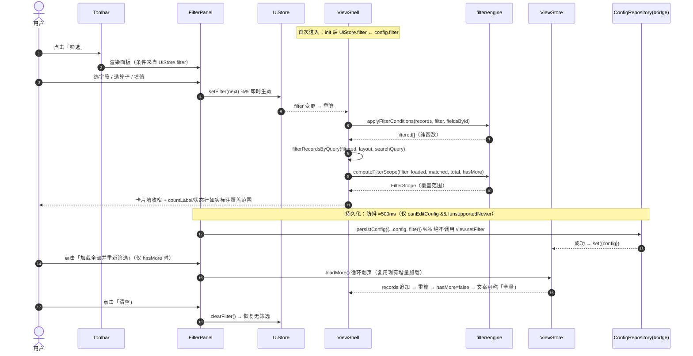

### 22.13 类图（筛选域）

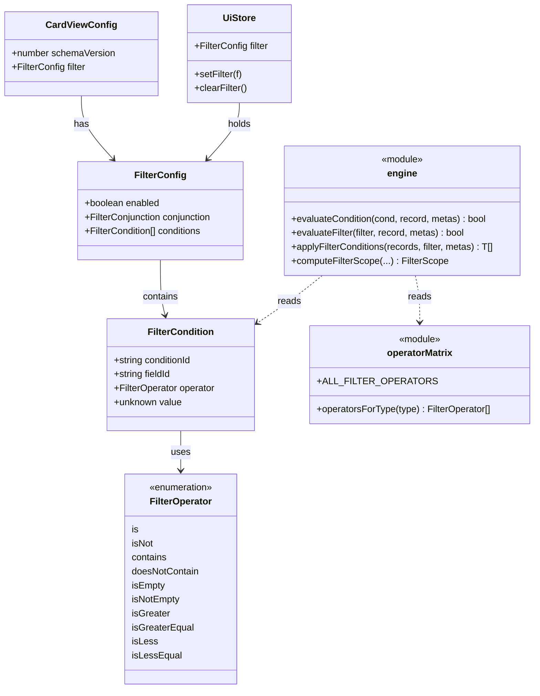

### 22.14 需求追踪（新增行，供 §20 矩阵补充）

| 需求 | 设计章节 | 任务 | 验收 |
|---|---|---|---|
| **NF-01 插件内自建筛选器**（选字段→算子→值，多层与/或） | §22.2 §22.5 | F1 F4 F5 | 面板可增删条件并即时生效 |
| **NF-02 结果 = 原生 ∩ 插件** | §22.1.2 | F3 | 原生筛选结果上再收窄；不写回原表 |
| **NF-03 算子语义对齐原生** | §22.3 | F2 | 算子 ⊆ SDK `FilterOperator`（矩阵断言） |
| **NF-04 筛选条件持久化，不改原表** | §22.2.3 | F1 | 重进恢复；全程无 `setFilter` 调用 |
| **NF-05 「所见即所筛」（数值/日期）** | §22.4.4 | F2 | 日期按天、数字按值，单测可证伪 |
| **NF-06 覆盖范围不误导（不假绿）** | §22.11 | F3 F5 | QA 断言：`hasMore` 时文案含「已加载」 |

---

> **本节结束**。本节为**增量特性**设计，**不放宽 D1**、**不改动既有架构分层**；实现风险集中在「配置三文件的合并顺序」与「覆盖范围的诚实文案」，二者均已在 §22.10 / §22.11 显式登记。
